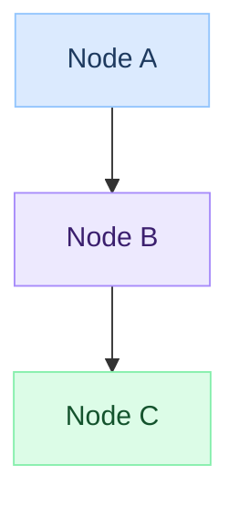

# Mermaid Diagram Standards

All architecture diagrams in DevopsPilot tutorials must follow these conventions.

## Format

- **Syntax**: `graph TD` (top-down flowchart)
- **Max nodes**: 6–8 (keep it minimal)
- **Edge labels**: Use short path/action descriptions (e.g. `|"/api/orders"|`)
- **Node labels**: Use `<br/>` for line breaks (NOT `\n`)

## Color Palette (classDef)

Copy this block into every diagram:

```
    classDef client   fill:#dbeafe,stroke:#93c5fd,color:#1e3a5f
    classDef gateway  fill:#ede9fe,stroke:#a78bfa,color:#3b1f6e
    classDef route    fill:#fef9c3,stroke:#fbbf24,color:#78350f
    classDef service  fill:#dcfce7,stroke:#86efac,color:#14532d
    classDef pods     fill:#ffedd5,stroke:#fdba74,color:#7c2d12
    classDef storage  fill:#fce7f3,stroke:#f9a8d4,color:#831843
    classDef external fill:#f1f5f9,stroke:#94a3b8,color:#1e293b
```

## Node → Class Mapping

| Node role | Class |
|---|---|
| User / Browser / Client | `client` (blue) |
| Load Balancer / Gateway / Ingress | `gateway` (purple) |
| Routing rule / HTTPRoute / Ingress rule | `route` (yellow) |
| Service (k8s Service, Cloud Run, etc.) | `service` (green) |
| Pods / Instances / Replicas | `pods` (orange) |
| Database / Storage / Bucket | `storage` (pink) |
| External API / CDN / DNS | `external` (slate) |

## Template



## MkDocs Requirements

`mkdocs.yaml` must have:

```yaml
markdown_extensions:
  - pymdownx.superfences:
      custom_fences:
        - name: mermaid
          class: mermaid
          format: !!python/name:pymdownx.superfences.fence_code_format

extra_javascript:
  - https://unpkg.com/mermaid@11/dist/mermaid.min.js
```

---

## Pending Diagrams — Topics to Add

Every overview/index page for the following topics needs a `## Architecture` or `## How it Works` Mermaid diagram following the standards above.

### Checklist

- [ ] **Linux** — show: User → Shell → Kernel → Hardware
- [ ] **Shell Scripting** — show: Script → Shell → OS Commands → Output
- [ ] **Git** — show: Working Dir → Staging → Local Repo → Remote Repo
- [ ] **Jenkins** — show: Developer → GitHub → Jenkins → Build Agent → Deploy
- [ ] **Docker** — show: Dockerfile → Build → Image → Registry → Container
- [ ] **Kubernetes** — show: kubectl → API Server → Scheduler → Node → Pod
- [ ] **Terraform** — show: .tf files → Plan → State → Apply → Cloud Resources
- [ ] **AWS** — show: User → Route53/CloudFront → ALB → EC2/ECS/Lambda → RDS/S3
- [ ] **GCP** — show: User → Cloud DNS → Load Balancer → GKE/Cloud Run → CloudSQL/GCS
- [ ] **Azure** — show: User → Azure DNS → App Gateway → AKS/App Service → Azure SQL/Blob

### Topic → Class Mapping Guide

| Topic | `client` | `gateway` | `route` | `service` | `pods` | `storage` |
|---|---|---|---|---|---|---|
| Linux | User | Shell | Kernel | System Call | Process | Filesystem |
| Git | Developer | GitHub/Remote | Branch | Commit | Working Dir | Local Repo |
| Jenkins | Developer | GitHub | Webhook | Jenkins Master | Build Agent | Artifact Store |
| Docker | Dockerfile | Registry | Image Tag | Container Runtime | Container | Volume |
| Kubernetes | kubectl | API Server | Scheduler | Service | Pod | PersistentVolume |
| Terraform | .tf Files | Terraform Core | State File | Provider | Resource | Backend/S3 |
| AWS | User | CloudFront/ALB | Route53 | EC2/Lambda | ECS Task | S3/RDS |
| GCP | User | Load Balancer | Cloud DNS | Cloud Run/GKE | Pod/Instance | GCS/CloudSQL |
| Azure | User | App Gateway | Azure DNS | AKS/App Service | Pod/Function | Blob/SQL |
