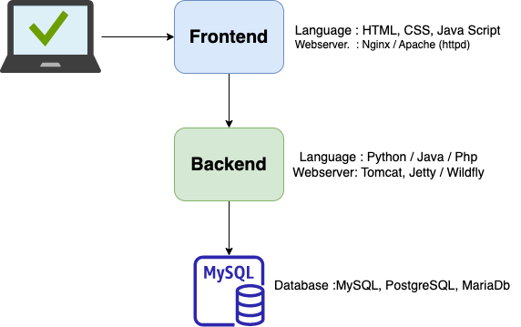

# Understanding the 3-Tier Architecture

The diagram above illustrates a common and robust software architecture known as the **3-Tier Architecture**. This model separates an application into three logical and physical computing tiers: the presentation tier (frontend), the application tier (backend), and the data tier (database). This separation enhances maintainability, scalability, and security.

Let's break down each tier:

---

## 1. Frontend (Presentation Tier)

This is what the user directly interacts with. It's responsible for presenting information to the user and handling user input.

* **Languages:**
    * **HTML (HyperText Markup Language):** Provides the structure and content of web pages.
    * **CSS (Cascading Style Sheets):** Controls the visual presentation and styling of HTML elements (colors, fonts, layout, etc.).
    * **JavaScript:** Adds interactivity, dynamic behavior, and client-side logic to web pages. It can make requests to the backend.

* **Web Server:**
    * **Nginx / Apache (httpd):** These are traditional web servers that primarily serve static content (HTML, CSS, JavaScript files, images) directly to the user's browser. They can also act as reverse proxies, forwarding dynamic requests to the backend server.

---

## 2. Backend (Application Tier)

The backend is the "brain" of the application. It handles the core business logic, processes user requests, and interacts with the database. It doesn't directly serve content to the user's browser but rather responds to requests from the frontend, often in data formats like JSON or XML.

* **Languages:**
    * **Python:** Popular for its versatility, vast libraries (Django, Flask, FastAPI), and suitability for various applications, including web development, data science, and AI.
    * **Java:** A robust, platform-independent language widely used for large-scale enterprise applications, Android development, and microservices (Spring Boot).
    * **PHP:** A widely used server-side scripting language primarily designed for web development (Laravel, Symfony, WordPress).

* **Web Server / Application Server:**
    * **Tomcat:** A widely used open-source servlet container for serving Java-based web applications (Servlets, JSPs). Often embedded in Spring Boot applications.
    * **Jetty:** A lightweight, embeddable web server and servlet container for Java, popular in microservices and smaller deployments.
    * **WildFly:** A robust, open-source Jakarta EE (formerly Java EE) application server providing a full suite of enterprise features for Java applications.

    *Note:* For Python backends, dedicated WSGI (e.g., Gunicorn, uWSGI) or ASGI (e.g., Uvicorn) servers are typically used to run the Python application, often behind a reverse proxy like Nginx. The diagram lists Java-specific servers, but the concept is the same for other backend languages where an application server runs the code.

---

## 3. Database (Data Tier)

The database tier is responsible for storing, managing, and retrieving all the application's data. It ensures data persistence, integrity, and efficient access.

* **Databases:**
    * **MySQL:** A very popular open-source relational database management system (RDBMS), widely used for web applications.
    * **PostgreSQL:** A powerful, open-source object-relational database system known for its robustness, advanced features, and extensibility.
    * **MariaDB:** A community-developed, commercially supported fork of MySQL, offering similar features and performance.

---

## Why Use a 3-Tier Architecture?

* **Scalability:** Each tier can be scaled independently. If your database becomes a bottleneck, you can scale just the database tier without affecting the frontend or backend.
* **Maintainability:** Changes in one tier (e.g., updating the UI in the frontend) often have minimal impact on other tiers, simplifying development and maintenance.
* **Security:** By separating concerns, you can implement different security measures for each tier. For instance, the database can be isolated from direct public access.
* **Flexibility:** Different technologies can be used for each tier, allowing developers to choose the best tools for specific tasks.
* **Team Collaboration:** Different teams can work on different tiers simultaneously with clear interfaces between them.

This architecture provides a solid foundation for building scalable, maintainable, and secure web applications.