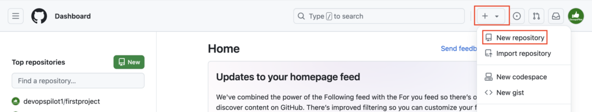
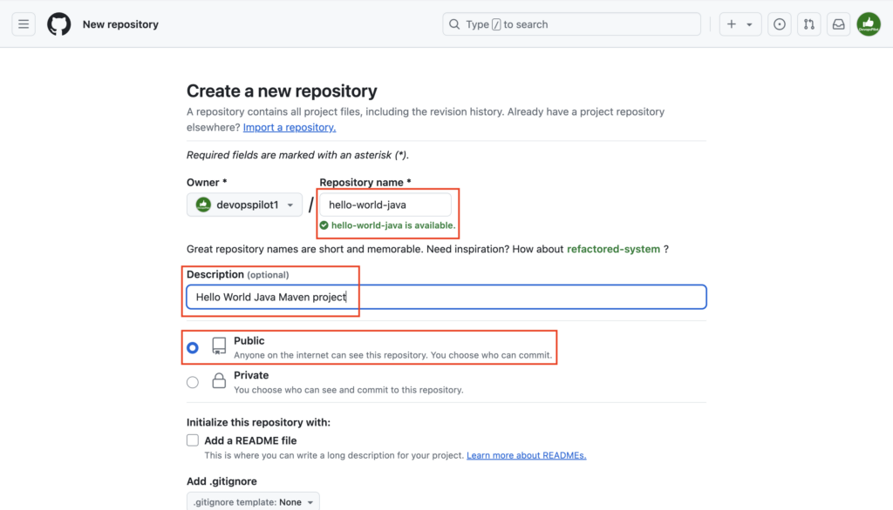
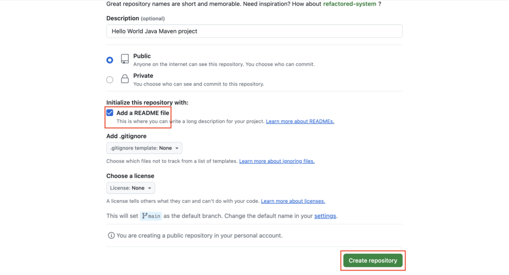
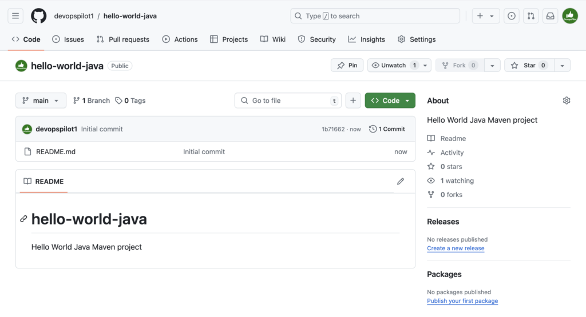
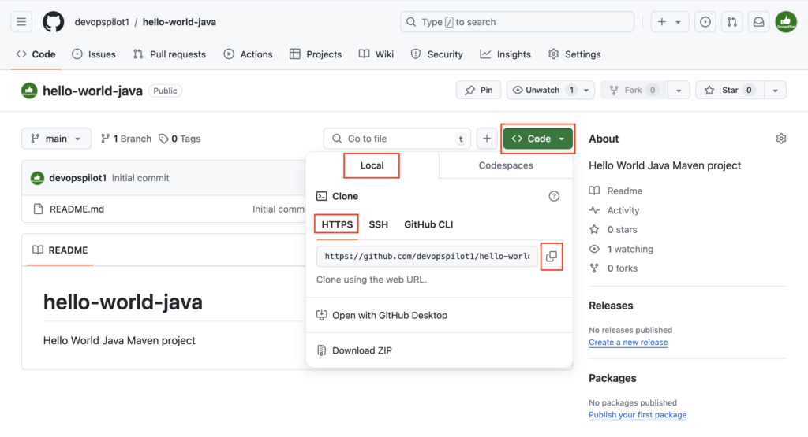
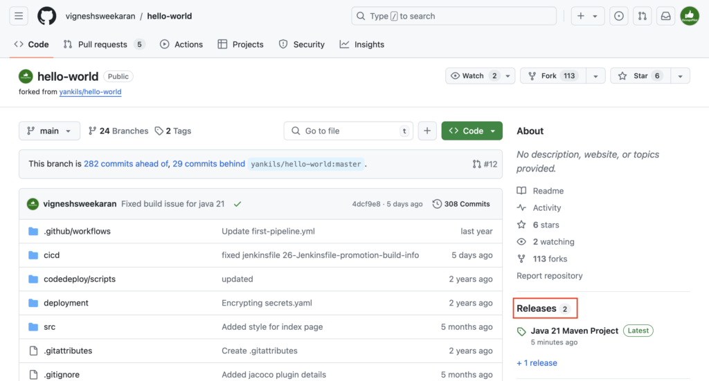
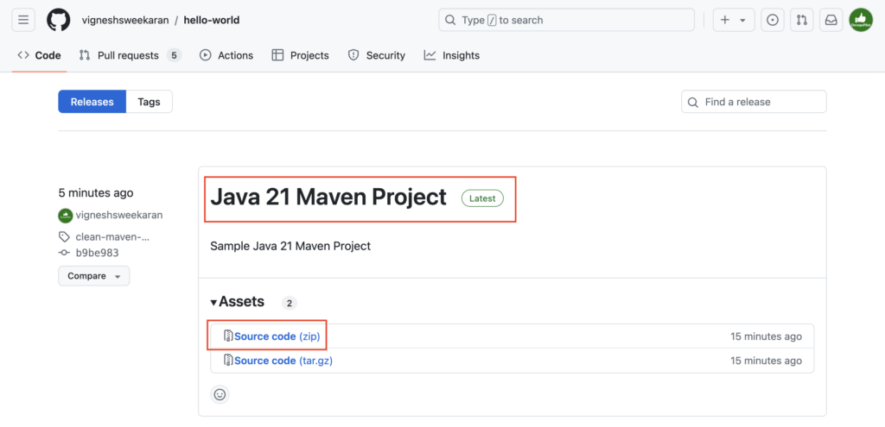
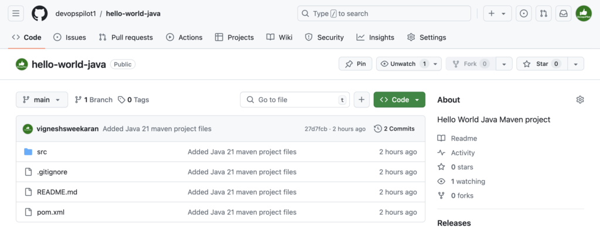

Creating a GitHub repository and pushing a "Hello World" Java 21 Maven project involves a series of steps that combine version control with modern Java development practices.

This guide will walk you through setting up a new repository on GitHub, creating a basic Java 21 project using Maven, and pushing your code to the remote repository.

By the end of this tutorial, you'll have a foundational understanding of how to manage and share your Java projects using Git and GitHub.

Goto [**https://github.com**](https://github.com/) -> Click on **+** Icon -> Click on New repository



Enter repository name **hello-world-java**, Description as **Hello World Java Maven project**

Choose **Public**



Check **Add a README** file -> Click on **Create repository**



Repository created



Clone the repository



```bash
git clone https://github.com/devopspilot1/hello-world-java.git
```

```
vignesh ~/code/devopspilot1  $ git clone https://github.com/devopspilot1/hello-world-java.git
Cloning into 'hello-world-java'...
remote: Enumerating objects: 3, done.
remote: Counting objects: 100% (3/3), done.
remote: Compressing objects: 100% (2/2), done.
remote: Total 3 (delta 0), reused 0 (delta 0), pack-reused 0
Receiving objects: 100% (3/3), done.
```

Go inside the cloned folder **hello-world-java** and see the files

```bash
ll
cd hello-world-java 
ll
```

```
vignesh ~/code/devopspilot1  $ ll
total 0
drwxr-xr-x  4 vignesh  staff  128 Jul 12 22:39 hello-world-java
```

```
vignesh ~/code/devopspilot1  $ cd hello-world-java 
```

```
vignesh ~/code/devopspilot1/hello-world-java [main] $ ll
total 8
-rw-r--r-- 1 vignesh  staff  50 Jul 12 22:39 README.md
```

Let's download the **Java 21 Maven project** code

Goto Github repository [https://github.com/vigneshsweekaran/hello-world](https://github.com/vigneshsweekaran/hello-world)

Click on **Releases**



Under **Java 21 Maven Project** -> Download the zip file [**Source code**](https://github.com/vigneshsweekaran/hello-world/archive/refs/tags/clean-maven-java-21.zip)



In **Linux** download [**Source code**](https://github.com/vigneshsweekaran/hello-world/archive/refs/tags/clean-maven-java-21.zip) zip files using the **wget** command

```bash
wget https://github.com/vigneshsweekaran/hello-world/archive/refs/tags/clean-maven-java-21.zip
```

```
vignesh ~/code/devopspilot1/hello-world-java [main] $ wget https://github.com/vigneshsweekaran/hello-world/archive/refs/tags/clean-maven-java-21.zip
--2024-07-12 23:31:25-- https://github.com/vigneshsweekaran/hello-world/archive/refs/tags/clean-maven-java-21.zip
Resolving github.com (github.com)... 20.205.243.166
Connecting to github.com (github.com)|20.205.243.166|:443... connected.
HTTP request sent, awaiting response... 302 Found
Location: https://codeload.github.com/vigneshsweekaran/hello-world/zip/refs/tags/clean-maven-java-21 [following]
--2024-07-12 23:31:25-- https://codeload.github.com/vigneshsweekaran/hello-world/zip/refs/tags/clean-maven-java-21
Resolving codeload.github.com (codeload.github.com)... 20.205.243.165
Connecting to codeload.github.com (codeload.github.com)|20.205.243.165|:443... connected.
HTTP request sent, awaiting response... 200 OK
Length: unspecified [application/zip]
Saving to: ‘clean-maven-java-21.zip’

clean-maven-java-21.zip               [ <=>                                                          ]   7.35K  --.-KB/s    in 0.001s  

2024-07-12 23:31:26 (7.45 MB/s) - ‘clean-maven-java-21.zip’ saved [7522]
```

```
vignesh ~/code/devopspilot1/hello-world-java [main] $ ll
total 24
-rw-r--r-- 1 vignesh  staff    50 Jul 12 22:39 README.md
-rw-r--r-- 1 vignesh  staff  7522 Jul 12 23:31 clean-maven-java-21.zip
```

Unzip the downloaded file **clean-maven-java-21.zip**

In Linux, unzip the file using th**e unzip** command

```bash
unzip clean-maven-java-21.zip
ll
```

```
vignesh ~/code/devopspilot1/hello-world-java [main] $ unzip clean-maven-java-21.zip 
Archive:  clean-maven-java-21.zip
b9be983bceb75d768ef80ba51e756a0781059015
   creating: hello-world-clean-maven-java-21/
  inflating: hello-world-clean-maven-java-21/.gitignore  
  inflating: hello-world-clean-maven-java-21/README.md  
  inflating: hello-world-clean-maven-java-21/pom.xml  
   creating: hello-world-clean-maven-java-21/src/
   creating: hello-world-clean-maven-java-21/src/main/
   creating: hello-world-clean-maven-java-21/src/main/java/
   creating: hello-world-clean-maven-java-21/src/main/java/com/
   creating: hello-world-clean-maven-java-21/src/main/java/com/example/
  inflating: hello-world-clean-maven-java-21/src/main/java/com/example/HelloWorld.java  
  inflating: hello-world-clean-maven-java-21/src/main/java/com/example/MyCalculator.java  
  inflating: hello-world-clean-maven-java-21/src/main/java/com/example/MyCalculatorUsingMath.java  
   creating: hello-world-clean-maven-java-21/src/main/webapp/
   creating: hello-world-clean-maven-java-21/src/main/webapp/WEB-INF/
  inflating: hello-world-clean-maven-java-21/src/main/webapp/WEB-INF/web.xml  
  inflating: hello-world-clean-maven-java-21/src/main/webapp/index.html  
  inflating: hello-world-clean-maven-java-21/src/main/webapp/index.jsp  
  inflating: hello-world-clean-maven-java-21/src/main/webapp/style.css  
   creating: hello-world-clean-maven-java-21/src/test/
   creating: hello-world-clean-maven-java-21/src/test/java/
   creating: hello-world-clean-maven-java-21/src/test/java/com/
   creating: hello-world-clean-maven-java-21/src/test/java/com/helloworld/
  inflating: hello-world-clean-maven-java-21/src/test/java/com/helloworld/MyCalculatorTest.java  
```

```
vignesh ~/code/devopspilot1/hello-world-java [main] $ ll
total 24
-rw-r--r-- 1 vignesh  staff    50 Jul 12 22:39 README.md
-rw-r--r-- 1 vignesh  staff  7522 Jul 12 23:31 clean-maven-java-21.zip
drwxr-xr-x  6 vignesh  staff   192 Jul 12 22:56 hello-world-clean-maven-java-21
```

Delete the **clean-maven-java-21.zip** file

```bash
rm -f clean-maven-java-21.zip
```

```
vignesh ~/code/devopspilot1/hello-world-java [main] $ rm -f clean-maven-java-21.zip
```

```
vignesh ~/code/devopspilot1/hello-world-java [main] $ ll
total 8
-rw-r--r-- 1 vignesh  staff   50 Jul 12 22:39 README.md
drwxr-xr-x  6 vignesh  staff  192 Jul 12 22:56 hello-world-clean-maven-java-21
```

Move the files from the **hello-world-clean-maven-java-21** folder to the **hello-world-java** folder

```bash
mv -f hello-world-clean-maven-java-21/{.,}* .
ls -la
```

```
vignesh ~/code/devopspilot1/hello-world-java [main] $ mv -f hello-world-clean-maven-java-21/{.,}* .
```

```
vignesh ~/code/devopspilot1/hello-world-java [main] $ ls -la
total 24
drwxr-xr-x   8 vignesh  staff   256 Jul 14 20:04 .
drwxr-xr-x   3 vignesh  staff    96 Jul 12 22:39 ..
drwxr-xr-x  12 vignesh  staff   384 Jul 12 22:46 .git
-rw-r--r-- 1 vignesh  staff    69 Jul 12 22:56 .gitignore
-rw-r--r-- 1 vignesh  staff   762 Jul 12 22:56 README.md
drwxr-xr-x   2 vignesh  staff    64 Jul 14 20:04 hello-world-clean-maven-java-21
-rw-r--r-- 1 vignesh  staff  1414 Jul 12 22:56 pom.xml
drwxr-xr-x   4 vignesh  staff   128 Jul 12 22:56 src
```

Delete folder **hello-world-clean-maven-java-21**

```bash
rm -rf hello-world-clean-maven-java-21
ls -la
```

```
vignesh ~/code/devopspilot1/hello-world-java [main] $ rm -rf hello-world-clean-maven-java-21
```

```
vignesh ~/code/devopspilot1/hello-world-java [main] $ ls -la
total 24
drwxr-xr-x   7 vignesh  staff   224 Jul 14 20:06 .
drwxr-xr-x   3 vignesh  staff    96 Jul 12 22:39 ..
drwxr-xr-x  12 vignesh  staff   384 Jul 12 22:46 .git
-rw-r--r-- 1 vignesh  staff    69 Jul 12 22:56 .gitignore
-rw-r--r-- 1 vignesh  staff   762 Jul 12 22:56 README.md
-rw-r--r-- 1 vignesh  staff  1414 Jul 12 22:56 pom.xml
drwxr-xr-x   4 vignesh  staff   128 Jul 12 22:56 src
```

Check **git status**

```bash
git status
```

```
vignesh ~/code/devopspilot1/hello-world-java [main] $ git status
On branch main
Your branch is up to date with 'origin/main'.

Changes not staged for commit:
  (use "git add <file>..." to update what will be committed)
  (use "git restore <file>..." to discard changes in working directory)
	modified:   README.md

Untracked files:
  (use "git add <file>..." to include in what will be committed)
	.gitignore
	pom.xml
	src/

no changes added to commit (use "git add" and/or "git commit -a")
```

Add the **files**

```bash
git add .
git status
```

```
vignesh ~/code/devopspilot1/hello-world-java [main] $ git add .
```

```
vignesh ~/code/devopspilot1/hello-world-java [main] $ git status
On branch main
Your branch is up to date with 'origin/main'.

Changes to be committed:
  (use "git restore --staged <file>..." to unstage)
	new file:   .gitignore
	modified:   README.md
	new file:   pom.xml
	new file:   src/main/java/com/example/HelloWorld.java
	new file:   src/main/java/com/example/MyCalculator.java
	new file:   src/main/java/com/example/MyCalculatorUsingMath.java
	new file:   src/main/webapp/WEB-INF/web.xml
	new file:   src/main/webapp/index.html
	new file:   src/main/webapp/index.jsp
	new file:   src/main/webapp/style.css
	new file:   src/test/java/com/helloworld/MyCalculatorTest.java
```

**Commit** the files

```bash
git commit -m "Added Java 21 maven project files"
```

```
vignesh ~/code/devopspilot1/hello-world-java [main] $ git commit -m "Added Java 21 maven project files"
[main 27d7fcb] Added Java 21 maven project files
 11 files changed, 287 insertions(+), 2 deletions(-)
 create mode 100644 .gitignore
 create mode 100644 pom.xml
 create mode 100644 src/main/java/com/example/HelloWorld.java
 create mode 100644 src/main/java/com/example/MyCalculator.java
 create mode 100644 src/main/java/com/example/MyCalculatorUsingMath.java
 create mode 100644 src/main/webapp/WEB-INF/web.xml
 create mode 100644 src/main/webapp/index.html
 create mode 100644 src/main/webapp/index.jsp
 create mode 100644 src/main/webapp/style.css
 create mode 100644 src/test/java/com/helloworld/MyCalculatorTest.java
```

Run the below Git command to **push** to your GitHub repository

```bash
git push origin main
```

**OUTPUT:**

```
vignesh ~/code/devopspilot1/hello-world-java [main] $ git push origin main
```

```
vignesh ~/code/devopspilot1/hello-world-java [main] $ git push origin main
Username for 'https://github.com': devopspilot1
Password for 'https://devopspilot1@github.com': 
Enumerating objects: 26, done.
Counting objects: 100% (26/26), done.
Delta compression using up to 10 threads
Compressing objects: 100% (17/17), done.
Writing objects: 100% (24/24), 3.90 KiB | 3.90 MiB/s, done.
Total 24 (delta 0), reused 0 (delta 0), pack-reused 0
To https://github.com/devopspilot1/hello-world-java.git
   1b71662..27d7fcb  main -> main
```

Check files are pushed to the GitHub repository


