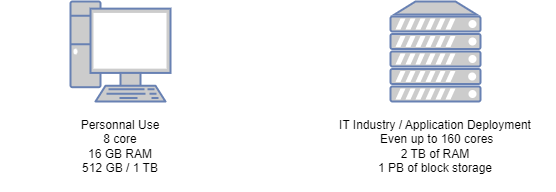
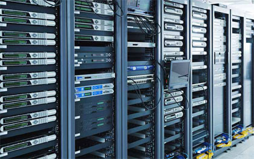
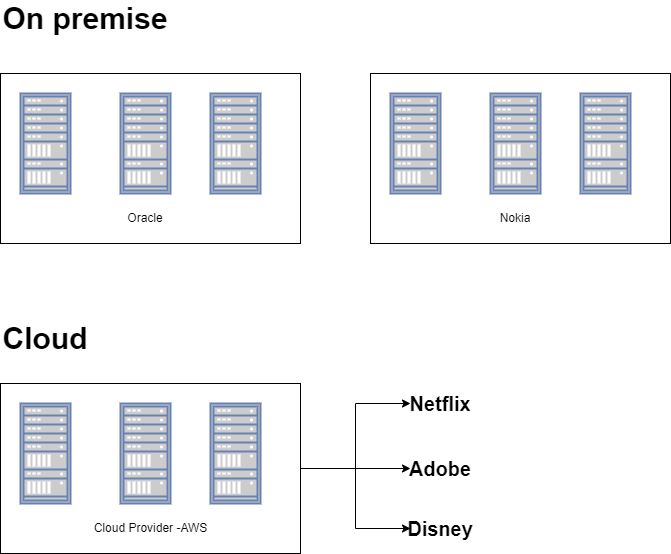
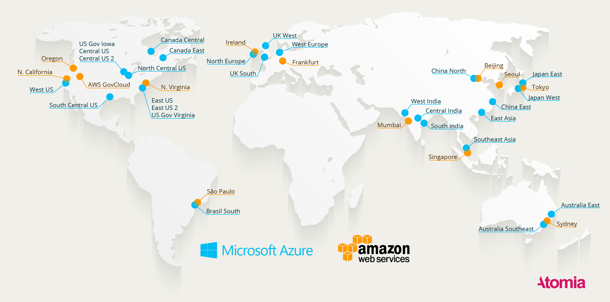
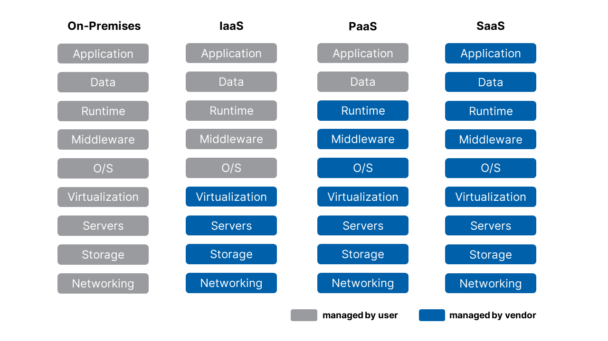
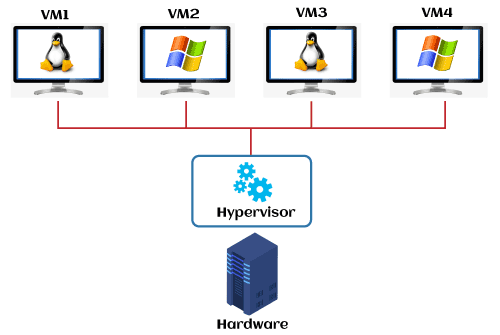

# On Premises vs Cloud

### Youtube

[On Premises vs Cloud](https://www.youtube.com/watch?v=Zn7AioNYPvg)

### Normal computer vs Server

### Datacenter

A data center is a collection of servers to  provide shared access to applications and data using a complex network, compute, and storage infrastructure

### On premises vs Cloud

On premises means the Datacenter owned only by the Company/Organization

Cloud means the Datacenter is owned by the provider and given as service to the customer and the servers will be shared by multiple customers

#### Datacenter locations of cloud providers

### Major Cloud Providers
* AWS (Amazon Web Services)
* Microsoft Azure
* GCP (Google Cloud Platform)

And many more....

### Cloud service offerings
* Iaas --> Infrastructure as a Service Eg: Getting servers from cloud providers ...
* Pass --> Platform as a Service Eg: EKS(Elastic Kubernetes Service) from AWS, Openshift from Redhat ...
* Saas --> Software as a Service Eg: Gmail, Youtube ...

### Virtual Machines

From a single server, we can create multiple small servers called Virtual Machines(VM) using a technology Hypervisor

