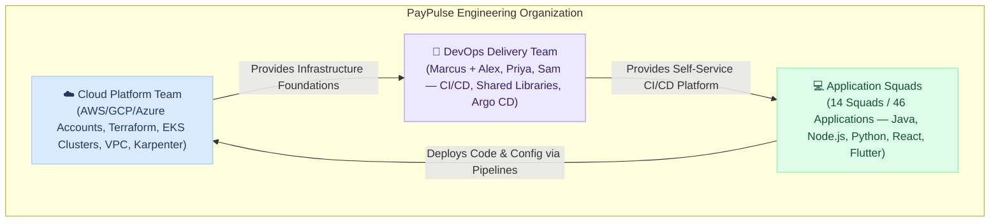

# Real-World DevOps Day-to-Day Responsibilities

[← Back to Home](../index.md)

---

A common misconception among aspiring and junior engineers is that DevOps work is simply about "writing Dockerfiles" or "configuring Jenkins pipelines." In real-world mid-to-large enterprises, DevOps is an **operational engineering discipline** focused on developer enablement, automated delivery guardrails, platform reliability, change governance, and rapid incident triage.

This series provides an authentic, unfiltered look into how enterprise DevOps teams actually operate across 30-day production cycles—balancing planned sprint features with urgent developer escalations, CAB approvals, security gate blockages, and platform upgrades.

!!! info "Flagship Reference Architecture: PayPulse Technologies"
    To keep these operational frameworks grounded in concrete enterprise realities rather than generic textbook theory, the operating models, team diagrams, squad counts (14 squads / 46 services), and SOPs detailed on this page are modeled directly from our primary case study: **[PayPulse Technologies](paypulse-technologies/index.md)**.
    
    Subsequent case studies in this series (*NexusRetail Global*, *AuraHealth Cloud*) will contrast this with alternative paradigms such as embedded squad SREs, GitHub Actions migrations, and cloud-native GitLab setups.

---

## 🏛️ The Three-Layer Enterprise Operating Model

In modern tech organizations (300+ employees, 10+ engineering teams), responsibilities are strictly decoupled to prevent bottlenecks and tool silos:



### 1. Cloud Platform Team (Infrastructure Foundation)
*(Underlying Infrastructure Context)*: Owns foundational AWS/GCP accounts, base VPC networking, and bare Kubernetes cluster infrastructure. The DevOps Delivery Team builds and operates the automated delivery platform on top.

### 2. DevOps Delivery Team (Software Delivery Platform Owners)
- Builds and operates the **software delivery platform** and **infrastructure CI/CD automation** on top of the cloud infrastructure.
- Authors centralized Jenkins pipelines for Terraform automation (`terraform init`, `plan`, and `apply` via `vars/terraformPipeline.groovy`), eliminating unsafe local laptop executions and enforcing audit compliance.
- Owns Jenkins controllers, dynamic Kubernetes agent pools, centralized Groovy Shared Libraries (`vars/*.groovy`), SonarQube quality gates, JFrog Artifactory HA, and Argo CD GitOps delivery pipelines.
- **The Application Front Door:** Engages directly with application project squads to capture build/test/infra requirements and onboard microservices into standardized pipelines through Jira.

### 3. Application Project Squads — 14–15 Projects / 20–50+ Microservices each (Business Logic Owners)
- Operating under PayPulse Technologies are **14–15 distinct projects (squads / domains)**, with each project containing multiple applications and **20 to 50+ microservices**.
- Owns application source code, Dockerfiles, and application deployment manifests (Helm/Kustomize).
- Consumes the DevOps delivery platform via a standardized CI `Jenkinsfile` in their repository calling the Shared Library, while QA and production deployments are governed centrally via the DevOps team's `paypulse-cd-pipelines` repository.

---

## 👥 Inside the DevOps Delivery Team

```
                      ┌───────────────────────────────────────────────┐
                      │          DevOps Team Lead / Architect         │
                      │ • Front Door to Application Development Squads│
                      │ • Technical Discovery & Sprint Planning       │
                      │ • Hands-On Architecture & Shared Libraries    │
                      │ • Critical Incident Command & Deep Debugging  │
                      │ • Enterprise CAB Governance & Knowledge Base  │
                      └───────────────────────┬───────────────────────┘
                                              │
                                              ▼
                      ┌───────────────────────────────────────────────┐
                      │    Cross-Functional DevOps Engineers (Pod)    │
                      │ • Full-Stack CI/CD Pipeline Automation        │
                      │ • Kubernetes, Dynamic Agents & Docker Builds  │
                      │ • Quality Gates (SonarQube) & Artifact Repos  │
                      │ • GitOps Delivery & Helm Deployments (Argo CD)│
                      │ • Platform Maintenance, TLS Renewals & Patching│
                      │ • Daily Tier-2/Tier-3 Developer Support       │
                      └───────────────────────────────────────────────┘
```

!!! note "Team Topology Across Organizations"
    The structure above illustrates the **Front-Door & Cross-Functional Delivery Pod** model implemented in the **PayPulse Technologies** case study (featuring Marcus as Lead, and Alex, Priya, and Sam as cross-functional engineers). 
    
    In real-world enterprises, DevOps structures vary according to scale, regulatory constraints, and cloud maturity—ranging from centralized Platform Engineering teams to embedded squad SREs or Cloud Centers of Excellence (CCoE), as explored across the different company profiles in this series.

### Core Operating Principles

#### 1. Zero Tool Silos Across Delivery Engineers
In high-performing teams, **no single engineer exclusively owns any tool**. Engineers do not say "I only do Jenkins" or "I only do Argo CD." All engineers collectively operate, improve, and troubleshoot the full delivery stack:
- **CI & Containers:** Jenkins controllers, Kubernetes agent templates, Docker multi-stage builds, and Cosign image signing.
- **Shared Libraries:** Extending and maintaining modular Groovy pipeline steps across Python, Java/Maven, Node.js, and Helm.
- **Quality & Artifact Security:** SonarQube LTA quality gates, and JFrog Artifactory repository architecture (Remote, Local, Virtual) with Xray scanning.
- **CD & GitOps:** Kubernetes Helm deployments, Argo CD application synchronizations, and progressive canaries.
- **Platform Maintenance:** Semi-annual TLS/SSL certificate rotations, monthly Linux host security patching, and platform tool upgrades.
- **Daily Support & Triage:** Resolving daily Tier-2/Tier-3 squad build blockers, flaky test pipelines, and on-call alerts.

Work is assigned through the Jira backlog based on sprint capacity, priority, and cross-training objectives—never tool ownership.

#### 2. Hands-On Engineering Leadership (Marcus)
Marcus operates as both the organizational front door and an active hands-on principal engineer:
- **Hands-On Shared Library Engineering:** Directly designs and codes new enterprise Shared Library frameworks (`vars/*.groovy`), creating the golden paths for new language runtimes and deployment targets.
- **Critical Troubleshooting & Deep Debugging:** Takes personal ownership of complex, cross-cutting incidents that span multiple systems (e.g., database lock contention during blue/green migrations, cluster-wide TLS handshake failures, or Kubernetes scheduler deadlocks).
- **Confluence Documentation Guardian:** Ensures that no fix is considered "done" until the root cause, immediate mitigation, and preventative safeguards are documented in Confluence.

#### 3. Living Confluence SOPs & Incident Knowledge Base
Reliability at scale requires that operational knowledge is never trapped in an engineer's head. The team maintains four core **Standard Operating Procedures (SOPs)** and an exhaustive Incident Knowledge Base in Confluence:

| Document | Purpose & Scope | Key Operational Procedures |
| :--- | :--- | :--- |
| **SOP-01: TLS/SSL Certificate Renewal** | End-to-end certificate rotation for ingress and internal tooling | CSR generation, Internal PKI / Public CA validation, JKS & PKCS#12 conversion, Kubernetes TLS Secret updates, zero-downtime NGINX/ALB reload, and post-cutover verification. |
| **SOP-02: Platform Tooling Upgrades** | Zero-downtime maintenance for Jenkins LTS, SonarQube, Artifactory, & Argo CD | Pre-flight database backups, QA environment dry-run validation, plugin compatibility matrices, maintenance window execution runbooks, and automated rollback triggers. |
| **SOP-03: Application CI Onboarding & Centralized CD Delivery** | Developer and DevOps onboarding for squads | Creating the application CI `Jenkinsfile`, passing parameters to `paypulse-shared-library`, raising PRs to the application `develop` branch for squad review, and configuring centralized deployment (`Jenkinsfile.deploy`) and promotion (`Jenkinsfile.promote`) pipelines in `paypulse-cd-pipelines`. |
| **SOP-04: JFrog Repository & Project Provisioning** | Multi-tier artifact repository architecture for squads | Provisioning **Local Repositories** (private builds & Docker images), **Remote Repositories** (caching proxies for Maven Central, npmjs, PyPI, Docker Hub with security caching), and **Virtual Repositories** (aggregated single-URL endpoints for developers). |
| **Incident Knowledge Base (RCAs)** | Blameless post-mortem repository for all operational outages | Standardized post-incident review (PIR) template: Chronological incident timeline, root-cause analysis (5 Whys), short-term remediation, and tracked Jira preventative action items. |

---

## 📚 Enterprise Case Studies in this Series

| Company Case Study | Organization Profile | Architecture & Technology Stack | Focus Area |
| :--- | :--- | :--- | :--- |
| **[PayPulse Technologies](paypulse-technologies/index.md)** | 300+ employees, 14 squads, 46 applications & services | **Hybrid Multi-Cloud + EKS:** On-Prem Jenkins, SonarQube LTA, JFrog HA, AWS Multi-Region EKS (1.34/1.35), Argo CD, GitHub Enterprise | Self-service Shared Library model, 30-day roster with multi-day Jira stories, daily bug tracking, certificate renewals, and 4 major incidents. |
| **NexusRetail Global** *(Upcoming)* | 600+ employees, 22 squads, 80+ services | **Jenkins to GitHub Actions Migration:** Deprecating self-hosted Jenkins controllers; migrating 80+ pipelines to GitHub Actions Enterprise runners and AWS ECS/EKS. | CI/CD migration planning, security secret mapping, developer transition, self-hosted runner auto-scaling, and build cost optimization. |
| **AuraHealth Cloud** *(Upcoming)* | 200+ employees, 8 squads, 24 microservices | **GitLab CI/CD + Cloud-Native Tooling:** GitLab Ultimate, JFrog Cloud, SonarQube Cloud, Google Cloud Platform (GKE & Cloud Run), OpenTelemetry observability. | Cloud-native GitOps, automated canary rollouts, supply-chain SLSA Level 3 compliance, and eBPF observability. |

---

## 🚀 Explore PayPulse Technologies

Dive into the complete 30-day operational journey of **PayPulse Technologies**:

👉 **[Read PayPulse Technologies (30-Day Operational Log & Architecture) →](paypulse-technologies/index.md)**
