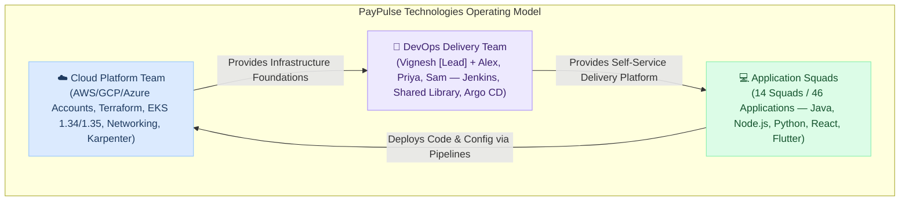
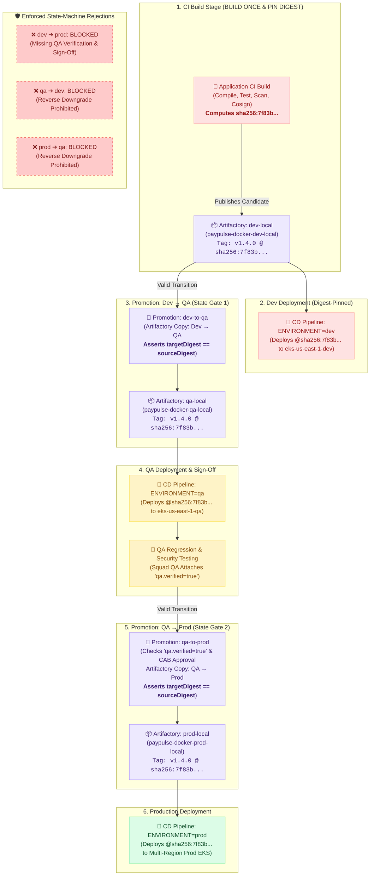
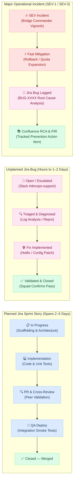

# PayPulse Technologies — 30-Day DevOps Operational Log

[← Back to DevOps Day-to-Day Overview](../index.md)

---

## 1. Executive Summary & Enterprise Profile

**PayPulse Technologies** is a fast-growing FinTech and merchant payment platform delivering real-time checkout gateways, merchant settlements, digital wallets, fraud analytics, and core banking ledger APIs.

### Key Metrics & Scale
- **Company Scale:** 300+ employees across Engineering, Product, Security, and Operations.
- **Engineering Organization:** 14 cross-functional product development squads (Core Payments, Settlements, Fraud Detection, Customer Loyalty, Ledger Accounting, Analytics & Reporting, Developer Experience, etc.).
- **Application Portfolio:** 46 application services deployed across a hybrid multi-cloud infrastructure:
  - **On-Premises Private Data Center:** Secure core CI/CD management plane (Jenkins controller, SonarQube Server LTA, JFrog Artifactory HA cluster, legacy HSM integrations).
  - **AWS Cloud (`us-east-1` Primary, `us-west-2` DR):** Multi-Region EKS clusters, Amazon S3, CloudFront CDN, DynamoDB, AWS SES.
  - **GCP Cloud (`us-central1`):** BigData & Analytics ingestion microservices on Google Cloud Run, Cloud Storage.
  - **Azure:** Enterprise Entra ID (Active Directory) SSO and identity federation.
- **Application Stacks:**
  - **Backends:** Java (Spring Boot 3.x), Python (FastAPI / Django), Node.js (NestJS / Express), Apache Kafka (KRaft mode event streaming).
  - **Frontends & Mobile:** React.js, Next.js, Flutter (merchant & customer mobile apps for iOS/Android).
- **Environments & Cluster Topology:**
  - **`dev` (`eks-us-east-1-dev`):** Developer experimentation & initial candidate build. Application artifacts are built **only once** by CI into `paypulse-docker-dev-local`.
  - **`qa` (`eks-us-east-1-qa`):** Squad regression & integration testbed. Promoted from dev via `promote-to-qa` without rebuilding (exact cryptographic SHA-256 preserved).
  - **`prod` (`eks-us-east-1-prod` Primary, `eks-us-west-2-prod` DR):** Mission-critical multi-region production clusters. Promoted from QA via `promote-to-prod` following CAB approval without rebuilding (exact same released artifact deployed).
- **Onboarding Velocity:**
  - 15 applications integrated into standardized pipelines prior to August 1.
  - 31 applications in the onboarding backlog, targeted for completion by **November 1, 2026** (cadence: 3–4 applications per 2-week sprint).

---

## 2. Organization Boundary & Team Operating Model

A critical factor in PayPulse's operational success is the strict separation between infrastructure ownership and application delivery:



### Responsibility & Ownership Matrix (RACI)

| Domain / Component | Cloud Platform Team | DevOps Delivery Team | Application Squads |
| :--- | :--- | :--- | :--- |
| **AWS / GCP / Azure Accounts & Networking** | **Owner** | Consumer | — |
| **Terraform & Base Infrastructure** | **Owner** | Consumer | — |
| **AWS EKS Clusters & Karpenter** | **Owner** | Consumer | — |
| **Jenkins Infrastructure & Dynamic Agents** | Supporting (VMs/Storage) | **Owner** | Consumer |
| **Jenkins Shared Libraries & Standards** | — | **Owner** | Consumer |
| **Application CI Pipeline (`Jenkinsfile`)**| — | Author & PR to `develop` | **Review, Merge & Owner** |
| **Centralized CD Pipelines (`paypulse-cd-pipelines`)** | — | **Owner & Maintainer** | Consumer / Release Approval |
| **Dockerfiles & Multi-Stage Builds** | — | Standards & Review | **Owner** |
| **JFrog Artifactory & Xray Scans** | Storage / Infra | **Integration Owner** | Consumer |
| **SonarQube Server 2026.1 LTA** | Database / Infra | **Integration Owner** | Consumer |
| **Argo CD (GitOps Controller)** | Platform Host (EKS) | **Delivery Integration**| Consumer |
| **Application Deployment Manifests / Helm** | — | Standards & Review | **Owner** |
| **Application Source Code & Release Decision**| — | Delivery Support | **Owner** |

### Team Structure & Operational Responsibilities

#### Vignesh — DevOps Team Lead (Front Door, Hands-On Architecture & Governance)
- **Application Squad Engagement:** Conducts technical discovery meetings with Squad Leads, Architects, and QA to capture onboarding requirements for new and existing applications.
- **Hands-On Architecture & Shared Library Engineering:** Directly designs and codes new enterprise Shared Library frameworks and modular steps (`vars/*.groovy`), establishing the foundational patterns used by the whole organization.
- **Escalated & Critical Troubleshooting:** Takes direct ownership of deep, cross-system operational failures and complex P1 incident investigations (e.g. database locks during migration, cluster-wide certificate chain breaks, Karpenter scheduling deadlocks).
- **Confluence Documentation Guardian:** Enforces that every issue, critical troubleshooting fix, post-mortem, and architectural decision is thoroughly documented in Confluence with clear root causes and runbooks.
- **Jira Backlog & Capacity Allocation:** Translates application requirements into Jira Epics and user stories (e.g., `PAY-4821` Onboard Payments API to CI/CD). Evaluates sprint capacity and allocates work across Alex, Priya, and Sam based on task complexity, urgency, and cross-training objectives.
- **Technical Governance & Change Coordination:** Submits and defends production Change Requests (CRs) at the enterprise Change Advisory Board (CAB), leads major incident responses, and reports velocity and DORA metrics to executive leadership.

#### Alex, Priya, and Sam — DevOps Engineers (100% Cross-Functional Delivery Team)
- **Core Operating Principle — Zero Tool Silos:** No individual engineer is the exclusive owner or operational dependency for any CI/CD technology. Alex, Priya, and Sam collectively design, build, operate, and troubleshoot the entire toolchain:
  - Jenkins controller & dynamic Kubernetes build agents
  - Groovy Shared Libraries (`paypulse-shared-library`)
  - GitHub Enterprise integration, PR decoration, and webhook automation
  - Docker multi-stage builds, layer caching, and Cosign image signing
  - SonarQube Server 2026.1 LTA quality gates & PR analysis
  - JFrog Artifactory HA repositories (Local, Remote, Virtual) & Xray security scanning
  - Argo CD GitOps controllers & Kubernetes Helm application delivery
  - TLS/SSL certificate rotations and monthly OS host patching
  - Real-time developer support, on-call troubleshooting, and pipeline firefighting
- **Capacity-Based Assignment:** Work is pulled from the Jira sprint backlog based on capacity, task complexity, and sprint priorities—not tool ownership.
- **Cross-Review Matrix:** To ensure clean peer reviews without creating single-point-of-failure dependencies, engineers rotate review routing preferences across PRs:

| Domain / Toolset | Primary Code Reviewer | Secondary Reviewer |
| :--- | :--- | :--- |
| **Jenkins & Dynamic Agent Pods** | Alex | Priya |
| **Shared Library Core Groovy Steps** | Priya | Sam |
| **SonarQube Quality & JFrog Repositories** | Priya | Alex |
| **Argo CD & Kubernetes Helm Delivery** | Sam | Alex |
| **Docker & Packaging Standards** | Sam | Priya |

*Note: Primary/secondary reviewer indicates peer-review routing preference, not exclusive technical ownership. Every engineer can operate, debug, and modify any component in the delivery ecosystem.*

### Confluence Standard Operating Procedures (SOPs) & Knowledge Base

PayPulse enforces a strict rule: **"If it isn't documented on Confluence with a step-by-step SOP, it isn't production-ready."** Vignesh and the team maintain living runbooks that allow any engineer to execute critical maintenance independently:

| Confluence Document | Category | Detailed Scope & Procedures |
| :--- | :--- | :--- |
| **SOP-01: TLS/SSL Certificate Renewal** | Infrastructure & Security | Step-by-step renewal process for internal and external endpoints (`*.devops.paypulse.internal`, `*.paypulse.internal`): CSR generation, Private CA issuance, conversion to Java KeyStore (JKS) and PKCS#12, Kubernetes secret updates, zero-downtime NGINX/HAProxy reload, and curl/OpenSSL verification scripts. |
| **SOP-02: Platform Tooling Upgrades** | Platform Maintenance | Standard maintenance window runbooks for Jenkins LTS, SonarQube LTA, JFrog Artifactory HA, and Argo CD. Includes dry-run verification on non-prod, plugin compatibility matrix validation, database backup procedures, binary replacement steps, and immediate rollback triggers. |
| **SOP-03: Application CI Onboarding & Centralized CD Delivery** | Developer Enablement | Developer and DevOps runbook: authoring the application CI `Jenkinsfile`, passing parameters to `paypulse-shared-library`, raising PRs to the application `develop` branch for squad review, and configuring centralized deployment (`Jenkinsfile.deploy`) and promotion (`Jenkinsfile.promote`) pipelines in `paypulse-cd-pipelines`. |
| **SOP-04: JFrog Project & Repository Provisioning** | Artifact Management | Comprehensive runbook for setting up package ecosystems for new squads: provisioning **Local Repositories** (private proprietary artifacts, Docker images, Helm charts), **Remote Repositories** (caching proxies for Maven Central, npmjs, PyPI, and Docker Hub with security vulnerability pre-caching), and **Virtual Repositories** (aggregated single-URL feeds with defined resolution priority). |
| **Incident Knowledge Base (RCAs)** | Operational Reliability | Standardized post-mortem repository. Every Sev-1/Sev-2 incident and complex troubleshooting resolution requires a published Confluence RCA containing: Incident Timeline, Root Cause (5 Whys), Immediate Mitigation, Preventative Actions, and linked Jira tickets. |

---

## 3. Enterprise Dual-Repository CI/CD & Immutable Artifact Promotion Architecture

To support 46 application services with a lean 4-person team while keeping workflows crystal-clear for developers and students, PayPulse enforces an **Enterprise Dual-Repository Architecture** coupled with an **Immutable Artifact Promotion Model**:

1. **Application Repository (CI):** Houses the application source code and a clean, declarative CI `Jenkinsfile`.
2. **Centralized CD Repository (`paypulse-cd-pipelines`):** A dedicated repository owned, maintained, and secured by the DevOps team for all `dev`, `qa`, and `prod` deployments.
3. **Enterprise Shared Library (`paypulse-shared-library`):** Centralizes all Groovy pipeline logic so application and deployment repositories only pass high-level parameters.

---

### 🛡️ Immutable Artifact Promotion Model (Digest-First & State-Machine Enforced)

PayPulse implements an enterprise artifact governance model built on two foundational security pillars:
1. **Digest-First Immutability:** While human engineers use semantic tags (e.g., `v1.4.0`) for readability, the pipeline resolves and enforces the **cryptographic SHA-256 container digest** (`sha256:7f83...`) as the primary immutable identifier. Deployments and promotions pin the exact digest, completely eliminating risks of tag mutation or docker cache drift.
2. **Finite State-Machine (FSM) Enforcement:** Promotion follows strict unidirectional transitions. The Shared Library enforces that an artifact can only transition `dev ➔ qa` and `qa ➔ prod`. Illegal skips (e.g., `dev ➔ prod`) or backwards regressions (`qa ➔ dev`, `prod ➔ qa`) are strictly blocked by automated pre-flight assertions.



#### The Five Core Principles:
1. **Rule 1 — Build Once & Pin Cryptographic Digest:**
   - The application CI pipeline compiles, tests, scans, and packages the container **exactly once**.
   - Upon pushing to `paypulse-docker-dev-local`, the pipeline extracts the immutable **SHA-256 digest** (`sha256:7f83...`), signs it with Cosign, and publishes it with initial tag `v1.4.0`.
2. **Rule 2 — Deploy to Dev by Digest:**
   - The CD pipeline (`Jenkinsfile.deploy` with `ENVIRONMENT=dev`) deploys the artifact to `eks-us-east-1-dev` referencing the exact digest (`paypulse/payments-service@sha256:7f83...`), preventing any tag mutation.
3. **Rule 3 — State-Enforced Promotion from Dev to QA (`dev-to-qa`):**
   - When promoting to QA, the promotion pipeline validates the allowed state transition (`dev ➔ qa`).
   - The pipeline resolves the digest from `paypulse-docker-dev-local`, copies metadata & layers to `paypulse-docker-qa-local` via `jf rt docker-promote`, and verifies that `targetDigest == sourceDigest`.
4. **Rule 4 — Deploy to QA & Attach Cryptographic Verification Metadata:**
   - The CD pipeline (`Jenkinsfile.deploy` with `ENVIRONMENT=qa`) deploys the exact digest to `eks-us-east-1-qa`.
   - Once automated test suites pass, the QA team attaches verified metadata properties to the Artifactory artifact: `qa.verified=true`, `qa.test_run_id=RUN-8841`.
5. **Rule 5 — Gated Promotion from QA to Prod (`qa-to-prod`) & Production Deployment:**
   - To promote to Production, the pipeline validates that the source repository is `qa-local`, confirms `qa.verified=true`, and verifies an approved CAB Change Request (e.g. `CR-9482`).
   - Any attempt to bypass QA (e.g., attempting a direct `dev ➔ prod` promotion) is rejected and terminated immediately.
   - The exact digest is copied to `paypulse-docker-prod-local`, asserted for 100% digest parity, and deployed to Production (`eks-us-east-1-prod` and `eks-us-west-2-prod`).
   - **Zero Rebuild Guarantee:** The exact container binary and SHA-256 digest tested in QA is what executes in Production. Rebuilding between environments is strictly prohibited.

---

### Shared Library Repository Structure (`paypulse-shared-library`)

```text
paypulse-shared-library/
├── vars/
│   ├── # --- Top-Level Pipeline Orchestrators ---
│   ├── ciPipeline.groovy           # Standardized CI pipeline orchestrator (Build Once)
│   ├── cdPipeline.groovy           # Standardized CD deployment orchestrator (Dev/QA/Prod)
│   ├── promoteArtifact.groovy      # Artifactory artifact promotion step (QA -> Prod)
│   │
│   ├── # --- Modular CI Steps ---
│   ├── python.groovy               # Python venv/poetry, pytest, flake8, bandit, package
│   ├── java_maven.groovy           # Java 21, Maven wrapper, spotbugs, jacoco (80% gate)
│   ├── java_gradle.groovy          # Gradle wrapper, multi-project build, checkstyle
│   ├── nodejs.groovy               # npm/pnpm ci, audit, jest, next build, packaging
│   ├── docker.groovy               # Multi-stage build, buildx cache, Xray scan, Cosign, push
│   │
│   ├── # --- Modular CD Steps (DevOps-Owned Application Delivery) ---
│   ├── kubernetes_helm.groovy      # EKS Pod Identity auth, Helm 3 lint/upgrade/rollback
│   ├── s3_cloudfront.groovy        # S3 sync, cache-control headers, CloudFront invalidation
│   ├── ecs_deploy.groovy           # ECS task revision registration and deployment
│   ├── gcp_cloudrun.groovy         # GCP Workload Identity auth, gcloud run deploy, traffic
│   └── pipeline_notifier.groovy    # Standardized Slack/Teams notifications & Jira sync
```

!!! note "Cloud Platform vs. DevOps Ownership Boundary"
    Cloud infrastructure provisioning (Terraform) is owned and operated by the dedicated Cloud Platform Team. The DevOps Delivery Library strictly owns **application delivery steps** (`kubernetes_helm.groovy`, `s3_cloudfront.groovy`, `gcp_cloudrun.groovy`) and does not provision underlying AWS/GCP clusters or VPCs.

---

### Component 1: Application-Level Continuous Integration (CI)

#### DevOps Onboarding & PR Workflow
When onboarding an application service to CI/CD:
1. **DevOps Authors the CI `Jenkinsfile`:** A DevOps engineer (Alex, Priya, or Sam) creates a feature branch in the application repository: `feature/devops-ci-pipeline`.
2. **Parameters are Passed to Shared Library:** The engineer crafts a concise `Jenkinsfile` that imports `paypulse-shared-library` and calls `ciPipeline(...)`, passing all service-specific configuration (stack, Java version, SonarQube keys, thresholds).
3. **Pull Request to `develop` Branch:** The DevOps engineer opens a Pull Request targeted to the application's `develop` branch.
4. **Squad Review & Merge:** The application squad lead reviews the PR, merges it into `develop`, and validates automated PR checks and build execution on commit.

#### Example: Application CI `Jenkinsfile`
```groovy
// Jenkinsfile inside paypulse/payments-service repository (develop branch)
@Library('paypulse-shared-library@v2.4.0') _

ciPipeline(
    appName: 'payments-service',
    stack: 'java-maven',
    javaVersion: '21',
    buildTool: 'mvn clean package',
    sonarQualityGate: true,
    sonarProjectKey: 'paypulse-payments-service',
    jacocoThreshold: 80,
    xrayScan: true,
    cosignSign: true,
    dockerRepo: 'paypulse-docker-dev-local' // Release candidate built ONCE into Dev repo
)
```

---

### Component 2: Centralized Continuous Delivery (CD) Repository (`paypulse-cd-pipelines`)

#### Centralized Governance & Security Boundary
To protect production environments and ensure compliance with PCI-DSS and SOC 2 audits, application developers do **not** have direct access to deploy into Kubernetes or manage cloud credentials:
- All CD pipelines are maintained in a single, centralized Git repository: **`paypulse-cd-pipelines`**.
- Only the DevOps Delivery Team has write access to this repository.
- Each application service contains **two standardized pipelines**:
  1. **`Jenkinsfile.deploy`**: Single parameterized CD pipeline for deploying to `dev`, `qa`, or `prod`.
  2. **`Jenkinsfile.promote`**: Parameterized pipeline for copying released artifacts from `dev` to `qa` and from `qa` to `prod` with **zero rebuild**.

#### Repository File Layout
```text
paypulse-cd-pipelines/
├── README.md
├── environments/
│   ├── dev.yaml                    # Declarative non-sensitive cluster reference
│   ├── qa.yaml                     # Declarative non-sensitive cluster reference
│   └── prod.yaml                   # Declarative non-sensitive cluster reference
└── apps/
    ├── payments-service/
    │   ├── Jenkinsfile.deploy      # Parameterized CD pipeline (params: ENVIRONMENT=dev|qa|prod, TAG)
    │   └── Jenkinsfile.promote     # State-machine promotion (params: PROMOTION_PATH=dev-to-qa|qa-to-prod, TAG)
    ├── settlements-service/
    │   ├── Jenkinsfile.deploy
    │   └── Jenkinsfile.promote
    └── fraud-analytics/
        ├── Jenkinsfile.deploy
        └── Jenkinsfile.promote
```

!!! tip "Enterprise Guardrail: Non-Sensitive Environment Descriptors (`environments/*.yaml`)"
    To maintain the strict boundary with the Cloud Platform Team, environment YAML files in `paypulse-cd-pipelines` contain **only declarative, non-sensitive logical pointers**:
    ```yaml
    # environments/qa.yaml
    environment: qa
    cluster_ref: eks-us-east-1-qa
    ingress_domain: qa.internal.paypulse.com
    datadog_env: qa
    ```
    **Zero cloud credentials, IAM roles, VPC subnets, or node pool definitions are stored in this repository.** All underlying infrastructure lifecycle and compute management remain exclusively owned and provisioned by the Cloud Platform Team via Terraform.

#### Example 1: Parameterized Deployment Pipeline (`Jenkinsfile.deploy`)
A single, parameterized Jenkinsfile handles continuous delivery across all three environments (`dev`, `qa`, and `prod`). It resolves the immutable container digest for the requested tag before triggering Helm:

```groovy
// apps/payments-service/Jenkinsfile.deploy inside paypulse-cd-pipelines repository
@Library('paypulse-shared-library@v2.4.0') _

properties([
    parameters([
        choice(
            name: 'ENVIRONMENT',
            choices: ['dev', 'qa', 'prod'],
            description: 'Target environment for deployment'
        ),
        string(
            name: 'RELEASE_VERSION',
            defaultValue: '',
            description: 'Semantic version tag to deploy (e.g. v1.4.0)'
        )
    ])
])

cdPipeline(
    appName: 'payments-service',
    environment: params.ENVIRONMENT,
    versionTag: params.RELEASE_VERSION,
    helmChartName: 'payments-service',
    helmReleaseName: 'payments-service',
    enableRollbackOnFailure: true
)
```

#### Example 2: State-Machine Promotion Pipeline (`Jenkinsfile.promote`)
The promotion pipeline enforces valid finite state transitions (`dev ➔ qa` and `qa ➔ prod`). It resolves the exact cryptographic SHA-256 digest from the source repository, verifies quality gates, copies the artifact, and asserts digest parity before completing:

```groovy
// apps/payments-service/Jenkinsfile.promote inside paypulse-cd-pipelines repository
@Library('paypulse-shared-library@v2.4.0') _

properties([
    parameters([
        choice(
            name: 'PROMOTION_PATH',
            choices: ['dev-to-qa', 'qa-to-prod'],
            description: 'Enforced state transition path'
        ),
        string(
            name: 'RELEASE_VERSION',
            defaultValue: '',
            description: 'Semantic version tag to promote (e.g. v1.4.0)'
        ),
        string(
            name: 'CAB_CR_TICKET',
            defaultValue: '',
            description: 'Approved CAB Change Request ticket (Required for qa-to-prod, e.g. CR-9482)'
        )
    ])
])

promoteArtifact(
    appName: 'payments-service',
    promotionPath: params.PROMOTION_PATH,
    versionTag: params.RELEASE_VERSION,
    cabTicket: params.CAB_CR_TICKET
)
```

*(Note: In dedicated Jenkins multi-branch folder views, teams can also expose this as two discrete job triggers—`payments-service-promote-to-qa` and `payments-service-promote-to-prod`—both delegating to `promoteArtifact.groovy` to guarantee identical state-machine enforcement).*

---

### Component 3: Central Shared Library Pipeline Orchestrators

#### `vars/ciPipeline.groovy` (Build Once)
```groovy
// vars/ciPipeline.groovy in paypulse-shared-library
def call(Map config = [:]) {
    pipeline {
        agent { label 'k8s-dynamic-agent' }
        stages {
            stage('Validate & Build') {
                steps {
                    script {
                        if (config.stack == 'java-maven') {
                            java_maven(jdk: config.javaVersion, sonar: config.sonarQualityGate)
                        } else if (config.stack == 'nodejs') {
                            nodejs(runAudit: true)
                        } else if (config.stack == 'python') {
                            python()
                        }
                    }
                }
            }
            stage('Containerize & Security Gate') {
                steps {
                    script {
                        docker(
                            image: "paypulse/${config.appName}",
                            tag: env.BUILD_NUMBER,
                            xrayScan: config.xrayScan,
                            signImage: config.cosignSign,
                            repository: config.dockerRepo
                        )
                    }
                }
            }
        }
        post {
            always {
                pipeline_notifier(appName: config.appName, channel: '#squad-alerts')
            }
        }
    }
}
```

#### `vars/promoteArtifact.groovy` (State-Machine & Digest-Enforced Promotion)
```groovy
// vars/promoteArtifact.groovy in paypulse-shared-library
def call(Map config = [:]) {
    pipeline {
        agent { label 'k8s-dynamic-agent' }
        stages {
            stage('Validate State Transition & Promotion Gates') {
                steps {
                    script {
                        def allowedTransitions = ['dev-to-qa', 'qa-to-prod']
                        if (!allowedTransitions.contains(config.promotionPath)) {
                            error "ILLEGAL PROMOTION PATH: '${config.promotionPath}'. Allowed transitions are: dev-to-qa, qa-to-prod."
                        }

                        if (config.promotionPath == 'qa-to-prod') {
                            if (!config.cabTicket || !config.cabTicket.startsWith('CR-')) {
                                error "PROMOTION BLOCKED: Valid CAB Change Request ticket (e.g. CR-9482) is mandatory for Production release."
                            }
                            echo "✅ CAB Ticket verified: ${config.cabTicket}"
                        }
                    }
                }
            }
            stage('Resolve Source Cryptographic Digest') {
                steps {
                    script {
                        def sourceRepo = (config.promotionPath == 'dev-to-qa') ? 'paypulse-docker-dev-local' : 'paypulse-docker-qa-local'
                        
                        echo "Resolving immutable container digest for paypulse/${config.appName}:${config.versionTag} in ${sourceRepo}..."
                        withCredentials([usernamePassword(credentialsId: 'artifactory-service-account', usernameVariable: 'JF_USER', passwordVariable: 'JF_PASS')]) {
                            // Extract exact immutable image manifest digest from Artifactory
                            def digestOutput = sh(
                                script: """
                                    curl -sf -u "\$JF_USER:\$JF_PASS" \
                                      "https://artifactory.paypulse.internal/artifactory/api/docker/${sourceRepo}/v2/paypulse/${config.appName}/manifests/${config.versionTag}" \
                                      -H "Accept: application/vnd.docker.distribution.manifest.v2+json" | \
                                      sha256sum | awk '{print \$1}'
                                """,
                                returnStdout: true
                            ).trim()

                            env.SOURCE_DIGEST = "sha256:${digestOutput}"
                            echo "🔒 Source Digest Locked: ${env.SOURCE_DIGEST}"

                            if (config.promotionPath == 'qa-to-prod') {
                                // Enforce that QA verification property is attached to this exact digest
                                echo "Verifying QA Sign-Off property on ${env.SOURCE_DIGEST}..."
                                def qaVerified = sh(
                                    script: """
                                        curl -sf -u "\$JF_USER:\$JF_PASS" \
                                          "https://artifactory.paypulse.internal/artifactory/api/storage/${sourceRepo}/paypulse/${config.appName}/${config.versionTag}?properties=qa.verified" | \
                                          grep -q "true" && echo "PASS" || echo "FAIL"
                                    """,
                                    returnStdout: true
                                ).trim()

                                if (qaVerified != "PASS") {
                                    error "PROMOTION REJECTED: Digest ${env.SOURCE_DIGEST} does not have required 'qa.verified=true' property in Artifactory!"
                                }
                                echo "✅ QA Sign-off verified in Artifactory metadata."
                            }
                        }
                    }
                }
            }
            stage('Promote Artifact Metadata & Layers') {
                steps {
                    script {
                        def sourceRepo = (config.promotionPath == 'dev-to-qa') ? 'paypulse-docker-dev-local' : 'paypulse-docker-qa-local'
                        def targetRepo = (config.promotionPath == 'dev-to-qa') ? 'paypulse-docker-qa-local' : 'paypulse-docker-prod-local'

                        echo "Executing ${config.promotionPath}: Promoting paypulse/${config.appName}:${config.versionTag} ➔ ${targetRepo}"

                        withCredentials([usernamePassword(credentialsId: 'artifactory-service-account', usernameVariable: 'JF_USER', passwordVariable: 'JF_PASS')]) {
                            // Copies layers and metadata without rebuilding Docker image
                            sh """
                                jf rt docker-promote paypulse/${config.appName} \
                                   ${sourceRepo} \
                                   ${targetRepo} \
                                   --source-tag=${config.versionTag} \
                                   --target-tag=${config.versionTag} \
                                   --copy=true
                            """

                            // Assert target digest matches source digest 100%
                            def targetDigestOutput = sh(
                                script: """
                                    curl -sf -u "\$JF_USER:\$JF_PASS" \
                                      "https://artifactory.paypulse.internal/artifactory/api/docker/${targetRepo}/v2/paypulse/${config.appName}/manifests/${config.versionTag}" \
                                      -H "Accept: application/vnd.docker.distribution.manifest.v2+json" | \
                                      sha256sum | awk '{print \$1}'
                                """,
                                returnStdout: true
                            ).trim()

                            def targetDigest = "sha256:${targetDigestOutput}"
                            assert env.SOURCE_DIGEST == targetDigest : "CRITICAL SECURITY FAULT: Digest mismatch! Source: ${env.SOURCE_DIGEST} vs Target: ${targetDigest}"
                            echo "✅ Cryptographic Parity Verified: ${targetDigest} (100% digest match, zero rebuild)"

                            // Tag target with promotion audit metadata
                            sh """
                                jf rt set-props "${targetRepo}/paypulse/${config.appName}/${config.versionTag}/" \
                                   "promoted.by=jenkins;promoted.path=${config.promotionPath};promoted.digest=${targetDigest}"
                            """
                        }
                    }
                }
            }
        }
        post {
            always {
                pipeline_notifier(appName: config.appName, status: currentBuild.currentResult, channel: '#devops-releases')
            }
        }
    }
}
```

#### `vars/cdPipeline.groovy` (Digest-Pinned Environment Deployment)
```groovy
// vars/cdPipeline.groovy in paypulse-shared-library
def call(Map config = [:]) {
    pipeline {
        agent { label 'k8s-dynamic-agent' }
        stages {
            stage('Resolve Environment & Image Digest') {
                steps {
                    script {
                        def envMatrix = [
                            dev: [
                                cluster: 'eks-us-east-1-dev',
                                namespace: "${config.appName}-dev",
                                dockerRepo: 'paypulse-docker-dev-local',
                                helmRepo: 'paypulse-helm-dev-local',
                                valuesFile: "helm/values-dev.yaml",
                                healthCheck: "https://dev.internal.paypulse.com/${config.appName}/health"
                            ],
                            qa: [
                                cluster: 'eks-us-east-1-qa',
                                namespace: "${config.appName}-qa",
                                dockerRepo: 'paypulse-docker-qa-local',
                                helmRepo: 'paypulse-helm-qa-local',
                                valuesFile: "helm/values-qa.yaml",
                                healthCheck: "https://qa.internal.paypulse.com/${config.appName}/health"
                            ],
                            prod: [
                                cluster: 'eks-us-east-1-prod',
                                namespace: "${config.appName}-prod",
                                dockerRepo: 'paypulse-docker-prod-local',
                                helmRepo: 'paypulse-helm-prod-local',
                                valuesFile: "helm/values-prod.yaml",
                                healthCheck: "https://api.internal.paypulse.com/${config.appName}/health"
                            ]
                        ]

                        def target = envMatrix[config.environment]
                        if (!target) {
                            error "Unknown environment: ${config.environment}. Expected 'dev', 'qa', or 'prod'."
                        }

                        // Resolve exact cryptographic digest from target repository
                        withCredentials([usernamePassword(credentialsId: 'artifactory-service-account', usernameVariable: 'JF_USER', passwordVariable: 'JF_PASS')]) {
                            def digestOutput = sh(
                                script: """
                                    curl -sf -u "\$JF_USER:\$JF_PASS" \
                                      "https://artifactory.paypulse.internal/artifactory/api/docker/${target.dockerRepo}/v2/paypulse/${config.appName}/manifests/${config.versionTag}" \
                                      -H "Accept: application/vnd.docker.distribution.manifest.v2+json" | \
                                      sha256sum | awk '{print \$1}'
                                """,
                                returnStdout: true
                            ).trim()

                            env.DEPLOY_DIGEST = "sha256:${digestOutput}"
                            echo "🔒 Deploying ${config.appName} to ${config.environment.toUpperCase()} via Digest: ${env.DEPLOY_DIGEST}"
                        }

                        // Deploy to Kubernetes pinning the immutable digest to eliminate tag drift
                        kubernetes_helm(
                            cluster: target.cluster,
                            namespace: target.namespace,
                            chartRepo: target.helmRepo,
                            chartName: config.helmChartName,
                            releaseName: config.helmReleaseName,
                            valuesFile: target.valuesFile,
                            versionTag: config.versionTag,
                            imageDigest: env.DEPLOY_DIGEST, // Injects image.digest into Deployment spec
                            healthCheckUrl: target.healthCheck,
                            rollbackOnFailure: config.enableRollbackOnFailure
                        )
                    }
                }
            }
        }
        post {
            failure {
                pipeline_notifier(appName: config.appName, status: 'FAILED', channel: '#devops-critical')
            }
        }
    }
}
```

### AI Assistance Boundary (Claude)
All four team members leverage Claude to draft Groovy Shared Library functions, generate Dockerfiles, write unit tests, and parse complex build logs. **Enterprise Guardrail:** AI-generated code must reside in a feature branch, pass Jenkins Shared Library unit tests (via JenkinsPipelineUnit), and pass human peer review before merge into `@v2.4.0` release branches.

---

## 4. 2026 Toolchain Inventory & Lifecycle Matrix

| Tool | Deployment Model | August 2026 Version | Baseline Standard | Target Upgrade Path |
| :--- | :--- | :--- | :--- | :--- |
| **Jenkins** | On-Premises Controller + Dynamic Linux Agent Pods | **v2.552.3 LTS** ($N-1$) | Java 21+ runtime; configuration-as-code (`JCasC`) | Target upgrade to **v2.568.2 LTS** on Saturday, Aug 29. |
| **SonarQube Server** | On-Premises Community | **2026.1 LTA** | Java 21+, PostgreSQL 16 backend; PR decoration | Quality Gates enforced on all pull requests. |
| **JFrog Artifactory**| On-Premises Enterprise HA (Licensed) | **v7.84.x** ($N-1$) | Dedicated virtual Maven, npm, PyPI, and Docker repos | Xray security & license compliance scanning. |
| **AWS EKS Clusters** | Multi-Region (`us-east-1` Primary, `us-west-2` DR) | **v1.34 standard support** | Owned by Cloud Team; EKS Pod Identity / IRSA | Cloud Team executes control plane upgrade to v1.35. |
| **Argo CD** | GitOps Controller on EKS | **v3.1.x** | Multi-cluster application reconciliation | Maintained in tandem with Cloud Platform. |
| **GitHub Enterprise**| Cloud Enterprise | Managed SaaS | Trunk-based PR workflow, branch protections | Signed commits required for release branches. |

---

## 5. Critical Operational Milestones & Incidents (August 2026)

### Milestones (August 1, 2026 = Saturday)
- **August 1 (Sat):** Weekend on-call handover.
- **August 3 (Mon):** Sprint 24 Kickoff & **Non-Prod SSL Certificate Renewal** (`*.internal.paypulse.com`).
- **August 15 (Sat 01:00 – 05:00 UTC):** **Production Maintenance Window (CAB CR-9482)** — Production SSL Certificate Cutover (**8 days ahead of expiration**) + Cloud Team host OS patching.
- **August 23 (Sun):** **Original Certificate Expiry Day:** Milestone verification confirming zero outages.
- **August 29 (Sat 02:00 – 04:00 UTC):** **Jenkins Controller Upgrade Window (CAB CR-9540):** Upgrade from v2.552.3 LTS to v2.568.2 LTS.

### 4 Real-World Major Operational Incidents
- **INC-0807-01 (Incident A, Fri Aug 7):** QA deployment in `kubernetes_helm.groovy` fails due to PostgreSQL lock timeout during Flyway migration; automatic Helm rollback triggered.
- **INC-0812-01 (Incident B, Wed Aug 12):** JFrog Xray blocks build in `nodejs.groovy` due to a simulated Critical CVSS 9.8 vulnerability in an npm dependency; emergency package override coordinated.
- **INC-0820-01 (Incident C, Thu Aug 20):** Argo CD GitOps drift in QA after manual developer edit via `kubectl edit`; self-healing reconciles state and fires Slack alert.
- **INC-0825-01 (Incident D, Tue Aug 25):** Dynamic Jenkins build agent pod starvation during concurrent multi-squad load; DevOps coordinates with Cloud Team to adjust Karpenter NodePool headroom.

---

## 6. Exhaustive 30-Day Operational Roster & Jira Lifecycle (August 1 – August 30, 2026)

*Calendar Ground Truth: August 1, 2026 = Saturday. August 30, 2026 = Sunday.*

### 📋 Enterprise Jira Sprint Dynamics & Lifecycle Framework

In an authentic enterprise DevOps environment, work is strictly governed by Jira sprint workflows, separating **planned sprint engineering capacity (70%)** from **unplanned operational interrupts & support buffer (30%)**:



#### Realistic Daily Engineer Workload Model
Every business day, each DevOps engineer balances four distinct streams of work:
1. **1 Primary Sprint Story:** Deep engineering work spanning 2 to 5 days (e.g., custom Shared Library steps, security automation, tool upgrades).
2. **0–1 Secondary Sprint Item:** Peer PR reviews, documentation updates, or backlog refinement.
3. **Unplanned Operational Interrupts:** 1–2 Jira Bugs or developer support escalations arriving via `#devops-support` or PagerDuty.
4. **Governance & Cross-Team Syncs:** 15-minute daily standup, bi-weekly CAB meetings, sprint demos, and retrospectives.

---

### Week 1: August 1 – August 7 (Sprint 24 Kickoff, Non-Prod Certs & Daily Jira Firefighting)

#### Day 1 — Saturday, August 1, 2026 (Weekend)
- **Vignesh (Lead):** Review monthly on-call rotation. Verify PagerDuty escalation policies with NOC. Confirm Cloud Team completed weekly VPC peering health checks.
- **Alex, Priya, Sam:** Scheduled Off. On-call engineer (Sam) monitors CI/CD controller telemetry.
- **[JIRA BUG-1400 / PAGERDUTY — Triaged → Storage Purged → Closed]** Sam: Alert at 14:15 UTC for high disk watermark (86%) on Artifactory HA node 2. Investigate via SSH; find orphaned temporary upload chunks from a failed developer Docker push. Run storage cleanup script; disk usage returns to 68%. Document root cause in ticket and resolve.

#### Day 2 — Sunday, August 2, 2026 (Weekend)
- **Team:** Scheduled Off. Automated health monitors green across Jenkins and Artifactory.

#### Day 3 — Monday, August 3, 2026 *(Sprint 24 Planning & Non-Prod SSL Renewal)*
- **Vignesh:** 
  - Host Sprint 24 Planning (10:00 – 11:30 AM). Review velocity and allocate capacity across planned epics and support buffer (70% planned / 30% operational support).
  - Lead discovery meeting with Squad 4 (Core Payments Lead & Architect). Create Jira Epic `PAY-4821` (Onboard Payments API to CI/CD) and user stories `PAY-4822` through `PAY-4826`.
  - Submit RFC/CAB for Aug 15 Production Maintenance Window (CR-9482).
- **Alex:** 
  - **[JIRA PAY-4822: In Progress - Day 1 of 3 (Shared Library Branch & Maven Cache Config)]** Branch `paypulse-shared-library`; begin prototyping remote Artifactory cache configuration for Maven dependencies in `java_maven.groovy`.
  - **[JIRA BUG-1401 / High — Triaged → Zombie Container Killed → Closed in 12 min]** Interrupted by Squad 3 escalation: "PR pipeline stuck in pending state" blocking an urgent hotfix for Customer Onboarding. Alex investigates while developers ping frantically in `#devops-support`. Discovers a zombie Jenkins agent container holding a locked workspace on agent node 4. Safely kills orphaned container and unblocks the PR queue in 12 minutes.
- **Priya:** 
  - **[JIRA PAY-4823: In Progress - Day 1 of 3 (Squad Discovery & CI Parameters)]** Meet with Squad 4 engineers to define CI `Jenkinsfile` build parameters and test profiles. Register SonarQube 2026.1 LTA project keys for Payments Gateway.
  - Review and triage incoming DevOps support queue; assign tickets for Sprint 24.
- **Sam:** 
  - **[JIRA INFRA-9102: In Progress - Day 1 of 5 (CA Cert Ingestion & Dev Ingress Deploy)]** Non-Prod SSL Renewal: Receive renewed wildcard certificate bundle (`*.internal.paypulse.com`) from Corporate CA. Deploy new certificates to Non-Prod reverse proxies (Dev Jenkins, Dev SonarQube, Dev Artifactory). Run `test-tls-handshake.sh`; confirm 2027 expiration and valid chain trust.

#### Day 4 — Tuesday, August 4, 2026
- **Vignesh:** Daily standup (9:30 AM). Sync with Cloud Platform Lead (David) regarding EKS QA cluster (`eks-us-east-1-qa`) network policies and IAM Pod Identity roles for Payments.
- **Alex:** 
  - **[JIRA PAY-4822: In Progress - Day 2 of 3 (Docker Multi-Stage Build Optimization)]** Test `docker.groovy` multi-stage build optimization for Payments BE using Java 21 Distroless base image. Image build time reduced by 45%.
  - Peer review: Review Priya's PR for SonarQube project automation.
- **Priya:** 
  - **[JIRA PAY-4823: In Progress - Day 2 of 3 (SonarQube PR Decoration Testing)]** Audit Project #16 pull request workflow. Verify that PR decoration on GitHub Enterprise displays SonarQube quality gate status.
  - **[JIRA BUG-1402 / Blocker — Triaged → Maven Virtual Cache Re-Indexed → Closed in 20 min]** Squad 2 developer escalates that their Maven build suddenly fails with `Checksum validation failed for internal-security-lib.jar`. Developer is under pressure before a partner demo. Priya investigates Artifactory metadata; discovers a corrupted SHA-256 checksum caused by an interrupted deployment earlier that morning. Re-indexes the Maven virtual cache and triggers a clean re-fetch, resolving the blocker in 20 minutes.
- **Sam:** 
  - **[JIRA INFRA-9102: In Progress - Day 2 of 5 (EKS QA Namespace Validation)]** Test `kubernetes_helm.groovy` deployment to EKS QA namespace in `us-east-1` (`eks-us-east-1-qa`). Confirm Helm release history and revision tracking.

#### Day 5 — Wednesday, August 5, 2026
- **Vignesh:** 
  - Daily standup. Discovery meeting with Squad 7 (Customer Loyalty & Mobile Lead). Create Jira Epic `LOY-1120` (Flutter Loyalty App CI/CD) and story `LOY-1121`.
  - Review SonarQube scan coverage thresholds (80% baseline across all squads).
- **Alex:** 
  - **[JIRA PAY-4822: Closed - Merged (PR #88 Passed & QA Verification)]** Finalize integration tests for `java_maven.groovy`, open PR #88, pass peer review with Priya, and merge to release branch. Close ticket.
  - **[JIRA LOY-1121: In Progress - Day 1 of 3 (Flutter Android Agent Dockerfile Spike)]** Pick up Flutter mobile agent story; begin constructing Dockerfile with Android SDK command-line tools.
- **Priya:** 
  - **[JIRA PAY-4823: Closed - Merged (FastAPI Pipeline Deployed & Verified)]** Onboard Project #16 Kafka event producer service (Python FastAPI). Configure `python.groovy` with pytest and flake8 linting. Merge configuration and close ticket.
  - **[JIRA PAY-4826: In Progress - Day 1 of 2 (Kafka KRaft Broker Sidecar Testing)]** Assist Squad 4 in architecting integration test stage with KRaft-based Kafka broker running as a sidecar container in Jenkins pod.
- **Sam:** 
  - **[JIRA INFRA-9102: In Progress - Day 3 of 5 (S3/CloudFront Cache Headers & Invalidation)]** Test `s3_cloudfront.groovy` for React merchant portal: verify S3 bucket sync, cache-control headers (`max-age=31536000` for assets), and CloudFront invalidation.
  - **[JIRA BUG-1403 / High — Triaged → Helm Secret Injected → Closed in 15 min]** Squad 5 developer reports QA Ingress endpoint returns `HTTP 502 Bad Gateway`. Developer assumes an EKS outage. Sam inspects EKS Pod logs; identifies that the microservice container crashed due to an unset environment variable (`KAFKA_BROKER_URL`). Guides developer to add the missing secret in their Helm values file, restoring service immediately.

#### Day 6 — Thursday, August 6, 2026
- **Vignesh:** Daily standup. Mid-week sprint burndown check. Review QA telemetry in Datadog.
- **Alex:** 
  - **[JIRA LOY-1121: In Progress - Day 2 of 3 (Gradle Cache Mount & Build Time Tuning)]** Optimize Flutter build times using persistent agent Gradle cache volume; build duration reduced from 22 minutes to 9 minutes.
  - **[JIRA BUG-1404 / Medium — Triaged → Jacoco XML Path Fixed → Closed in 30 min]** Squad 8 reports SonarQube quality gate failed on an urgent PR with `Coverage is 0%`, despite unit tests passing locally. Alex context-switches off Flutter optimization to pair with developer. Discovers Jacoco XML report path misconfigured in `pom.xml` (`target/site/jacoco` vs `target/jacoco.exec`). Corrects parameter in `java_maven.groovy`, allowing the PR to pass.
- **Priya:** 
  - **[JIRA PAY-4826: Closed - Merged (Dynamic Broker Integration Tests Passed)]** Validate KRaft Kafka broker sidecar in dynamic agent pods. Complete test documentation and close ticket.
  - Prepare SonarQube quality gate compliance report for weekly platform sync.
- **Sam:** 
  - **[JIRA INFRA-9102: In Progress - Day 4 of 5 (Jenkins Controller Upgrade Sandbox Dry-Run)]** Prepare QA sandbox environment for Jenkins controller upgrade dry-run ($N-1$ `v2.552.3` $\rightarrow$ `v2.568.2 LTS`). Audit plugin compatibility list.

#### Day 7 — Friday, August 7, 2026 *(Incident A: QA Migration Failure)*
- **Vignesh:** **[INC-0807-01 / SEV-2]** QA deployment in `kubernetes_helm.groovy` fails due to PostgreSQL lock timeout during Flyway migration. Coordinate with Squad 4 Lead; invoke automatic Helm rollback to previous stable release. Create post-incident action items `PAY-4830` and `SOP-03` update.
- **Alex:** 
  - **[JIRA PAY-4830: In Progress - Day 1 of 2 (Flyway Migration Dry-Run Step Architecture)]** Update `java_maven.groovy` Shared Library step to include optional `dbMigrationCheck: true` parameter executing Flyway `dryRun`.
  - **[JIRA LOY-1121: Closed - Merged (Android Agent Released to Artifactory)]** Push validated Flutter Android agent to Artifactory; update `vars/docker.groovy` agent labels; close story.
- **Priya:** 
  - Document `java_maven.groovy` migration dry-run check parameters in developer onboarding portal (Confluence SOP-03).
  - **[JIRA BUG-1405 / Blocker — Triaged → Robot Token Rotated → Closed in 25 min]** Concurrent with Incident A, Squad 9 developer raises urgent ticket: "Cannot pull base Docker image `paypulse-java21-base:latest` in CI". Priya tracks failure to an expired Docker robot token in Jenkins credentials store. Rotates Artifactory service account token, updates Jenkins credentials via JCasC, and notifies developers.
- **Sam:** 
  - **[JIRA INFRA-9102: Closed - Verified (QA JCasC Reload & SOP-01 Runbook Staged)]** Execute Jenkins controller upgrade dry-run in QA sandbox VM. Document rollback procedure, verify JCasC config reload, and close ticket.

---

### Week 2: August 8 – August 14 (CAB Preparation, Release Hardening & Support Pressure)

#### Day 8 — Saturday, August 8, 2026 (Weekend)
- **Team:** Scheduled Off. On-call rotation active.

#### Day 9 — Sunday, August 9, 2026 (Weekend)
- **Team:** Scheduled Off.

#### Day 10 — Monday, August 10, 2026
- **Vignesh:** 
  - Sprint 24 Week 2 Kickoff standup. Review sprint burndown. 
  - Discovery meeting with Squad 6 (Merchant Settlements). Create Jira Epic `SET-3040` (Settlements Service CI/CD: Node.js BE + React FE). 
  - Submit final CAB change ticket CR-9482 for Saturday Aug 15.
- **Alex:** 
  - **[JIRA SET-3041: In Progress - Day 1 of 2 (pnpm Cache & Jest Reporting)]** Enhance `nodejs.groovy` in Shared Library with automated pnpm/npm dependency caching and Jest code coverage reporting.
  - Peer review: Review Sam's Helm deployment script improvements.
- **Priya:** 
  - **[JIRA SET-3042: In Progress - Day 1 of 2 (Artifactory Virtual npm Repo Scaffolding)]** Configure JFrog Artifactory virtual npm repository and scan policies for Settlements Service dependencies.
- **Sam:** 
  - **[JIRA CAB-9482: In Progress - Day 1 of 4 (QA Pod Identity Verification)]** Maintenance Preparation: Coordinate with Cloud Platform team to verify automated QA IAM Pod Identity roles for Settlements microservices.
  - **[JIRA BUG-1406 / Blocker — Triaged → Stuck Helm Secret Cleaned → Closed in 20 min]** Squad 1 developer frantically asks in Slack: "Helm deploy failed with `release payments-service has failed status and cannot be upgraded`". Release train is held up. Sam identifies a stuck Helm pending-upgrade secret created when a build agent pod was abruptly evicted. Runs `helm rollback` and cleans the pending release metadata, enabling the release to continue.

#### Day 11 — Tuesday, August 11, 2026
- **Vignesh:** Daily standup. Sync with Enterprise Security Architect on token expiration standards for Jenkins GitHub App credentials.
- **Alex:** 
  - **[JIRA SET-3041: Closed - Merged (PR #95 Merged, Build 60% Faster)]** Validate pnpm cache speedup (builds 60% faster); open PR, merge, and close ticket.
  - **[JIRA SEC-2091: In Progress - Day 1 of 2 (Cosign Keyless Signing Integration)]** Update `docker.groovy` to enforce container image signing using Cosign and push signature metadata to Artifactory.
  - **[JIRA BUG-1407 / High — Triaged → Git History Rewritten & Pre-Receive Hook Enforced]** A developer pushes a large 850MB mock test database file directly into Git, causing all Jenkins clones across 3 squads to time out over the internal network. Alex diagnoses the spike in agent network latency, identifies the commit with `git-sizer`, works with developer to rewrite Git history using `git-filter-repo`, and adds a pre-receive hook in GitHub preventing commits > 50MB.
- **Priya:** 
  - **[JIRA SET-3042: Closed - Merged (Virtual npm Resolution Configured)]** Finalize virtual npm repository resolution order in Artifactory; author CI `Jenkinsfile` and raise PR to Squad 6's `develop` branch.
- **Sam:** 
  - **[JIRA CAB-9482: In Progress - Day 2 of 4 (Vault Prod Cert Pre-Loading & verify-prod-tls.sh)]** Pre-load production certificates in HashiCorp Vault. Author automated verification script (`verify-prod-tls.sh`) for Saturday's production maintenance window.

#### Day 12 — Wednesday, August 12, 2026 *(Incident B: Simulated Supply-Chain Vulnerability)*
- **Vignesh:** **[INC-0812-01 / SEV-1]** JFrog Xray flags a simulated Critical remote code execution vulnerability (CVSS 9.8) in a shared npm logging library during Project #18 `nodejs.groovy` build. Pipeline gate automatically blocks deployment.
- **Alex:** 
  - **[JIRA SEC-2091: Closed - Merged (Cosign Verification Enforced in docker.groovy)]** Finalize Cosign verification checks; merge to `vars/docker.groovy`; close ticket.
  - Audit all 15 live microservice pipelines to determine vulnerability blast radius (2 services affected).
- **Priya:** 
  - Collaborate with Squad 6 developers to pin patched library version; re-trigger pipeline; verify Xray clearance.
  - **[JIRA BUG-1408 / High — Triaged → Chrome Agent Image Built & Labeled]** Amidst the Xray vulnerability investigation, Squad 10 QA lead reports that their automated Cypress end-to-end test suite in Jenkins failed because headless Chrome binary was missing in dynamic node agent pod. Priya quickly creates an updated Docker agent image with Chrome pre-installed and updates agent label in `nodejs.groovy`.
- **Sam:** 
  - **[JIRA CAB-9482: In Progress - Day 3 of 4 (Post-Incident Guardrail Verification)]** Validate that `kubernetes_helm.groovy` rejected unsigned container image deployment, confirming security guardrail.

#### Day 13 — Thursday, August 13, 2026
- **Vignesh:** Attend Enterprise CAB Meeting. Defend CR-9482: Production SSL Certificate Cutover for Jenkins/SonarQube/Artifactory and Cloud Team's monthly host patching. **CR-9482 Approved**.
- **Alex:** Finalize pipeline code freeze before production weekend. Clean up orphaned workspace directories on agent nodes.
- **Priya:** Conduct developer office hours (14:00 – 16:00) helping Squad 4 and Squad 6 with pipeline telemetry dashboards.
- **Sam:** 
  - **[JIRA CAB-9482: In Progress - Day 4 of 4 (Pre-Maintenance SAN/EBS Snapshot Sanity Checks)]** Perform pre-maintenance sanity checks with Cloud Team. Verify SAN/EBS disk snapshots for Jenkins, SonarQube, and Artifactory.
  - **[JIRA BUG-1409 / High — Triaged → Webhook HMAC Secret Re-Synced in 15 min]** Squad 12 developer reports PR builds in GitHub are not triggering Jenkins webhooks. Developer has an impending release deadline. Sam traces GitHub Enterprise webhook delivery log; finds `HTTP 403 Forbidden` due to an expired webhook HMAC secret rotated by IT security without notification. Sam re-synchronizes the secret between GitHub and Jenkins, restoring automated builds in 15 minutes.

#### Day 14 — Friday, August 14, 2026 *(Sprint 24 Review & Retro)*
- **Vignesh:** Facilitate Sprint 24 Review & Demo (Projects #16, #17, #18 onboarded). Facilitate Sprint 24 Retrospective. Review shift assignments for Saturday maintenance.
- **Alex:** 
  - Publish release notes for Shared Library `v2.4.0` (Flyway dry-run validation, Cosign signing, Flutter mobile support).
  - **[JIRA BUG-1410 / Blocker — Triaged → Vault Secret Re-Injected & ExternalSecrets Operator Deployed]** Friday afternoon pre-freeze panic: A developer accidentally deletes their QA Kubernetes secret containing database credentials. Alex uses Vault audit logs to retrieve secret template, re-injects it into QA namespace, and configures an ExternalSecrets operator manifest so secrets sync automatically.
- **Priya:** Validate SonarQube quality gate compliance report for executive leadership.
- **Sam:** 
  - **[JIRA CAB-9482: Ready for Maintenance (Production Certs & Rollback Config Prepared)]** Final verification of production certificate files and preparation of rollback configuration.

---

### Week 3: August 15 – August 21 (Prod SSL Cutover & Sprint 25 Kickoff)

#### Day 15 — Saturday, August 15, 2026 *(CR-9482: Production Maintenance Window 01:00 – 05:00 UTC)*
- **Vignesh (Bridge Commander):** Open maintenance bridge with NOC. Supervise execution.
- **Sam (DevOps Execution Lead):**
  - **Task 1: Production SSL Certificate Cutover:** Re-bind renewed wildcard certificate (`*.internal.paypulse.com`) to production Load Balancers and NGINX proxies for Jenkins Prod, SonarQube Prod, and Artifactory HA Cluster. Validate HTTPS handshakes, certificate chain, and August 2027 expiration.
  - **Task 2: Service Verification:** Test `docker login`, `mvn deploy`, `npm publish`, and Git webhook reception.
- **Cloud Team:** Apply monthly OS kernel security patches to host VMs; perform rolling reboot of Artifactory HA nodes (zero downtime).
- **Alex & Priya (Verification Team):** Execute automated synthetic pipeline suite across `java_maven.groovy`, `nodejs.groovy`, and `python.groovy`. Confirm 100% test pass.
- **Vignesh:** System nominal at 04:15 UTC. Close bridge line, update CAB ticket to "Completed - Successful", broadcast all-clear. *(Milestone achieved 8 days ahead of Aug 23 expiration!)*

#### Day 16 — Sunday, August 16, 2026 (Weekend)
- **Team:** Scheduled Off (Recovery following night maintenance).

#### Day 17 — Monday, August 17, 2026 *(Sprint 25 Planning)*
- **Vignesh:** 
  - Sprint 25 Planning (10:00 – 11:30 AM). Celebrate successful SSL cutover. Review sprint velocity and support allocation.
  - Discovery meeting with Squad 1 (Core Banking Ledger Lead). Create Jira Epic `LED-5010` (Core Banking Ledger CI/CD) with stories `LED-5011` and `LED-5012`.
  - Discovery meeting with Squad 9 (Fraud Analytics Lead). Create Jira Epic `FRD-2020` (GCP Cloud Run Analytics Pipeline) with story `FRD-2021`.
- **Alex:** 
  - **[JIRA LED-5011: In Progress - Day 1 of 3 (Dynamic Testcontainers Pod Spec Spike)]** Architect custom Shared Library step for database integration testing using Testcontainers in dynamic Kubernetes agent pods. Spike initial pod template.
  - Triage Sprint 25 backlog stories and configure CI test harnesses.
- **Priya:** 
  - **[JIRA LED-5012: In Progress - Day 1 of 2 (Banking Ledger Pipeline Architecture Design)]** Review Project #19 code structure with Squad 1. Define immutable promotion workflow: single parameterized CD pipeline (`Jenkinsfile.deploy` for `dev`, `qa`, and `prod`) and centralized promotion pipeline (`Jenkinsfile.promote` for `promote-to-qa` and `promote-to-prod`) copying released artifacts without rebuilding.
  - **[JIRA BUG-1411 / Blocker — Triaged → Root CA Injected into Python Base Image → Closed in 35 min]** Following weekend maintenance, multiple Python pipelines fail with `SSL: CERTIFICATE_VERIFY_FAILED` when pulling dependencies via pip. Developers blocked across 3 squads. Priya quickly isolates that the Python base container was missing the updated corporate Root CA cert. Pushes patched base image to Artifactory with Root CA in `/etc/ssl/certs/`, resolving the blocker for all squads.
- **Sam:** 
  - **[JIRA FRD-2021: In Progress - Day 1 of 3 (GCP Cloud Run Deploy Architecture Review)]** Monitor post-patching system telemetry in Datadog; verify CPU/memory baseline across Jenkins controller and Artifactory HA cluster.
  - Begin reviewing GCP Cloud Run deployment parameters with Squad 9 engineers.

#### Day 18 — Tuesday, August 18, 2026
- **Vignesh:** Daily standup. Sync with Cloud Team on multi-region Argo CD delivery architecture for Core Banking Ledger across `us-east-1` and `us-west-2`.
- **Alex:** 
  - **[JIRA LED-5011: In Progress - Day 2 of 3 (PostgreSQL 16 Ephemeral Container Test Stage)]** Update `java_maven.groovy` to support dynamic Testcontainers spinning up ephemeral PostgreSQL 16 containers inside agent pods.
  - Peer review: Review Priya's Artifactory encrypted repository policy.
- **Priya:** 
  - **[JIRA LED-5012: Closed - Merged (Encrypted Banking JAR Repo Provisioned)]** Setup dedicated Artifactory encrypted repository for Banking core JAR distributions. Complete promotion workflow and close ticket.
  - **[JIRA SEC-2104: In Progress - Day 1 of 2 (Gitleaks Pre-Commit Secret Scanning Spike)]** Begin integrating Gitleaks pre-commit secret scanning into Shared Library baseline.
- **Sam:** 
  - **[JIRA FRD-2021: In Progress - Day 2 of 3 (GCP Workload Identity Federation Testing)]** Test `gcp_cloudrun.groovy` with GCP Workload Identity federation for Project #21 (Fraud Analytics microservice).
  - **[JIRA BUG-1412 / High — Triaged → Rootless Podman Socket Mounted → Closed in 25 min]** Squad 1 developer reports dynamic Testcontainers pod in Jenkins fails to start PostgreSQL with error `Cannot connect to Docker daemon`. Sam identifies that the Jenkins agent pod was missing rootless Docker-in-Docker socket mounting. Updates Kubernetes pod template spec to mount rootless Podman socket, resolving container-in-container testing.

#### Day 19 — Wednesday, August 19, 2026
- **Vignesh:** Daily standup. Audit compliance evidence for upcoming ISO 27001 / SOC 2 review.
- **Alex:** 
  - **[JIRA LED-5011: Closed - Merged (PR #104 Merged to vars/java_maven.groovy)]** Finalize Testcontainers integration tests, pass peer review with Priya, merge to `vars/java_maven.groovy`, and close story.
  - **[JIRA NOT-4001: In Progress - Day 1 of 3 (FastAPI + Kafka CI Pipeline Scaffolding)]** Build CI pipeline for Project #20 (Notification Engine: Python FastAPI + Kafka).
  - **[JIRA BUG-1413 / Blocker — Triaged → Sandbox Key Revoked & git reset Enforced]** A developer's pipeline fails immediately at pre-commit stage with `Gitleaks rule failure: AWS Access Key ID detected`. Developer insists it is a test mock key. Alex reviews commit diff; discovers it is an actual active AWS sandbox credential committed in `application-test.properties`. Guides developer through AWS IAM key revocation and `git reset`, preventing credential exposure.
- **Priya:** 
  - **[JIRA SEC-2104: Closed - Merged (Gitleaks Pre-Commit Gate Enforced in Shared Library)]** Enforce secret scanning using Gitleaks inside the Jenkins Shared Library pre-commit stage. Merge to main branch and close ticket.
  - Coordinate developer documentation updates for Squads 1 and 9.
- **Sam:** 
  - **[JIRA FRD-2021: Closed - Merged (Cloud Run Service Account Validated & Closed)]** Finalize GCP Cloud Run service account permissions with Cloud Team; validate automated canary deployment and close ticket.

#### Day 20 — Thursday, August 20, 2026 *(Incident C: GitOps QA Drift)*
- **Vignesh:** **[INC-0820-01 / SEV-2]** Argo CD flags `OutOfSync` status on QA Payments deployment; investigation reveals developer manually edited replica count via `kubectl edit`. Trigger post-mortem action items with Cloud Platform Team.
- **Sam:** 
  - Trigger Argo CD automated reconciliation (self-healing mode); manifest restored to Git desired state.
  - **[JIRA INFRA-9150: In Progress - Day 1 of 2 (Restrict Developer Direct kubectl Access)]** Open Jira ticket `INFRA-9150` for Cloud Team to remove direct `kubectl edit` write permissions from developer roles.
- **Priya:** 
  - Host educational session with Squad 4 explaining GitOps immutability: all configuration changes must go through Git PRs.
  - **[JIRA BUG-1414 / High — Triaged → JVM MaxRAMPercentage Configured → Closed in 30 min]** Squad 11 reports their microservice fails in QA with `OOMKilled (Exit Code 137)`. Developer claims it worked fine locally. Priya reviews Datadog container telemetry; observes JVM heap spikes up to 1.8GB during Kafka consumer rebalancing while container limit was 1.5GB. Guides developer to configure `-XX:MaxRAMPercentage=75.0` in Docker entrypoint.
- **Alex:** 
  - **[JIRA NOT-4001: In Progress - Day 2 of 3 (Automated Linting & Integration Test Stages)]** Configure automated linting and integration test stages for Notification Engine. Add Slack alerting rule forwarding Argo CD drift events directly to `#devops-alerts`.

#### Day 21 — Friday, August 21, 2026
- **Vignesh:** Daily standup. End-of-week roadmap sync. Note: 18 projects onboarded (on track for Nov 1).
- **Alex:** 
  - **[JIRA NOT-4001: Closed - Merged (Notification Engine QA Pipeline Verified)]** Validate Notification Engine pipeline on QA; merge and close ticket.
  - Assist Squad 1 in optimizing Core Banking unit test execution time using parallel JUnit forks.
- **Priya:** Update SonarQube custom ruleset to catch deprecated Spring framework methods.
- **Sam:** 
  - Pre-expiry audit: 100% of internal services confirmed running on the renewed certificate with August 2027 expiration date.
  - **[JIRA INFRA-9150: Closed - Merged (RBAC Restricting kubectl edit Merged by Cloud Team)]** Validate that direct developer `kubectl edit` permissions are revoked across QA namespaces.
  - **[JIRA BUG-1415 / Medium — Triaged → aws-vault Refresh Script Provided → Closed in 15 min]** Squad 13 developer escalates: "Cannot deploy to EKS QA (`eks-us-east-1-qa`); error: `Unauthorized - token expired`". Sam discovers AWS STS session tokens in developer's local CLI expired, while CI/CD pipeline uses IAM Pod Identity without issue. Sam provides an updated `aws-vault` login script to refresh developer's local role assumption.

---

### Week 4: August 22 – August 28 (Certificate Milestone, Capacity Panic & Tool Upgrades)

#### Day 22 — Saturday, August 22, 2026 (Weekend)
- **Team:** Scheduled Off.

#### Day 23 — Sunday, August 23, 2026 *(Milestone: Original Certificate Expiry Day)*
- **Vignesh:** **[ORIGINAL CERTIFICATE EXPIRY DAY]** Milestone safety check: Monitor telemetry dashboards. Zero outages, zero browser warnings, zero webhook drops across the entire company. Proactive operational engineering validated!

#### Day 24 — Monday, August 24, 2026
- **Vignesh:** 
  - Sprint 25 Week 2 Kickoff standup. 
  - Submit CAB RFC `CR-9540` for Jenkins Controller LTS Upgrade scheduled for Saturday, Aug 29.
  - Discovery meeting with Squad 11 (Merchant Analytics Portal). Create Jira Epic `ANA-4010` (Merchant Analytics Delivery) with stories `ANA-4011` (React Frontend CI/CD) and `BLD-7011` (Gradle 8.8+ & JDK 21 Toolchain).
- **Alex:** 
  - **[JIRA BLD-7011: In Progress - Day 1 of 3 (Gradle 8.8+ & JDK 21 Toolchain Scaffolding)]** Update `java_gradle.groovy` Shared Library module to support Gradle 8.8+ and JDK 21 toolchains across Java squads.
  - **[JIRA BUG-1416 / High — Triaged → Circular Dependency Decoupled → Closed in 20 min]** A developer in Squad 6 pushes a commit that creates a circular dependency between two internal Gradle sub-projects, causing the Jenkins agent to enter an infinite dependency resolution loop and hang for 45 minutes. Alex identifies the stuck build, kills it, analyzes the dependency tree with `./gradlew dependencies`, and sends the developer the exact lines to decouple in `build.gradle`.
- **Priya:** 
  - **[JIRA OPS-3301: In Progress - Day 1 of 5 (SonarQube LOC Volume & Retention Audit Kickoff)]** Review SonarQube LOC volume metrics (180k / 250k LOC utilized) and initiate enterprise Artifactory capacity & retention audit for Q4.
  - Peer review: Review Sam's Jenkins JCasC sandbox configuration.
- **Sam:** 
  - **[JIRA UPG-9540: In Progress - Day 1 of 4 (Jenkins Controller LTS Bundle Staged on Secondary VM)]** Stage Jenkins Controller upgrade bundle (`v2.552.3` $\rightarrow$ `v2.568.2 LTS`) on secondary controller VM. Verify JCasC compatibility and plugin dependency graph.

#### Day 25 — Tuesday, August 25, 2026 *(Incident D: Build Agent Starvation)*
- **Vignesh:** **[INC-0825-01 / SEV-2]** Incident Commander: High concurrent build load from 4 squads triggers Jenkins dynamic pod queue congestion; builds pending due to Kubernetes node capacity limits in QA cluster. Coordinate with Cloud Platform Lead to adjust Karpenter NodePool quotas.
- **Sam:** 
  - Coordinate with Cloud Platform Team; diagnose that Karpenter NodePool maximum vCPU limit was reached. Cloud Team increases NodePool ceiling; pending pods schedule within 3 minutes.
  - **[JIRA UPG-9540: In Progress - Day 2 of 4 (Mock Plugin Upgrades & JCasC Validation)]** Run mock plugin upgrade tests against secondary controller VM.
- **Alex:** 
  - **[JIRA BLD-7011: In Progress - Day 2 of 3 (Daemon Caching in Ephemeral Kubernetes Pods)]** Test Gradle 8.8 toolchain builds with daemon caching enabled in ephemeral Kubernetes pods.
  - Implement Jenkins pipeline build priority queue: PR validation builds take precedence over scheduled nightly builds during queue surges.
- **Priya:** 
  - **[JIRA OPS-3301: In Progress - Day 2 of 5 (Datadog Pending Queue Alerting Configured)]** Add proactive Datadog alert when Jenkins pending queue exceeds 5 jobs for more than 2 minutes.
  - **[JIRA BUG-1417 / High — Triaged → NODE_OPTIONS Memory Ceiling Raised → Closed in 15 min]** Simultaneously during the pod starvation incident, a Squad 14 developer escalates that their React build in `nodejs.groovy` failed with `JavaScript heap out of memory`. Priya updates the Jenkins agent pod spec for frontend builds to export `NODE_OPTIONS="--max-old-space-size=4096"`, resolving the build memory ceiling.

#### Day 26 — Wednesday, August 26, 2026
- **Vignesh:** Daily standup. Prepare sprint demo slides. Attend pre-CAB technical review.
- **Alex:** 
  - **[JIRA BLD-7011: Closed - Merged (Gradle 8.8+ Toolchain Live Across Java Squads)]** Finalize Gradle 8.8+ & JDK 21 toolchain support in `java_gradle.groovy`; validate with Squad 6 and close ticket.
  - **[JIRA ANA-4011: In Progress - Day 1 of 2 (React Frontend CI/CD & Lighthouse Scoring)]** Onboard Project #22 (Merchant Analytics React Frontend) using `nodejs.groovy` and `s3_cloudfront.groovy`. Add automated Lighthouse performance scoring.
- **Priya:** 
  - **[JIRA OPS-3301: In Progress - Day 3 of 5 (Custom Environment Variable Injection Support)]** Review developer feedback on CI `Jenkinsfile` parameters; implement minor enhancement in Shared Library supporting custom environment variable injection into dynamic pods.
- **Sam:** 
  - **[JIRA UPG-9540: In Progress - Day 3 of 4 (Final 42-Plugin Regression Dry-Run)]** Conduct final dry-run of Jenkins Controller upgrade on sandbox; verify zero plugin regression across 42 active plugins.
  - **[JIRA BUG-1418 / High — Triaged → GCP Workload Identity Role Binding Restored in 15 min]** Squad 9 reports that their GCP Cloud Run deployment failed from `gcp_cloudrun.groovy` with `GoogleJsonResponseException: 403 Forbidden - Caller does not have permission 'run.services.get'`. Sam discovers that GCP Workload Identity pool mapping for the service account was modified by a Cloud Team Terraform run earlier that morning. Sam coordinates with Cloud Team to restore the IAM role binding in 15 minutes.

#### Day 27 — Thursday, August 27, 2026
- **Vignesh:** Attend Enterprise CAB Meeting. Defend CR-9540: Production Jenkins Controller LTS Upgrade to `v2.568.2`. **CR-9540 Approved**.
- **Alex:** 
  - **[JIRA ANA-4011: Closed - Merged (Merchant Analytics S3 & CloudFront Invalidation Live)]** Complete Project #22 frontend pipeline; verify S3 upload and CloudFront invalidation stages. Merge and close ticket.
  - **[JIRA BOT-1020: In Progress - Day 1 of 2 (Slack Pipeline Stage Transition Notifier)]** Build Slack bot notifying developers of build stage transitions with direct links to console logs.
  - **[JIRA BUG-1419 / Medium — Triaged → Duplicate Builds Pruned & disableConcurrentBuilds Configured]** A developer accidentally triggers 14 concurrent builds of an experimental branch by repeatedly rebasing and pushing, clogging the pipeline executor queue. Alex cancels the duplicate builds, contacts the developer to explain GitHub branch push debounce, and configures the `disableConcurrentBuilds()` option in the Shared Library baseline.
- **Priya:** 
  - **[JIRA OPS-3301: In Progress - Day 4 of 5 (Confluence Documentation for Projects #19–#22)]** Complete developer documentation updates on Confluence for Projects #19–#22; document custom env var schema.
- **Sam:** 
  - **[JIRA UPG-9540: Closed - Merged (Rollback Runbook Staged & CAB CR-9540 Approved)]** Finalize rollback runbook for Saturday maintenance: storage snapshot verified, fallback WAR binary staged, failover DNS TTL lowered to 60s. Close ticket.

#### Day 28 — Friday, August 28, 2026 *(Sprint 25 Demo & Retro)*
- **Vignesh:** Facilitate Sprint 25 Review & Demo (Projects #19, #20, #21, #22 onboarded; 4 microservices in one sprint!). Facilitate Sprint 25 Retrospective. Send maintenance broadcast to all engineering channels for Saturday 02:00 UTC window.
- **Alex:** 
  - **[JIRA BOT-1020: Closed - Merged (Slack Integration Deployed to QA)]** Deploy Slack pipeline notification integration to QA; merge and close ticket. Freeze pipeline changes ahead of Saturday maintenance.
- **Priya:** 
  - **[JIRA OPS-3301: Closed - Merged (400GB SAN Storage Reclaimed via Docker Image Purge)]** Audit Artifactory storage retention policies; execute automated purge of untagged test docker images to reclaim 400GB SAN storage. Close ticket.
  - **[JIRA BUG-1420 / Blocker — Triaged → Renewed Apple Profile Ingested → Merchant Build Released]** Friday afternoon release crunch: Squad 7 mobile team finds their iOS Flutter build failed because the Apple developer provisioning profile expired. Priya assists the mobile lead in downloading the renewed profile from Apple Developer Portal, updating the encrypted Jenkins credential store, and successfully releasing the merchant mobile build.
- **Sam:** Take pre-upgrade SAN volume snapshot of production Jenkins controller; execute disk integrity check and verify cold-standby image.

---

### Week 5: August 29 – August 30 (Jenkins LTS Upgrade & Month-End Metrics)

#### Day 29 — Saturday, August 29, 2026 *(CR-9540: Jenkins LTS Upgrade Window 02:00 – 04:00 UTC)*
- **Vignesh (Bridge Commander):** Open maintenance bridge line with NOC.
- **Sam (Execution Lead):** Stop Jenkins service. Back up `/var/jenkins_home`. Replace Jenkins WAR with `v2.568.2 LTS`. Update plugin binaries. Restart service. Validate JCasC reload and Java 21 runtime.
- **Alex & Priya (Verification Leads):** Trigger automated smoke test suite across all 22 onboarded microservices testing `java_maven()`, `nodejs()`, `python()`, `kubernetes_helm()`, `gcp_cloudrun()`, and `s3_cloudfront()`.
- **Vignesh:** All verification passed at 03:20 UTC. Close bridge line; update CAB ticket to "Completed - Successful"; broadcast all-clear.
- **[JIRA BUG-1421 / Critical — Triaged → Patched workflow-cps HPI Injected → Closed in 18 min]** Alex: During post-upgrade verification, one legacy pipeline fails with `Plugin 'workflow-cps' version incompatible with Jenkins 2.568.2`. Alex immediately identifies the plugin downgrade artifact in `/var/jenkins_home/plugins/`, applies the latest patched HPI package, and restarts the Jenkins service, resolving the issue within the maintenance window without invoking rollback.

#### Day 30 — Sunday, August 30, 2026 (Month-End Wrap-Up)
- **Vignesh:** Compile August DevOps Executive Report:
  - **Onboarding Progress:** 7 new projects onboarded in August (Total 22 of 46 live = 48% completion, on track for Nov 1).
  - **Operational Reliability:** 0 customer-impacting outages across the entire month; 4 major operational incidents (`INC-0807-01`, `INC-0812-01`, `INC-0820-01`, `INC-0825-01`) and 21 Jira bug tickets resolved within agreed SLA.
  - **Milestone Success:** SSL certificates renewed 8 days ahead of expiration; monthly host patching and Jenkins LTS upgrade completed cleanly.
  - **Shared Library Standardization:** 100% of onboarded applications use the standardized `paypulse-shared-library`; no bespoke CI/CD implementation logic is maintained in application repositories.
  - **Illustrative DORA Baseline:** Initial baseline established during August:
    - *Deployment Frequency:* 4.2 deployments / day
    - *Lead Time for Changes:* 45 minutes
    - *Change Failure Rate:* 2.1%
    - *Mean Time to Recovery (MTTR):* 18 minutes
- **Team:** Scheduled Off.

---

## 7. Four Major Incident Deep Dives & Post-Mortem Actions

### Incident A (INC-0807-01): QA Database Migration Lock Timeout (Day 7, Aug 7)
- **Failure Domain:** Application / Relational Database (PostgreSQL 16).
- **Trigger:** Squad 4 deployed a new Flyway migration with an unindexed foreign key lock while QA automated regression traffic was active.
- **Impact:** Pods crash-looped on startup waiting for lock acquisition; QA Payments endpoint returned `HTTP 500`.
- **Resolution:** Vignesh coordinated with Squad 4 Lead; Sam executed an automatic Helm rollback via `kubernetes_helm.groovy` to the previous stable release within 8 minutes.
- **Post-Mortem Action Item:** Alex added `dbMigrationCheck: true` to `java_maven.groovy` to run Flyway dry-runs against ephemeral QA databases before deployment.

### Incident B (INC-0812-01): Simulated Supply-Chain Zero-Day Vulnerability (Day 12, Aug 12)
- **Failure Domain:** Security & Supply Chain.
- **Trigger:** JFrog Xray flagged a simulated Critical RCE (CVSS 9.8) in a shared npm logging library during an automated build in `nodejs.groovy`.
- **Impact:** Automated security gate blocked image build and artifact promotion; PR could not be merged.
- **Resolution:** Alex identified 2 microservices impacted; Priya collaborated with developers to pin the patched library version; pipeline re-triggered and passed.
- **Post-Mortem Action Item:** Priya enabled automated Dependabot / Renovate PRs to proactively catch patched libraries before CI build triggers.

### Incident C (INC-0820-01): GitOps Configuration Drift in QA (Day 20, Aug 20)
- **Failure Domain:** GitOps & Configuration Management.
- **Trigger:** A developer used `kubectl edit deployment` to manually increase replica count from 2 to 6 during a load test, bypassing Git.
- **Impact:** Argo CD detected `OutOfSync` status; live cluster state drifted from declarative repository.
- **Resolution:** Sam triggered Argo CD automated reconciliation (self-healing mode); replicas reverted to 2. Priya hosted an educational session on GitOps immutability.
- **Post-Mortem Action Item:** Cloud Platform Team removed direct `kubectl edit` write permissions from developer roles, enforcing PR-only access.

### Incident D (INC-0825-01): Dynamic Jenkins Agent Pod Starvation (Day 25, Aug 25)
- **Failure Domain:** Infrastructure & Compute Capacity.
- **Trigger:** 4 squads simultaneously triggered concurrent integration test suites, exhausting QA Kubernetes compute capacity.
- **Impact:** 12 build pods stuck in `Pending` state; developer PR checks delayed by up to 25 minutes.
- **Resolution:** Sam alerted Cloud Platform Team; Cloud Team expanded Karpenter NodePool maximum vCPU limit from 64 to 128 vCPUs. Pending pods scheduled within 3 minutes.
- **Post-Mortem Action Item:** Alex implemented build priority queues in Jenkins, ensuring PR validation builds take precedence over scheduled nightly builds.

---

## 8. Lessons Learned & Production Best Practices

1. **Decouple CI and CD into Dedicated Repositories:** Placing the CI `Jenkinsfile` directly in application repositories (via DevOps PR to `develop`) while maintaining all QA and production CD pipelines in the centralized `paypulse-cd-pipelines` repository provides crystal-clear separation of concerns. Developers own and view their application build tests, while the DevOps team centrally enforces security guardrails, Kubernetes cluster configurations, and deployment strategies without burdening application developers.
2. **Centralize Implementation Logic in Shared Libraries:** Rather than copying hundreds of lines of Groovy into each repository, both application CI `Jenkinsfiles` and centralized CD pipelines simply import `paypulse-shared-library` and pass high-level parameters. This enabled a 4-person team to onboard 7 applications in a single month with zero boilerplate duplication.
3. **Digest-First Immutability & State-Machine Promotion (Build Once, Zero Rebuild):** The platform strictly enforces single-artifact immutability and state-machine transitions across `dev`, `qa`, and `prod`. The application container is compiled and built **only once** by CI into `paypulse-docker-dev-local`, where its cryptographic SHA-256 digest (`sha256:...`) is extracted and locked. Continuous delivery deploys the pinned digest via a single parameterized CD pipeline (`Jenkinsfile.deploy` with `ENVIRONMENT=dev|qa|prod`), while the promotion pipeline (`Jenkinsfile.promote` with `PROMOTION_PATH=dev-to-qa|qa-to-prod`) enforces valid unidirectional state transitions, verifies QA sign-off & CAB approval gates, and copies the exact artifact across Artifactory repositories with 100% digest parity assertion. Rebuilding an artifact between QA and Production is mathematically and operationally prohibited.
4. **Proactive Change Windows Prevent Panics:** Executing the production SSL certificate cutover on **Saturday, August 15** (8 days ahead of the August 23 expiration) eliminated all last-minute crisis firefighting.
5. **Zero Tool Silos Protects Team Well-Being:** Ensuring Alex, Priya, and Sam are all cross-functional prevented single-person bottlenecks when high-pressure incidents hit.
