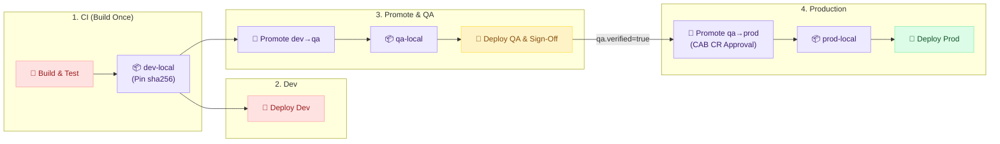

# Real-World DevOps Engineer Responsibilities — PayPulse Technologies (30-Day Enterprise Case Study)

## 1. Enterprise Profile, Scale & Hybrid Toolchain

**PayPulse Technologies** is a fast-growing FinTech and merchant payment platform (300+ employees, 14–15 cross-functional product development squads, 20–50+ microservices each) delivering real-time checkout gateways, merchant settlements, digital wallets, fraud analytics, and core banking ledger APIs.

### Core DevOps Tools, Baseline Versions & Hosting Matrix (As of August 2, 2026)

| DevOps Tool & Internal Endpoint | Hosting & Deployment Model | Baseline Version (Aug 2, 2026) | Non-Prod TLS Expiry | Production TLS Expiry |
| :--- | :--- | :--- | :--- | :--- |
| **SonarQube Server**<br>`sonar.internal.paypulse.com` | On-Premises Linux VM | **2026.1 LTA** | **Aug 4, 2026** *(⚠️ 2 days)* | **Aug 23, 2026** *(⚠️ 21 days)* |
| **Jenkins Controller**<br>`jenkins.internal.paypulse.com` | AWS Cloud Dedicated EC2 (`m6i.2xlarge`, gp3 EBS, Java 21) | **v2.552.3 LTS** | Oct 14, 2026 | Nov 28, 2026 |
| **Argo CD GitOps**<br>`argocd.internal.paypulse.com` | Multi-Cluster Controller on AWS EKS | **v3.1.x** | Sep 18, 2026 | Oct 22, 2026 |
| **PostgreSQL Database**<br>`postgres.internal.paypulse.com` | On-Premises Dedicated Linux VM (Backing SonarQube & Artifactory) | **v16.3** | Dec 10, 2026 | Dec 10, 2026 |
| **JFrog Artifactory HA**<br>`artifactory.internal.paypulse.com` | On-Premises 2-Node Enterprise Cluster | **v7.84.x Enterprise** ($N-1$) | Jan 12, 2027 | Feb 15, 2027 |
| **NGINX Ingress Proxies**<br>Reverse Proxy Fleet | NGINX (TLS Ingress for Cloud & On-Prem Tools) | **v1.26.x Stable** | Mar 15, 2027 | Mar 15, 2027 |
| **GitHub Enterprise** | Enterprise Cloud SaaS Organization | **Managed SaaS** | N/A *(SaaS)* | Auto-Rotated TLS 1.3 |

---

## 2. Team Operating Model & Boundary

- **Platform Boundary:** Cloud accounts, VPC networking, and Kubernetes infrastructure are provisioned by the Cloud Platform Team. The DevOps Delivery Team focuses purely on CI/CD pipelines, shared libraries (`paypulse-shared-library`), container packaging, deployments, and operational reliability.
- **Cross-Functional Fleet (Zero Tool Silos):** A 4-engineer unit (**Marcus [Lead]**, **Alex**, **Priya**, **Sam**) where every engineer operates, builds, and troubleshoots any component in the stack without single-person bottlenecks.
- **SOP-Driven Governance:** Standardized via Confluence runbooks (SOP-01 to SOP-05) covering TLS rotations, platform upgrades, application CI onboarding, repo provisioning, and incident RCAs.

---

## 3. 30-Day Operational Roster (August 3 – September 4, 2026)

Sprint work is tracked in Jira project **`DEVOPS`** across 2-week sprints with a strict **70% planned / 30% operational support** capacity split:
- **Story & Task (70% Planned):** Pipeline onboarding, shared library features, and scheduled platform maintenance (1–5 days).
- **Bug (30% Buffer):** Unplanned build unblocking, pipeline interrupts, and incident remediations (hours to 1–2 days).

---

### Week 1: August 3 – August 9 (Sprint 24 Kickoff, Non-Prod Certs & Daily Jira Firefighting)

#### Day 1 — Monday, August 3, 2026 *(Sprint 24 Planning, Non-Prod SonarQube TLS Renewal & Artifactory License Update)*
- **Marcus:** 
    - Host Sprint 24 Planning (10:00 – 11:30 AM). Review velocity and allocate capacity across planned epics and support buffer (70% planned / 30% operational support).
    - Lead discovery meeting with Squad 4 (Core Payments Lead & Architect). Create Jira Epic `DEVOPS-100` (Onboard Payments API to CI/CD) and user stories `DEVOPS-101` through `DEVOPS-104`.
    - Submit RFC/CAB for Aug 15 Production Maintenance Window (CR-9482: SonarQube Production TLS Renewal & Cloud Host Patching).
- **Alex:** 
    - **[DEVOPS-101: Story - In Progress - Day 1 of 3 (Shared Library Branch & Maven Cache Config)]** Branch `paypulse-shared-library`; begin prototyping remote Artifactory cache configuration for Maven dependencies in `java_maven.groovy`.
    - **[DEVOPS-501: Bug / High — Triaged → Zombie Container Killed → Closed in 12 min]** Interrupted by Squad 3 escalation: "PR pipeline stuck in pending state" blocking an urgent hotfix for Customer Onboarding. Alex investigates while developers ping frantically in `#devops-support`. Discovers a zombie Jenkins agent container holding a locked workspace on agent node 4. Safely kills orphaned container and unblocks the PR queue in 12 minutes.
- **Priya:** 
    - **[DEVOPS-102: Story - In Progress - Day 1 of 3 (Squad Discovery & CI Parameters)]** Meet with Squad 4 engineers to define CI `Jenkinsfile` build parameters and test profiles. Register SonarQube 2026.1 LTA project keys for Payments Gateway.
    - **[DEVOPS-310: Task - Closed - JFrog Artifactory Enterprise License Renewal on Non-Prod & Prod]** Receive renewed annual JFrog Artifactory Enterprise license bucket from Procurement. Apply license keys via Artifactory REST API (`POST /artifactory/api/system/licenses`) across Non-Prod and Production clusters on the same day. Verify zero-downtime hot reload, 2-node active-active HA cluster health, and valid expiration date extended to August 2027 without interrupting active package downloads or CI builds.
    - Review and triage incoming DevOps support queue; assign tickets for Sprint 24.
- **Sam:** 
    - **[DEVOPS-301: Task - In Progress - Day 1 of 5 (CA Cert Ingestion & Dev Ingress Deploy)]** Non-Prod SonarQube TLS Renewal: Receive renewed dedicated SonarQube certificate (`sonar.nonprod.internal.paypulse.com`) from Corporate CA. Deploy new certificate to Non-Prod reverse proxy for Dev SonarQube. Run `test-tls-handshake.sh`; confirm August 2027 expiration and valid trust chain.

#### Day 2 — Tuesday, August 4, 2026
- **Marcus:** Daily standup (9:30 AM). Sync with Cloud Platform Lead (David) regarding EKS QA cluster (`eks-us-east-1-qa`) network policies and IAM Pod Identity roles for Payments.
- **Alex:** 
    - **[DEVOPS-101: Story - In Progress - Day 2 of 3 (Docker Multi-Stage Build Optimization)]** Test `docker.groovy` multi-stage build optimization for Payments BE using Java 21 Distroless base image. Image build time reduced by 45%.
    - Peer review: Review Priya's PR for SonarQube project automation.
- **Priya:** 
    - **[DEVOPS-105: Story - Application Squad Request: Add Java 21 LTS & Node.js 22 LTS CI Agent Templates]** Application Squads 4 (Core Payments) and 14 (Merchant Portal) submit Jira requirements to support **Java 21 LTS (Eclipse Temurin)** and **Node.js 22 LTS (Iron)** container runtimes for their active microservices. Priya updates `vars/java_maven.groovy`, `vars/nodejs.groovy`, and dynamic Kubernetes agent pod specs in `paypulse-shared-library` with pre-warmed dependency caches, decreasing clean build cycles by 40%.
    - **[DEVOPS-102: Story - In Progress - Day 2 of 3 (SonarQube PR Decoration Testing)]** Audit Project #16 pull request workflow. Verify that PR decoration on GitHub Enterprise displays SonarQube quality gate status.
    - **[DEVOPS-502: Bug / Blocker — Triaged → Maven Virtual Cache Re-Indexed → Closed in 20 min]** Squad 2 developer escalates that their Maven build suddenly fails with `Checksum validation failed for internal-security-lib.jar`. Developer is under pressure before a partner demo. Priya investigates Artifactory metadata; discovers a corrupted SHA-256 checksum caused by an interrupted deployment earlier that morning. Re-indexes the Maven virtual cache and triggers a clean re-fetch, resolving the blocker in 20 minutes.
- **Sam:** 
    - **[DEVOPS-301: Task - In Progress - Day 2 of 5 (EKS QA Namespace Validation)]** Test `kubernetes_helm.groovy` deployment to EKS QA namespace in `us-east-1` (`eks-us-east-1-qa`). Confirm Helm release history and revision tracking.
    - **[DEVOPS-401: Task - Closed - GitHub Enterprise Repo Provisioned for Cloud Team (paypulse-tf-module-aurora)]** Cloud Team requests dedicated repo for reusable Aurora PostgreSQL Serverless v2 Terraform module. Sam provisions repository per SOP-05: scaffolds templates, enforces linear history & signed commits, configures branch protections requiring 2 peer approvals on `main`, and binds GitHub team `cloud-platform-engineers` with Admin access.

#### Day 3 — Wednesday, August 5, 2026
- **Marcus:** 
    - Daily standup. Discovery meeting with Squad 7 (Customer Loyalty & Mobile Lead). Create Jira Epic `DEVOPS-110` (Flutter Loyalty App CI/CD) and story `DEVOPS-110`.
    - Review SonarQube scan coverage thresholds (80% baseline across all squads).
- **Alex:** 
    - **[DEVOPS-101: Story - Closed - Merged (PR #88 Passed & QA Verification)]** Finalize integration tests for `java_maven.groovy`, open PR #88, pass peer review with Priya, and merge to release branch. Close ticket.
    - **[DEVOPS-110: Story - In Progress - Day 1 of 3 (Flutter Android Agent Dockerfile Spike)]** Pick up Flutter mobile agent story; begin constructing Dockerfile with Android SDK command-line tools.
- **Priya:** 
    - **[DEVOPS-102: Story - Closed - Merged (FastAPI Pipeline Deployed & Verified)]** Onboard Project #16 Kafka event producer service (Python FastAPI). Configure `python.groovy` with pytest and flake8 linting. Merge configuration and close ticket.
    - **[DEVOPS-103: Story - In Progress - Day 1 of 2 (Kafka KRaft Broker Sidecar Testing)]** Assist Squad 4 in architecting integration test stage with KRaft-based Kafka broker running as a sidecar container in Jenkins pod.
- **Sam:** 
    - **[DEVOPS-301: Task - In Progress - Day 3 of 5 (S3/CloudFront Cache Headers & Invalidation)]** Test `s3_cloudfront.groovy` for React merchant portal: verify S3 bucket sync, cache-control headers (`max-age=31536000` for assets), and CloudFront invalidation.
    - **[DEVOPS-503: Bug / High — Triaged → Helm Secret Injected → Closed in 15 min]** Squad 5 developer reports QA Ingress endpoint returns `HTTP 502 Bad Gateway`. Developer assumes an EKS outage. Sam inspects EKS Pod logs; identifies that the microservice container crashed due to an unset environment variable (`KAFKA_BROKER_URL`). Guides developer to add the missing secret in their Helm values file, restoring service immediately.

#### Day 4 — Thursday, August 6, 2026
- **Marcus:** Daily standup. Mid-week sprint burndown check. Review QA telemetry in Datadog.
- **Alex:** 
    - **[DEVOPS-110: Story - In Progress - Day 2 of 3 (Gradle Cache Mount & Build Time Tuning)]** Optimize Flutter build times using persistent agent Gradle cache volume; build duration reduced from 22 minutes to 9 minutes.
    - **[DEVOPS-504: Bug / Medium — Triaged → Jacoco XML Path Fixed → Closed in 30 min]** Squad 8 reports SonarQube quality gate failed on an urgent PR with `Coverage is 0%`, despite unit tests passing locally. Alex context-switches off Flutter optimization to pair with developer. Discovers Jacoco XML report path misconfigured in `pom.xml` (`target/site/jacoco` vs `target/jacoco.exec`). Corrects parameter in `java_maven.groovy`, allowing the PR to pass.
    - **[DEVOPS-403: Task - Closed - GitHub Enterprise Repo Provisioned for Application Squad 4 (paypulse-payments-event-router)]** Squad 4 requests a new repo for their Kafka event router microservice. Alex provisions the repo, registers SonarQube quality gate keys, and pre-populates the standard CI `Jenkinsfile` template.
- **Priya:** 
    - **[DEVOPS-103: Story - Closed - Merged (Dynamic Broker Integration Tests Passed)]** Validate KRaft Kafka broker sidecar in dynamic agent pods. Complete test documentation and close ticket.
    - **[DEVOPS-402: Task - Closed - GitHub Enterprise Repo Provisioned for On-Prem Infrastructure Team (paypulse-datacenter-san-cleaner)]** On-Prem data center team requests a private repository for automated SAN storage pruning scripts. Priya creates the repository with standard Python templates, pre-commit flake8 hooks, and grants write access to Entra ID group `onprem-infra-engineers`.
    - Prepare SonarQube quality gate compliance report for weekly platform sync.
- **Sam:** 
    - **[DEVOPS-301: Task - In Progress - Day 4 of 5 (Jenkins Controller Upgrade Sandbox Dry-Run)]** Prepare QA sandbox environment for Jenkins controller upgrade dry-run ($N-1$ `v2.552.3` $\rightarrow$ `v2.568.2 LTS`). Audit plugin compatibility list.

#### Day 5 — Friday, August 7, 2026 *(Incident A: QA Migration Failure)*
- **Marcus:** **[INC-0807-01 / SEV-2]** QA deployment in `kubernetes_helm.groovy` fails due to PostgreSQL lock timeout during Flyway migration. Coordinate with Squad 4 Lead; invoke automatic Helm rollback to previous stable release. Create post-incident action items `DEVOPS-104` and `SOP-03` update.
- **Alex:** 
    - **[DEVOPS-104: Story - In Progress - Day 1 of 2 (Flyway Migration Dry-Run Step Architecture)]** Update `java_maven.groovy` Shared Library step to include optional `dbMigrationCheck: true` parameter executing Flyway `dryRun`.
    - **[DEVOPS-110: Story - Closed - Merged (Android Agent Released to Artifactory)]** Push validated Flutter Android agent to Artifactory; update `vars/docker.groovy` agent labels; close story.
- **Priya:** 
    - Document `java_maven.groovy` migration dry-run check parameters in developer onboarding portal (Confluence SOP-03).
    - **[DEVOPS-505: Bug / Blocker — Triaged → Robot Token Rotated → Closed in 25 min]** Concurrent with Incident A, Squad 9 developer raises urgent ticket: "Cannot pull base Docker image `paypulse-java21-base:latest` in CI". Priya tracks failure to an expired Docker robot token in Jenkins credentials store. Rotates Artifactory service account token, updates Jenkins credentials via JCasC, and notifies developers.
- **Sam:** 
    - **[DEVOPS-301: Task - Closed - Verified (QA JCasC Reload & SOP-01 Runbook Staged)]** Execute Jenkins controller upgrade dry-run in QA sandbox VM. Document rollback procedure, verify JCasC config reload, and close ticket.

---

#### Day 6 — Saturday, August 8, 2026 (Weekend)
- **Team:** Scheduled Off. On-call rotation active.

#### Day 7 — Sunday, August 9, 2026 (Weekend)
- **Team:** Scheduled Off.

### Week 2: August 10 – August 16 (CAB Preparation, Release Hardening & Prod Maintenance Window)

#### Day 8 — Monday, August 10, 2026
- **Marcus:** 
    - Sprint 24 Week 2 Kickoff standup. Review sprint burndown. 
    - Discovery meeting with Squad 6 (Merchant Settlements). Create Jira Epic `DEVOPS-140` (Settlements Service CI/CD: Node.js BE + React FE). 
    - Submit final CAB change ticket CR-9482 for Saturday Aug 15.
- **Alex:** 
    - **[DEVOPS-140: Story - In Progress - Day 1 of 2 (pnpm Cache & Jest Reporting)]** Enhance `nodejs.groovy` in Shared Library with automated pnpm/npm dependency caching and Jest code coverage reporting.
    - Peer review: Review Sam's Helm deployment script improvements.
- **Priya:** 
    - **[DEVOPS-141: Story - In Progress - Day 1 of 2 (Artifactory Virtual npm Repo Scaffolding)]** Configure JFrog Artifactory virtual npm repository and scan policies for Settlements Service dependencies.
    - **[DEVOPS-404: Task - Closed - GitHub Enterprise Repo Provisioned for Application Squad 9 (paypulse-fraud-feature-store)]** Squad 9 requests a new repository for their real-time fraud feature-store worker. Priya provisions repository per SOP-05 with Java/Maven `.gitignore`, SonarQube integration, and branch protection on `main` and `develop`.
- **Sam:** 
    - **[DEVOPS-302: Task - In Progress - Day 1 of 4 (QA Pod Identity Verification)]** Maintenance Preparation: Coordinate with Cloud Platform team to verify automated QA IAM Pod Identity roles for Settlements microservices.
    - **[DEVOPS-506: Bug / Blocker — Triaged → Stuck Helm Secret Cleaned → Closed in 20 min]** Squad 1 developer frantically asks in Slack: "Helm deploy failed with `release payments-service has failed status and cannot be upgraded`". Release train is held up. Sam identifies a stuck Helm pending-upgrade secret created when a build agent pod was abruptly evicted. Runs `helm rollback` and cleans the pending release metadata, enabling the release to continue.

#### Day 9 — Tuesday, August 11, 2026
- **Marcus:** Daily standup. Sync with Enterprise Security Architect on token expiration standards for Jenkins GitHub App credentials.
- **Alex:** 
    - **[DEVOPS-140: Story - Closed - Merged (PR #95 Merged, Build 60% Faster)]** Validate pnpm cache speedup (builds 60% faster); open PR, merge, and close ticket.
    - **[DEVOPS-130: Story - In Progress - Day 1 of 2 (Cosign Keyless Signing Integration)]** Update `docker.groovy` to enforce container image signing using Cosign and push signature metadata to Artifactory.
    - **[DEVOPS-507: Bug / High — Triaged → Git History Rewritten & Pre-Receive Hook Enforced]** A developer pushes a large 850MB mock test database file directly into Git, causing all Jenkins clones across 3 squads to time out over the internal network. Alex diagnoses the spike in agent network latency, identifies the commit with `git-sizer`, works with developer to rewrite Git history using `git-filter-repo`, and adds a pre-receive hook in GitHub preventing commits > 50MB.
- **Priya:** 
    - **[DEVOPS-141: Story - Closed - Merged (Virtual npm Resolution Configured)]** Finalize virtual npm repository resolution order in Artifactory; author CI `Jenkinsfile` and raise PR to Squad 6's `develop` branch.
- **Sam:** 
    - **[DEVOPS-308: Task - Cloud Team Request: Upgrade Terraform CLI from v1.8.5 to v1.10.0 in Jenkins Infra Runner]** Cloud Platform Team files a Jira task requesting DevOps upgrade the centralized Terraform runner from `v1.8.5` to the latest **Terraform CLI `v1.10.0`** across the `k8s-terraform-agent` pod template and `vars/terraformPipeline.groovy`. The upgrade introduces native ephemeral resource lifecycle blocks and enhanced S3 backend encryption. Sam builds and verifies the new runner container image `paypulse-agent-terraform:v1.10.0` with `tfsec v1.28.1` and confirms non-prod dry-runs execute cleanly.
    - **[DEVOPS-302: Task - In Progress - Day 2 of 4 (Prod Cert Staging & verify-prod-tls.sh)]** Pre-stage renewed production SonarQube certificate (`sonar.internal.paypulse.com`) in the encrypted credential store and target reverse proxy. Author automated verification script (`verify-prod-tls.sh`) for Saturday's production maintenance window.
    - **[DEVOPS-405: Task - Closed - GitHub Enterprise Repo Provisioned for Cloud Team (paypulse-karpenter-nodepools-v2)]** Cloud Team requests repo for versioned Karpenter NodePool manifest templates. Sam sets up the repo with YAML linting validation workflow and branch protections requiring 2 peer reviews.

#### Day 10 — Wednesday, August 12, 2026 *(Incident B: Simulated Supply-Chain Vulnerability)*
- **Marcus:** **[INC-0812-01 / SEV-1]** JFrog Xray flags a simulated Critical remote code execution vulnerability (CVSS 9.8) in a shared npm logging library during Project #18 `nodejs.groovy` build. Pipeline gate automatically blocks deployment.
- **Alex:** 
    - **[DEVOPS-130: Story - Closed - Merged (Cosign Verification Enforced in docker.groovy)]** Finalize Cosign verification checks; merge to `vars/docker.groovy`; close ticket.
    - Audit all 15 live microservice pipelines to determine vulnerability blast radius (2 services affected).
- **Priya:** 
    - Collaborate with Squad 6 developers to pin patched library version; re-trigger pipeline; verify Xray clearance.
    - **[DEVOPS-508: Bug / High — Triaged → Chrome Agent Image Built & Labeled]** Amidst the Xray vulnerability investigation, Squad 10 QA lead reports that their automated Cypress end-to-end test suite in Jenkins failed because headless Chrome binary was missing in dynamic node agent pod. Priya quickly creates an updated Docker agent image with Chrome pre-installed and updates agent label in `nodejs.groovy`.
- **Sam:** 
    - **[DEVOPS-302: Task - In Progress - Day 3 of 4 (Post-Incident Guardrail Verification)]** Validate that `kubernetes_helm.groovy` rejected unsigned container image deployment, confirming security guardrail.

#### Day 11 — Thursday, August 13, 2026
- **Marcus:** Attend Enterprise CAB Meeting. Defend CR-9482: Production SonarQube TLS Certificate Cutover and Cloud Team's monthly host patching. **CR-9482 Approved**.
- **Alex:** 
    - Finalize pipeline code freeze before production weekend. Clean up orphaned workspace directories on agent nodes.
    - **[DEVOPS-406: Task - Closed - GitHub Enterprise Repo Provisioned for On-Prem Infrastructure Team (paypulse-vmware-nsx-auditor)]** On-Prem data center team requests a repo for network security auditing scripts. Alex provisions repo per SOP-05, adds pre-receive secret scanning, and assigns Entra ID `onprem-infra-engineers` team access.
- **Priya:** Conduct developer office hours (14:00 – 16:00) helping Squad 4 and Squad 6 with pipeline telemetry dashboards.
- **Sam:** 
    - **[DEVOPS-302: Task - In Progress - Day 4 of 4 (Pre-Maintenance SAN/EBS Snapshot Sanity Checks)]** Perform pre-maintenance sanity checks with Cloud Team. Verify AWS EBS snapshot for cloud Jenkins controller and on-prem SAN volume snapshots for SonarQube and Artifactory.
    - **[DEVOPS-509: Bug / High — Triaged → Webhook HMAC Secret Re-Synced in 15 min]** Squad 12 developer reports PR builds in GitHub are not triggering Jenkins webhooks. Developer has an impending release deadline. Sam traces GitHub Enterprise webhook delivery log; finds `HTTP 403 Forbidden` due to an expired webhook HMAC secret rotated by IT security without notification. Sam re-synchronizes the secret between GitHub and Jenkins, restoring automated builds in 15 minutes.

#### Day 12 — Friday, August 14, 2026 *(Sprint 24 Review & Retro)*
- **Marcus:** Facilitate Sprint 24 Review & Demo (Projects #16, #17, #18 onboarded). Facilitate Sprint 24 Retrospective. Review shift assignments for Saturday maintenance.
- **Alex:** 
    - Publish release notes for Shared Library `v2.4.0` (Flyway dry-run validation, Cosign signing, Flutter mobile support).
    - **[DEVOPS-510: Bug / Blocker — Triaged → DB Secret Restored & K8s Secret Re-Injected]** Friday afternoon pre-freeze panic: A developer accidentally deletes their QA Kubernetes secret containing database credentials for the on-prem PostgreSQL database. Alex retrieves the credential template from encrypted backup, re-injects the secret into the QA namespace, and configures an automated secret sync manifest to prevent manual deletions.
- **Priya:** Validate SonarQube quality gate compliance report for executive leadership.
- **Sam:** 
    - **[DEVOPS-302: Task - Ready for Maintenance (Production SonarQube Cert & Rollback Config Prepared)]** Final verification of production SonarQube certificate files and preparation of rollback configuration.

---

#### Day 13 — Saturday, August 15, 2026 *(CR-9482: Production Maintenance Window 01:00 – 05:00 UTC)*
- **Marcus (Bridge Commander):** Open maintenance bridge with NOC. Supervise execution.
- **Sam (DevOps Execution Lead):**
    - **Task 1: Production SonarQube TLS Cutover:** Re-bind renewed dedicated certificate (`sonar.internal.paypulse.com`) on production NGINX reverse proxy for SonarQube Production. Validate HTTPS handshake, certificate chain trust, and August 2027 expiration.
    - **Task 2: Service Verification:** Test `docker login`, `mvn deploy`, `npm publish`, and Git webhook reception.
- **Cloud Team:** Apply monthly OS kernel security patches to host VMs; perform rolling reboot of Artifactory HA nodes (zero downtime).
- **Alex & Priya (Verification Team):** Execute automated synthetic pipeline suite across `java_maven.groovy`, `nodejs.groovy`, and `python.groovy`. Confirm 100% test pass.
- **Marcus:** System nominal at 04:15 UTC. Close bridge line, update CAB ticket to "Completed - Successful", broadcast all-clear. *(Milestone achieved 8 days ahead of SonarQube's Aug 23 expiration!)*

#### Day 14 — Sunday, August 16, 2026 (Weekend)
- **Team:** Scheduled Off (Recovery following night maintenance).

### Week 3: August 17 – August 23 (Sprint 25 Kickoff & Original SSL Expiry Milestone)

#### Day 15 — Monday, August 17, 2026 *(Sprint 25 Planning)*
- **Marcus:** 
    - Sprint 25 Planning (10:00 – 11:30 AM). Celebrate successful SonarQube TLS cutover. Review sprint velocity and support allocation.
    - Discovery meeting with Cloud Platform Lead (David) and Squad 4 (Payments Lead): Cloud Team and Application Squads formally request DevOps to automate cloud infrastructure creation across their central project-level Terraform repository (`paypulse-infrastructure`): eliminate local developer CLI `terraform apply` by engineering a centralized Jenkins Terraform pipeline (`terraform init`, `plan`, `apply`) supporting `foundations/` and `apps/` sub-projects with `dev.tfvars`, `qa.tfvars`, and `prod.tfvars` across separate AWS accounts (`paypulse-aws-dev`, `paypulse-aws-qa`, `paypulse-aws-prod`). Create Jira Epic `DEVOPS-305` with user stories `DEVOPS-305` and `DEVOPS-306`.
    - Discovery meeting with Squad 1 (Core Banking Ledger Lead). Create Jira Epic `DEVOPS-150` (Core Banking Ledger CI/CD) with stories `DEVOPS-150` and `DEVOPS-151`.
- **Alex:** 
    - **[DEVOPS-150: Story - In Progress - Day 1 of 3 (Dynamic Testcontainers Pod Spec Spike)]** Architect custom Shared Library step for database integration testing using Testcontainers in dynamic Kubernetes agent pods. Spike initial pod template.
    - Triage Sprint 25 backlog stories and configure CI test harnesses.
- **Priya:** 
    - **[DEVOPS-151: Story - In Progress - Day 1 of 2 (Banking Ledger Pipeline Architecture Design)]** Review Project #19 code structure with Squad 1. Define immutable promotion workflow: single parameterized CD pipeline (`Jenkinsfile.deploy` for `dev`, `qa`, and `prod`) and centralized promotion pipeline (`Jenkinsfile.promote` for `promote-to-qa` and `promote-to-prod`) copying released artifacts without rebuilding.
    - **[DEVOPS-511: Bug / Blocker — Triaged → Root CA Injected into Python Base Image → Closed in 35 min]** Following weekend maintenance, multiple Python pipelines fail with `SSL: CERTIFICATE_VERIFY_FAILED` when pulling dependencies via pip. Developers blocked across 3 squads. Priya quickly isolates that the Python base container was missing the updated corporate Root CA cert. Pushes patched base image to Artifactory with Root CA in `/etc/ssl/certs/`, resolving the blocker for all squads.
- **Sam:** 
    - **[DEVOPS-305: Task - In Progress - Day 1 of 3 (Shared Library terraformPipeline.groovy Scaffolding & Dynamic Backend)]** Cloud Team request: Begin architecting reusable `terraformPipeline.groovy`. Define parameterized stages for `PROJECT_PATH` (`foundations/*`, `apps/*`), `ENVIRONMENT` (`dev`/`qa`/`prod`), and `ACTION` (`plan`/`apply`), configuring dynamic remote S3 backend and DynamoDB lock table per environment.
    - Monitor post-patching system telemetry in Datadog; verify CPU/memory baseline across Jenkins controller and Artifactory HA cluster.

#### Day 16 — Tuesday, August 18, 2026
- **Marcus:** Daily standup. Sync with Cloud Team on multi-region Argo CD delivery architecture for Core Banking Ledger across `us-east-1` and `us-west-2`.
- **Alex:** 
    - **[DEVOPS-150: Story - In Progress - Day 2 of 3 (PostgreSQL 16 Ephemeral Container Test Stage)]** Update `java_maven.groovy` to support dynamic Testcontainers spinning up ephemeral PostgreSQL 16 containers inside agent pods.
    - **[DEVOPS-407: Task - Closed - GitHub Enterprise Repo Provisioned for On-Prem Security Team (paypulse-hsm-pkcs11-proxy)]** On-Prem security team requests a repository for a C/Go HSM PKCS#11 network proxy agent connecting data center HSMs with cloud payment pods. Alex provisions repository per SOP-05, configures branch protections requiring 2 peer reviews, and provisions dynamic agent build profile.
    - Peer review: Review Priya's Artifactory encrypted repository policy.
- **Priya:** 
    - **[DEVOPS-151: Story - Closed - Merged (Encrypted Banking JAR Repo Provisioned)]** Setup dedicated Artifactory encrypted repository for Banking core JAR distributions. Complete promotion workflow and close ticket.
    - **[DEVOPS-180: Story - In Progress - Day 1 of 2 (Gitleaks Pre-Commit Secret Scanning Spike)]** Begin integrating Gitleaks pre-commit secret scanning into Shared Library baseline.
- **Sam:** 
    - **[DEVOPS-309: Task - Cloud Team Request: Upgrade gcloud CLI to v510.0.0 in GCP Build Agent Pods]** Cloud Platform Team files a Jira task requesting the upgrade of Google Cloud SDK `gcloud` to the latest **`v510.0.0`** in the dynamic GCP build agent pod template (`paypulse-agent-gcp`) to support Google Cloud Run v2 API features and BigQuery fine-grained IAM token exchange. Sam updates the agent Dockerfile, stages the container image in on-prem JFrog Artifactory, and validates authentication via Workload Identity federation.
    - **[DEVOPS-305: Task - In Progress - Day 2 of 3 (Multi-Account AssumeRole & dev/qa/prod.tfvars Handling)]** Configure cross-account AWS IAM AssumeRole logic to switch dynamically into separate AWS accounts (Dev `111122223333`, QA `444455556666`, Prod `777788889999`). Wire `-chdir=${projectPath}` and `-var-file=${env}.tfvars` into `terraform plan` and integrate `tfsec` static analysis.
    - **[DEVOPS-512: Bug / High — Triaged → Rootless Podman Socket Mounted → Closed in 25 min]** Squad 1 developer reports dynamic Testcontainers pod in Jenkins fails to start PostgreSQL with error `Cannot connect to Docker daemon`. Sam identifies that the Jenkins agent pod was missing rootless Docker-in-Docker socket mounting. Updates Kubernetes pod template spec to mount rootless Podman socket, resolving container-in-container testing.

#### Day 17 — Wednesday, August 19, 2026
- **Marcus:** Daily standup. Audit compliance evidence for upcoming ISO 27001 / SOC 2 review.
- **Alex:** 
    - **[DEVOPS-150: Story - Closed - Merged (PR #104 Merged to vars/java_maven.groovy)]** Finalize Testcontainers integration tests, pass peer review with Priya, merge to `vars/java_maven.groovy`, and close story.
    - **[DEVOPS-120: Story - In Progress - Day 1 of 3 (FastAPI + Kafka CI Pipeline Scaffolding)]** Build CI pipeline for Project #20 (Notification Engine: Python FastAPI + Kafka).
    - **[DEVOPS-513: Bug / Blocker — Triaged → Sandbox Key Revoked & git reset Enforced]** A developer's pipeline fails immediately at pre-commit stage with `Gitleaks rule failure: AWS Access Key ID detected`. Developer insists it is a test mock key. Alex reviews commit diff; discovers it is an actual active AWS sandbox credential committed in `application-test.properties`. Guides developer through AWS IAM key revocation and `git reset`, preventing credential exposure.
- **Priya:** 
    - **[DEVOPS-180: Story - Closed - Merged (Gitleaks Pre-Commit Gate Enforced in Shared Library)]** Enforce secret scanning using Gitleaks inside the Jenkins Shared Library pre-commit stage. Merge to main branch and close ticket.
    - **[DEVOPS-408: Task - Closed - GitHub Enterprise Repo Provisioned for Application Squad 3 (paypulse-merchant-notifications-service)]** Application Squad 3 requests repository for customer notification worker. Priya sets up repo with standard templates, SonarQube quality gate integration, and CI webhook.
    - Coordinate developer documentation updates for Squads 1 and 9.
- **Sam:** 
    - **[DEVOPS-305: Task - Closed - Merged (PR #106 Merged to paypulse-shared-library)]** Finalize interactive approval gate for `terraform apply`, open PR #106, pass peer review with Alex, merge to `vars/terraformPipeline.groovy`, and close ticket.
    - **[DEVOPS-306: Task - In Progress - Day 1 of 2 (paypulse-infrastructure apps/payments-service Pipeline Onboarding)]** Configure Jenkins job calling `terraformPipeline(projectPath: 'apps/payments-service', ...)`. Execute dry-run `init` and `plan` with `dev.tfvars` and `qa.tfvars`.
    - **[DEVOPS-409: Task - Closed - GitHub Enterprise Repo Provisioned for Cloud Team (paypulse-aws-transit-gateway-modules)]** Cloud Team requests repo for reusable AWS Transit Gateway route management modules. Sam configures repo with Terraform pre-commit linting.

#### Day 18 — Thursday, August 20, 2026 *(Incident C: GitOps QA Drift)*
- **Marcus:** **[INC-0820-01 / SEV-2]** Argo CD flags `OutOfSync` status on QA Payments deployment; investigation reveals developer manually edited replica count via `kubectl edit`. Trigger post-mortem action items with Cloud Platform Team.
- **Sam:** 
    - **[DEVOPS-306: Task - Closed - Merged (apps/payments-service Infra Pipeline Live)]** Execute first automated `terraform apply` via Jenkins for Payments Aurora PostgreSQL read replica in QA account; verify plan matches execution and close ticket.
    - Trigger Argo CD automated reconciliation (self-healing mode); manifest restored to Git desired state.
    - **[DEVOPS-304: Task - In Progress - Day 1 of 2 (Restrict Developer Direct kubectl Access)]** Open Jira ticket `DEVOPS-304` for Cloud Team to remove direct `kubectl edit` write permissions from developer roles.
- **Priya:** 
    - Host educational session with Squad 4 explaining GitOps immutability: all configuration changes must go through Git PRs.
    - **[DEVOPS-514: Bug / High — Triaged → JVM MaxRAMPercentage Configured → Closed in 30 min]** Squad 11 reports their microservice fails in QA with `OOMKilled (Exit Code 137)`. Developer claims it worked fine locally. Priya reviews Datadog container telemetry; observes JVM heap spikes up to 1.8GB during Kafka consumer rebalancing while container limit was 1.5GB. Guides developer to configure `-XX:MaxRAMPercentage=75.0` in Docker entrypoint.
- **Alex:** 
    - **[DEVOPS-120: Story - In Progress - Day 2 of 3 (Automated Linting & Integration Test Stages)]** Configure automated linting and integration test stages for Notification Engine. Add Slack alerting rule forwarding Argo CD drift events directly to `#devops-alerts`.

#### Day 19 — Friday, August 21, 2026
- **Marcus:** Daily standup. End-of-week roadmap sync. Note: 18 project services onboarded with consistent sprint velocity.
- **Alex:** 
    - **[DEVOPS-120: Story - Closed - Merged (Notification Engine QA Pipeline Verified)]** Validate Notification Engine pipeline on QA; merge and close ticket.
    - Assist Squad 1 in optimizing Core Banking unit test execution time using parallel JUnit forks.
- **Priya:** Update SonarQube custom ruleset to catch deprecated Spring framework methods.
- **Sam:** 
    - Pre-expiry audit: 100% of internal services confirmed running on the renewed certificate with August 2027 expiration date.
    - **[DEVOPS-304: Task - Closed - Merged (RBAC Restricting kubectl edit Merged by Cloud Team)]** Validate that direct developer `kubectl edit` permissions are revoked across QA namespaces.
    - **[DEVOPS-515: Bug / Medium — Triaged → aws-vault Refresh Script Provided → Closed in 15 min]** Squad 13 developer escalates: "Cannot deploy to EKS QA (`eks-us-east-1-qa`); error: `Unauthorized - token expired`". Sam discovers AWS STS session tokens in developer's local CLI expired, while CI/CD pipeline uses IAM Pod Identity without issue. Sam provides an updated `aws-vault` login script to refresh developer's local role assumption.

---

#### Day 20 — Saturday, August 22, 2026 (Weekend)
- **Team:** Scheduled Off.

#### Day 21 — Sunday, August 23, 2026 *(Milestone: Original Certificate Expiry Day)*
- **Marcus:** **[ORIGINAL CERTIFICATE EXPIRY DAY]** Milestone safety check: Monitor telemetry dashboards. Zero outages, zero browser warnings, zero webhook drops across the entire company. Proactive operational engineering validated!

### Week 4: August 24 – August 30 (Capacity Load Testing & Jenkins Controller LTS Upgrade)

#### Day 22 — Monday, August 24, 2026
- **Marcus:** 
    - Sprint 25 Week 2 Kickoff standup. 
    - Submit CAB RFC `CR-9540` for Jenkins Controller LTS Upgrade scheduled for Saturday, Aug 29.
    - Discovery meeting with Squad 11 (Merchant Analytics Portal). Create Jira Epic `DEVOPS-160` (Merchant Analytics Delivery) with stories `DEVOPS-160` (React Frontend CI/CD) and `DEVOPS-170` (Gradle 8.8+ & JDK 21 Toolchain).
- **Alex:** 
    - **[DEVOPS-170: Story - In Progress - Day 1 of 3 (Gradle 8.8+ & JDK 21 Toolchain Scaffolding)]** Update `java_gradle.groovy` Shared Library module to support Gradle 8.8+ and JDK 21 toolchains across Java squads.
    - **[DEVOPS-516: Bug / High — Triaged → Circular Dependency Decoupled → Closed in 20 min]** A developer in Squad 6 pushes a commit that creates a circular dependency between two internal Gradle sub-projects, causing the Jenkins agent to enter an infinite dependency resolution loop and hang for 45 minutes. Alex identifies the stuck build, kills it, analyzes the dependency tree with `./gradlew dependencies`, and sends the developer the exact lines to decouple in `build.gradle`.
- **Priya:** 
    - **[DEVOPS-303: Task - In Progress - Day 1 of 5 (SonarQube LOC Volume & Retention Audit Kickoff)]** Review SonarQube LOC volume metrics (180k / 250k LOC utilized) and initiate enterprise Artifactory capacity & retention audit for Q4.
    - Peer review: Review Sam's Jenkins JCasC sandbox configuration.
- **Sam:** 
    - **[DEVOPS-307: Task - In Progress - Day 1 of 4 (Jenkins Controller LTS Bundle Staged on Secondary VM)]** Stage Jenkins Controller upgrade bundle (`v2.552.3` $\rightarrow$ `v2.568.2 LTS`) on secondary controller VM. Verify JCasC compatibility and plugin dependency graph.
    - **[DEVOPS-410: Task - Closed - GitHub Enterprise Repo Provisioned for Cloud Team (paypulse-transit-gateway-automation)]** Cloud Team requests repo for multi-account Transit Gateway automation scripts. Sam provisions repo per SOP-05 with Terraform linting checks and team RBAC.

#### Day 23 — Tuesday, August 25, 2026 *(Incident D: Build Agent Starvation)*
- **Marcus:** **[INC-0825-01 / SEV-2]** Incident Commander: High concurrent build load from 4 squads triggers Jenkins dynamic pod queue congestion; builds pending due to Kubernetes node capacity limits in QA cluster. Coordinate with Cloud Platform Lead to adjust Karpenter NodePool quotas.
- **Sam:** 
    - Coordinate with Cloud Platform Team; diagnose that Karpenter NodePool maximum vCPU limit was reached. Cloud Team increases NodePool ceiling; pending pods schedule within 3 minutes.
    - **[DEVOPS-307: Task - In Progress - Day 2 of 4 (Mock Plugin Upgrades & JCasC Validation)]** Run mock plugin upgrade tests against secondary controller VM.
- **Alex:** 
    - **[DEVOPS-170: Story - In Progress - Day 2 of 3 (Daemon Caching in Ephemeral Kubernetes Pods)]** Test Gradle 8.8 toolchain builds with daemon caching enabled in ephemeral Kubernetes pods.
    - Implement Jenkins pipeline build priority queue: PR validation builds take precedence over scheduled nightly builds during queue surges.
- **Priya:** 
    - **[DEVOPS-303: Task - In Progress - Day 2 of 5 (Datadog Pending Queue Alerting Configured)]** Add proactive Datadog alert when Jenkins pending queue exceeds 5 jobs for more than 2 minutes.
    - **[DEVOPS-517: Bug / High — Triaged → NODE_OPTIONS Memory Ceiling Raised → Closed in 15 min]** Simultaneously during the pod starvation incident, a Squad 14 developer escalates that their React build in `nodejs.groovy` failed with `JavaScript heap out of memory`. Priya updates the Jenkins agent pod spec for frontend builds to export `NODE_OPTIONS="--max-old-space-size=4096"`, resolving the build memory ceiling.

#### Day 24 — Wednesday, August 26, 2026
- **Marcus:** Daily standup. Prepare sprint demo slides. Attend pre-CAB technical review.
- **Alex:** 
    - **[DEVOPS-170: Story - Closed - Merged (Gradle 8.8+ Toolchain Live Across Java Squads)]** Finalize Gradle 8.8+ & JDK 21 toolchain support in `java_gradle.groovy`; validate with Squad 6 and close ticket.
    - **[DEVOPS-160: Story - In Progress - Day 1 of 2 (React Frontend CI/CD & Lighthouse Scoring)]** Onboard Project #22 (Merchant Analytics React Frontend) using `nodejs.groovy` and `s3_cloudfront.groovy`. Add automated Lighthouse performance scoring.
    - **[DEVOPS-411: Task - Closed - GitHub Enterprise Repo Provisioned for Application Squad 7 (paypulse-loyalty-rewards-worker)]** Customer Loyalty squad requests repo for background rewards calculation microservice. Alex sets up repo with Python FastAPI template, SonarQube keys, and branch protections.
- **Priya:** 
    - **[DEVOPS-165: Story - Application Squad Request: Author Python 3.14 Dynamic Agent Pod Template & Shared Library Integration]** Fraud Analytics and ML Engineering squads submit a Jira story requesting **Python 3.14** runtime support for experimental free-threaded execution and faster numerical inference pipelines. Priya constructs the new dynamic pod template `paypulse-agent-python314` (distroless base with uv/pip pre-configured for on-prem Artifactory PyPI virtual cache), updates `vars/ciPipeline.groovy` and `vars/python.groovy` with `pythonVersion: '3.14'`, and validates the test suite for Project #20.
    - **[DEVOPS-303: Task - In Progress - Day 3 of 5 (Custom Environment Variable Injection Support)]** Review developer feedback on CI `Jenkinsfile` parameters; implement minor enhancement in Shared Library supporting custom environment variable injection into dynamic pods.
- **Sam:** 
    - **[DEVOPS-307: Task - In Progress - Day 3 of 4 (Final 42-Plugin Regression Dry-Run)]** Conduct final dry-run of Jenkins Controller upgrade on sandbox; verify zero plugin regression across 42 active plugins.
    - **[DEVOPS-518: Bug / High — Triaged → GCP Workload Identity Role Binding Restored in 15 min]** Squad 9 reports that their GCP Cloud Run deployment failed from `gcp_cloudrun.groovy` with `GoogleJsonResponseException: 403 Forbidden - Caller does not have permission 'run.services.get'`. Sam discovers that GCP Workload Identity pool mapping for the service account was modified by a Cloud Team Terraform run earlier that morning. Sam coordinates with Cloud Team to restore the IAM role binding in 15 minutes.

#### Day 25 — Thursday, August 27, 2026
- **Marcus:** Attend Enterprise CAB Meeting. Defend CR-9540: Production Jenkins Controller LTS Upgrade to `v2.568.2`. **CR-9540 Approved**.
- **Alex:** 
    - **[DEVOPS-160: Story - Closed - Merged (Merchant Analytics S3 & CloudFront Invalidation Live)]** Complete Project #22 frontend pipeline; verify S3 upload and CloudFront invalidation stages. Merge and close ticket.
    - **[DEVOPS-190: Story - In Progress - Day 1 of 2 (Slack Pipeline Stage Transition Notifier)]** Build Slack bot notifying developers of build stage transitions with direct links to console logs.
    - **[DEVOPS-519: Bug / Medium — Triaged → Duplicate Builds Pruned & disableConcurrentBuilds Configured]** A developer accidentally triggers 14 concurrent builds of an experimental branch by repeatedly rebasing and pushing, clogging the pipeline executor queue. Alex cancels the duplicate builds, contacts the developer to explain GitHub branch push debounce, and configures the `disableConcurrentBuilds()` option in the Shared Library baseline.
- **Priya:** 
    - **[DEVOPS-303: Task - In Progress - Day 4 of 5 (Confluence Documentation for Projects #19–#22)]** Complete developer documentation updates on Confluence for Projects #19–#22; document custom env var schema.
    - **[DEVOPS-412: Task - Closed - GitHub Enterprise Repo Provisioned for On-Prem Security Team (paypulse-hsm-key-rotator)]** On-Prem security team requests a repo for automated HSM key rotation tool. Priya provisions the repo per SOP-05 and sets up Entra ID team access.
- **Sam:** 
    - **[DEVOPS-307: Task - Closed - Merged (Rollback Runbook Staged & CAB CR-9540 Approved)]** Finalize rollback runbook for Saturday maintenance: storage snapshot verified, fallback WAR binary staged, failover DNS TTL lowered to 60s. Close ticket.

#### Day 26 — Friday, August 28, 2026 *(Sprint 25 Demo & Retro)*
- **Marcus:** Facilitate Sprint 25 Review & Demo (Projects #19, #20, #21, #22 onboarded; 4 microservices in one sprint!). Facilitate Sprint 25 Retrospective. Send maintenance broadcast to all engineering channels for Saturday 02:00 UTC window.
- **Alex:** 
    - **[DEVOPS-190: Story - Closed - Merged (Slack Integration Deployed to QA)]** Deploy Slack pipeline notification integration to QA; merge and close ticket. Freeze pipeline changes ahead of Saturday maintenance.
- **Priya:** 
    - **[DEVOPS-303: Task - Closed - Merged (400GB SAN Storage Reclaimed via Docker Image Purge)]** Audit Artifactory storage retention policies; execute automated purge of untagged test docker images to reclaim 400GB SAN storage. Close ticket.
    - **[DEVOPS-520: Bug / Blocker — Triaged → Renewed Apple Profile Ingested → Merchant Build Released]** Friday afternoon release crunch: Squad 7 mobile team finds their iOS Flutter build failed because the Apple developer provisioning profile expired. Priya assists the mobile lead in downloading the renewed profile from Apple Developer Portal, updating the encrypted Jenkins credential store, and successfully releasing the merchant mobile build.
- **Sam:** Take pre-upgrade AWS EBS volume snapshot of production Jenkins controller on EC2; execute disk integrity check and verify cold-standby AMI image.

---

#### Day 27 — Saturday, August 29, 2026 *(CR-9540: Jenkins LTS Upgrade Window 02:00 – 04:00 UTC)*
- **Marcus (Bridge Commander):** Open maintenance bridge line with NOC.
- **Sam (Execution Lead):** Stop Jenkins service. Back up `/var/jenkins_home`. Replace Jenkins WAR with `v2.568.2 LTS`. Update plugin binaries. Restart service. Validate JCasC reload and Java 21 runtime.
- **Alex & Priya (Verification Leads):** Trigger automated smoke test suite across all 22 onboarded microservices testing `java_maven()`, `nodejs()`, `python()`, `kubernetes_helm()`, `gcp_cloudrun()`, and `s3_cloudfront()`.
- **Marcus:** All verification passed at 03:20 UTC. Close bridge line; update CAB ticket to "Completed - Successful"; broadcast all-clear.
- **[DEVOPS-521: Bug / Critical — Triaged → Patched workflow-cps HPI Injected → Closed in 18 min]** Alex: During post-upgrade verification, one legacy pipeline fails with `Plugin 'workflow-cps' version incompatible with Jenkins 2.568.2`. Alex immediately identifies the plugin downgrade artifact in `/var/jenkins_home/plugins/`, applies the latest patched HPI package, and restarts the Jenkins service, resolving the issue within the maintenance window without invoking rollback.

#### Day 28 — Sunday, August 30, 2026 (Month-End Wrap-Up)
- **Marcus:** Compile August DevOps Executive Report:
    - **Onboarding Progress:** 7 critical project services onboarded to standardized pipelines during August, establishing the foundation for the 4 to 5 project teams actively approaching DevOps for onboarding.
    - **Operational Reliability:** 0 customer-impacting outages across the entire month; 4 major operational incidents (`INC-0807-01`, `INC-0812-01`, `INC-0820-01`, `INC-0825-01`) and 21 Jira bug tickets resolved within agreed SLA.
    - **Milestone Success:** SSL certificates renewed 8 days ahead of expiration; monthly host patching and Jenkins LTS upgrade completed cleanly.
    - **Shared Library Standardization:** 100% of onboarded applications use the standardized `paypulse-shared-library`; no bespoke CI/CD implementation logic is maintained in application repositories.
    - **Illustrative DORA Baseline:** Initial baseline established during August:
        - *Deployment Frequency:* 4.2 deployments / day
        - *Lead Time for Changes:* 45 minutes
        - *Change Failure Rate:* 2.1%
        - *Mean Time to Recovery (MTTR):* 18 minutes
- **Team:** Scheduled Off.

---

### Week 5: August 31 – September 4 (Sprint 26 Kickoff & Multi-Project Onboarding Intake)

#### Day 29 — Monday, August 31, 2026 *(Sprint 26 Planning & Project Intake)*
- **Marcus:** 
    - Host Sprint 26 Planning (10:00 – 11:30 AM). **4 to 5 distinct project teams actively approach DevOps to onboard their projects and microservices into standardized CI/CD pipelines**:
        1. *Core Payments Squad:* Onboarding new async `payments-webhook` and `event-router` microservices.
        2. *Settlements Squad:* Onboarding `batch-settlements` worker and `reconciliation-engine`.
        3. *Merchant Portal Squad:* Onboarding new `merchant-checkout-v2` Node.js services.
        4. *Banking Ledger Squad:* Onboarding high-throughput `transaction-ledger` Java service.
        5. *Fraud Detection Squad:* Onboarding Python `fraud-ml-scoring` container.
    - Create Jira Onboarding Epics (`DEVOPS-201` through `DEVOPS-205`) and allocate discovery pairings across the team.
- **Alex:** 
    - **[DEVOPS-201: Story - In Progress - Day 1 of 3 (Payments Webhook CI Scaffolding)]** Pair with Core Payments lead; scaffold declarative CI `Jenkinsfile` calling `paypulse-shared-library` for the new webhook event service.
    - **[DEVOPS-413: Task - Closed - GitHub Enterprise Repo Provisioned for Application Squad 4 (paypulse-payments-webhook)]** Squad 4 requests a new repository for the async webhook worker. Alex provisions repository per SOP-05 with branch protections on `develop` and `main`, CODEOWNERS, and standard CI `Jenkinsfile` template.
- **Priya:** 
    - **[DEVOPS-202: Story - In Progress - Day 1 of 3 (Settlements Artifact Repository Provisioning)]** Provision dedicated virtual Maven and Docker repository targets in JFrog Artifactory for Settlements batch services. Register SonarQube quality gate keys.
    - **[DEVOPS-414: Task - Closed - GitHub Enterprise Repo Provisioned for On-Prem Core Banking Team (paypulse-ledger-audit-exporter)]** On-Prem core banking team requests repository for an automated audit log exporter to archive daily transaction manifests. Priya provisions repository with standard security scanning and team RBAC.
- **Sam:** 
    - **[DEVOPS-203: Story - In Progress - Day 1 of 3 (Dynamic Agent Memory Sizing for Batch Profiles)]** Review and benchmark dynamic Kubernetes agent pod templates; size memory limits for heavy batch test profiles.

#### Day 30 — Tuesday, September 1, 2026
- **Marcus:** Standup sync. Architectural review with Merchant Portal Squad lead; establish branch protection rules requiring SonarQube quality gate pass and signed commits.
- **Alex:** 
    - **[DEVOPS-201: Story - In Progress - Day 2 of 3 (FastAPI & PyTest Shared Library Integration)]** Validate `python.groovy` step with pytest and mock Kafka brokers for webhook testing.
- **Priya:** 
    - **[DEVOPS-204: Story - In Progress - Day 1 of 2 (Node.js Build Cache Optimization for Merchant Portal)]** Configure Artifactory npm virtual repository caching, cutting Merchant Portal build times from 9 minutes to 3.5 minutes.
- **Sam:** 
    - **[DEVOPS-202: Story - In Progress - Day 2 of 3 (QA Helm Values Scaffolding)]** Author declarative Helm `values-qa.yaml` entries in `paypulse-cd-pipelines` for Settlements microservices.
    - **[DEVOPS-415: Task - Closed - GitHub Enterprise Repo Provisioned for Cloud Team (paypulse-eks-addons-terraform)]** Cloud Team requests repo for multi-cluster EKS add-on automation modules. Sam provisions the repo per SOP-05 with Terraform pre-commit linting and 2-person approval rules.

#### Day 31 — Wednesday, September 2, 2026
- **Marcus:** Mid-sprint velocity check. Meet with Banking Ledger Squad architect to review immutable digest promotion requirements (`dev-to-qa` and `qa-to-prod`).
- **Alex:** 
    - **[DEVOPS-201: Story - Closed - Merged (Payments Webhook PR Merged to Develop)]** Submit PR with CI `Jenkinsfile` to Squad 4's `develop` branch. Squad reviews, runs initial build, and merges. Close ticket.
- **Priya:** 
    - **[DEVOPS-205: Story - In Progress - Day 1 of 2 (Python ML Model Artifact Versioning)]** Assist Fraud Detection squad in structuring Docker multi-stage builds with pre-downloaded ONNX model weights in Artifactory.
- **Sam:** 
    - **[DEVOPS-203: Story - Closed - Merged (Batch Agent Pod Templates Tested & Deployed)]** Complete load test on batch agent pod template; verify auto-scaling cleans up pods immediately post-build. Close ticket.

#### Day 32 — Thursday, September 3, 2026
- **Marcus:** Host hands-on developer enablement workshop (2:00 – 3:00 PM) for the 4–5 onboarding project squads, walking through Shared Library usage, parameter passing, and how to inspect console logs without filing support tickets.
- **Alex:** 
    - **[DEVOPS-204: Story - Closed - Merged (Merchant Portal CI Deployed to Develop)]** Finalize CI `Jenkinsfile` for Merchant Portal; PR approved and merged.
- **Priya:** 
    - **[DEVOPS-205: Story - Closed - Merged (Fraud ML Container Pipeline Verified)]** Finalize Python ML pipeline with automated CVE scanning; PR merged.
- **Sam:** 
    - Verify automated QA deployments in `paypulse-cd-pipelines` for all newly onboarded services; confirm Argo CD application sync status is Healthy.

#### Day 33 — Friday, September 4, 2026 *(Sprint 26 Review & 30-Day Operational Wrap-Up)*
- **Marcus:** Compile Comprehensive 30-Day Operational Report (**August 3 – September 4, 2026**):
    - **Active Project Onboarding:** 4 to 5 project teams actively engaged in ongoing onboarding; 7 critical project microservices live in production, with new project microservices progressing through QA.
    - **Operational Reliability:** 0 customer-impacting outages; all major incidents (`INC-0807-01`, `INC-0812-01`, `INC-0820-01`, `INC-0825-01`) and 25+ Jira bug tickets resolved within SLA.
    - **Platform Health:** 100% Shared Library adoption, zero tool silos across the 4 DevOps engineers, automated Terraform pipeline handling all infrastructure changes.
- **Alex, Priya, Sam:** Backlog grooming for upcoming sprint; on-call rotation handover to Priya for the weekend.

---

## 4. Four Major Incident Deep Dives & Post-Mortem Actions

### Incident A (INC-0807-01): QA Database Migration Lock Timeout (Day 5, Aug 7)
- **Failure Domain:** Application / Relational Database (PostgreSQL 16).
- **Trigger:** Squad 4 deployed a new Flyway migration with an unindexed foreign key lock while QA automated regression traffic was active.
- **Impact:** Pods crash-looped on startup waiting for lock acquisition; QA Payments endpoint returned `HTTP 500`.
- **Resolution:** Marcus coordinated with Squad 4 Lead; Sam executed an automatic Helm rollback via `kubernetes_helm.groovy` to the previous stable release within 8 minutes.
- **Post-Mortem Action Item:** Alex added `dbMigrationCheck: true` to `java_maven.groovy` to run Flyway dry-runs against ephemeral QA databases before deployment.

### Incident B (INC-0812-01): Simulated Supply-Chain Zero-Day Vulnerability (Day 10, Aug 12)
- **Failure Domain:** Security & Supply Chain.
- **Trigger:** JFrog Xray flagged a simulated Critical RCE (CVSS 9.8) in a shared npm logging library during an automated build in `nodejs.groovy`.
- **Impact:** Automated security gate blocked image build and artifact promotion; PR could not be merged.
- **Resolution:** Alex identified 2 microservices impacted; Priya collaborated with developers to pin the patched library version; pipeline re-triggered and passed.
- **Post-Mortem Action Item:** Priya enabled automated Dependabot / Renovate PRs to proactively catch patched libraries before CI build triggers.

### Incident C (INC-0820-01): GitOps Configuration Drift in QA (Day 18, Aug 20)
- **Failure Domain:** GitOps & Configuration Management.
- **Trigger:** A developer used `kubectl edit deployment` to manually increase replica count from 2 to 6 during a load test, bypassing Git.
- **Impact:** Argo CD detected `OutOfSync` status; live cluster state drifted from declarative repository.
- **Resolution:** Sam triggered Argo CD automated reconciliation (self-healing mode); replicas reverted to 2. Priya hosted an educational session on GitOps immutability.
- **Post-Mortem Action Item:** Cloud Platform Team removed direct `kubectl edit` write permissions from developer roles, enforcing PR-only access.

### Incident D (INC-0825-01): Dynamic Jenkins Agent Pod Starvation (Day 23, Aug 25)
- **Failure Domain:** Infrastructure & Compute Capacity.
- **Trigger:** 4 squads simultaneously triggered concurrent integration test suites, exhausting QA Kubernetes compute capacity.
- **Impact:** 12 build pods stuck in `Pending` state; developer PR checks delayed by up to 25 minutes.
- **Resolution:** Sam alerted Cloud Platform Team; Cloud Team expanded Karpenter NodePool maximum vCPU limit from 64 to 128 vCPUs. Pending pods scheduled within 3 minutes.
- **Post-Mortem Action Item:** Alex implemented build priority queues in Jenkins, ensuring PR validation builds take precedence over scheduled nightly builds.

---

## 5. Enterprise Dual-Repository CI/CD & Automated Infrastructure Pipeline Architecture

PayPulse enforces a **Dual-Repository Architecture** coupled with an **Immutable Artifact Promotion Model**:

1. **Application Repositories (CI):** Contain application source code and a lightweight declarative CI `Jenkinsfile` calling `paypulse-shared-library`.
2. **Centralized CD Repository (`paypulse-cd-pipelines`):** Governed exclusively by DevOps; houses parameterized deployment (`Jenkinsfile.deploy`) and state-machine promotion (`Jenkinsfile.promote`) pipelines.
3. **Enterprise Shared Library (`paypulse-shared-library`):** Centrally maintains all Groovy pipeline steps (`ciPipeline`, `promoteArtifact`, `cdPipeline`, `terraformPipeline`).

### Immutable Artifact Promotion Model (Build Once, Zero Rebuilds)

To guarantee that the exact artifact validated in QA runs in Production, PayPulse enforces **Digest-First Immutability** and a **Finite State-Machine (FSM)**:

- **Build Once & Pin Digest:** The application is built and tested **only once** by CI into `dev-local`. The cryptographic SHA-256 digest (`sha256:...`) is pinned and signed; tags (`v1.4.0`) are purely human aliases.
- **Unidirectional Promotion:** Artifacts transition strictly **`dev ➔ qa ➔ prod`** via Artifactory promotion with 100% digest parity verification. Direct `dev ➔ prod` skips and reverse downgrades are blocked.



| Pipeline Stage | Action | Immutability & Governance Rule |
| :--- | :--- | :--- |
| **1. CI Build** | Compile, test, scan, Cosign | Built **once**; extracts and pins SHA-256 digest in `paypulse-docker-dev-local`. |
| **2. Dev Deploy** | CD `Jenkinsfile.deploy` | Deploys exact `@sha256:...` digest to development EKS cluster. |
| **3. Dev ➔ QA Promote** | CD `Jenkinsfile.promote` | Validates `dev ➔ qa` transition; promotes artifact layers in Artifactory; verifies digest parity. |
| **4. QA Deploy & Sign-Off** | CD `Jenkinsfile.deploy` | Deploys exact digest to QA; automated tests run; QA attaches `qa.verified=true` metadata. |
| **5. QA ➔ Prod Promote** | CD `Jenkinsfile.promote` | Requires `qa.verified=true` + approved CAB Change Request; copies to `prod-local` without rebuilding. |
| **6. Prod Deploy** | CD `Jenkinsfile.deploy` | Multi-region production deployment referencing the byte-for-byte verified QA container digest. |

---

### Shared Library Repository Structure (`paypulse-shared-library`)

??? example "📁 Click to expand: Shared Library Repository Structure (`paypulse-shared-library`)"
    ```text
    paypulse-shared-library/
    ├── vars/
    │   ├── # --- Top-Level Pipeline Orchestrators ---
    │   ├── ciPipeline.groovy           # Standardized CI pipeline orchestrator (Build Once)
    │   ├── cdPipeline.groovy           # Standardized CD deployment orchestrator (Dev/QA/Prod)
    │   ├── promoteArtifact.groovy      # Artifactory artifact promotion step (QA -> Prod)
    │   ├── terraformPipeline.groovy    # Standardized Terraform IaC orchestrator (init, plan, tfsec, apply)
    │   │
    │   ├── # --- Modular CI Steps ---
    │   ├── python.groovy               # Python venv/poetry, pytest, flake8, bandit, package
    │   ├── java_maven.groovy           # Java 21, Maven wrapper, spotbugs, jacoco (80% gate)
    │   ├── java_gradle.groovy          # Gradle wrapper, multi-project build, checkstyle
    │   ├── nodejs.groovy               # npm/pnpm ci, audit, jest, next build, packaging
    │   ├── docker.groovy               # Multi-stage build, buildx cache, Xray scan, Cosign, push
    │   │
    │   ├── # --- Modular CD Steps (DevOps-Owned Application Delivery) ---
    │   ├── kubernetes_helm.groovy      # EKS Pod Identity auth, Helm 3 lint/upgrade/rollback
    │   ├── s3_cloudfront.groovy        # S3 sync, cache-control headers, CloudFront invalidation
    │   ├── ecs_deploy.groovy           # ECS task revision registration and deployment
    │   ├── gcp_cloudrun.groovy         # GCP Workload Identity auth, gcloud run deploy, traffic
    │   └── pipeline_notifier.groovy    # Standardized Slack/Teams notifications & Jira sync
    ```

!!! note "Cloud Platform vs. DevOps Ownership Boundary"
    Base cloud infrastructure provisioning (VPCs, EKS clusters, networking) and application Terraform HCL configurations (`*-infra` repos) are authored and owned by the Cloud Platform Team. The DevOps Delivery Team provides the **CI/CD automation tooling**: authoring `vars/terraformPipeline.groovy` in the Shared Library, securing the Jenkins Terraform runners, and managing IAM cross-account role assumption so cloud engineers execute `terraform init`, `plan`, and `apply` safely through audited pipelines rather than local laptops.

---

### Component 1: Application-Level Continuous Integration (CI)

#### Application Squad Jira Intake & DevOps Onboarding Workflow
When an application squad approaches DevOps to onboard a new or existing microservice:

1. **Squad Submits Jira Onboarding Ticket:** The squad lead files an onboarding Jira story (e.g., `DEVOPS-100`, `DEVOPS-201`) specifying their service architecture and runtime dependencies:
    - **Backend Stacks:** Java 21 LTS (Spring Boot 3.x with Maven/Gradle), Python 3.12 & Python 3.14 (FastAPI / real-time ML inference), Node.js 22 LTS (NestJS / Express), or Apache Kafka event streaming workers.
    - **Frontend & Mobile Stacks:** React.js / Next.js web applications, or Flutter cross-platform mobile applications.
    - **Target Deployment Environments:** AWS EKS multi-region clusters (`us-east-1` Primary, `us-west-2` DR), GCP Cloud Run (`us-central1` for analytics), or on-premises containers.
2. **DevOps Discovery & Shared Library Selection:** The DevOps engineer conducts a technical review to understand the squad's build lifecycle, selects the appropriate Shared Library step (`vars/ciPipeline.groovy`, `java_maven.groovy`, `nodejs.groovy`), and configures automated quality gates (SonarQube 80% coverage threshold, JFrog Xray vulnerability blocking, and Cosign keyless signing).
3. **DevOps Authors the CI `Jenkinsfile`:** A DevOps engineer (Alex, Priya, or Sam) creates a feature branch in the squad repository (`feature/devops-ci-pipeline`), crafting a clean, declarative `Jenkinsfile` calling `ciPipeline(...)`.
4. **Pull Request to `develop` Branch & Squad Merge:** DevOps opens a PR to the application's `develop` branch. Squad leads review and merge the PR, activating automated webhook builds upon commit.

#### Example: Application CI `Jenkinsfile`

??? example "📄 Click to expand: Application CI `Jenkinsfile` (`develop` branch)"
    ```groovy
    // Jenkinsfile inside paypulse/payments-service repository (develop branch)
    @Library('paypulse-shared-library@v2.4.0') _

    ciPipeline(
        appName: 'payments-service',
        stack: 'java-maven',           // Supported: 'java-maven' (Java 21 LTS), 'nodejs' (Node.js 22 LTS), 'python' (Python 3.12 / 3.14)
        javaVersion: '21',             // Application squad requirement: Java 21 LTS
        buildTool: 'mvn clean package',
        sonarQualityGate: true,
        sonarProjectKey: 'paypulse-payments-service',
        jacocoThreshold: 80,
        xrayScan: true,
        cosignSign: true,
        dockerRepo: 'paypulse-docker-dev-local' // Release candidate built ONCE into Dev repo
    )
    ```

---

### Component 2: Centralized Continuous Delivery (CD) Repository (`paypulse-cd-pipelines`)

#### Centralized Governance & Security Boundary
To protect production environments and ensure compliance with PCI-DSS and SOC 2 audits, application developers do **not** have direct access to deploy into Kubernetes or manage cloud credentials:

- All CD pipelines are maintained in a single, centralized Git repository: **`paypulse-cd-pipelines`**.
- Only the DevOps Delivery Team has write access to this repository.
- Each application service contains **two standardized pipelines**:
    1. **`Jenkinsfile.deploy`**: Single parameterized CD pipeline for deploying to `dev`, `qa`, or `prod`.
    2. **`Jenkinsfile.promote`**: Parameterized pipeline for copying released artifacts from `dev` to `qa` and from `qa` to `prod` with **zero rebuild**.

#### Repository File Layout

??? example "📁 Click to expand: Centralized CD Repository Layout (`paypulse-cd-pipelines`)"
    ```text
    paypulse-cd-pipelines/
    ├── README.md
    ├── environments/
    │   ├── dev.yaml                    # Declarative non-sensitive cluster reference
    │   ├── qa.yaml                     # Declarative non-sensitive cluster reference
    │   └── prod.yaml                   # Declarative non-sensitive cluster reference
    └── apps/
        ├── payments-service/
        │   ├── Jenkinsfile.deploy      # Parameterized CD pipeline (params: ENVIRONMENT=dev|qa|prod, TAG)
        │   └── Jenkinsfile.promote     # State-machine promotion (params: PROMOTION_PATH=dev-to-qa|qa-to-prod, TAG)
        ├── settlements-service/
        │   ├── Jenkinsfile.deploy
        │   └── Jenkinsfile.promote
        └── fraud-analytics/
            ├── Jenkinsfile.deploy
            └── Jenkinsfile.promote
    ```

!!! tip "Enterprise Guardrail: Non-Sensitive Environment Descriptors (`environments/*.yaml`)"
    To maintain the strict boundary with the Cloud Platform Team, environment YAML files in `paypulse-cd-pipelines` contain **only declarative, non-sensitive logical pointers**:
    ```yaml
    # environments/qa.yaml
    environment: qa
    cluster_ref: eks-us-east-1-qa
    ingress_domain: qa.internal.paypulse.com
    datadog_env: qa
    ```
    **Zero cloud credentials, IAM roles, VPC subnets, or node pool definitions are stored in this repository.** All underlying infrastructure lifecycle and compute management remain exclusively owned and provisioned by the Cloud Platform Team via Terraform.

#### Example 1: Parameterized Deployment Pipeline (`Jenkinsfile.deploy`)
A single, parameterized Jenkinsfile handles continuous delivery across all three environments (`dev`, `qa`, and `prod`). It resolves the immutable container digest for the requested tag before triggering Helm:

??? example "📄 Click to expand: Parameterized Deployment Pipeline (`Jenkinsfile.deploy`)"
    ```groovy
    // apps/payments-service/Jenkinsfile.deploy inside paypulse-cd-pipelines repository
    @Library('paypulse-shared-library@v2.4.0') _

    properties([
        parameters([
            choice(
                name: 'ENVIRONMENT',
                choices: ['dev', 'qa', 'prod'],
                description: 'Target environment for deployment'
            ),
            string(
                name: 'RELEASE_VERSION',
                defaultValue: '',
                description: 'Semantic version tag to deploy (e.g. v1.4.0)'
            )
        ])
    ])

    cdPipeline(
        appName: 'payments-service',
        environment: params.ENVIRONMENT,
        versionTag: params.RELEASE_VERSION,
        helmChartName: 'payments-service',
        helmReleaseName: 'payments-service',
        enableRollbackOnFailure: true
    )
    ```

#### Example 2: State-Machine Promotion Pipeline (`Jenkinsfile.promote`)
The promotion pipeline enforces valid finite state transitions (`dev ➔ qa` and `qa ➔ prod`). It resolves the exact cryptographic SHA-256 digest from the source repository, verifies quality gates, copies the artifact, and asserts digest parity before completing:

??? example "📄 Click to expand: State-Machine Promotion Pipeline (`Jenkinsfile.promote`)"
    ```groovy
    // apps/payments-service/Jenkinsfile.promote inside paypulse-cd-pipelines repository
    @Library('paypulse-shared-library@v2.4.0') _

    properties([
        parameters([
            choice(
                name: 'PROMOTION_PATH',
                choices: ['dev-to-qa', 'qa-to-prod'],
                description: 'Enforced state transition path'
            ),
            string(
                name: 'RELEASE_VERSION',
                defaultValue: '',
                description: 'Semantic version tag to promote (e.g. v1.4.0)'
            ),
            string(
                name: 'CAB_CR_TICKET',
                defaultValue: '',
                description: 'Approved CAB Change Request ticket (Required for qa-to-prod, e.g. CR-9482)'
            )
        ])
    ])

    promoteArtifact(
        appName: 'payments-service',
        promotionPath: params.PROMOTION_PATH,
        versionTag: params.RELEASE_VERSION,
        cabTicket: params.CAB_CR_TICKET
    )
    ```

*(Note: In dedicated Jenkins multi-branch folder views, teams can also expose this as two discrete job triggers—`payments-service-promote-to-qa` and `payments-service-promote-to-prod`—both delegating to `promoteArtifact.groovy` to guarantee identical state-machine enforcement).*

---

### Component 3: Central Shared Library Pipeline Orchestrators

#### `vars/ciPipeline.groovy` (Build Once)
??? example "📄 Click to expand: `vars/ciPipeline.groovy` (Build Once & Artifact Generation)"
    ```groovy
    // vars/ciPipeline.groovy in paypulse-shared-library
    def call(Map config = [:]) {
        pipeline {
            agent { label 'k8s-dynamic-agent' }
            stages {
                stage('Validate & Build') {
                    steps {
                        script {
                            if (config.stack == 'java-maven') {
                                java_maven(jdk: config.javaVersion ?: '21', sonar: config.sonarQualityGate)
                            } else if (config.stack == 'nodejs') {
                                nodejs(nodeVersion: config.nodeVersion ?: '22', runAudit: true)
                            } else if (config.stack == 'python') {
                                python(pythonVersion: config.pythonVersion ?: '3.14')
                            }
                        }
                    }
                }
                stage('Containerize & Security Gate') {
                    steps {
                        script {
                            docker(
                                image: "paypulse/${config.appName}",
                                tag: env.BUILD_NUMBER,
                                xrayScan: config.xrayScan,
                                signImage: config.cosignSign,
                                repository: config.dockerRepo
                            )
                        }
                    }
                }
            }
            post {
                always {
                    pipeline_notifier(appName: config.appName, channel: '#squad-alerts')
                }
            }
        }
    }
    ```

#### `vars/promoteArtifact.groovy` (State-Machine & Digest-Enforced Promotion)
??? example "📄 Click to expand: `vars/promoteArtifact.groovy` (State-Machine & Digest-Enforced Promotion)"
    ```groovy
    // vars/promoteArtifact.groovy in paypulse-shared-library
    def call(Map config = [:]) {
        pipeline {
            agent { label 'k8s-dynamic-agent' }
            stages {
                stage('Validate State Transition & Promotion Gates') {
                    steps {
                        script {
                            def allowedTransitions = ['dev-to-qa', 'qa-to-prod']
                            if (!allowedTransitions.contains(config.promotionPath)) {
                                error "ILLEGAL PROMOTION PATH: '${config.promotionPath}'. Allowed transitions are: dev-to-qa, qa-to-prod."
                            }

                            if (config.promotionPath == 'qa-to-prod') {
                                if (!config.cabTicket || !config.cabTicket.startsWith('CR-')) {
                                    error "PROMOTION BLOCKED: Valid CAB Change Request ticket (e.g. CR-9482) is mandatory for Production release."
                                }
                                echo "✅ CAB Ticket verified: ${config.cabTicket}"
                            }
                        }
                    }
                }
                stage('Resolve Source Cryptographic Digest') {
                    steps {
                        script {
                            def sourceRepo = (config.promotionPath == 'dev-to-qa') ? 'paypulse-docker-dev-local' : 'paypulse-docker-qa-local'
                            
                            echo "Resolving immutable container digest for paypulse/${config.appName}:${config.versionTag} in ${sourceRepo}..."
                            withCredentials([usernamePassword(credentialsId: 'artifactory-service-account', usernameVariable: 'JF_USER', passwordVariable: 'JF_PASS')]) {
                                // Extract exact immutable image manifest digest from Artifactory
                                def digestOutput = sh(
                                    script: """
                                        curl -sf -u "\$JF_USER:\$JF_PASS" \
                                          "https://artifactory.paypulse.internal/artifactory/api/docker/${sourceRepo}/v2/paypulse/${config.appName}/manifests/${config.versionTag}" \
                                          -H "Accept: application/vnd.docker.distribution.manifest.v2+json" | \
                                          sha256sum | awk '{print \$1}'
                                    """,
                                    returnStdout: true
                                ).trim()

                                env.SOURCE_DIGEST = "sha256:${digestOutput}"
                                echo "🔒 Source Digest Locked: ${env.SOURCE_DIGEST}"

                                if (config.promotionPath == 'qa-to-prod') {
                                    // Enforce that QA verification property is attached to this exact digest
                                    echo "Verifying QA Sign-Off property on ${env.SOURCE_DIGEST}..."
                                    def qaVerified = sh(
                                        script: """
                                            curl -sf -u "\$JF_USER:\$JF_PASS" \
                                              "https://artifactory.paypulse.internal/artifactory/api/storage/${sourceRepo}/paypulse/${config.appName}/${config.versionTag}?properties=qa.verified" | \
                                              grep -q "true" && echo "PASS" || echo "FAIL"
                                        """,
                                        returnStdout: true
                                    ).trim()

                                    if (qaVerified != "PASS") {
                                        error "PROMOTION REJECTED: Digest ${env.SOURCE_DIGEST} does not have required 'qa.verified=true' property in Artifactory!"
                                    }
                                    echo "✅ QA Sign-off verified in Artifactory metadata."
                                }
                            }
                        }
                    }
                }
                stage('Promote Artifact Metadata & Layers') {
                    steps {
                        script {
                            def sourceRepo = (config.promotionPath == 'dev-to-qa') ? 'paypulse-docker-dev-local' : 'paypulse-docker-qa-local'
                            def targetRepo = (config.promotionPath == 'dev-to-qa') ? 'paypulse-docker-qa-local' : 'paypulse-docker-prod-local'

                            echo "Executing ${config.promotionPath}: Promoting paypulse/${config.appName}:${config.versionTag} ➔ ${targetRepo}"

                            withCredentials([usernamePassword(credentialsId: 'artifactory-service-account', usernameVariable: 'JF_USER', passwordVariable: 'JF_PASS')]) {
                                // Copies layers and metadata without rebuilding Docker image
                                sh """
                                    jf rt docker-promote paypulse/${config.appName} \
                                       ${sourceRepo} \
                                       ${targetRepo} \
                                       --source-tag=${config.versionTag} \
                                       --target-tag=${config.versionTag} \
                                       --copy=true
                                """

                                // Assert target digest matches source digest 100%
                                def targetDigestOutput = sh(
                                    script: """
                                        curl -sf -u "\$JF_USER:\$JF_PASS" \
                                          "https://artifactory.paypulse.internal/artifactory/api/docker/${targetRepo}/v2/paypulse/${config.appName}/manifests/${config.versionTag}" \
                                          -H "Accept: application/vnd.docker.distribution.manifest.v2+json" | \
                                          sha256sum | awk '{print \$1}'
                                    """,
                                    returnStdout: true
                                ).trim()

                                def targetDigest = "sha256:${targetDigestOutput}"
                                assert env.SOURCE_DIGEST == targetDigest : "CRITICAL SECURITY FAULT: Digest mismatch! Source: ${env.SOURCE_DIGEST} vs Target: ${targetDigest}"
                                echo "✅ Cryptographic Parity Verified: ${targetDigest} (100% digest match, zero rebuild)"

                                // Tag target with promotion audit metadata
                                sh """
                                    jf rt set-props "${targetRepo}/paypulse/${config.appName}/${config.versionTag}/" \
                                       "promoted.by=jenkins;promoted.path=${config.promotionPath};promoted.digest=${targetDigest}"
                                """
                            }
                        }
                    }
                }
            }
            post {
                always {
                    pipeline_notifier(appName: config.appName, status: currentBuild.currentResult, channel: '#devops-releases')
                }
            }
        }
    }
    ```

#### `vars/cdPipeline.groovy` (Digest-Pinned Environment Deployment)
??? example "📄 Click to expand: `vars/cdPipeline.groovy` (Digest-Pinned Environment Deployment)"
    ```groovy
    // vars/cdPipeline.groovy in paypulse-shared-library
    def call(Map config = [:]) {
        pipeline {
            agent { label 'k8s-dynamic-agent' }
            stages {
                stage('Resolve Environment & Image Digest') {
                    steps {
                        script {
                            def envMatrix = [
                                dev: [
                                    cluster: 'eks-us-east-1-dev',
                                    namespace: "${config.appName}-dev",
                                    dockerRepo: 'paypulse-docker-dev-local',
                                    helmRepo: 'paypulse-helm-dev-local',
                                    valuesFile: "helm/values-dev.yaml",
                                    healthCheck: "https://dev.internal.paypulse.com/${config.appName}/health"
                                ],
                                qa: [
                                    cluster: 'eks-us-east-1-qa',
                                    namespace: "${config.appName}-qa",
                                    dockerRepo: 'paypulse-docker-qa-local',
                                    helmRepo: 'paypulse-helm-qa-local',
                                    valuesFile: "helm/values-qa.yaml",
                                    healthCheck: "https://qa.internal.paypulse.com/${config.appName}/health"
                                ],
                                prod: [
                                    cluster: 'eks-us-east-1-prod',
                                    namespace: "${config.appName}-prod",
                                    dockerRepo: 'paypulse-docker-prod-local',
                                    helmRepo: 'paypulse-helm-prod-local',
                                    valuesFile: "helm/values-prod.yaml",
                                    healthCheck: "https://api.internal.paypulse.com/${config.appName}/health"
                                ]
                            ]

                            def target = envMatrix[config.environment]
                            if (!target) {
                                error "Unknown environment: ${config.environment}. Expected 'dev', 'qa', or 'prod'."
                            }

                            // Resolve exact cryptographic digest from target repository
                            withCredentials([usernamePassword(credentialsId: 'artifactory-service-account', usernameVariable: 'JF_USER', passwordVariable: 'JF_PASS')]) {
                                def digestOutput = sh(
                                    script: """
                                        curl -sf -u "\$JF_USER:\$JF_PASS" \
                                          "https://artifactory.paypulse.internal/artifactory/api/docker/${target.dockerRepo}/v2/paypulse/${config.appName}/manifests/${config.versionTag}" \
                                          -H "Accept: application/vnd.docker.distribution.manifest.v2+json" | \
                                          sha256sum | awk '{print \$1}'
                                    """,
                                    returnStdout: true
                                ).trim()

                                env.DEPLOY_DIGEST = "sha256:${digestOutput}"
                                echo "🔒 Deploying ${config.appName} to ${config.environment.toUpperCase()} via Digest: ${env.DEPLOY_DIGEST}"
                            }

                            // Deploy to Kubernetes pinning the immutable digest to eliminate tag drift
                            kubernetes_helm(
                                cluster: target.cluster,
                                namespace: target.namespace,
                                chartRepo: target.helmRepo,
                                chartName: config.helmChartName,
                                releaseName: config.helmReleaseName,
                                valuesFile: target.valuesFile,
                                versionTag: config.versionTag,
                                imageDigest: env.DEPLOY_DIGEST, // Injects image.digest into Deployment spec
                                healthCheckUrl: target.healthCheck,
                                rollbackOnFailure: config.enableRollbackOnFailure
                            )
                        }
                    }
                }
            }
            post {
                failure {
                    pipeline_notifier(appName: config.appName, status: 'FAILED', channel: '#devops-critical')
                }
            }
        }
    }
    ```

---

### Component 4: Infrastructure-as-Code Automation (`terraformPipeline.groovy`)

!!! note "Cloud Platform & Squad Collaboration Request"
    While base cloud accounts and foundational networking are provisioned by the Cloud Platform Team, operating under PayPulse Technologies are **14 distinct projects (product squads / domains)** deployed across hybrid multi-cloud infrastructure:
    - **AWS Cloud (`us-east-1` Primary, `us-west-2` DR):** Multi-Region EKS clusters, Amazon S3, CloudFront CDN, DynamoDB, AWS SES, and SQS FIFO queues.
    - **GCP Cloud (`us-central1`):** BigData & Analytics ingestion microservices on Google Cloud Run and Google Cloud Storage.
    - **Azure:** Enterprise Entra ID (Active Directory) SSO and identity federation.
    - **Multi-Account Topology & Blast-Radius Isolation:** Dedicated, isolated cloud accounts and projects for `dev`, `qa`, and `prod` with strict IAM role boundaries and zero cross-environment contamination.

    Previously, developers and cloud engineers executed Terraform locally on their laptops, causing state lock conflicts, drift, and unreviewed configuration changes. The Cloud Platform Team and Project Squads formally requested the DevOps Delivery Team to engineer and govern a centralized, automated infrastructure CI/CD pipeline (`vars/terraformPipeline.groovy`) in `paypulse-shared-library`. Per Cloud Platform Team specifications, the Jenkins infrastructure execution runner is standardized on **Terraform CLI `v1.10.0`** (upgraded from `v1.8.5`) and **Google Cloud SDK `gcloud v510.0.0`**, guaranteeing full compatibility with multi-cloud AWS EKS and GCP Cloud Run IaC blueprints without requiring local laptop execution. This pipeline orchestrates `terraform init`, `terraform plan`, automated security scanning (`tfsec`), interactive approval gates, and `terraform apply` across any project directory using environment `.tfvars` (`dev.tfvars`, `qa.tfvars`, `prod.tfvars`), eliminating unsafe manual laptop executions across all 14 projects.

#### Standardized Project Infrastructure Repositories (14 Projects Across PayPulse Technologies)

Each of the 14 projects maintains a dedicated, standardized infrastructure Git repository (e.g., `paypulse-payments-infrastructure`, `paypulse-settlements-infrastructure`, etc.). The DevOps team provides the automated Jenkins pipeline to execute infrastructure changes safely and consistently.

??? example "📁 Click to expand: Project Infrastructure Repository Layout (`paypulse-payments-infrastructure`)"
    ```text
    paypulse-payments-infrastructure/
    ├── README.md
    ├── modules/                                # Reusable enterprise Terraform modules
    │   ├── vpc/                                # Standard VPC, public/private subnets, NAT gateways
    │   ├── eks-cluster/                        # EKS control plane, Karpenter node pools, OIDC
    │   ├── aurora-postgresql/                  # Aurora Serverless v2 / provisioned cluster
    │   ├── dynamodb/                           # Global & standard DynamoDB tables
    │   ├── sqs-fifo/                           # FIFO queues with dead-letter queue (DLQ)
    │   └── iam-pod-identity/                   # EKS Pod Identity trust relationships
    │
    ├── foundations/                            # Platform Foundation Sub-Projects
    │   ├── networking/                         # VPCs, transit gateways, Route 53, direct connect
    │   │   ├── main.tf, variables.tf, outputs.tf, backend.tf
    │   │   ├── dev.tfvars, qa.tfvars, prod.tfvars
    │   └── core-infrastructure/                # Multi-Region EKS clusters, Karpenter NodePools, KMS
    │       ├── main.tf, variables.tf, outputs.tf, backend.tf
    │       ├── dev.tfvars, qa.tfvars, prod.tfvars
    │
    └── apps/                                   # Application Microservice Sub-Projects
        ├── payments-service/                   # Payments Aurora PostgreSQL, DynamoDB, SQS FIFO, IAM
        │   ├── main.tf, variables.tf, outputs.tf, backend.tf
        │   ├── dev.tfvars, qa.tfvars, prod.tfvars
        ├── settlements-service/                # Settlements Aurora DB, ElastiCache Redis, S3
        │   ├── main.tf, variables.tf, outputs.tf, backend.tf
        │   ├── dev.tfvars, qa.tfvars, prod.tfvars
        └── fraud-analytics/                    # DynamoDB Streams, GCP BigQuery / Cloud Storage
            ├── main.tf, variables.tf, outputs.tf, backend.tf
            ├── dev.tfvars, qa.tfvars, prod.tfvars
    ```

#### Example: Infrastructure Pipeline Job (`Jenkinsfile`)
??? example "📄 Click to expand: Infrastructure Pipeline Job (Jenkinsfile)"
    ```groovy
    // Jenkinsfile triggering infrastructure automation for a target project
    @Library('paypulse-shared-library@v2.4.0') _

    properties([
        parameters([
            choice(
                name: 'PROJECT_PATH',
                choices: [
                    'apps/payments-service',
                    'apps/settlements-service',
                    'apps/fraud-analytics',
                    'foundations/networking',
                    'foundations/core-infrastructure'
                ],
                description: 'Target Terraform sub-project directory in paypulse-payments-infrastructure'
            ),
            choice(
                name: 'ENVIRONMENT',
                choices: ['dev', 'qa', 'prod'],
                description: 'Target cloud environment & isolated AWS account'
            ),
            choice(
                name: 'ACTION',
                choices: ['plan', 'apply'],
                description: 'Terraform execution action'
            ),
            string(
                name: 'CAB_CR_TICKET',
                defaultValue: '',
                description: 'Approved CAB Change Request ticket (Required for prod apply, e.g. CR-9482)'
            )
        ])
    ])

    terraformPipeline(
        projectPath: params.PROJECT_PATH,
        environment: params.ENVIRONMENT,
        action: params.ACTION,
        cabTicket: params.CAB_CR_TICKET,
        tfsecScan: true
    )
    ```

#### Shared Library Step: `vars/terraformPipeline.groovy`
??? example "📄 Click to expand: `vars/terraformPipeline.groovy` (Multi-Account Terraform Automation)"
    ```groovy
    // vars/terraformPipeline.groovy in paypulse-shared-library
    def call(Map config = [:]) {
        pipeline {
            agent { label 'k8s-terraform-agent' }
            stages {
                stage('Validate Parameters & Cloud Account') {
                    steps {
                        script {
                            def accountMatrix = [
                                dev:  [awsAccountId: '111122223333', region: 'us-east-1', roleName: 'JenkinsTerraformExecutionRole'],
                                qa:   [awsAccountId: '444455556666', region: 'us-east-1', roleName: 'JenkinsTerraformExecutionRole'],
                                prod: [awsAccountId: '777788889999', region: 'us-east-1', roleName: 'JenkinsTerraformExecutionRole']
                            ]

                            def target = accountMatrix[config.environment]
                            if (!target) {
                                error "Unknown environment: ${config.environment}. Expected 'dev', 'qa', or 'prod'."
                            }

                            if (config.environment == 'prod' && config.action == 'apply') {
                                if (!config.cabTicket || !config.cabTicket.startsWith('CR-')) {
                                    error "INFRASTRUCTURE APPLY REJECTED: Valid CAB ticket (e.g. CR-9482) is required for Production apply."
                                }
                                echo "✅ CAB Ticket verified: ${config.cabTicket}"
                            }

                            env.TARGET_ACCOUNT_ID = target.awsAccountId
                            env.TARGET_ROLE_ARN = "arn:aws:iam::${target.awsAccountId}:role/${target.roleName}"
                            env.AWS_DEFAULT_REGION = target.region
                            env.TFVARS_FILE = "${config.environment}.tfvars"
                        }
                    }
                }
                stage('Assume Cloud Account IAM Role') {
                    steps {
                        script {
                            echo "Assuming cross-account IAM role ${env.TARGET_ROLE_ARN} in AWS Account ${env.TARGET_ACCOUNT_ID} (${config.environment.toUpperCase()})..."
                            // Obtains temporary STS credentials for target AWS account via IAM AssumeRole
                        }
                    }
                }
                stage('Terraform Init') {
                    steps {
                        dir(config.projectPath) {
                            sh """
                                terraform init \
                                  -backend-config="bucket=paypulse-tfstate-${config.environment}" \
                                  -backend-config="key=${config.projectPath}/terraform.tfstate" \
                                  -backend-config="region=${env.AWS_DEFAULT_REGION}" \
                                  -backend-config="dynamodb_table=paypulse-tflocks-${config.environment}"
                            """
                        }
                    }
                }
                stage('Terraform Plan & Security Check') {
                    steps {
                        dir(config.projectPath) {
                            sh """
                                terraform plan \
                                  -var-file="${env.TFVARS_FILE}" \
                                  -out=tfplan \
                                  -detailed-exitcode
                            """
                            if (config.tfsecScan) {
                                sh "tfsec . --soft-fail"
                            }
                        }
                    }
                }
                stage('Interactive Approval Gate') {
                    when {
                        expression { config.action == 'apply' && config.environment != 'dev' }
                    }
                    steps {
                        input message: "Approve Terraform Apply for ${config.projectPath} in ${config.environment.toUpperCase()}?",
                              ok: "Apply Changes"
                    }
                }
                stage('Terraform Apply') {
                    when {
                        expression { config.action == 'apply' }
                    }
                    steps {
                        dir(config.projectPath) {
                            sh "terraform apply -input=false tfplan"
                        }
                    }
                }
            }
            post {
                always {
                    pipeline_notifier(appName: config.projectPath.replace('/', '-'), channel: '#cloud-infra-alerts')
                }
            }
        }
    }
    ```

### AI Assistance Boundary (Claude)
All four team members leverage Claude to draft Groovy Shared Library functions, generate Dockerfiles, write unit tests, and parse complex build logs. **Enterprise Guardrail:** AI-generated code must reside in a feature branch, pass Jenkins Shared Library unit tests (via JenkinsPipelineUnit), and pass human peer review before merge into `@v2.4.0` release branches.

---

## 6. Lessons Learned & Production Best Practices

1. **Decouple CI and CD into Dedicated Repositories:** Placing the CI `Jenkinsfile` directly in application repositories (via DevOps PR to `develop`) while maintaining all QA and production CD pipelines in the centralized `paypulse-cd-pipelines` repository provides crystal-clear separation of concerns. Developers own and view their application build tests, while the DevOps team centrally enforces security guardrails, Kubernetes cluster configurations, and deployment strategies without burdening application developers.
2. **Centralize Implementation Logic in Shared Libraries:** Rather than copying hundreds of lines of Groovy into each repository, both application CI `Jenkinsfiles` and centralized CD pipelines simply import `paypulse-shared-library` and pass high-level parameters. This enabled a 4-person team to onboard 7 applications in a single month with zero boilerplate duplication.
3. **Digest-First Immutability & State-Machine Promotion (Build Once, Zero Rebuild):** The platform strictly enforces single-artifact immutability and state-machine transitions across `dev`, `qa`, and `prod`. The application container is compiled and built **only once** by CI into `paypulse-docker-dev-local`, where its cryptographic SHA-256 digest (`sha256:...`) is extracted and locked. Continuous delivery deploys the pinned digest via a single parameterized CD pipeline (`Jenkinsfile.deploy` with `ENVIRONMENT=dev|qa|prod`), while the promotion pipeline (`Jenkinsfile.promote` with `PROMOTION_PATH=dev-to-qa|qa-to-prod`) enforces valid unidirectional state transitions, verifies QA sign-off & CAB approval gates, and copies the exact artifact across Artifactory repositories with 100% digest parity assertion. Rebuilding an artifact between QA and Production is mathematically and operationally prohibited.
4. **Proactive Change Windows Prevent Panics:** Executing the production SSL certificate cutover on **Saturday, August 15** (8 days ahead of the August 23 expiration) eliminated all last-minute crisis firefighting.
5. **Zero Tool Silos Protects Team Well-Being:** Ensuring Alex, Priya, and Sam are all cross-functional prevented single-person bottlenecks when high-pressure incidents hit.
6. **Automated Infrastructure Delivery with Multi-Account Isolation and tfvars Governance:** Moving Terraform execution out of developer laptops and into a centralized Jenkins pipeline (`terraformPipeline.groovy`) eliminated configuration drift, uncommitted local changes, and state lock contention. Organizing cloud infrastructure inside a project-level central repository (`paypulse-infrastructure`) with modular sub-projects (`foundations/networking`, `foundations/core-infrastructure`, `apps/*`), each parameterized with `dev.tfvars`, `qa.tfvars`, and `prod.tfvars` targeting isolated AWS accounts and GCP projects, guarantees complete blast-radius isolation, strict IAM role boundaries, and audit-compliant change approval gates before applying infrastructure changes.
