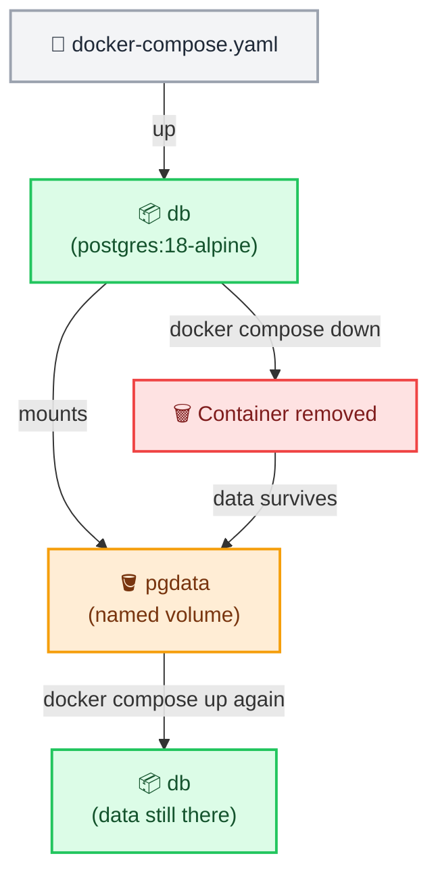

# Docker Compose Advanced

← [Back to Docker Tutorials](../index.md)

---

## Use Named Volumes in Compose

Named volumes declared in the top-level `volumes` block of a Compose file are managed by Docker and persist across `docker compose down` restarts. Data is preserved until `docker compose down -v` is run.



Write a Compose file with a named volume.

```bash
[labuser@container ~]$ cat > docker-compose.yaml << 'EOF'
services:
  db:
    image: postgres:18-alpine
    environment:
      POSTGRES_PASSWORD: secretpassword
    volumes:
      - pgdata:/var/lib/postgresql

volumes:
  pgdata:
EOF
```

Start the database stack.

```bash
[labuser@container ~]$ docker compose up -d
[+] Running 2/2
 ✔ Volume "workspace_pgdata"  Created                             0.0s 
 ✔ Container workspace-db-1   Started                             0.3s 
```

Verify the container is running.

```bash
[labuser@container ~]$ docker compose ps
NAME               IMAGE                COMMAND                  SERVICE   CREATED          STATUS          PORTS
workspace-db-1     postgres:18-alpine   "docker-entrypoint.s…"   db        15 seconds ago   Up 14 seconds   5432/tcp
```

Wait a few seconds for Postgres to fully start, then execute a command inside the container to create a table and insert a row:

```bash
[labuser@container ~]$ docker compose exec db psql -U postgres -c "
CREATE TABLE users (
  id serial PRIMARY KEY,
  name VARCHAR(50)
);
INSERT INTO users (name) VALUES ('Alice');
"

CREATE TABLE
INSERT 0 1
```

Verify the data was inserted successfully by querying the database.

```bash
[labuser@container ~]$ docker compose exec db psql -U postgres -c "SELECT * FROM users;"
 id | name  
----+-------
  1 | Alice
(1 row)
```

Now, completely stop and remove the container.

```bash
[labuser@container ~]$ docker compose down
[+] Running 2/2
 ✔ Container workspace-db-1   Removed                             0.2s 
 ✔ Network workspace_default  Removed                             0.1s 
```

Verify that no containers are running with `docker ps -a`.

```bash
[labuser@container ~]$ docker ps -a
CONTAINER ID   IMAGE     COMMAND   CREATED   STATUS    PORTS     NAMES
```

Even though the container is gone, the named volume `pgdata` still exists on your host machine. Verify it's still there.

```bash
[labuser@container ~]$ docker volume ls
DRIVER    VOLUME NAME
local     workspace_pgdata
```

Bring the stack back up.

```bash
[labuser@container ~]$ docker compose up -d
[+] Running 2/2
 ✔ Network workspace_default  Created                             0.1s 
 ✔ Container workspace-db-1   Started                             0.3s 
```

Wait a few seconds for it to start, then verify the data survived by querying the database.

```bash
[labuser@container ~]$ docker compose exec db psql -U postgres -c "SELECT * FROM users;"
 id | name  
----+-------
  1 | Alice
(1 row)
```

---

## Use Custom Networks in Compose

Compose automatically creates a default bridge network for each project. You can define additional custom networks to isolate service groups from each other.

**Why use multiple networks?**
- **Security Isolation**: By placing the `frontend` and `db` on completely different networks, the frontend cannot talk to the database directly. If the frontend web server is compromised, the database remains protected because it's unreachable over the network.
- **The Bridge**: The `api` service acts as the middleman. By attaching it to BOTH the `frontend-net` and `backend-net`, it can receive requests from the frontend on one network, and securely fetch data from the database on the other network.

**How do we configure them?**
There are two steps to setting up custom networks in a Compose file:
1. **Declare them**: Just like volumes, you must declare the networks you intend to create in a top-level `networks` block at the very bottom of the file.
2. **Attach them**: Under each individual service, you add a `networks` list specifying exactly which networks that container should join.

Update the Compose file to see this in action:

```bash
[labuser@container ~]$ cat > docker-compose.yaml << 'EOF'
services:
  frontend:
    image: nginx:alpine
    networks:
      - frontend-net
  api:
    image: alpine:3.22
    command: sleep infinity
    networks:
      - frontend-net
      - backend-net
  db:
    image: postgres:18-alpine
    environment:
      POSTGRES_PASSWORD: secretpassword
    networks:
      - backend-net
    volumes:
      - pgdata:/var/lib/postgresql

networks:
  frontend-net:
  backend-net:

volumes:
  pgdata:
EOF
```

Apply changes.

```bash
[labuser@container ~]$ docker compose up -d
[+] Running 4/4
 ✔ Network workspace_backend-net   Created                        0.1s 
 ✔ Network workspace_frontend-net  Created                        0.1s 
 ✔ Container workspace-frontend-1  Started                        0.4s 
 ✔ Container workspace-db-1        Started                        0.5s 
 ✔ Container workspace-api-1       Started                        0.6s 
```

Verify the networks.

```bash
[labuser@container ~]$ docker network ls
NETWORK ID     NAME                       DRIVER    SCOPE
a1b2c3d4e5f6   bridge                     bridge    local
b2c3d4e5f6g7   host                       host      local
c3d4e5f6g7h8   none                       null      local
d4e5f6g7h8i9   workspace_backend-net      bridge    local
e5f6g7h8i9j0   workspace_frontend-net     bridge    local
```

Now let's prove the isolation works! Try to reach the database from the frontend.

```bash
[labuser@container ~]$ docker compose exec frontend ping -c 1 db
ping: bad address 'db'
```
*(This fails with a "bad address" error because they are on different networks, so Docker DNS blocks the resolution!)*

Now try to reach the database from the API.

```bash
[labuser@container ~]$ docker compose exec api ping -c 1 db
PING db (172.20.0.2): 56 data bytes
64 bytes from 172.20.0.2: seq=0 ttl=64 time=0.082 ms
```
*(This succeeds because the API is connected to the `backend-net`!)*

---

## Add Health Checks

A `healthcheck` block in a Compose file tells Docker to periodically test if a service is actually ready to receive traffic, rather than just checking if the container process is running. Other services with `depends_on: condition: service_healthy` will wait for the health check to pass before they start!

Here is what the health check fields mean:
- **test**: The command to run inside the container. For Postgres, we use `pg_isready -U postgres` which asks the database if it's ready to accept connections.
- **interval**: How often to run the test (e.g., every 5 seconds).
- **timeout**: How long to wait for the test command to finish before considering it a failure (e.g., 3 seconds).
- **retries**: How many consecutive failures are allowed before Docker marks the container as `unhealthy`.

Update the db service to include a health check:

```bash
[labuser@container ~]$ cat > docker-compose.yaml << 'EOF'
services:
  frontend:
    image: nginx:alpine
    networks:
      - frontend-net
  api:
    image: alpine:3.22
    command: sleep infinity
    networks:
      - frontend-net
      - backend-net
    depends_on:
      db:
        condition: service_healthy
  db:
    image: postgres:18-alpine
    environment:
      POSTGRES_PASSWORD: secretpassword
    networks:
      - backend-net
    volumes:
      - pgdata:/var/lib/postgresql
    healthcheck:
      test: ["CMD-SHELL", "pg_isready -U postgres"]
      interval: 5s
      timeout: 3s
      retries: 3

networks:
  frontend-net:
  backend-net:

volumes:
  pgdata:
EOF
```

Apply by running `docker compose up -d`.

```bash
[labuser@container ~]$ docker compose up -d
[+] Running 3/3
 ✔ Container workspace-frontend-1  Running                        0.0s 
 ✔ Container workspace-db-1        Started                        0.4s 
 ✔ Container workspace-api-1       Started                        0.8s 
```

Check the health status.

```bash
[labuser@container ~]$ docker compose ps
NAME                   IMAGE                COMMAND                  SERVICE    CREATED          STATUS                    PORTS
workspace-api-1        alpine:3.22          "sleep infinity"         api        10 seconds ago   Up 9 seconds              
workspace-db-1         postgres:18-alpine   "docker-entrypoint.s…"   db         10 seconds ago   Up 9 seconds (healthy)    5432/tcp
workspace-frontend-1   nginx:alpine         "/docker-entrypoint.…"   frontend   5 minutes ago    Up 5 minutes              80/tcp
```

Notice in the output that the `workspace-db-1` container shows a status like `Up 9 seconds (healthy)` instead of just "Running" or "Up". Because we defined a health check, Docker no longer assumes the container is working just because the process started—it actively runs our `test` command and reports its exact health status!

---

## Use an Environment File for Container Variables

Hardcoding secrets like passwords directly in a Compose file is a security risk. Instead, you can use the `env_file` directive to pass a file containing environment variables securely into the container.

Create a `db.env` file to store the database password.

```bash
[labuser@container ~]$ echo "POSTGRES_PASSWORD=supersecret" > db.env
```

Verify the file was created and contains the correct content.

```bash
[labuser@container ~]$ ls -l db.env
[labuser@container ~]$ cat db.env

-rw-r--r-- 1 user group 30 Nov 01 13:30 db.env
POSTGRES_PASSWORD=supersecret
```

Update the Compose file to use this file instead of the `environment` block:

```bash
[labuser@container ~]$ cat > docker-compose.yaml << 'EOF'
services:
  frontend:
    image: nginx:alpine
    networks:
      - frontend-net
  api:
    image: alpine:3.22
    command: sleep infinity
    networks:
      - frontend-net
      - backend-net
    depends_on:
      db:
        condition: service_healthy
  db:
    image: postgres:18-alpine
    env_file:
      - db.env
    networks:
      - backend-net
    volumes:
      - pgdata:/var/lib/postgresql
    healthcheck:
      test: ["CMD-SHELL", "pg_isready -U postgres"]
      interval: 5s
      timeout: 3s
      retries: 3

networks:
  frontend-net:
  backend-net:

volumes:
  pgdata:
EOF
```

Apply the changes.

```bash
[labuser@container ~]$ docker compose up -d
[+] Running 3/3
 ✔ Container workspace-frontend-1  Running                        0.0s 
 ✔ Container workspace-db-1        Recreated                      0.4s 
 ✔ Container workspace-api-1       Recreated                      0.8s 
```

---

## Use Environment Variable Interpolation

A Compose file supports `${VARIABLE}` substitution from a `.env` file in the same directory or from shell environment variables. This allows the same Compose file to work across environments.

Create a `.env` file.

```bash
[labuser@container ~]$ echo "POSTGRES_TAG=18-alpine" > .env
```

Verify the file was created and contains the correct content.

```bash
[labuser@container ~]$ ls -la .env
[labuser@container ~]$ cat .env

-rw-r--r-- 1 user group 23 Nov 01 13:35 .env
POSTGRES_TAG=18-alpine
```

In the updated Compose file below, we replace the hardcoded Postgres image tag with `image: postgres:${POSTGRES_TAG}`. Docker Compose will automatically read the `.env` file and substitute the variable, resolving it to `postgres:18-alpine` before starting the container!

Update the Compose file to use interpolation.

```bash
[labuser@container ~]$ cat > docker-compose.yaml << 'EOF'
services:
  frontend:
    image: nginx:alpine
    networks:
      - frontend-net
  api:
    image: alpine:3.22
    command: sleep infinity
    networks:
      - frontend-net
      - backend-net
    depends_on:
      db:
        condition: service_healthy
  db:
    image: postgres:${POSTGRES_TAG}
    env_file:
      - db.env
    networks:
      - backend-net
    volumes:
      - pgdata:/var/lib/postgresql
    healthcheck:
      test: ["CMD-SHELL", "pg_isready -U postgres"]
      interval: 5s
      timeout: 3s
      retries: 3

networks:
  frontend-net:
  backend-net:

volumes:
  pgdata:
EOF
```

Start the stack and confirm the correct image is used.

```bash
[labuser@container ~]$ docker compose up -d
[labuser@container ~]$ docker compose ps

NAME                   IMAGE                COMMAND                  SERVICE    CREATED          STATUS                    PORTS
workspace-api-1        alpine:3.22          "sleep infinity"         api        2 minutes ago    Up 2 minutes              
workspace-db-1         postgres:18-alpine   "docker-entrypoint.s…"   db         2 minutes ago    Up 2 minutes (healthy)    5432/tcp
workspace-frontend-1   nginx:alpine         "/docker-entrypoint.…"   frontend   10 minutes ago   Up 10 minutes             80/tcp
```

---

## Tear Down with Volume Removal

`docker compose down -v` stops and removes containers, networks, and named volumes defined in the Compose file.

Run `docker compose down -v`.

```bash
[labuser@container ~]$ docker compose down -v
[+] Running 5/5
 ✔ Container workspace-api-1       Removed                        0.3s 
 ✔ Container workspace-frontend-1  Removed                        0.3s 
 ✔ Container workspace-db-1        Removed                        0.4s 
 ✔ Volume workspace_pgdata         Removed                        0.1s 
 ✔ Network workspace_frontend-net  Removed                        0.1s 
 ✔ Network workspace_backend-net   Removed                        0.1s 
```

Verify the volume is gone by running `docker volume ls` — it should return nothing (or at least, the `workspace_pgdata` volume is gone).

```bash
[labuser@container ~]$ docker volume ls
DRIVER    VOLUME NAME
```

## 🧠 Quick Quiz

<quiz>
What does running `docker compose down -v` accomplish?
- [ ] It runs down in verbose mode.
- [ ] It validates the Compose file syntax before shutting down.
- [x] It removes containers, networks, AND named volumes.
- [ ] It keeps volumes but deletes the images.

The `-v` or `--volumes` flag ensures that named volumes declared in the `volumes` section are destroyed alongside the containers.
</quiz>

<quiz>
How can a Compose file utilize environment variables defined in a `.env` file?
- [ ] Using the `inject_env` keyword.
- [x] By using `${VARIABLE_NAME}` interpolation in the `docker-compose.yaml` file.
- [ ] Compose cannot read `.env` files.
- [ ] By hardcoding them in the `ports` section.

Docker Compose automatically loads `.env` files in the project directory, allowing you to use `${VAR}` substitution inside the yaml.
</quiz>

<quiz>
Why would you configure a `healthcheck` in a Compose file instead of just relying on `depends_on`?
- [ ] Because health checks run faster.
- [x] Because `depends_on` only waits for the container process to start, not for the application inside to actually be ready.
- [ ] Because health checks automatically restart failed containers.
- [ ] Because `depends_on` is deprecated.

A healthcheck actively tests the application (e.g., pinging a database port), and `depends_on: condition: service_healthy` will wait for that test to pass.
</quiz>

---



---


