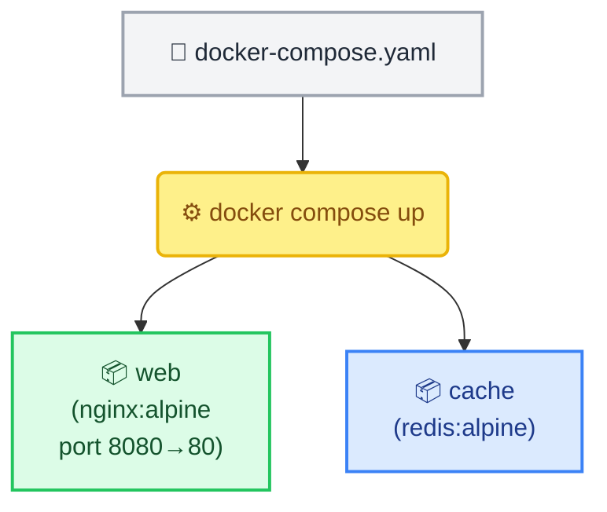
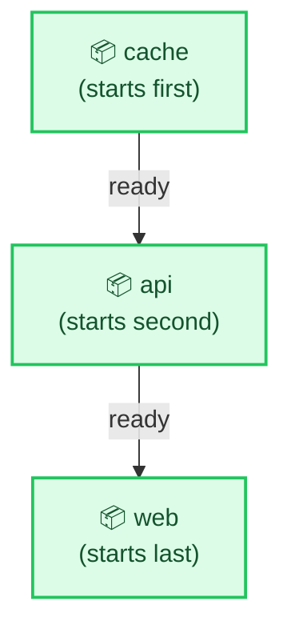

# Docker Compose Fundamentals

← [Back to Docker Tutorials](../index.md)

---

## Write a Basic Compose File

A `docker-compose.yaml` file describes a multi-service application as code. Each entry under `services` defines one container. Docker Compose reads this file, spins up the containers, and automatically connects them to the same shared network so they can communicate.



Write your first Compose file.

```bash
[labuser@container ~]$ cat > docker-compose.yaml << 'EOF'
services:
  web:
    image: nginx:alpine
    ports:
      - "8080:80"
  cache:
    image: redis:alpine
EOF
```

Verify the file was created.

```bash
[labuser@container ~]$ cat docker-compose.yaml
services:
  web:
    image: nginx:alpine
    ports:
      - "8080:80"
  cache:
    image: redis:alpine
```

---

## Start the Application Stack

`docker compose up` reads the Compose file and creates, starts, and connects all defined services. The `-d` flag runs them in detached (background) mode.

Start the stack.

```bash
[labuser@container ~]$ docker compose up -d
[+] Running 3/3
 ✔ Network workspace_default    Created                                   0.1s 
 ✔ Container workspace-cache-1  Started                                   0.2s 
 ✔ Container workspace-web-1    Started                                   0.3s 
```

Notice in the output that Docker automatically created a default network called `workspace_default` even though we didn't define one. It also named your containers using the format `[project]-[service]-[instance]` (e.g., `workspace-web-1`). The project name defaults to the directory you are in (`workspace`).

You can assign specific names using the `container_name` property. Update your Compose file:

```bash
[labuser@container ~]$ cat > docker-compose.yaml << 'EOF'
services:
  web:
    image: nginx:alpine
    container_name: my-custom-web
    ports:
      - "8080:80"
  cache:
    image: redis:alpine
    container_name: my-custom-cache
EOF
```

Apply the changes by running `docker compose up -d` again. Docker will detect the configuration change, recreate the containers with your custom names, and keep them on the shared network.

```bash
[labuser@container ~]$ docker compose up -d
[+] Running 2/2
 ✔ Container my-custom-cache  Started                                     0.3s 
 ✔ Container my-custom-web    Started                                     0.4s 
```

---

## List Running Services

`docker compose ps` lists the status of all services defined in the Compose file for the current project.

Run `docker compose ps` to see the state of the `web` and `cache` services.

```bash
[labuser@container ~]$ docker compose ps
NAME                IMAGE          COMMAND                  SERVICE   CREATED          STATUS          PORTS
my-custom-cache     redis:alpine   "docker-entrypoint.s…"   cache     15 seconds ago   Up 14 seconds   6379/tcp
my-custom-web       nginx:alpine   "/docker-entrypoint.…"   web       15 seconds ago   Up 14 seconds   0.0.0.0:8080->80/tcp, :::8080->80/tcp
```

---

## View Service Logs

`docker compose logs` aggregates the log output of all services into a single stream, prefixed by service name.

Run `docker compose logs` to view combined logs.

```bash
[labuser@container ~]$ docker compose logs
cache  | 1:C 01 Nov 2023 13:10:01.000 * oO0OoO0OoO0Oo Redis is starting oO0OoO0OoO0Oo
cache  | 1:C 01 Nov 2023 13:10:01.000 * Redis version=7.2.3, bits=64, commit=00000000, modified=0, pid=1, just started
cache  | 1:M 01 Nov 2023 13:10:01.005 * Ready to accept connections tcp
web    | /docker-entrypoint.sh: /docker-entrypoint.d/ is not empty, will attempt to perform configuration
web    | /docker-entrypoint.sh: Looking for shell scripts in /docker-entrypoint.d/
web    | /docker-entrypoint.sh: Configuration complete; ready for start up
```

Run `docker compose logs web` to view logs for the `web` service only.

```bash
[labuser@container ~]$ docker compose logs web
web    | /docker-entrypoint.sh: /docker-entrypoint.d/ is not empty, will attempt to perform configuration
web    | /docker-entrypoint.sh: Looking for shell scripts in /docker-entrypoint.d/
web    | /docker-entrypoint.sh: Configuration complete; ready for start up
```

---

## Execute a Command in a Service

`docker compose exec` runs a command inside a running service container — equivalent to `docker exec` but using the service name instead of the container name.

Run `docker compose exec web ls /usr/share/nginx/html` to list the default Nginx web root.

```bash
[labuser@container ~]$ docker compose exec web ls /usr/share/nginx/html
50x.html
index.html
```

---

## Add a Service with a Dependency

`depends_on` tells Docker Compose to start a service only after its dependencies are running. This prevents startup race conditions.



Update the Compose file to add an `api` service that depends on `cache`:

```bash
[labuser@container ~]$ cat > docker-compose.yaml << 'EOF'
services:
  web:
    image: nginx:alpine
    ports:
      - "8080:80"
    depends_on:
      - api
  api:
    image: alpine:3.22
    command: sleep infinity
    depends_on:
      - cache
  cache:
    image: redis:alpine
EOF
```

Apply changes by running `docker compose up -d` — Compose will start `cache` first, then `api`, then `web`.

```bash
[labuser@container ~]$ docker compose up -d
[+] Running 3/3
 ✔ Container workspace-cache-1  Started                                   0.0s 
 ✔ Container workspace-api-1    Started                                   0.3s 
 ✔ Container workspace-web-1    Started                                   0.5s 
```

---

## Stop and Remove the Stack

`docker compose down` stops all services and removes their containers and the default network. Volumes are preserved unless `-v` is also passed.

Run `docker compose down`.

```bash
[labuser@container ~]$ docker compose down
[+] Running 4/4
 ✔ Container workspace-web-1    Removed                                   1.2s 
 ✔ Container workspace-api-1    Removed                                   0.3s 
 ✔ Container workspace-cache-1  Removed                                   0.4s 
 ✔ Network workspace_default    Removed                                   0.2s 
```

Verify all containers are gone.

```bash
[labuser@container ~]$ docker ps -a
CONTAINER ID   IMAGE     COMMAND   CREATED   STATUS    PORTS     NAMES
```

## 🧠 Quick Quiz

<quiz>
Which command builds, creates, starts, and attaches to containers for a service defined in `docker-compose.yaml`?
- [ ] docker compose start
- [ ] docker compose build
- [x] docker compose up
- [ ] docker compose run

`docker compose up` is the primary command to bring up an entire application stack.
</quiz>

<quiz>
How do you stop and completely remove the containers and networks created by `docker compose up`?
- [ ] docker compose stop
- [ ] docker compose rm
- [x] docker compose down
- [ ] docker compose clean

`docker compose down` gracefully stops containers and then removes them along with the default bridge network.
</quiz>

<quiz>
What does the `depends_on` directive do in a Compose file?
- [ ] It links two containers over the internet.
- [ ] It shares volumes between services.
- [x] It dictates the startup order of services.
- [ ] It combines two services into one container.

`depends_on` ensures that dependencies (like a database) are started before the services that rely on them (like an API).
</quiz>

---



---


