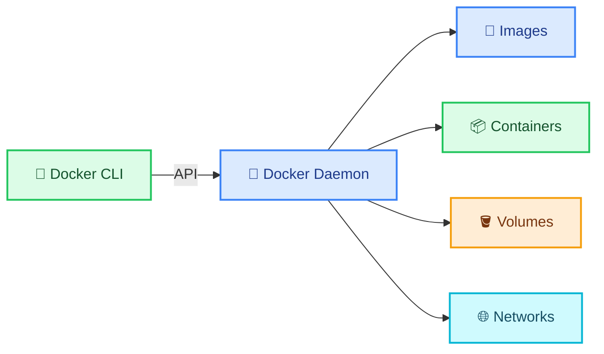
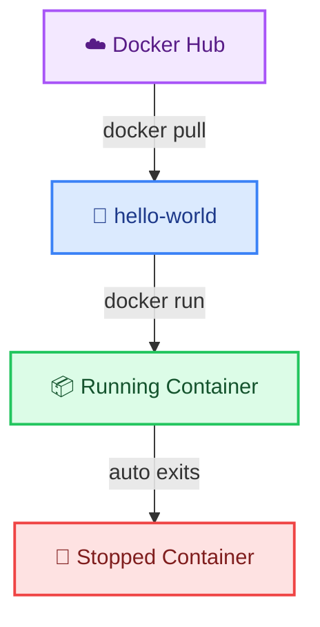
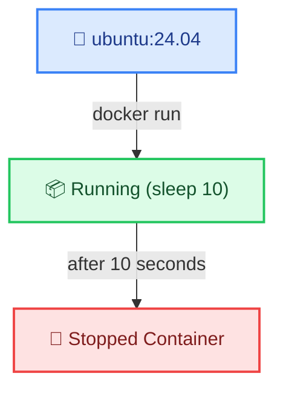
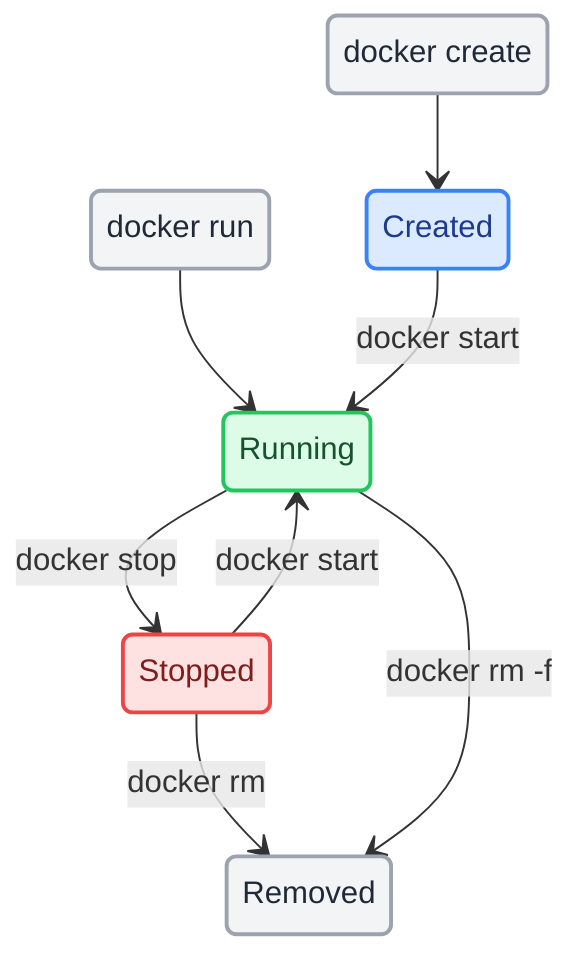

# Docker Container Basics

← [Back to Docker Tutorials](../index.md)

---

## What is Docker?

Before Docker, deploying software was fragile. Code worked on a developer's laptop but failed on the server because of different OS versions, missing libraries, or conflicting dependencies — the classic *"works on my machine"* problem.

**Docker solves this** by packaging your application and all its dependencies into a single, portable unit called a **container**. Containers run identically on any machine that has Docker installed — laptop, CI server, or cloud VM.


| Term | What it means |
|---|---|
| **Image** | A read-only blueprint — OS, code, and dependencies bundled together |
| **Container** | A running instance of an image — isolated, lightweight, and disposable |
| **Docker Hub** | A public registry where images are stored and shared (like GitHub for images) |
| **Docker Engine** | The background service that builds images and manages containers |



When you type a Docker command, the `Docker CLI` sends it to the `Docker Daemon` — the background service that manages images, containers, volumes, and networks.

Run `docker info` to display the system-wide Docker configuration and confirm the daemon is running.

```bash
docker info
```

```text
Client: Docker Engine - Community
 Version:    24.0.2
 Context:    default
 Debug Mode: false

Server:
 Containers: 2
  Running: 1
  Paused: 0
  Stopped: 1
 Images: 5
 Server Version: 24.0.2
 Storage Driver: overlay2
...
```

Run `docker version` to see the client and daemon versions.

```bash
docker version
```

```text
Client: Docker Engine - Community
 Version:           24.0.2
 API version:       1.43
 Go version:        go1.20.4
 Git commit:        cb74dfc
 Built:             Thu May 25 21:52:17 2023
 OS/Arch:           linux/amd64
 Context:           default

Server: Docker Engine - Community
 Engine:
  Version:          24.0.2
  API version:      1.43 (minimum version 1.12)
  Go version:       go1.20.4
  Git commit:       659604f
  Built:            Thu May 25 21:52:17 2023
  OS/Arch:          linux/amd64
  Experimental:     false
```

---

## Pull and Run Your First Container

`docker run` is the primary command for starting containers. When an image does not exist locally, Docker automatically pulls it from Docker Hub before starting.



| Argument | Meaning |
|---|---|
| `IMAGE` | The image name and optional tag, e.g. `hello-world` or `hello-world:linux`|

Run `docker run hello-world` to start a container from the `hello-world` image. Because we didn't specify a tag, Docker automatically looks for the `latest` tag by default (i.e. `hello-world:latest`).

Observe the output — Docker pulled the image, created a container, printed a message, and then the container exited automatically.

```bash
docker run hello-world
```

```text
Unable to find image 'hello-world:latest' locally
latest: Pulling from library/hello-world
719385e32844: Pull complete 
Digest: sha256:4f53e2564790c8e7856ec08e384732aa38cb43fceaf923c0aea3d7a8e5cc698a
Status: Downloaded newer image for hello-world:latest

Hello from Docker!
This message shows that your installation appears to be working correctly.
...
```

Run `docker image ls` to view the newly pulled image in your local storage. You should see `hello-world` with the `latest` tag.

```bash
docker image ls
```

```text
REPOSITORY    TAG       IMAGE ID       CREATED         SIZE
hello-world   latest    d2c94e258dcb   10 months ago   13.3kB
```

Next, run `docker ps -a` to view the container you just ran. The `-a` flag tells Docker to list **all** containers, including stopped ones. You will notice its status is `Exited`.

```bash
docker ps -a
```

```text
CONTAINER ID   IMAGE         COMMAND    CREATED          STATUS                      PORTS     NAMES
4a2f8b9e1c3d   hello-world   "/hello"   10 seconds ago   Exited (0) 9 seconds ago              nifty_curie
```

**Why did it stop?**

A Docker container only stays alive as long as the main process inside it is running. The `hello-world` container is designed to do just one job: print a welcome message. Once the message is printed, its job is complete, and it gracefully stops itself. 

To keep a container running continuously (like a database or web server), we need to run it in the background as a long-running service.

---

## Name Your Container

When we ran the `hello-world` container in the previous task, Docker automatically assigned it a random, quirky name (like `nifty_curie` or `sleepy_einstein`). 

While random names are fun, they make it hard to manage containers in a real environment. We use the `--name` flag to assign a fixed, recognizable name.

| Flag | Meaning |
|---|---|
| `--name` | Assign a custom, human-readable name to the container |

Run `docker run --name my-hello-container hello-world` to create a new container with a specific name.

```bash
docker run --name my-hello-container hello-world
```

```text
Hello from Docker!
This message shows that your installation appears to be working correctly.
```

Next, run `docker ps -a` again. You will now see two `hello-world` containers — one with a random name, and your new one proudly named `my-hello-container`.

```bash
docker ps -a
```

```text
CONTAINER ID   IMAGE         COMMAND    CREATED          STATUS                      PORTS     NAMES
9d8c7b6a5e4f   hello-world   "/hello"   12 seconds ago   Exited (0) 11 seconds ago             my-hello-container
4a2f8b9e1c3d   hello-world   "/hello"   2 minutes ago    Exited (0) 2 minutes ago              nifty_curie
```

---

## Run a Container in the Background

By default, `docker run` runs in the foreground, locking up your terminal as it streams the container's output. 

For long-running services like web servers or databases, we want them to run quietly in the background. We use the `-d` (detached) flag for this.

| Flag | Meaning |
|---|---|
| `-d` | Detached mode — run the container in the background |

First, run `docker ps` to confirm you currently have no active containers running. 

```bash
docker ps
```

```text
CONTAINER ID   IMAGE     COMMAND   CREATED   STATUS    PORTS     NAMES
```

Next, run `docker run -d --name webserver nginx:1.30` to start an Nginx web server in the background. Docker will print a long container ID and immediately return your terminal prompt.

```bash
docker run -d --name webserver nginx:1.30
```

```text
Unable to find image 'nginx:1.30' locally
1.30: Pulling from library/nginx
...
f2a715f4e5c3b9d0a1b2c3d4e5f6g7h8i9j0k1l2m3n4o5p6q7r8s9t0u1v2w3x4
```

Verify the server is running silently in the background by running `docker ps` again. You will see your `webserver` container in the active list.

```bash
docker ps
```

```text
CONTAINER ID   IMAGE        COMMAND                  CREATED          STATUS          PORTS     NAMES
f2a715f4e5c3   nginx:1.30   "/docker-entrypoint.…"   15 seconds ago   Up 14 seconds   80/tcp    webserver
```

---

## Understanding Container Lifespans

A container's lifespan is tied directly to the main command it is running. Once that command finishes, the container stops. 

To visualize this, let's run a container that simply sleeps for 10 seconds and then exits automatically.



Run `docker run -d ubuntu:24.04 sleep 10` to start it in the background.

```bash
docker run -d ubuntu:24.04 sleep 10
```

```text
c3b9d0a1b2c3d4e5f6g7h8i9j0k1l2m3n4o5p6q7r8s9t0u1v2w3x4y5z6a7b8c9
```

Immediately run `docker ps` to verify the container is running. Look closely at the `COMMAND` column in the output — you will see `"sleep 10"` listed as its main process!

```bash
docker ps
```

```text
CONTAINER ID   IMAGE          COMMAND                  CREATED         STATUS         PORTS     NAMES
c3b9d0a1b2c3   ubuntu:24.04   "sleep 10"               2 seconds ago   Up 1 second              sleepy_turing
f2a715f4e5c3   nginx:1.30     "/docker-entrypoint.…"   2 minutes ago   Up 2 minutes   80/tcp    webserver
```

Wait for about 10 seconds, then run `docker ps` again. You will notice the container has vanished from the active list because its command finished.

Finally, run `docker ps -a` to view both running and stopped containers. You will see your `ubuntu` container is now marked as `Exited`. This proves that when a container's main command finishes, the container stops automatically!

```bash
docker ps -a
```

```text
CONTAINER ID   IMAGE          COMMAND                  CREATED          STATUS                      PORTS     NAMES
c3b9d0a1b2c3   ubuntu:24.04   "sleep 10"               15 seconds ago   Exited (0) 4 seconds ago              sleepy_turing
f2a715f4e5c3   nginx:1.30     "/docker-entrypoint.…"   3 minutes ago    Up 3 minutes                80/tcp    webserver
...
```

---

## Inspect a Running Container

Sometimes you need to know exactly how a container is configured — what its internal IP address is, what ports are open, or what volumes are mounted. 

`docker inspect` returns detailed, low-level metadata about a container in JSON format. 

| Flag | Meaning |
|---|---|
| `--format` | Extract a specific field using Go template syntax |

Run `docker inspect webserver` to view the full metadata of the running container. It will output a massive wall of JSON text.

```bash
docker inspect webserver
```

```json
[
    {
        "Id": "f2a715f4e5c3b9d0a1b2c3d4e5f6g7h8i9j0k1l2m3n4o5p6q7r8s9t0u1v2w3x4",
        "Created": "2023-10-27T10:00:00.000000000Z",
        "Path": "/docker-entrypoint.sh",
        "Args": [
            "nginx",
            "-g",
            "daemon off;"
        ],
        "State": {
            "Status": "running",
            "Running": true,
...
```

Scrolling through all that JSON is difficult. Instead, we can extract just the information we need.

Run `docker inspect --format '{{.State.Status}}' webserver` to filter the output and display only the container's current status.

```bash
docker inspect --format '{{.State.Status}}' webserver
```

```text
running
```

---

## Execute a Command Inside a Container

`docker exec` lets you run a new command inside a container that is already running. This is incredibly useful for debugging, checking configuration files, or opening an interactive shell.

| Flag | Meaning |
|---|---|
| `-i` | Keep STDIN open (interactive) |
| `-t` | Allocate a pseudo-TTY (terminal emulator) |
| `-it` | Combine both — required for interactive shell sessions |

First, run `docker exec webserver ls /usr/share/nginx/html` to list the files in the Nginx web root. 

```bash
docker exec webserver ls /usr/share/nginx/html
```

```text
50x.html
index.html
```

Since the `ls` command showed us that an `index.html` file exists, let's view its contents.

```bash
docker exec webserver cat /usr/share/nginx/html/index.html
```

```text
<!DOCTYPE html>
<html>
<head>
<title>Welcome to nginx!</title>
...
```

Now, let's overwrite that file with our own custom text. 

```bash
docker exec webserver sh -c "echo 'Welcome to DevOpsPilot Labs' > /usr/share/nginx/html/index.html"
```

Now, let's "log in" to the container to verify the file was really changed. Run `docker exec -it webserver bash`. Look closely at your terminal — the text at the beginning of the line (your prompt) just changed! This proves you are now successfully "inside" the container.

```bash
docker exec -it webserver bash
```

```text
root@f2a715f4e5c3:/# 
```

Run `ls -l /usr/share/nginx/html` and then `cat /usr/share/nginx/html/index.html`. You will see "Welcome to DevOpsPilot Labs" instead of the original HTML!

```bash
cat /usr/share/nginx/html/index.html
```

```text
Welcome to DevOpsPilot Labs
```

Finally, type `exit` and hit Enter to leave the container and return to your normal terminal.

```bash
exit
```

---

## View Container Logs

When a container runs in the background, you can't see its output. `docker logs` allows you to view the `STDOUT` and `STDERR` streams produced by the container. For services like Nginx, this is how you view access and error logs to troubleshoot issues.

| Flag | Meaning |
|---|---|
| `--tail N` | Show only the last N lines of output |
| `--follow` | Stream logs in real time (like `tail -f`) |

Run `docker logs webserver` to view the container's entire log history. 

```bash
docker logs webserver
```

```text
/docker-entrypoint.sh: /docker-entrypoint.d/ is not empty, will attempt to perform configuration
/docker-entrypoint.sh: Looking for shell scripts in /docker-entrypoint.d/
/docker-entrypoint.sh: Launching /docker-entrypoint.d/10-listen-on-ipv6-by-default.sh
10-listen-on-ipv6-by-default.sh: info: Getting the checksum of /etc/nginx/conf.d/default.conf
10-listen-on-ipv6-by-default.sh: info: Enabled listen on IPv6 in /etc/nginx/conf.d/default.conf
/docker-entrypoint.sh: Launching /docker-entrypoint.d/20-envsubst-on-templates.sh
/docker-entrypoint.sh: Launching /docker-entrypoint.d/30-tune-worker-processes.sh
/docker-entrypoint.sh: Configuration complete; ready for start up
2023/10/27 10:00:01 [notice] 1#1: using the "epoll" event method
2023/10/27 10:00:01 [notice] 1#1: nginx/1.30.0
...
```

To make it more manageable, run `docker logs --tail 5 webserver` to show only the last 5 lines of the log output.

```bash
docker logs --tail 5 webserver
```

```text
/docker-entrypoint.sh: Launching /docker-entrypoint.d/30-tune-worker-processes.sh
/docker-entrypoint.sh: Configuration complete; ready for start up
2023/10/27 10:00:01 [notice] 1#1: using the "epoll" event method
2023/10/27 10:00:01 [notice] 1#1: nginx/1.30.0
2023/10/27 10:00:01 [notice] 1#1: built by gcc 12.2.0 (Debian 12.2.0-14)
```

---

## Stop a Running Container



First, try to delete the container while it's still running by executing `docker rm webserver`. Docker will reject this action with an error, protecting the running container from accidental deletion. You must stop it first.

```bash
docker rm webserver
```

```text
Error response from daemon: You cannot remove a running container f2a715f4e5c3b9d0... Stop the container before attempting removal or force remove
```

`docker stop` sends a gentle termination signal to the container, giving it time to shut down gracefully and save its state. Run `docker stop webserver` to stop the container.

```bash
docker stop webserver
```

```text
webserver
```

Verify it has stopped by running `docker ps`. You will notice the `webserver` container is no longer in the active list.

Finally, run `docker ps -a` to confirm the container still exists on your disk, but its status is now `Exited`.

```bash
docker ps -a
```

```text
CONTAINER ID   IMAGE        COMMAND                  CREATED          STATUS                      PORTS     NAMES
f2a715f4e5c3   nginx:1.30   "/docker-entrypoint.…"   15 minutes ago   Exited (0) 10 seconds ago             webserver
```

---

## Remove a Container

Stopped containers are no longer running, but they still occupy disk space on your machine. `docker rm` permanently deletes a stopped container and frees up its resources.

| Flag | Meaning |
|---|---|
| (none) | Remove a stopped container |
| `-f` | Force-remove a running container (sends SIGKILL immediately) |

Run `docker rm webserver` to permanently delete the stopped container.

```bash
docker rm webserver
```

```text
webserver
```

Verify the cleanup was successful by running `docker ps -a`. Look at the list and observe that the `webserver` container is completely gone.

---

## Bulk Remove Stopped Containers

Removing containers one by one with `docker rm` is tedious. Docker provides a built-in command to safely bulk-delete all stopped containers at once.

Run `docker container prune -f` to remove all stopped containers. The `-f` flag forces the action without prompting for confirmation.

```bash
docker container prune -f
```

```text
Deleted Containers:
9d8c7b6a5e4f
4a2f8b9e1c3d
c3b9d0a1b2c3

Total reclaimed space: 0B
```

Verify the cleanup by running `docker ps -a`. Your container list should now be completely empty!

---

## Run a Self-Cleaning Container

Even with `prune`, manually cleaning up containers is repetitive. The `--rm` flag solves this by automatically deleting the container the moment it stops running. This is perfect for one-shot tasks where you only need the container temporarily.

| Flag | Meaning |
|---|---|
| `--rm` | Automatically remove the container when it exits |

Run `docker run --rm hello-world` to start a container, print a short message, and automatically clean it up.

```bash
docker run --rm hello-world
```

```text
Hello from Docker!
This message shows that your installation appears to be working correctly.
...
```

Verify there is no leftover container by running `docker ps -a`. You will notice the `hello-world` container you just ran was instantly deleted upon exit!

## 🧠 Quick Quiz

<quiz>
Which flag is used to run a Docker container in the background (detached mode)?
- [ ] -it
- [x] -d
- [ ] -b
- [ ] --background

The `-d` or `--detach` flag runs the container in the background and prints the container ID.
</quiz>

<quiz>
Which command lists all containers, including both running and stopped ones?
- [ ] docker ps
- [ ] docker containers ls
- [x] docker ps -a
- [ ] docker list all

The `-a` or `--all` flag tells `docker ps` to show all containers regardless of their state.
</quiz>

<quiz>
What command is used to completely remove a stopped container?
- [ ] docker delete
- [ ] docker kill
- [x] docker rm
- [ ] docker rmi

`docker rm` removes containers, whereas `docker rmi` removes images.
</quiz>

---



---


