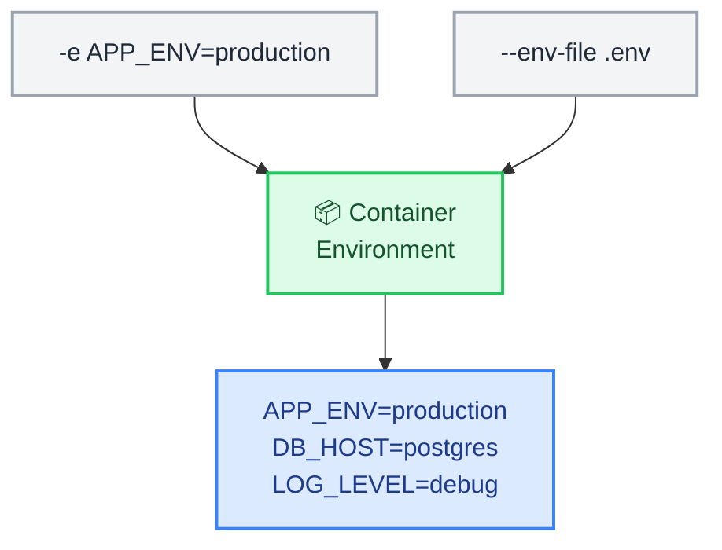

# Docker Environment Variables

← [Back to Docker Tutorials](../index.md)

---

## Pass a Single Environment Variable

Containers are stateless by design. Configuration is injected at runtime using environment variables rather than baked into the image. The `-e` flag passes a key-value pair to a container.



Run `docker run --rm -e APP_ENV=production alpine:3.22 env | grep APP_ENV` to start a container, inject the `APP_ENV` variable, and immediately print it.

```bash
[labuser@container ~]$ docker run --rm -e APP_ENV=production alpine:3.22 env | grep APP_ENV

APP_ENV=production
```

Observe that `APP_ENV=production` appears in the container's environment.

---

## Pass Multiple Environment Variables

The `-e` flag can be repeated multiple times to pass several variables in a single `docker run` command.

Run `docker run --rm -e APP_ENV=staging -e DB_HOST=postgres -e LOG_LEVEL=debug alpine:3.22 env | grep -E "APP_ENV|DB_HOST|LOG_LEVEL"` to inject three variables at once.

```bash
[labuser@container ~]$ docker run --rm -e APP_ENV=staging -e DB_HOST=postgres -e LOG_LEVEL=debug alpine:3.22 env | grep -E "APP_ENV|DB_HOST|LOG_LEVEL"

APP_ENV=staging
DB_HOST=postgres
LOG_LEVEL=debug
```

Verify all three appear in the container's environment output.

---

## Use an Environment File

Passing many variables with repeated `-e` flags becomes unwieldy. An `env file` stores key-value pairs in a file and passes them all at once using `--env-file`.

Create an env file.

```bash
[labuser@container ~]$ printf "APP_ENV=production\nDB_HOST=postgres\nDB_PORT=5432\nLOG_LEVEL=info\n" > app.env
```

Verify its contents with `cat app.env`.

```bash
[labuser@container ~]$ cat app.env

APP_ENV=production
DB_HOST=postgres
DB_PORT=5432
LOG_LEVEL=info
```

Launch a container using the file.

```bash
[labuser@container ~]$ docker run --rm --env-file app.env alpine:3.22 env | grep -E "APP_ENV|DB_HOST|DB_PORT|LOG_LEVEL"

APP_ENV=production
DB_HOST=postgres
DB_PORT=5432
LOG_LEVEL=info
```

---

## Inspect Environment Variables Inside a Running Container

`docker inspect` lets you read a container's environment variables without executing a shell session inside it. This is useful for auditing running containers.

Start a background container.

```bash
[labuser@container ~]$ docker run -d --name myapp -e APP_VERSION=2.1 -e REGION=us-east alpine:3.22 sleep infinity

d3e4f5g6h7i8j9k0l1m2n3o4p5q6r7s8t9u0v1w2x3y4z5a6b7c8d9e0f1g2h3i4
```

First, view the full JSON configuration of the container by running `docker inspect myapp`.

```bash
[labuser@container ~]$ docker inspect myapp

[
    {
        "Id": "d3e4f5g6h7i8j9k0l1m2n3o4p5q6r7s8t9u0v1w2x3y4z5a6b7c8d9e0f1g2h3i4",
        "Created": "2023-11-01T12:08:00.000000000Z",
        "Path": "sleep",
        "Args": [
            "infinity"
        ],
        "State": {
            "Status": "running",
            "Running": true,
...
```

Notice how overwhelming the output is! To extract just the environment variables cleanly, we can use a Go template format. Inspect only its environment.

```bash
[labuser@container ~]$ docker inspect myapp --format '{{range .Config.Env}}{{println .}}{{end}}'

PATH=/usr/local/sbin:/usr/local/bin:/usr/sbin:/usr/bin:/sbin:/bin
APP_VERSION=2.1
REGION=us-east
```

---

## Override Variables at Runtime

Environment variables in a Dockerfile (set with `ENV`) provide defaults. They can always be overridden at runtime using `-e` — the runtime value always wins.

This means images can ship sensible defaults while operators inject environment-specific values at deploy time without rebuilding the image.

First, view the default value of the `HOME` variable built into the Alpine image.

```bash
[labuser@container ~]$ docker run --rm alpine:3.22 env | grep HOME

HOME=/root
```

Notice that it defaults to `/root`. Now, override it at runtime.

```bash
[labuser@container ~]$ docker run --rm -e HOME=/override alpine:3.22 env | grep HOME

HOME=/override
```

Observe how the new runtime value completely replaces the built-in default!

## 🧠 Quick Quiz

<quiz>
Which flag is used to pass a single environment variable to a container at runtime?
- [ ] --env-var
- [x] -e or --env
- [ ] -v
- [ ] --set

The `-e KEY=VALUE` flag injects environment variables into the container.
</quiz>

<quiz>
How do you pass multiple environment variables from a file into a container?
- [ ] -f .env
- [ ] --file .env
- [x] --env-file .env
- [ ] -e .env

The `--env-file` flag allows you to bulk-load variables from a file formatted with `KEY=VALUE` lines.
</quiz>

<quiz>
What happens if you use `-e MY_VAR` without specifying a value (e.g., `-e MY_VAR` alone)?
- [ ] It sets the value to an empty string.
- [ ] It throws a syntax error.
- [x] It passes the variable from the host's environment into the container.
- [ ] It ignores the flag entirely.

Docker will look up `MY_VAR` in your local shell environment and pass its value into the container.
</quiz>

---



---


