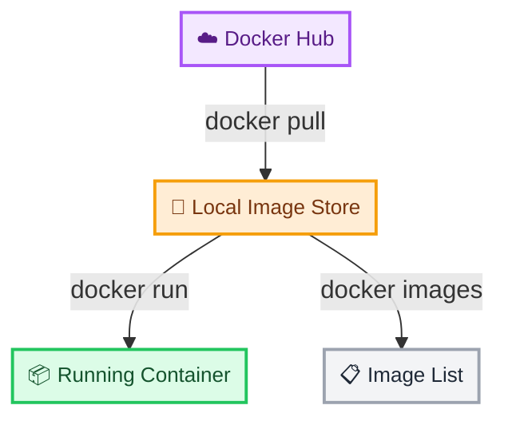
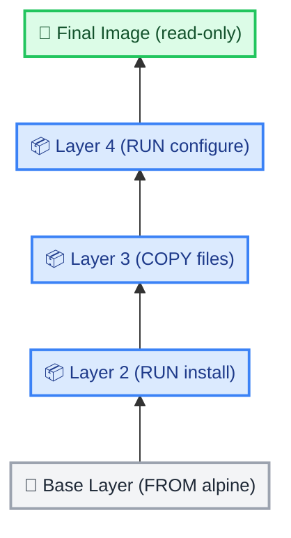
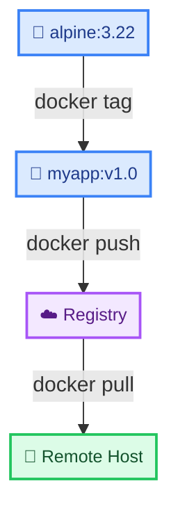

# Docker Image Management

← [Back to Docker Tutorials](../index.md)

---

## List Local Images

Docker stores downloaded images in a local cache called the `image store`. The `docker images` command lists all locally available images.



Run `docker images` to see what images are currently cached on this system. Notice the columns output by the command — they will show you the image name, tag, unique ID, and its size.

```bash
[labuser@container ~]$ docker images

REPOSITORY    TAG       IMAGE ID       CREATED         SIZE
hello-world   latest    d2c94e258dcb   10 months ago   13.3kB
ubuntu        24.04     3b418d7b466a   2 weeks ago     77.8MB
nginx         1.30      f2a715f4e5c3   3 weeks ago     142MB
```

---

## Pull an Image from a Registry

`docker pull` downloads an image from a registry (Docker Hub by default) without running a container. Use this to pre-fetch images before use.

Run `docker pull alpine:3.22` to download the `alpine` image tagged `3.22`.

```bash
[labuser@container ~]$ docker pull alpine:3.22

3.22: Pulling from library/alpine
4abcf2066143: Pull complete 
Digest: sha256:c5b1261d6d3e43071626931fc004f70149baeba2c8ec672bd4f27761f8e1ad6b
Status: Downloaded newer image for alpine:3.22
docker.io/library/alpine:3.22
```

After the pull completes, verify it appears in your local store by running `docker images`.

```bash
[labuser@container ~]$ docker images

REPOSITORY    TAG       IMAGE ID       CREATED         SIZE
alpine        3.22      05455a08881e   3 days ago      7.38MB
hello-world   latest    d2c94e258dcb   10 months ago   13.3kB
```

When pulling images, Docker uses a specific naming convention: `registry/repository/image_name:tag`. 
- If you don't specify a registry, it defaults to Docker Hub (`docker.io`).
- If you don't specify a tag, it defaults to `latest`.

For example, `public.ecr.aws/hashicorp/terraform:1.15` breaks down as:

| Component | Value | Description |
| :--- | :--- | :--- |
| **🌐 Registry** | `public.ecr.aws` | The server hosting the image. |
| **🏢 Repository** | `hashicorp` | The organization or user namespace. |
| **📦 Image Name** | `terraform` | The specific application image. |
| **🏷️ Tag** | `1.15` | The version or variant of the image. |

To see this in action, pull an image from AWS Elastic Container Registry (ECR) Public.

Run `docker pull public.ecr.aws/hashicorp/terraform:1.15` to pull the Terraform image from AWS instead of Docker Hub.

```bash
[labuser@container ~]$ docker pull public.ecr.aws/hashicorp/terraform:1.15

1.15: Pulling from hashicorp/terraform
Digest: sha256:8a1b2c3d4e5f6g7h8i9j0k1l2m3n4o5p6q7r8s9t0u1v2w3x4y5z6a7b8c9d0e1f
Status: Downloaded newer image for public.ecr.aws/hashicorp/terraform:1.15
public.ecr.aws/hashicorp/terraform:1.15
```

Verify it was downloaded successfully by running `docker images`.

```bash
[labuser@container ~]$ docker images

REPOSITORY                           TAG       IMAGE ID       CREATED         SIZE
public.ecr.aws/hashicorp/terraform   1.15      9c8b7a6d5e4f   2 months ago    75MB
alpine                               3.22      05455a08881e   3 days ago      7.38MB
```

---

## Inspect Image Metadata

`docker inspect` returns the full JSON metadata for an image, including its layers, environment variables, default command, and exposed ports.

Run `docker inspect alpine:3.22` to view the full metadata.

```bash
[labuser@container ~]$ docker inspect alpine:3.22

[
    {
        "Id": "sha256:05455a08881ea9cf0e7fac51e00f3408e24483a90710ba0a5521b4a0f8df78dc",
        "RepoTags": [
            "alpine:3.22"
        ],
        "RepoDigests": [
            "alpine@sha256:c5b1261d6d3e43071626931fc004f70149baeba2c8ec672bd4f27761f8e1ad6b"
        ],
        "Parent": "",
        "Comment": "",
...
```

To extract just the OS, run `docker inspect --format '{{.Os}}' alpine:3.22`.

```bash
[labuser@container ~]$ docker inspect --format '{{.Os}}' alpine:3.22

linux
```

---

## View Image Layer History

Every Docker image is built from a stack of read-only layers. `docker history` shows the instruction that created each layer and its size contribution.



Run `docker history alpine:3.22` to view the layer history of the Alpine image.

```bash
[labuser@container ~]$ docker history alpine:3.22

IMAGE          CREATED       CREATED BY                                      SIZE      COMMENT
05455a08881e   3 days ago    /bin/sh -c #(nop)  CMD ["/bin/sh"]              0B        
<missing>      3 days ago    /bin/sh -c #(nop) ADD file:04c8f25b390b1e45b…   7.38MB    
```

Pull a more complex image and compare by running `docker pull nginx:alpine` followed by `docker history nginx:alpine`.

```bash
[labuser@container ~]$ docker pull nginx:alpine
[labuser@container ~]$ docker history nginx:alpine

IMAGE          CREATED       CREATED BY                                      SIZE      COMMENT
6b6a5e4f3d2c   5 days ago    /bin/sh -c #(nop)  CMD ["nginx" "-g" "daemon…   0B        
<missing>      5 days ago    /bin/sh -c #(nop)  STOPSIGNAL SIGQUIT           0B        
<missing>      5 days ago    /bin/sh -c #(nop)  EXPOSE 80                    0B        
<missing>      5 days ago    /bin/sh -c #(nop)  ENTRYPOINT ["/docker-entr…   0B        
<missing>      5 days ago    /bin/sh -c #(nop) COPY file:65504f71f5855ca0…   4.62kB    
<missing>      5 days ago    /bin/sh -c #(nop) COPY file:0b866ff3fc1ef5b0…   3.02kB    
...
```

Observe that `nginx:alpine` has significantly more layers than the base `alpine` image.

---

## Tag an Image

`docker tag` creates an additional name (tag) pointing to the same image. Tags are used to version and organise images before pushing to a registry.

The format is `docker tag SOURCE_IMAGE:TAG TARGET_IMAGE:TAG`.



Tag the `alpine:3.22` image as `myapp:v1.0` by running `docker tag alpine:3.22 myapp:v1.0`.

```bash
[labuser@container ~]$ docker tag alpine:3.22 myapp:v1.0
```

A tag is just a lightweight pointer. Tagging an image does not duplicate its data or take up extra disk space. Both tags simply point to the exact same underlying image, which is why they will share the identical `IMAGE ID`.

Verify both tags exist and share the same `IMAGE ID` by running `docker images`.

```bash
[labuser@container ~]$ docker images

REPOSITORY    TAG       IMAGE ID       CREATED         SIZE
alpine        3.22      05455a08881e   3 days ago      7.38MB
myapp         v1.0      05455a08881e   3 days ago      7.38MB
```

---

## Remove an Image Tag

`docker rmi` removes an image tag from the local store. If the tag is the only reference to an image, the image layers are also deleted.

Remove the `myapp:v1.0` tag by running `docker rmi myapp:v1.0`.

```bash
[labuser@container ~]$ docker rmi myapp:v1.0

Untagged: myapp:v1.0
```

Notice the output says `Untagged:` instead of `Deleted:`. Because the `alpine:3.22` tag still points to the same underlying image layers, Docker is smart enough to only remove the pointer (untag) rather than destroying the actual data.

Verify the `alpine:3.22` image still exists by running `docker images`. Only the `myapp:v1.0` tag should be gone.

---

## Pull a Specific Image Digest

Image tags are mutable — a publisher can update a tag to point to a new image. For reproducible builds, you can reference an image by its immutable content digest.

Run `docker pull alpine:3.22` and note the digest shown in the output (the `sha256:...` line).

To view the digest of a locally cached image, run `docker images --digests alpine`.

```bash
[labuser@container ~]$ docker images --digests alpine

REPOSITORY   TAG       DIGEST                                                                    IMAGE ID       CREATED      SIZE
alpine       3.22      sha256:c5b1261d6d3e43071626931fc004f70149baeba2c8ec672bd4f27761f8e1ad6b   05455a08881e   3 days ago   7.38MB
```

To pull an image using its exact digest, use the `@` symbol instead of a colon. The format is `docker pull alpine@sha256:<YOUR_DIGEST>`.

Run `docker pull alpine@sha256:48b0309ca019d89d40f670aa1bc06e426dc0931948452e8491e3d65087abc07d` to pull the exact image.

```bash
[labuser@container ~]$ docker pull alpine@sha256:48b0309ca019d89d40f670aa1bc06e426dc0931948452e8491e3d65087abc07d

docker.io/library/alpine@sha256:48b0309ca019d89d40f670aa1bc06e426dc0931948452e8491e3d65087abc07d: Pulling from library/alpine
...
Digest: sha256:48b0309ca019d89d40f670aa1bc06e426dc0931948452e8491e3d65087abc07d
Status: Downloaded newer image for alpine@sha256:48b0309ca019d89d40f670aa1bc06e426dc0931948452e8491e3d65087abc07d
```

Run `docker images` again to verify. You will notice the image is listed with its digest directly in the image name instead of a traditional tag.

```bash
[labuser@container ~]$ docker images

REPOSITORY   TAG       IMAGE ID       CREATED         SIZE
alpine       <none>    3e23a4b6c8d0   10 months ago   7.34MB
```

---

## Clean Up Unused Images

`docker image prune -a` removes all unused images (not just dangling ones) that are not referenced by any container. This reclaims disk space.

A `dangling` image is an image that has lost its tag (showing as `<none>:<none>` in `docker images`). This usually happens when you build a new image and assign it a tag that was already in use by an older image. The default `prune` command only removes these dangling images, but adding `-a` removes *all* unused images.

First view current disk usage by running `docker system df`.

```bash
[labuser@container ~]$ docker system df

TYPE         TOTAL     ACTIVE    SIZE      RECLAIMABLE
Images       4         0         231MB     231MB (100%)
Containers   0         0         0B        0B
Local Volumes 0        0         0B        0B
Build Cache  0         0         0B        0B
```

Run `docker image prune -af` to remove all unused images without prompting for confirmation.

```bash
[labuser@container ~]$ docker image prune -af

Deleted Images:
untagged: alpine:3.22
untagged: alpine@sha256:c5b1261d6d3e43071626931fc004f70149baeba2c8ec672bd4f27761f8e1ad6b
deleted: sha256:05455a08881ea9cf0e7fac51e00f3408e24483a90710ba0a5521b4a0f8df78dc
deleted: sha256:a6b8c9d0e1f2g3h4i5j6k7l8m9n0o1p2q3r4s5t6u7v8w9x0y1z2a3b4c5d6e7f8
...

Total reclaimed space: 231MB
```

Run `docker system df` again to confirm disk usage decreased.

## 🧠 Quick Quiz

<quiz>
Which command is used to download an image from Docker Hub without running it?
- [ ] docker get
- [ ] docker download
- [x] docker pull
- [ ] docker fetch

`docker pull` downloads the image layers and metadata from the registry.
</quiz>

<quiz>
How do you remove a local Docker image from your machine?
- [ ] docker rm
- [x] docker rmi
- [ ] docker delete image
- [ ] docker drop

`docker rmi` (remove image) deletes images. It will fail if containers are still using the image.
</quiz>

<quiz>
Which command provides detailed JSON metadata about an image, such as its layers, env vars, and entrypoint?
- [x] docker inspect
- [ ] docker info
- [ ] docker describe
- [ ] docker details

`docker inspect` returns a wealth of low-level information in JSON format for any Docker object.
</quiz>

---



---


