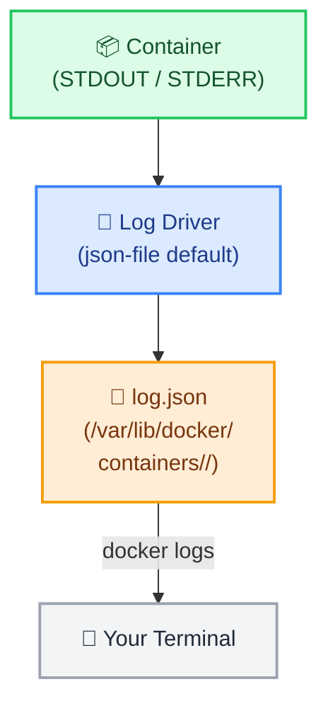

# Docker Logging & Inspection

← [Back to Docker Tutorials](../index.md)

---

## View Container Logs

Docker captures everything a container writes to `STDOUT` and `STDERR` and stores it as logs. `docker logs` retrieves this output.



Start a container that generates log entries.

```bash
[labuser@container ~]$ docker run -d --name logdemo nginx:alpine
c1d2e3f4g5h6i7j8k9l0m1n2o3p4q5r6s7t8u9v0w1x2y3z4a5b6c7d8e9f0g1h2
```

Generate a few log entries.

```bash
[labuser@container ~]$ docker exec logdemo wget -q http://localhost -O /dev/null
[labuser@container ~]$ docker exec logdemo wget -q http://localhost -O /dev/null
```

View the logs.

```bash
[labuser@container ~]$ docker logs logdemo
/docker-entrypoint.sh: /docker-entrypoint.d/ is not empty, will attempt to perform configuration
/docker-entrypoint.sh: Looking for shell scripts in /docker-entrypoint.d/
/docker-entrypoint.sh: Launching /docker-entrypoint.d/10-listen-on-ipv6-by-default.sh
10-listen-on-ipv6-by-default.sh: info: Getting the checksum of /etc/nginx/conf.d/default.conf
10-listen-on-ipv6-by-default.sh: info: Enabled listen on IPv6 in /etc/nginx/conf.d/default.conf
/docker-entrypoint.sh: Launching /docker-entrypoint.d/20-envsubst-on-templates.sh
/docker-entrypoint.sh: Launching /docker-entrypoint.d/30-tune-worker-processes.sh
/docker-entrypoint.sh: Configuration complete; ready for start up
127.0.0.1 - - [01/Nov/2023:12:40:01 +0000] "GET / HTTP/1.1" 200 615 "-" "Wget" "-"
127.0.0.1 - - [01/Nov/2023:12:40:03 +0000] "GET / HTTP/1.1" 200 615 "-" "Wget" "-"
```

---

## Follow Logs in Real Time

The `--follow` (or `-f`) flag keeps the log stream open, printing new entries as they arrive — equivalent to `tail -f` on a file.

First, start a background loop that continuously generates log entries every second:

```bash
[labuser@container ~]$ docker exec -d logdemo sh -c \
[labuser@container ~]$   "while true; do wget -q http://localhost -O /dev/null; sleep 1; done"
```

Now follow the live log stream.

```bash
[labuser@container ~]$ docker logs --follow --tail 5 logdemo
127.0.0.1 - - [01/Nov/2023:12:40:01 +0000] "GET / HTTP/1.1" 200 615 "-" "Wget" "-"
127.0.0.1 - - [01/Nov/2023:12:40:03 +0000] "GET / HTTP/1.1" 200 615 "-" "Wget" "-"
127.0.0.1 - - [01/Nov/2023:12:41:01 +0000] "GET / HTTP/1.1" 200 615 "-" "Wget" "-"
127.0.0.1 - - [01/Nov/2023:12:41:02 +0000] "GET / HTTP/1.1" 200 615 "-" "Wget" "-"
127.0.0.1 - - [01/Nov/2023:12:41:03 +0000] "GET / HTTP/1.1" 200 615 "-" "Wget" "-"
```

You will see new access log entries appearing every second. Press `Ctrl+C` to stop following.

---

## Filter Logs by Time

The `--since` and `--until` flags filter log output by time. `--timestamps` adds an RFC3339 timestamp to every line.

Run `docker logs --timestamps --since 1m logdemo` to view log entries from the last minute with timestamps.

```bash
[labuser@container ~]$ docker logs --timestamps --since 1m logdemo
2023-11-01T12:41:01.123456789Z 127.0.0.1 - - [01/Nov/2023:12:41:01 +0000] "GET / HTTP/1.1" 200 615 "-" "Wget" "-"
2023-11-01T12:41:02.123456789Z 127.0.0.1 - - [01/Nov/2023:12:41:02 +0000] "GET / HTTP/1.1" 200 615 "-" "Wget" "-"
2023-11-01T12:41:03.123456789Z 127.0.0.1 - - [01/Nov/2023:12:41:03 +0000] "GET / HTTP/1.1" 200 615 "-" "Wget" "-"
```

---

## Inspect Container Metadata

`docker inspect` returns the complete low-level JSON configuration for a running or stopped container. This includes network settings, mounts, environment variables, restart policy, and resource limits.

Run `docker inspect logdemo` to view the full metadata.

```bash
[labuser@container ~]$ docker inspect logdemo
[
    {
        "Id": "c1d2e3f4g5h6i7j8k9l0m1n2o3p4q5r6s7t8u9v0w1x2y3z4a5b6c7d8e9f0g1h2",
        "Created": "2023-11-01T12:40:00.000000000Z",
        "Path": "/docker-entrypoint.sh",
        "Args": [
            "nginx",
            "-g",
            "daemon off;"
        ],
        "State": {
            "Status": "running",
            "Running": true,
...
```

Extract specific fields using `--format`. Run `docker inspect logdemo --format '{{.State.Status}}'` to get the container status.

```bash
[labuser@container ~]$ docker inspect logdemo --format '{{.State.Status}}'
running
```

Run `docker inspect logdemo --format '{{range .NetworkSettings.Networks}}{{.IPAddress}}{{end}}'` to get its IP address.

```bash
[labuser@container ~]$ docker inspect logdemo --format '{{range .NetworkSettings.Networks}}{{.IPAddress}}{{end}}'
172.17.0.2
```

---

## Monitor Docker Events

`docker events` streams real-time events from the Docker daemon — container starts, stops, network connections, volume mounts, and more. It is invaluable for auditing and debugging.

Run `docker events --since 5m --until 0s` to replay the last 5 minutes of events.

```bash
[labuser@container ~]$ docker events --since 5m --until 0s
2023-11-01T12:40:00.000000000Z container create c1d2e3f4g5h6 (image=nginx:alpine, name=logdemo)
2023-11-01T12:40:00.123000000Z network connect a1b2c3d4e5f6 (container=c1d2e3f4g5h6, name=bridge, type=bridge)
2023-11-01T12:40:00.456000000Z container start c1d2e3f4g5h6 (image=nginx:alpine, name=logdemo)
2023-11-01T12:40:01.000000000Z container exec_create: /bin/sh -c wget -q http://localhost -O /dev/null c1d2e3f4g5h6 (execID=e1f2g3h4, image=nginx:alpine, name=logdemo)
2023-11-01T12:40:01.010000000Z container exec_start: /bin/sh -c wget -q http://localhost -O /dev/null c1d2e3f4g5h6 (execID=e1f2g3h4, image=nginx:alpine, name=logdemo)
```

Observe the events generated when you started `logdemo`.

## 🧠 Quick Quiz

<quiz>
Which flag is used to continuously stream new logs as they are written by the container?
- [ ] --stream
- [ ] --tail
- [x] -f or --follow
- [ ] --live

`docker logs -f` keeps the connection open and prints new logs in real-time, similar to `tail -f`.
</quiz>

<quiz>
What information does `docker inspect` provide?
- [ ] Real-time CPU usage.
- [ ] The source code of the container application.
- [x] Low-level JSON metadata about the container's configuration, network, and state.
- [ ] Only the container's IP address.

`docker inspect` returns a comprehensive JSON object detailing everything Docker knows about the container.
</quiz>

<quiz>
Which command shows a real-time stream of server-level occurrences, such as container starts, stops, and kills?
- [x] docker events
- [ ] docker history
- [ ] docker system log
- [ ] docker ps --events

`docker events` streams daemon-level activities, which is incredibly useful for auditing and debugging lifecycle issues.
</quiz>

---



---


