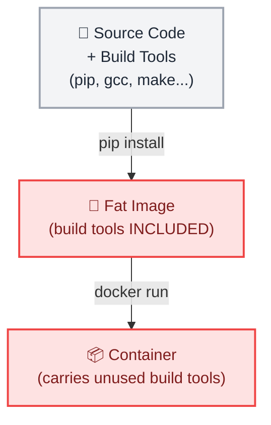
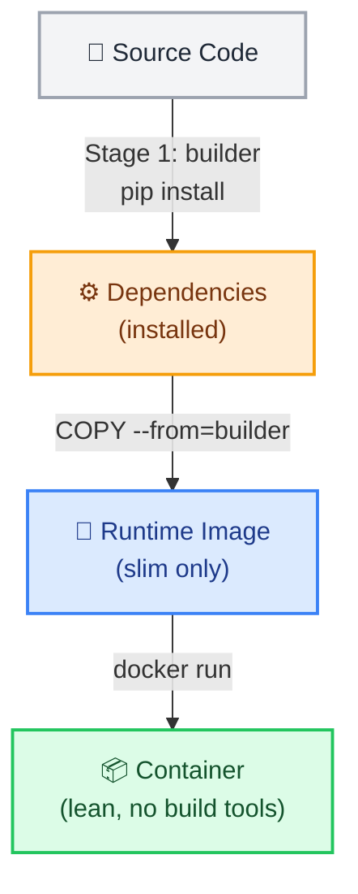

# Docker Multi-Stage Builds

← [Back to Docker Tutorials](../index.md)

---

## Observe a Bloated Single-Stage Build

A common mistake is installing build tools in the same image that runs the application. Build tools like compilers and test frameworks are only needed during the build — shipping them in production images wastes disk space and increases the attack surface.



First, create a simple Python application using Flask.

```bash
cat > app.py << 'EOF'
from flask import Flask

app = Flask(__name__)

@app.route("/")
def hello():
    return "Hello"

if __name__ == "__main__":
    app.run(host="0.0.0.0", port=8080)
EOF
```

Write a single-stage Dockerfile.

```bash
cat > Dockerfile.single << 'EOF'
FROM python:3.12
WORKDIR /app
COPY app.py .
RUN pip install flask
CMD ["python", "app.py"]
EOF
```

Build it by running `docker build -t python-single -f Dockerfile.single .`

```bash
docker build -t python-single -f Dockerfile.single .
```

```text
[+] Building 15.2s (8/8) FINISHED                               docker:default
...
 => => naming to docker.io/library/python-single                          0.0s
```

Check its size by running `docker images python-single`.

```bash
docker images python-single
```

```text
REPOSITORY       TAG       IMAGE ID       CREATED          SIZE
python-single    latest    1a2b3c4d5e6f   15 seconds ago   1.02GB
```

---

## Build and Compare a Multi-Stage Image

A `multi-stage build` uses multiple `FROM` instructions in a single Dockerfile. Each stage is independent. The `AS` keyword names a stage. `COPY --from=STAGE` copies artifacts from one stage into another without carrying over the build environment.



Write the multi-stage Dockerfile.

```bash
cat > Dockerfile << 'EOF'
# --- Stage 1: Build ---
FROM python:3.12 AS builder
WORKDIR /build
RUN pip install --no-cache-dir --target=/install flask

# --- Stage 2: Runtime ---
FROM python:3.12-slim
ENV PYTHONPATH=/install
WORKDIR /app
COPY --from=builder /install /install
COPY app.py .
CMD ["python", "app.py"]
EOF
```

Build the multi-stage image.

```bash
docker build -t python-multi .
```

```text
[+] Building 6.2s (10/10) FINISHED                              docker:default
...
 => => naming to docker.io/library/python-multi                           0.0s
```

Run it to verify it works in the background and test it.

```bash
docker run -d -p 8080:8080 --name test-app python-multi
sleep 2
curl localhost:8080
docker stop test-app && docker rm test-app
```

```text
Hello
```

Finally, run `docker images | grep -E "python-single|python-multi"` to compare both image sizes side by side. 

```bash
docker images | grep -E "python-single|python-multi"
```

```text
python-single         latest    1a2b3c4d5e6f   2 minutes ago    1.02GB
python-multi          latest    f1g2h3i4j5k6   15 seconds ago   165MB
```

Observe that `python-multi` is dramatically smaller because the heavy Python build tools (`python:3.12`) are not present in the final image — only the installed dependencies and application code were copied over into the lightweight `python:3.12-slim` image.

---

## Build a Specific Stage

`docker build --target` stops the build at a named stage. This is useful for debugging the build environment without producing the full runtime image.

Build only the `builder` stage.

```bash
docker build --target builder -t python-builder-only .
```

```text
[+] Building 0.2s (7/7) FINISHED                                docker:default
...
 => => naming to docker.io/library/python-builder-only                    0.0s
```

Verify the `pip` package manager is present in this intermediate stage.

```bash
docker run --rm python-builder-only pip --version
```

```text
pip 24.0 from /usr/local/lib/python3.12/site-packages/pip (python 3.12)
```

Now, try running a build tool like `gcc` (often required for compiling python packages) on your intermediate builder image.

```bash
docker run --rm python-builder-only gcc --version
```

```text
gcc (Debian 12.2.0-14) 12.2.0
```

Now, try running the same command on your final production image.

```bash
docker run --rm python-multi gcc --version
```

```text
docker: Error response from daemon: failed to create task for container: failed to create shim task: OCI runtime create failed: runc create failed: unable to start container process: exec: "gcc": executable file not found in $PATH: unknown.
```

It will fail! This proves that the multi-stage build successfully stripped out the massive build tools before producing the final image.

## 🧠 Quick Quiz

<quiz>
What is the primary benefit of using a multi-stage build?
- [ ] It builds images twice as fast.
- [ ] It allows running multiple containers from one image.
- [x] It produces a much smaller and more secure final image by excluding build tools.
- [ ] It automatically pushes the image to a registry.

Multi-stage builds let you install dependencies or compile code in a heavy image and only copy the necessary artifacts into a lightweight runtime image.
</quiz>

<quiz>
How do you name a specific stage in a multi-stage Dockerfile?
- [ ] NAME stage1
- [x] FROM image AS stage_name
- [ ] STAGE name
- [ ] ALIAS stage_name

The `AS` keyword assigns a name to the build stage so it can be referenced later.
</quiz>

<quiz>
Which command is used to retrieve artifacts from a previous build stage?
- [ ] DOWNLOAD --stage=builder
- [ ] GET --from=builder
- [x] COPY --from=builder
- [ ] ADD --stage=builder

`COPY --from=STAGE_NAME` copies files directly from a previous stage's filesystem into the current stage.
</quiz>

---



---


