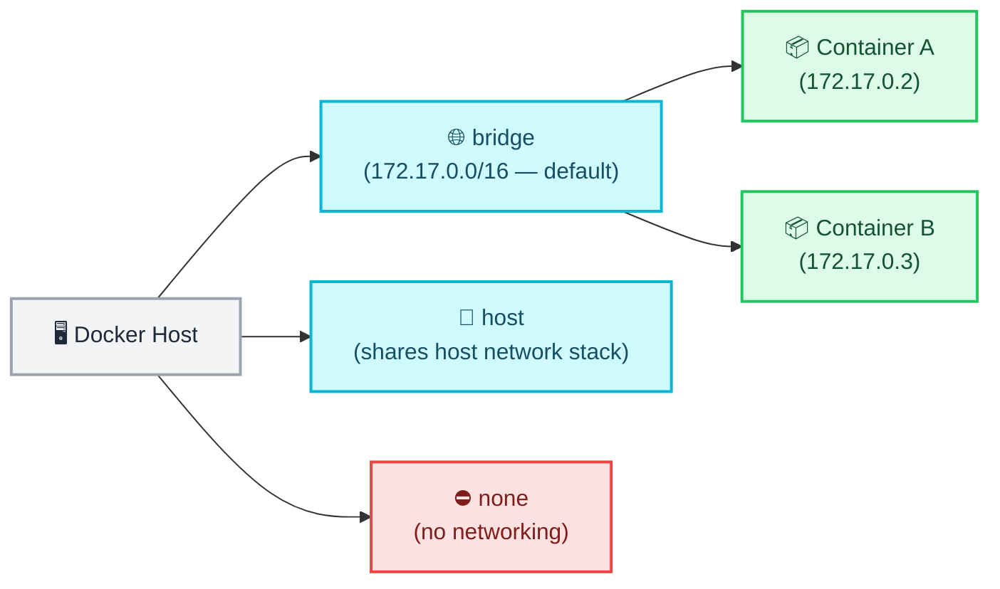
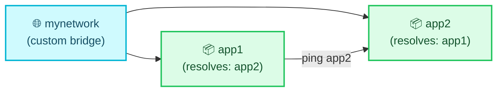

# Docker Networking Basics

← [Back to Docker Tutorials](../index.md)

---

## Explore the Default Networks

Docker automatically creates three networks when installed: `bridge`, `host`, and `none`. Every container joins the `bridge` network by default.



Run `docker network ls` to list all networks.

```bash
docker network ls
```

```text
NETWORK ID     NAME      DRIVER    SCOPE
a1b2c3d4e5f6   bridge    bridge    local
b2c3d4e5f6a1   host      host      local
c3d4e5f6a1b2   none      null      local
```

Run `docker network inspect bridge` to view the bridge network configuration. Look closely at the `Subnet` under the `IPAM` section (usually `172.17.0.0/16`) — this is the default IP range Docker assigned to it.

```bash
docker network inspect bridge
```

```json
[
    {
        "Name": "bridge",
        "Id": "a1b2c3d4e5f67g8h9i0j1k2l3m4n5o6p",
        "Created": "2023-11-01T12:00:00.000000000Z",
        "Scope": "local",
        "Driver": "bridge",
        "EnableIPv6": false,
        "IPAM": {
            "Driver": "default",
            "Options": null,
            "Config": [
                {
                    "Subnet": "172.17.0.0/16",
                    "Gateway": "172.17.0.1"
                }
            ]
        },
...
```

---

## Observe Default Bridge Behaviour

Start two containers on the default bridge network and try to reach one from the other by container name.

```bash
docker run -d --name app1 alpine:3.22 sleep infinity
docker run -d --name app2 alpine:3.22 sleep infinity
```

```text
d1e2f3g4h5i6j7k8l9m0n1o2p3q4r5s6t7u8v9w0x1y2z3a4b5c6d7e8f9g0h1i2
e2f3g4h5i6j7k8l9m0n1o2p3q4r5s6t7u8v9w0x1y2z3a4b5c6d7e8f9g0h1i2j3
```

Verify both containers are running by running `docker ps`.

```bash
docker ps
```

```text
CONTAINER ID   IMAGE         COMMAND            CREATED          STATUS          PORTS     NAMES
e2f3g4h5i6j7   alpine:3.22   "sleep infinity"   10 seconds ago   Up 9 seconds              app2
d1e2f3g4h5i6   alpine:3.22   "sleep infinity"   15 seconds ago   Up 14 seconds             app1
```

Try to ping `app1` from `app2` by name by running `docker exec app2 ping -c 2 app1`.

```bash
docker exec app2 ping -c 2 app1
```

```text
ping: bad address 'app1'
```

Observe the failure — the default bridge network does not provide automatic DNS resolution by container name.

---

## Create a Custom Bridge Network

User-defined bridge networks provide automatic DNS resolution between containers by name. This is the recommended approach for production deployments.



First stop and remove the previous containers.

```bash
docker stop app1 app2 && docker rm app1 app2
```

```text
app1
app2
app1
app2
```

Run `docker network create mynetwork` to create a custom bridge network.

```bash
docker network create mynetwork
```

```text
f1g2h3i4j5k6l7m8n9o0p1q2r3s4t5u6v7w8x9y0z1a2b3c4d5e6f7g8h9i0j1k2
```

Run `docker network ls` and verify `mynetwork` appears.

```bash
docker network ls
```

```text
NETWORK ID     NAME        DRIVER    SCOPE
a1b2c3d4e5f6   bridge      bridge    local
b2c3d4e5f6a1   host        host      local
f1g2h3i4j5k6   mynetwork   bridge    local
c3d4e5f6a1b2   none        null      local
```

---

## Connect Containers via Custom Network

Start two containers attached to `mynetwork` and verify DNS resolution works.

```bash
docker run -d --name app1 --network mynetwork alpine:3.22 sleep infinity
docker run -d --name app2 --network mynetwork alpine:3.22 sleep infinity
```

```text
1a2b3c4d5e6f7g8h9i0j1k2l3m4n5o6p7q8r9s0t1u2v3w4x5y6z7a8b9c0d1e2f
2b3c4d5e6f7g8h9i0j1k2l3m4n5o6p7q8r9s0t1u2v3w4x5y6z7a8b9c0d1e2f3g
```

Test DNS resolution by running `docker exec app2 ping -c 2 app1`.

```bash
docker exec app2 ping -c 2 app1
```

```text
PING app1 (172.18.0.2): 56 data bytes
64 bytes from 172.18.0.2: seq=0 ttl=64 time=0.104 ms
64 bytes from 172.18.0.2: seq=1 ttl=64 time=0.082 ms

--- app1 ping statistics ---
2 packets transmitted, 2 packets received, 0% packet loss
round-trip min/avg/max = 0.082/0.093/0.104 ms
```

Observe that this succeeds — Docker's embedded DNS server resolves `app1` to its IP address automatically.

---

## Inspect the Custom Network

Run `docker network inspect mynetwork` to view the network's configuration.

```bash
docker network inspect mynetwork
```

```json
[
    {
        "Name": "mynetwork",
        "Id": "f1g2h3i4j5k6l7m8n9o0p1q2r3s4t5u6v7w8x9y0z1a2b3c4d5e6f7g8h9i0j1k2",
        "Created": "2023-11-01T12:05:00.000000000Z",
        "Scope": "local",
        "Driver": "bridge",
        "EnableIPv6": false,
        "IPAM": {
            "Driver": "default",
            "Options": {},
            "Config": [
                {
                    "Subnet": "172.18.0.0/16",
                    "Gateway": "172.18.0.1"
                }
            ]
        },
        "Internal": false,
        "Attachable": false,
        "Ingress": false,
        "ConfigFrom": {
            "Network": ""
        },
        "ConfigOnly": false,
        "Containers": {
            "1a2b3c4d5e6f7g8h9i0j1k2l3m4n5o6p7q8r9s0t1u2v3w4x5y6z7a8b9c0d1e2f": {
                "Name": "app1",
                "EndpointID": "a1b2...",
                "MacAddress": "02:42:ac:12:00:02",
                "IPv4Address": "172.18.0.2/16",
                "IPv6Address": ""
            },
            "2b3c4d5e6f7g8h9i0j1k2l3m4n5o6p7q8r9s0t1u2v3w4x5y6z7a8b9c0d1e2f3g": {
                "Name": "app2",
                "EndpointID": "b2c3...",
                "MacAddress": "02:42:ac:12:00:03",
                "IPv4Address": "172.18.0.3/16",
                "IPv6Address": ""
            }
        },
...
```

Notice the `Subnet` value. Docker automatically calculated and assigned the next available, non-overlapping CIDR block (usually `172.18.0.0/16`) to prevent conflicts with the default bridge!

Also note the `Containers` section — both `app1` and `app2` are listed with their newly assigned IP addresses.

---

## Disconnect a Container from a Network

`docker network disconnect` removes a container from a network while the container continues running.

Run `docker network disconnect mynetwork app2` to disconnect `app2`.

```bash
docker network disconnect mynetwork app2
```

Verify the disconnection by running `docker exec app2 ping -c 2 app1`. It should now fail because `app2` is no longer on `mynetwork`.

```bash
docker exec app2 ping -c 2 app1
```

```text
ping: bad address 'app1'
```

---

## Run a Container with Host Networking

The `host` network removes network isolation, attaching the container directly to the Docker host's network stack.

Run `docker run -d --name host-app --network host alpine:3.22 sleep infinity`.

```bash
docker run -d --name host-app --network host alpine:3.22 sleep infinity
```

```text
h1i2j3k4l5m6n7o8p9q0r1s2t3u4v5w6x7y8z9a0b1c2d3e4f5g6h7i8j9k0l1m2
```

View the network interfaces by running `docker exec host-app ip addr`.

```bash
docker exec host-app ip addr
```

```text
1: lo: <LOOPBACK,UP,LOWER_UP> mtu 65536 qdisc noqueue state UNKNOWN qlen 1000
    link/loopback 00:00:00:00:00:00 brd 00:00:00:00:00:00
    inet 127.0.0.1/8 scope host lo
       valid_lft forever preferred_lft forever
2: eth0: <BROADCAST,MULTICAST,UP,LOWER_UP> mtu 1500 qdisc pfifo_fast state UP qlen 1000
    link/ether 02:42:ac:11:00:02 brd ff:ff:ff:ff:ff:ff
    inet 192.168.1.10/24 scope global eth0
       valid_lft forever preferred_lft forever
3: docker0: <NO-CARRIER,BROADCAST,MULTICAST,UP> mtu 1500 qdisc noqueue state DOWN 
    link/ether 02:42:61:9a:1a:2b brd ff:ff:ff:ff:ff:ff
    inet 172.17.0.1/16 brd 172.17.255.255 scope global docker0
       valid_lft forever preferred_lft forever
...
```

Notice the output! Instead of just a single isolated container interface, you will see a multitude of interfaces (like `eth0`, `docker0`, etc.). Because of `--network host`, this container is completely bypassing isolation and looking directly at the host machine's network stack!

---

## Run a Container with No Networking

First, verify that a normal container has internet access by pinging an external IP from `app1`.

```bash
docker exec app1 ping -c 2 8.8.8.8
```

```text
PING 8.8.8.8 (8.8.8.8): 56 data bytes
64 bytes from 8.8.8.8: seq=0 ttl=114 time=10.123 ms
64 bytes from 8.8.8.8: seq=1 ttl=114 time=11.234 ms

--- 8.8.8.8 ping statistics ---
2 packets transmitted, 2 packets received, 0% packet loss
round-trip min/avg/max = 10.123/10.678/11.234 ms
```

Now, let's create a container with no networking. The `none` network fully isolates a container, giving it a loopback interface but absolutely no external network access.

Run `docker run -d --name isolated-app --network none alpine:3.22 sleep infinity`.

```bash
docker run -d --name isolated-app --network none alpine:3.22 sleep infinity
```

```text
z9y8x7w6v5u4t3s2r1q0p9o8n7m6l5k4j3i2h1g0f9e8d7c6b5a4z3y2x1w0v9u8
```

Verify the isolation by attempting to ping the same external IP.

```bash
docker exec isolated-app ping -c 2 8.8.8.8
```

```text
ping: sendto: Network unreachable
```

Observe the failure — it returns `ping: sendto: Network unreachable`. The container is completely cut off from the outside world!

---

## Clean Up

Stop and remove all running containers and the custom network.

```bash
docker stop app1 app2 host-app isolated-app && docker rm app1 app2 host-app isolated-app
```

```text
app1
app2
host-app
isolated-app
app1
app2
host-app
isolated-app
```

Run `docker network rm mynetwork` to remove the custom network.

```bash
docker network rm mynetwork
```

```text
mynetwork
```

Verify by running `docker network ls` — only the default `bridge`, `host`, and `none` networks should remain.

```bash
docker network ls
```

```text
NETWORK ID     NAME      DRIVER    SCOPE
a1b2c3d4e5f6   bridge    bridge    local
b2c3d4e5f6a1   host      host      local
c3d4e5f6a1b2   none      null      local
```

## 🧠 Quick Quiz

<quiz>
What is the default network driver used when you run a container without specifying a network?
- [ ] host
- [x] bridge
- [ ] overlay
- [ ] none

The `bridge` network is the default, assigning an internal IP to the container and allowing outward connectivity.
</quiz>

<quiz>
Which command attaches a running container to an existing custom network?
- [ ] docker network link
- [ ] docker network bind
- [x] docker network connect
- [ ] docker network attach

`docker network connect <network> <container>` allows a container to dynamically join a network.
</quiz>

<quiz>
Why do custom bridge networks provide better container-to-container communication than the default bridge?
- [ ] They have faster bandwidth.
- [x] They provide automatic DNS resolution between containers by name.
- [ ] They automatically encrypt all traffic.
- [ ] They bypass the host firewall.

Custom networks allow containers to resolve each other using their container names as DNS hostnames.
</quiz>

---



---


