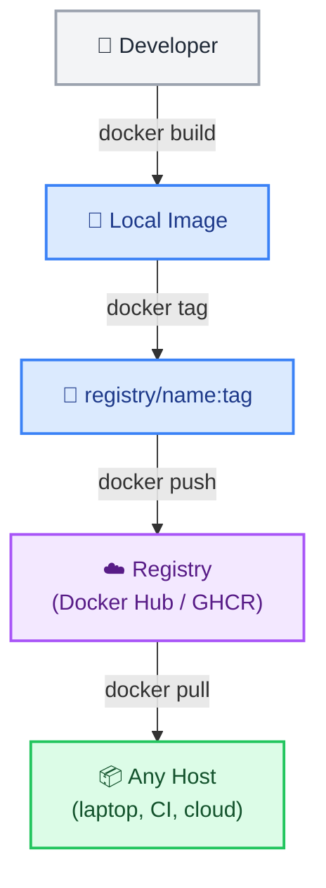

# Docker Registry and Image Push

← [Back to Docker Tutorials](../index.md)

---

## Tag an Image for a Registry

Before pushing an image, you must tag it with the full registry path. The format is `REGISTRY/OWNER/NAME:TAG`. For Docker Hub the registry is implicit. For GHCR it is `ghcr.io`.



Pull a base image and inspect it.

```bash
docker pull alpine:3.22
```

```text
3.22: Pulling from library/alpine
Digest: sha256:c5b1261d6d3e43071626931fc004f70149baeba2c8ec672bd4f27761f8e1ad6b
Status: Image is up to date for alpine:3.22
docker.io/library/alpine:3.22
```

Tag it as if you were preparing to push it to Docker Hub.

```bash
docker tag alpine:3.22 myusername/myapp:1.0
```

Verify the tag.

```bash
docker images myusername/myapp
```

```text
REPOSITORY         TAG       IMAGE ID       CREATED       SIZE
myusername/myapp   1.0       05455a08881e   3 days ago    7.38MB
```

---

## Start a Local Registry

A **Docker Registry** is a storage and distribution server for Docker images — think of it like GitHub, but for container images instead of code. When you run `docker pull nginx`, Docker is actually downloading that image from a registry.

The most popular registries are:

| Registry | URL | Who uses it |
|---|---|---|
| **Docker Hub** | `hub.docker.com` | Default public registry, millions of community images |
| **GitHub Container Registry (GHCR)** | `ghcr.io` | GitHub-hosted private/public images, great for CI/CD |
| **AWS Elastic Container Registry (ECR)** | `*.dkr.ecr.*.amazonaws.com` | AWS-native registry for EKS and ECS deployments |
| **Google Artifact Registry** | `*-docker.pkg.dev` | GCP-native registry |
| **Official Docker Registry** | `localhost:5000` (self-hosted) | Open-source registry you run yourself, on any server |

In production, you would push your images to one of these registries so your servers and CI pipelines can pull them. In this lab, we will spin up the **official Docker registry image** locally on port `5000` — it's the same technology that powers these cloud registries, running entirely inside a container on your machine!

Start a local registry on port `5000`.

```bash
docker run -d --name localreg -p 5000:5000 registry:3
```

```text
a1b2c3d4e5f6g7h8i9j0k1l2m3n4o5p6q7r8s9t0u1v2w3x4y5z6a7b8c9d0e1f2
```

Verify it is running.

```bash
docker ps
```

```text
CONTAINER ID   IMAGE        COMMAND                  CREATED         STATUS         PORTS                                       NAMES
a1b2c3d4e5f6   registry:3   "/entrypoint.sh /etc…"   2 seconds ago   Up 1 second    0.0.0.0:5000->5000/tcp, :::5000->5000/tcp   localreg
```

---

## Push an Image to the Local Registry

In the previous task, you started a registry container listening on port `5000`. This means `localhost:5000` is now your **local Docker registry address** — the same way `ghcr.io` or `hub.docker.com` is the address for cloud registries.

To push an image to it, you simply prefix the image name with `localhost:5000/` when tagging. Docker uses the prefix to know *which registry* to push to.

Run `docker tag alpine:3.22 localhost:5000/myapp:1.0` to tag for the local registry.

```bash
docker tag alpine:3.22 localhost:5000/myapp:1.0
```

Run `docker push localhost:5000/myapp:1.0` to push it.

```bash
docker push localhost:5000/myapp:1.0
```

```text
The push refers to repository [localhost:5000/myapp]
d1e2f3g4h5i6: Pushed 
1.0: digest: sha256:7b6a5e4f3d2c1b0a9f8e7d6c5b4a3f2e1d0c9b8a7f6e5d4c3b2a1f0e9d8c7b6 size: 528
```

The `registry:3` image has no visual web UI — it is a pure REST API server. But you can query it directly with `curl` to see exactly what it has stored!

List all repositories in your local registry.

```bash
curl http://localhost:5000/v2/_catalog
```

```json
{"repositories":["myapp"]}
```

You will see a JSON response confirming your image is stored. Now list all available tags for your image.

```bash
curl http://localhost:5000/v2/myapp/tags/list
```

```json
{"name":"myapp","tags":["1.0"]}
```

This is exactly how Docker itself queries a registry before pulling an image!

---

## Pull the Image Back from the Registry

Let's simulate a completely fresh machine for our app by wiping the local image tags. 

```bash
docker rmi localhost:5000/myapp:1.0 myusername/myapp:1.0
```

```text
Untagged: localhost:5000/myapp:1.0
Untagged: localhost:5000/myapp@sha256:7b6a5e4f3d2c1b0a9f8e7d6c5b4a3f2e1d0c9b8a7f6e5d4c3b2a1f0e9d8c7b6
Untagged: myusername/myapp:1.0
```

Verify the images are gone by running `docker images` — your `localhost:5000/myapp:1.0` image should be gone (but you will still see `alpine:3.22` and `registry:3`).

```bash
docker images
```

```text
REPOSITORY   TAG       IMAGE ID       CREATED       SIZE
alpine       3.22      05455a08881e   3 days ago    7.38MB
registry     3         123456789abc   2 weeks ago   25.4MB
```

Now pull it back from your local registry.

```bash
docker pull localhost:5000/myapp:1.0
```

```text
1.0: Pulling from myapp
Digest: sha256:7b6a5e4f3d2c1b0a9f8e7d6c5b4a3f2e1d0c9b8a7f6e5d4c3b2a1f0e9d8c7b6
Status: Downloaded newer image for localhost:5000/myapp:1.0
localhost:5000/myapp:1.0
```

Verify it appears in your local image store.

```bash
docker images
```

```text
REPOSITORY             TAG       IMAGE ID       CREATED       SIZE
localhost:5000/myapp   1.0       05455a08881e   3 days ago    7.38MB
alpine                 3.22      05455a08881e   3 days ago    7.38MB
registry               3         123456789abc   2 weeks ago   25.4MB
```

---

## Save and Load Images Offline

`docker save` exports an image to a tar archive. `docker load` imports it back. This is used when pushing to a registry is not possible (air-gapped environments).

The `alpine:3.22` image is already available locally from the previous tasks. Save it to a tar archive.

```bash
docker save alpine:3.22 -o alpine.tar
```

Verify the file was created.

```bash
ls -l alpine.tar
```

```text
-rw------- 1 user group 7524864 Nov 01 13:00 alpine.tar
```

Now remove all local unused images.

```bash
docker image prune -a -f
```

```text
Deleted Images:
untagged: alpine:3.22
untagged: localhost:5000/myapp:1.0
untagged: localhost:5000/myapp@sha256:7b6a5e4f3d2c1b0a9f8e7d6c5b4a3f2e1d0c9b8a7f6e5d4c3b2a1f0e9d8c7b6
deleted: sha256:05455a08881ea9cf0e7fac51e00f3408e24483a90710ba0a5521b4a0f8df78dc
deleted: sha256:d1e2f3g4h5i6j7k8l9m0n1o2p3q4r5s6t7u8v9w0x1y2z3a4b5c6d7e8f9g0h1i2

Total reclaimed space: 7.38MB
```

Verify the image is gone (you will only see `registry:3` since it's running).

```bash
docker images
```

```text
REPOSITORY   TAG       IMAGE ID       CREATED       SIZE
registry     3         123456789abc   2 weeks ago   25.4MB
```

Load it back from the tar file.

```bash
docker load -i alpine.tar
```

```text
c5b1261d6d3e: Loading layer [==================================================>]  7.525MB/7.525MB
Loaded image: alpine:3.22
```

Verify.

```bash
docker images
```

```text
REPOSITORY   TAG       IMAGE ID       CREATED       SIZE
alpine       3.22      05455a08881e   3 days ago    7.38MB
registry     3         123456789abc   2 weeks ago   25.4MB
```

## 🧠 Quick Quiz

<quiz>
Before pushing an image to a custom registry, how must the image be tagged?
- [ ] `image:registry_url`
- [x] `registry_url/username/image_name:tag`
- [ ] `username/image_name:registry_url`
- [ ] `registry_url:username/image_name`

Docker uses the registry URL prefix in the image tag to determine where the push request should be routed.
</quiz>

<quiz>
What does a Docker registry do?
- [ ] It compiles source code into Docker images.
- [x] It stores and distributes Docker images.
- [ ] It monitors running containers.
- [ ] It acts as a load balancer for containers.

A registry (like Docker Hub or GHCR) hosts images so they can be pulled by other users or servers.
</quiz>

<quiz>
If you need to transfer an image to an air-gapped environment without internet access, which commands should you use?
- [ ] docker export / docker import
- [x] docker save / docker load
- [ ] docker backup / docker restore
- [ ] docker push / docker pull

`docker save` exports the image layers to a tarball, and `docker load` reads the tarball back into the local Docker daemon.
</quiz>

---



---


