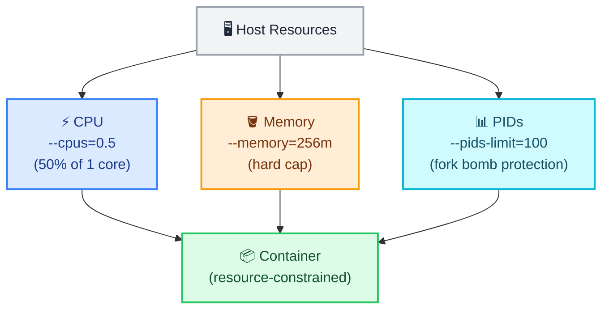

# Docker Resource Limits

← [Back to Docker Tutorials](../index.md)

---

## Monitor Container Resource Usage

`docker stats` streams real-time CPU, memory, network I/O, and block I/O metrics for running containers. 

By default, Docker containers have **no resource limits**. If you do not specify any constraints, a single container can consume 100% of the host machine's CPU and Memory. This is extremely dangerous—if a single container experiences a memory leak or a massive traffic spike, it can completely crash the underlying host server, taking down all other containers with it!



Start a container that consumes some CPU.

```bash
docker run -d --name loadtest alpine:3.22 sh -c "while true; do :; done"
```

```text
c1d2e3f4g5h6i7j8k9l0m1n2o3p4q5r6s7t8u9v0w1x2y3z4a5b6c7d8e9f0g1h2
```

Run `docker stats --no-stream loadtest` to take a single snapshot of its resource usage. Notice under the `CPU %` column that this single container is consuming an enormous amount of CPU (often pinning a whole core) because there are no limits in place!

```bash
docker stats --no-stream loadtest
```

```text
CONTAINER ID   NAME       CPU %     MEM USAGE / LIMIT     MEM %     NET I/O       BLOCK I/O   PIDS
c1d2e3f4g5h6   loadtest   100.00%   1.141MiB / 7.765GiB   0.01%     1.03kB / 0B   0B / 0B     1
```

Run `docker stop loadtest && docker rm loadtest` to clean up.

```bash
docker stop loadtest && docker rm loadtest
```

```text
loadtest
loadtest
```

---

## Set a CPU Limit

The `--cpus` flag limits the number of CPU cores a container may use. A value of `0.25` means the container can consume at most 25% of one CPU core.

Run a container with a CPU limit and a heavy load loop.

```bash
docker run -d \
  --name cpulimited \
  --cpus=0.25 \
  alpine sh -c "while true; do :; done"
```

```text
b2c3d4e5f6g7h8i9j0k1l2m3n4o5p6q7r8s9t0u1v2w3x4y5z6a7b8c9d0e1f2g3
```

Now, check its CPU usage by running `docker stats --no-stream cpulimited`.

```bash
docker stats --no-stream cpulimited
```

```text
CONTAINER ID   NAME         CPU %     MEM USAGE / LIMIT     MEM %     NET I/O       BLOCK I/O   PIDS
b2c3d4e5f6g7   cpulimited   25.02%    1.23MiB / 7.765GiB    0.02%     906B / 0B     0B / 0B     1
```

Unlike Task 1 (where the CPU spiked out of control), you will see the `CPU %` is now firmly locked at exactly `25.00%`!

**Why doesn't it crash?** When a container hits a memory limit, the Linux kernel has no choice but to kill it because there is physically no more RAM to allocate. But when a container hits a CPU limit, the kernel simply **throttles** it using the Completely Fair Scheduler (CFS). The container doesn't crash; it just runs slower, receiving exactly the CPU quota it was assigned!

---

## Set a Memory Limit

The `--memory` flag caps the maximum RAM a container can use. If the container exceeds this limit, the Linux kernel OOM (Out Of Memory) killer forcefully terminates it.

Run a container with a 64MB memory limit.

```bash
docker run -d --name memlimited --memory=64m nginx:alpine
```

```text
f1e2d3c4b5a6z7y8x9w0v1u2t3s4r5q6p7o8n9m0l1k2j3i4h5g6f7e8d9c0b1a2
```

Verify the limit is applied. Note: `67108864` bytes = 64MB.

```bash
docker inspect memlimited --format '{{.HostConfig.Memory}}'
```

```text
67108864
```

Let's prove the OOM killer works! Run a new 10MB limited container that intentionally consumes memory in an infinite loop:

```bash
docker run -d \
  --name oom_test \
  --memory=10m \
  alpine sh -c "x=a; while true; do x=\$x\$x; done"
```

```text
a1b2c3d4e5f6g7h8i9j0k1l2m3n4o5p6q7r8s9t0u1v2w3x4y5z6a7b8c9d0e1f2
```

Wait a few seconds, then run `docker ps -a` and look at the `STATUS` column for your container. You will see it has unexpectedly stopped (e.g., `Exited (137)`).

```bash
docker ps -a
```

```text
CONTAINER ID   IMAGE           COMMAND                  CREATED          STATUS                       PORTS     NAMES
a1b2c3d4e5f6   alpine          "sh -c 'x=a; while t…"   5 seconds ago    Exited (137) 3 seconds ago             oom_test
f1e2d3c4b5a6   nginx:alpine    "/docker-entrypoint.…"   2 minutes ago    Up 2 minutes                 80/tcp    memlimited
b2c3d4e5f6g7   alpine          "sh -c 'while true; …"   5 minutes ago    Up 5 minutes                           cpulimited
```

But *why* did it exit? Let's dig deeper. Inspect the container's state and look closely at the JSON output for the `"OOMKilled"` field. It will be set to `true`!

```bash
docker inspect oom_test --format '{{json .State}}' | jq
```

```json
{
  "Status": "exited",
  "Running": false,
  "Paused": false,
  "Restarting": false,
  "OOMKilled": true,
  "Dead": false,
  "Pid": 0,
  "ExitCode": 137,
  "Error": "",
  "StartedAt": "2023-11-01T12:30:01.000000000Z",
  "FinishedAt": "2023-11-01T12:30:03.000000000Z"
}
```

---

## Inspect Process List

`docker top` displays the running processes inside a container, similar to the Unix `top` command but scoped to a single container.

Run `docker top memlimited` to list the Nginx processes inside the memory-limited container.

```bash
docker top memlimited
```

```text
UID                 PID                 PPID                C                   STIME               TTY                 TIME                CMD
root                1234                1211                0                   12:28               ?                   00:00:00            nginx: master process nginx -g daemon off;
101                 1277                1234                0                   12:28               ?                   00:00:00            nginx: worker process
101                 1278                1234                0                   12:28               ?                   00:00:00            nginx: worker process
```

---

## View System-Wide Resource Usage

`docker system df` shows total disk usage broken down by images, containers, and volumes. Running containers with resource limits helps prevent a single container from impacting the entire host.

Run `docker system df` to see overall disk utilisation.

```bash
docker system df
```

```text
TYPE         TOTAL     ACTIVE    SIZE      RECLAIMABLE
Images       3         1         120MB     40MB (33%)
Containers   3         2         0B        0B
Local Volumes 0        0         0B        0B
Build Cache  0         0         0B        0B
```

Run `docker stats --no-stream` to see all running containers and their current resource consumption.

```bash
docker stats --no-stream
```

```text
CONTAINER ID   NAME         CPU %     MEM USAGE / LIMIT     MEM %     NET I/O       BLOCK I/O   PIDS
f1e2d3c4b5a6   memlimited   0.00%     2.34MiB / 64MiB       3.66%     1.2kB / 0B    0B / 0B     3
b2c3d4e5f6g7   cpulimited   25.04%    1.23MiB / 7.765GiB    0.02%     1.5kB / 0B    0B / 0B     1
```

## 🧠 Quick Quiz

<quiz>
What happens if a container exceeds its hard memory limit (`--memory`)?
- [ ] It starts writing to the host's hard drive.
- [x] The Linux kernel's OOM killer forcefully terminates it.
- [ ] Docker gracefully pauses the container.
- [ ] It borrows memory from other containers.

Exceeding a hard memory limit results in an immediate Out-Of-Memory kill (OOMKilled status).
</quiz>

<quiz>
What happens if a container hits its CPU limit (`--cpus`)?
- [ ] The container crashes.
- [x] The container is throttled to stay within the limit.
- [ ] The container is paused until CPU usage drops globally.
- [ ] It triggers an OOM kill.

Unlike memory, CPU is a compressible resource. The scheduler simply slows down the container so it doesn't exceed its quota.
</quiz>

<quiz>
Which command provides a real-time, top-like view of resource usage for all running containers?
- [ ] docker monitor
- [ ] docker top all
- [x] docker stats
- [ ] docker usage

`docker stats` streams real-time CPU, memory, and network usage metrics.
</quiz>

---



---


