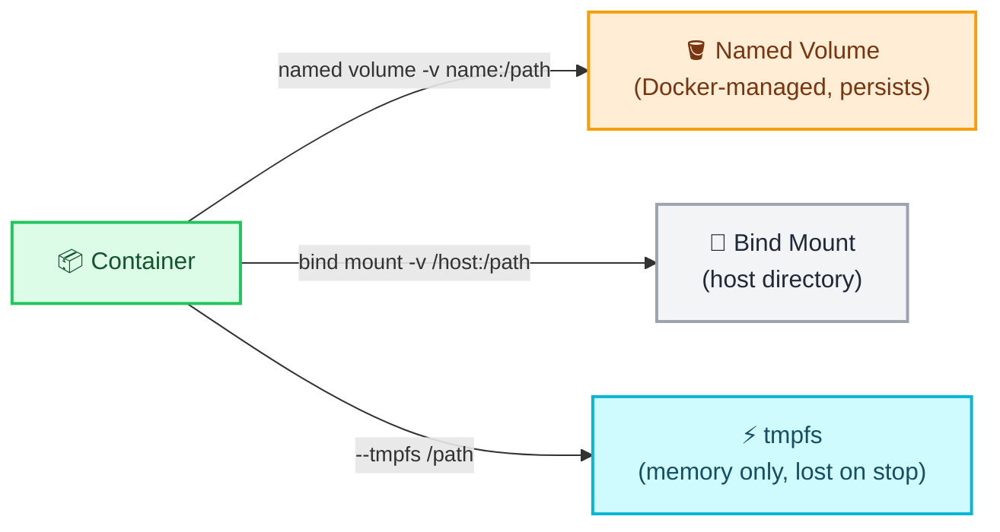
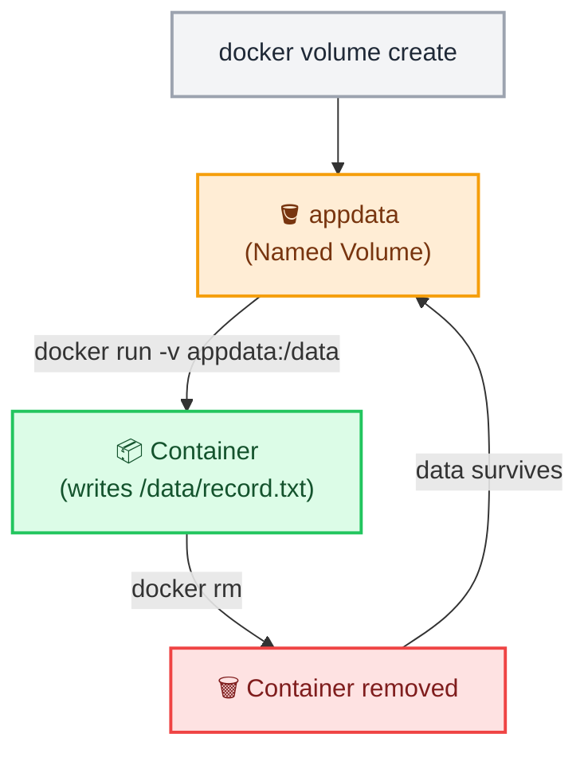

# Docker Volumes and Persistence

← [Back to Docker Tutorials](../index.md)

---

## Observe the Problem with Container Storage

By default, any files written inside a container exist only in that container's writable layer. When the container is removed, the data is permanently lost.

Start a container in the background that stays alive indefinitely by running `docker run -d --name temp-app alpine:3.22 sleep infinity`.

```bash
[labuser@container ~]$ docker run -d --name temp-app alpine:3.22 sleep infinity
7b6a5e4f3d2c1b0a9f8e7d6c5b4a3f2e1d0c9b8a7f6e5d4c3b2a1f0e9d8c7b6a
```

Now, create a file inside this running container using the `exec` command.

```bash
[labuser@container ~]$ docker exec temp-app sh -c "echo 'critical data' > /data.txt"
```

Verify the file exists inside the container.

```bash
[labuser@container ~]$ docker exec temp-app ls -l /data.txt
[labuser@container ~]$ docker exec temp-app cat /data.txt

-rw-r--r--    1 root     root            14 Nov  1 12:00 /data.txt
critical data
```

Verify the container is running by using `docker ps`.

```bash
[labuser@container ~]$ docker ps
CONTAINER ID   IMAGE         COMMAND            CREATED          STATUS          PORTS     NAMES
7b6a5e4f3d2c   alpine:3.22   "sleep infinity"   15 seconds ago   Up 14 seconds             temp-app
```

Remove the container to simulate an update or a crash.

```bash
[labuser@container ~]$ docker rm -f temp-app
temp-app
```

Run `docker ps -a` to verify the container has been completely removed.

```bash
[labuser@container ~]$ docker ps -a
CONTAINER ID   IMAGE     COMMAND   CREATED   STATUS    PORTS     NAMES
```

Recreate the container with the exact same name.

```bash
[labuser@container ~]$ docker run -d --name temp-app alpine:3.22 sleep infinity
c5b4a3f2e1d0c9b8a7f6e5d4c3b2a1f0e9d8c7b6a5e4f3d2c1b0a9f8e7d6c5b4
```

Try to read the file again.

```bash
[labuser@container ~]$ docker exec temp-app cat /data.txt
cat: can't open '/data.txt': No such file or directory
```

You will get a `No such file or directory` error! The data was permanently destroyed when the original container was removed.

To solve this problem, Docker provides three types of external storage mounts:



1. **Docker Volumes (Named Volumes):** Managed entirely by Docker. Data is stored in a hidden, protected directory on the host machine. This is the **recommended** approach for persisting database files or application state, because the volume easily survives the deletion of the container. Example syntax: `-v my-volume:/app/data`
2. **Bind Mounts:** Maps a specific, user-defined path on your host machine directly into the container. This is great for **local development** (e.g., mapping your source code folder so live edits show up immediately inside the container). Example syntax: `-v /host/path:/app/data`
3. **tmpfs Mounts:** Mounts a temporary file system directly in the host's memory. Fast and secure, but the data is completely lost when the container stops. Perfect for storing temporary scratch space or sensitive secrets. Example syntax: `--tmpfs /app/data`

---

## Create a Named Volume

`docker volume create` creates a named volume managed by Docker. Named volumes persist beyond the lifecycle of any individual container.



Run `docker volume create appdata` to create a named volume called `appdata`.

```bash
[labuser@container ~]$ docker volume create appdata
appdata
```

Run `docker volume ls` to list all volumes and confirm `appdata` appears.

```bash
[labuser@container ~]$ docker volume ls
DRIVER    VOLUME NAME
local     appdata
```

---

## Inspect a Volume

`docker volume inspect` shows the full metadata for a volume, including its mount point on the host filesystem.

Run `docker volume inspect appdata` to view the volume configuration. Note the `Mountpoint` field — this is where Docker stores the volume's data on the host.

```bash
[labuser@container ~]$ docker volume inspect appdata
[
    {
        "CreatedAt": "2023-11-01T12:02:00Z",
        "Driver": "local",
        "Labels": {},
        "Mountpoint": "/var/lib/docker/volumes/appdata/_data",
        "Name": "appdata",
        "Options": {},
        "Scope": "local"
    }
]
```

---

## Write Data to a Volume

Start a new container in the background and attach the `appdata` volume so that it appears as the `/data` folder inside the container. 

```bash
[labuser@container ~]$ docker run -d --name volume-app -v appdata:/data alpine:3.22 sleep infinity
e5d4c3b2a1f0e9d8c7b6a5e4f3d2c1b0a9f8e7d6c5b4a3f2e1d0c9b8a7f6e5d4
```

Now, create a file inside this running container on the mounted volume.

```bash
[labuser@container ~]$ docker exec volume-app sh -c "echo 'persisted across restarts' > /data/record.txt"
```

Verify the file was written.

```bash
[labuser@container ~]$ docker exec volume-app ls -l /data/record.txt
[labuser@container ~]$ docker exec volume-app cat /data/record.txt

-rw-r--r--    1 root     root            26 Nov  1 12:05 /data/record.txt
persisted across restarts
```

---

## Verify Data Survives Container Removal

Verify the running containers by using `docker ps`.

```bash
[labuser@container ~]$ docker ps
CONTAINER ID   IMAGE         COMMAND            CREATED          STATUS          PORTS     NAMES
e5d4c3b2a1f0   alpine:3.22   "sleep infinity"   2 minutes ago    Up 2 minutes              volume-app
```

Remove the container that wrote the data.

```bash
[labuser@container ~]$ docker rm -f volume-app
volume-app
```

Run `docker ps -a` to verify the container has been completely removed.

```bash
[labuser@container ~]$ docker ps -a
CONTAINER ID   IMAGE     COMMAND   CREATED   STATUS    PORTS     NAMES
```

Start a new container — with the exact same name and volume mount.

```bash
[labuser@container ~]$ docker run -d --name volume-app -v appdata:/data alpine:3.22 sleep infinity
f0e9d8c7b6a5e4f3d2c1b0a9f8e7d6c5b4a3f2e1d0c9b8a7f6e5d4c3b2a1f0e9
```

Try to read the file again.

```bash
[labuser@container ~]$ docker exec volume-app ls -l /data/record.txt
[labuser@container ~]$ docker exec volume-app cat /data/record.txt

-rw-r--r--    1 root     root            26 Nov  1 12:05 /data/record.txt
persisted across restarts
```

Notice that the file `record.txt` is still there! Even though we deleted the container and created a brand new one, the data was safely preserved inside the volume.

---

## Use a Bind Mount

A `bind mount` maps a directory on the host filesystem directly into a container. Unlike named volumes, the source path is controlled by you.

Create a directory on the host.

```bash
[labuser@container ~]$ mkdir -p shared
```

Write a file on the host.

```bash
[labuser@container ~]$ echo 'data from host' > shared/app.txt
```

Verify the file exists on the host.

```bash
[labuser@container ~]$ ls -l shared/
total 4
-rw-r--r-- 1 opc opc 15 Nov  1 12:10 app.txt
```

Start a container in the background and mount the directory into it.

```bash
[labuser@container ~]$ docker run -d --name bind-app -v $(pwd)/shared:/app ubuntu:24.04 sleep infinity
1a2b3c4d5e6f7g8h9i0j1k2l3m4n5o6p7q8r9s0t1u2v3w4x5y6z7a8b9c0d1e2f
```

Open an interactive shell inside the running container.

```bash
[labuser@container ~]$ docker exec -it bind-app bash
root@1a2b3c4d5e6f:/# 
```

List the contents of the mounted folder and then read the file from the host.

```bash
root@1a2b3c4d5e6f:/# ls -l /app
root@1a2b3c4d5e6f:/# cat /app/app.txt

total 4
-rw-r--r-- 1 root root 15 Nov  1 12:10 app.txt
data from host
```

Because we used a bind mount (`-v $(pwd)/shared:/app`), the `shared` folder from your current directory on the host machine is now directly accessible inside the container as the `/app` folder. This is exactly why the container can instantly see the `app.txt` file you just created!

Now let's do the reverse! Write a file from inside the container.

```bash
root@1a2b3c4d5e6f:/# echo 'from container' > /app/container.txt
```

Exit the container shell to return to your host terminal.

```bash
root@1a2b3c4d5e6f:/# exit
```

List the contents of the shared folder on your host machine and then read the new file.

```bash
[labuser@container ~]$ ls -l shared/
[labuser@container ~]$ cat shared/container.txt

total 8
-rw-r--r-- 1 opc  opc  15 Nov  1 12:10 app.txt
-rw-r--r-- 1 root root 15 Nov  1 12:15 container.txt
from container
```

This proves that bind mounts work in both directions (they are deeply synced). The file written inside the container at `/app/container.txt` instantly appears on your host machine at `shared/container.txt`. This real-time syncing makes bind mounts perfect for live-editing source code during local development!

---

## Remove a Volume

`docker volume rm` removes a named volume and permanently deletes its data. A volume cannot be removed while a container is using it.

Try to remove the volume.

```bash
[labuser@container ~]$ docker volume rm appdata
Error response from daemon: remove appdata: volume is in use - [f0e9d8c7b6a5e4f3d2c1b0a9f8e7d6c5b4a3f2e1d0c9b8a7f6e5d4c3b2a1f0e9]
```

You will get an error stating the volume is in use! Docker protects volumes from being deleted if any container (running or stopped) is currently attached to them.

Remove the container that is using the volume.

```bash
[labuser@container ~]$ docker rm -f volume-app
volume-app
```

Now, successfully remove the volume.

```bash
[labuser@container ~]$ docker volume rm appdata
appdata
```

Verify it is gone.

```bash
[labuser@container ~]$ docker volume ls
DRIVER    VOLUME NAME
```

## 🧠 Quick Quiz

<quiz>
What is the primary advantage of using a named Docker volume over a bind mount?
- [ ] Volumes are faster.
- [ ] Bind mounts cannot be shared between containers.
- [x] Volumes are fully managed by Docker and isolated from the host filesystem.
- [ ] Volumes automatically back themselves up to the cloud.

Volumes are stored in Docker's managed storage directory, making them more secure and easier to manage than relying on host-specific paths.
</quiz>

<quiz>
Which flag is used to map a volume or bind mount when running a container?
- [ ] --mount-point
- [x] -v or --volume
- [ ] -m
- [ ] -d

The `-v` flag is used to specify the mapping (e.g., `-v my_volume:/app/data`).
</quiz>

<quiz>
How can you list all Docker volumes on your system?
- [ ] docker list volumes
- [ ] docker volume get
- [x] docker volume ls
- [ ] docker volume show

`docker volume ls` displays all named and anonymous volumes managed by Docker.
</quiz>

---



---


