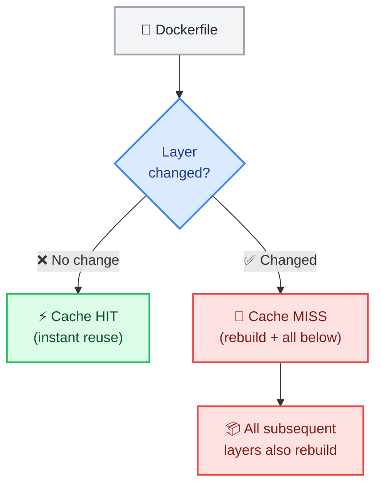

# Dockerfile Best Practices

← [Back to Docker Tutorials](../index.md)

---

## Observe the Cache Busting Problem

Docker caches each layer. If a layer's instruction has not changed since the last build, Docker reuses the cached result. However, this creates a subtle bug: running `apt-get update` and `apt-get install` in separate `RUN` instructions means `apt-get update` may never re-run, even when you add new packages.



Write a problematic Dockerfile that splits `apt-get update` and `apt-get install` into separate `RUN` instructions:

```bash
[labuser@container ~]$ cat > Dockerfile.bad << 'EOF'
FROM ubuntu:24.04
RUN apt-get update
RUN apt-get install -y curl
EOF
```

The `-f` flag tells Docker to use a specific file instead of looking for the default `Dockerfile`.

Build the problematic image.

```bash
[labuser@container ~]$ docker build -t bad-cache -f Dockerfile.bad .
```

Simulate a scenario where you also need to install `wget`. Update the install instruction:

```bash
[labuser@container ~]$ cat > Dockerfile.bad << 'EOF'
FROM ubuntu:24.04
RUN apt-get update
RUN apt-get install -y curl wget
EOF
```

Rebuild the image.

```bash
[labuser@container ~]$ docker build -t bad-cache -f Dockerfile.bad .

[+] Building 0.2s (6/6) FINISHED                                docker:default
 => [internal] load build definition from Dockerfile.bad                  0.0s
 => [internal] load metadata for docker.io/library/ubuntu:24.04           0.0s
 => [internal] load .dockerignore                                         0.0s
 => CACHED [1/3] FROM docker.io/library/ubuntu:24.04                      0.0s
 => CACHED [2/3] RUN apt-get update                                       0.0s
 => ERROR [3/3] RUN apt-get install -y curl wget                          0.1s
------
 > [3/3] RUN apt-get install -y curl wget:
0.082 Reading package lists...
0.091 Building dependency tree...
0.093 Reading state information...
0.095 E: Unable to locate package wget
...
```

Observe the build output. The `RUN apt-get update` step will show `CACHED` (or `---> Using cache`). Because the cache was reused, the package index is stale, which can cause the installation of `wget` to fail. The fix: always combine `apt-get update` and `apt-get install` in a single `RUN` instruction.

---

## Combine Update and Install in One RUN

The correct pattern chains `apt-get update` and `apt-get install` in a single `RUN` with `&&`. Adding `--no-install-recommends` reduces bloat. Cleaning the apt cache with `rm -rf /var/lib/apt/lists/*` in the same layer prevents caching the package index in the image.

Write the corrected Dockerfile:

```bash
[labuser@container ~]$ cat > Dockerfile << 'EOF'
FROM ubuntu:24.04
RUN apt-get update && apt-get install -y --no-install-recommends \
    curl \
    ca-certificates \
    && rm -rf /var/lib/apt/lists/*
CMD ["bash"]
EOF
```

Build it.

```bash
[labuser@container ~]$ docker build -t optimized-app:v1 .
```

Simulate adding `wget` to your requirements. Update the Dockerfile:

```bash
[labuser@container ~]$ cat > Dockerfile << 'EOF'
FROM ubuntu:24.04
RUN apt-get update && apt-get install -y --no-install-recommends \
    curl \
    ca-certificates \
    wget \
    && rm -rf /var/lib/apt/lists/*
CMD ["bash"]
EOF
```

Rebuild the image.

```bash
[labuser@container ~]$ docker build -t optimized-app:v1 .

[+] Building 3.5s (5/5) FINISHED                                docker:default
...
 => [2/2] RUN apt-get update && apt-get install -y --no-install-...       3.2s
 => exporting to image                                                    0.0s
```

Observe the build output. Because the `RUN` instruction changed, Docker invalidated the cache for this layer. The build executes a fresh `apt-get update` before installing the packages, ensuring the package index is up-to-date.

---

## Use .dockerignore to Exclude Files

A `.dockerignore` file excludes files and directories from the build context. This prevents sensitive files (e.g., `.env`), large build artifacts (e.g., `node_modules/`), and source control metadata (e.g., `.git/`) from being sent to the daemon and potentially baked into the image.

Assume we have dummy folders and files (`node_modules/`, `.git/`, and `.env`). View them.

```bash
[labuser@container ~]$ ls -la

total 16
drwxr-xr-x 5 user group 4096 Nov 01 12:00 .
drwxr-xr-x 3 user group 4096 Nov 01 11:50 ..
drwxr-xr-x 8 user group 4096 Nov 01 12:00 .git
-rw-r--r-- 1 user group   35 Nov 01 12:00 .env
-rw-r--r-- 1 user group  220 Nov 01 12:00 Dockerfile
drwxr-xr-x 4 user group 4096 Nov 01 12:00 node_modules
```

Build the image without a `.dockerignore` file to observe the build context transfer.

```bash
[labuser@container ~]$ docker build -t optimized-app:v1 .

[+] Building 1.2s (5/5) FINISHED                                docker:default
 => [internal] load build context                                         0.8s
 => => transferring context: 15.2MB                                       0.7s
...
```

Notice the `transferring context` size. It might be over 15MB because it's sending the large dummy folders to the daemon. 

Create a `.dockerignore` file:

```bash
[labuser@container ~]$ cat > .dockerignore << 'EOF'
.env
node_modules
*.log
.git
EOF
```

Rebuild the image to see the difference.

```bash
[labuser@container ~]$ docker build -t optimized-app:v1 .

[+] Building 0.2s (6/6) FINISHED                                docker:default
 => [internal] load build context                                         0.0s
 => => transferring context: 4.1kB                                        0.0s
...
```

Observe the output again. The context transfer is now nearly instant and very small (around 4kB), proving that the large folders and sensitive files were successfully ignored.

---

## Run as a Non-Root User

Containers run as `root` by default, which is a security risk. The `USER` instruction switches to a non-privileged user. Always create a dedicated application user and switch to it before the final `CMD`.

First, verify that the default user is root.

```bash
[labuser@container ~]$ docker run --rm ubuntu:24.04 whoami

root
```

Update the Dockerfile to add a non-root user:

```bash
[labuser@container ~]$ cat > Dockerfile << 'EOF'
FROM ubuntu:24.04
RUN apt-get update && apt-get install -y --no-install-recommends \
    curl \
    ca-certificates \
    && rm -rf /var/lib/apt/lists/* \
    && useradd -m -u 1001 appuser
USER appuser
WORKDIR /home/appuser
CMD ["bash"]
EOF
```

Rebuild.

```bash
[labuser@container ~]$ docker build -t optimized-app:v2 .
```

Verify the container now runs as `appuser`.

```bash
[labuser@container ~]$ docker run --rm optimized-app:v2 whoami

appuser
```

---

## Pin Your Base Image Version

Using `FROM ubuntu:24.04` is better than `FROM ubuntu:latest` because the `latest` tag changes. But even version tags are mutable — a publisher can push a new image to the same tag.

For fully reproducible builds, pin to a specific content digest using `@sha256:...`. Pull the current digest:

```bash
[labuser@container ~]$ docker pull ubuntu:24.04 && docker inspect ubuntu:24.04 --format '{{index .RepoDigests 0}}'

ubuntu@sha256:72297848456d5d37d1262630108ab308d33c22fa2866055bf533b62db4811f5d
```

Note the digest. In production, you would use this value in your `FROM` instruction like this:

```dockerfile
FROM ubuntu:24.04@sha256:72297848456d5d37d1262630108ab308d33c22fa2866055bf533b62db4811f5d
```

---

## Sort Multi-Line Arguments Alphabetically

Sorting package lists alphabetically in multi-line `RUN` instructions makes them easier to read, review in pull requests, and avoids accidental duplicates.

Here is an example of what that looks like in practice:

```dockerfile
RUN apt-get update && apt-get install -y --no-install-recommends \
    ca-certificates \
    curl \
    git \
    jq \
    && rm -rf /var/lib/apt/lists/*
```

---

## Clean Up Archives in the Same Layer

When you run a command in a Dockerfile, Docker commits the filesystem changes as a new layer. If you download a file in one `RUN` instruction and delete it in the next `RUN` instruction, the file is still permanently baked into the image in the first layer!

To actually save space, you must download, extract, and delete the file in a single `RUN` instruction.

First, create a problematic Dockerfile that spreads these steps across multiple layers.

```bash
[labuser@container ~]$ cat > Dockerfile << 'EOF'
FROM ubuntu:24.04
RUN apt-get update && apt-get install -y wget && rm -rf /var/lib/apt/lists/*
RUN wget -q https://wordpress.org/latest.tar.gz
RUN tar -xzf latest.tar.gz -C /usr/local
RUN rm latest.tar.gz
CMD ["bash"]
EOF
```

Build the problematic image.

```bash
[labuser@container ~]$ docker build -t layered-archive .
```

Now, fix it by combining everything into a single `RUN` command. This ensures the archive is deleted *before* the layer is saved.

```bash
[labuser@container ~]$ cat > Dockerfile << 'EOF'
FROM ubuntu:24.04
RUN apt-get update && apt-get install -y wget && rm -rf /var/lib/apt/lists/*
RUN wget -q https://wordpress.org/latest.tar.gz \
    && tar -xzf latest.tar.gz -C /usr/local \
    && rm latest.tar.gz
CMD ["bash"]
EOF
```

Build the optimized image.

```bash
[labuser@container ~]$ docker build -t clean-archive .
```

List the images to see the difference.

```bash
[labuser@container ~]$ docker images | grep -E "layered-archive|clean-archive"

layered-archive   latest    12a34b56c78d   1 minute ago    173MB
clean-archive     latest    98d76c54b32a   15 seconds ago  115MB
```

Observe the output. Even though both images end up with the exact same files in the final filesystem, `layered-archive` is significantly larger! The massive archive is permanently trapped in one of its intermediate layers.

## 🧠 Quick Quiz

<quiz>
Why is it a best practice to combine multiple `RUN apt-get` commands using `&&`?
- [ ] It makes the Dockerfile easier to read.
- [x] It reduces the number of layers created, resulting in a smaller final image size.
- [ ] Docker limits the total number of `RUN` instructions to 5.
- [ ] It forces apt-get to run faster.

Every `RUN` instruction creates a new image layer. Combining commands keeps temporary files from becoming permanently stored in intermediate layers.
</quiz>

<quiz>
What is the purpose of a `.dockerignore` file?
- [ ] To hide passwords inside the container.
- [ ] To tell Docker which containers to ignore during cleanup.
- [x] To prevent unnecessary files from being sent to the Docker daemon during a build.
- [ ] To ignore build errors.

It functions like `.gitignore`, reducing the build context size and preventing sensitive or large files from entering the image.
</quiz>

<quiz>
When optimizing for build caching, where should you place the `COPY . .` instruction?
- [ ] At the very beginning of the Dockerfile.
- [x] As close to the end as possible, after installing dependencies.
- [ ] Immediately after the `FROM` instruction.
- [ ] It doesn't matter.

Source code changes frequently. By placing it late in the Dockerfile, you prevent cache invalidation for the slow dependency installation steps.
</quiz>

---



---


