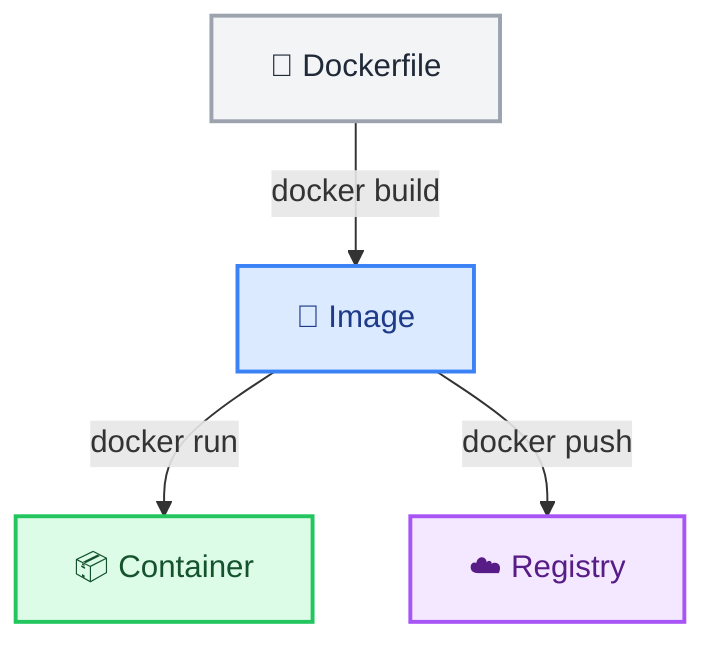

# Dockerfile Writing Basics

← [Back to Docker Tutorials](../index.md)

---

## Write Your First Dockerfile

A `Dockerfile` is a text file containing sequential instructions that Docker executes to build an image. Each instruction creates a new read-only layer in the image.



The `FROM` instruction specifies the base image. Every Dockerfile must start with one.

Write a minimal Dockerfile.

```bash
[labuser@container ~]$ cat > Dockerfile << 'EOF'
FROM alpine:3.22
CMD ["echo", "Hello from my first image"]
EOF
```

Verify by running `cat Dockerfile`.

```bash
[labuser@container ~]$ cat Dockerfile

FROM alpine:3.22
CMD ["echo", "Hello from my first image"]
```

---

## Build the Image

`docker build` reads the Dockerfile and executes each instruction to produce an image. The `-t` flag assigns a name and tag.

Build your image by running `docker build -t myimage:v1 .`

```bash
[labuser@container ~]$ docker build -t myimage:v1 .

[+] Building 0.1s (5/5) FINISHED                                docker:default
 => [internal] load build definition from Dockerfile                      0.0s
 => => transferring dockerfile: 91B                                       0.0s
 => [internal] load metadata for docker.io/library/alpine:3.22            0.0s
 => [internal] load .dockerignore                                         0.0s
 => => transferring context: 2B                                           0.0s
 => CACHED [1/1] FROM docker.io/library/alpine:3.22                       0.0s
 => exporting to image                                                    0.0s
 => => exporting layers                                                   0.0s
 => => writing image sha256:7b6a5e4f3d2c1b0a9f8e7d6c5b4a3f2e1d0c9b8a...   0.0s
 => => naming to docker.io/library/myimage:v1                             0.0s
```

Verify it appears in the local store by running `docker images myimage`.

```bash
[labuser@container ~]$ docker images myimage

REPOSITORY   TAG       IMAGE ID       CREATED          SIZE
myimage      v1        7b6a5e4f3d2c   10 seconds ago   7.38MB
```

---

## Add WORKDIR and COPY

`WORKDIR` sets the working directory for subsequent instructions and for the container at runtime. `COPY` transfers files from the build context (your local machine) into the image.

Create an application file.

```bash
[labuser@container ~]$ echo "name=myapp" > config.txt
```

Update the Dockerfile.

```bash
[labuser@container ~]$ cat > Dockerfile << 'EOF'
FROM alpine:3.22
WORKDIR /app
COPY config.txt .
EOF
```

Rebuild.

```bash
[labuser@container ~]$ docker build -t myimage:v2 .

[+] Building 0.2s (7/7) FINISHED                                docker:default
 => [internal] load build definition from Dockerfile                      0.0s
 => [internal] load metadata for docker.io/library/alpine:3.22            0.0s
 => [internal] load .dockerignore                                         0.0s
 => [internal] load build context                                         0.0s
 => => transferring context: 35B                                          0.0s
 => CACHED [1/3] FROM docker.io/library/alpine:3.22                       0.0s
 => [2/3] WORKDIR /app                                                    0.1s
 => [3/3] COPY config.txt .                                               0.0s
 => exporting to image                                                    0.0s
 => => exporting layers                                                   0.0s
 => => writing image sha256:c5b4a3f2e1d0c9b8a7f6e5d4c3b2a1f0e9d8c7b6...   0.0s
 => => naming to docker.io/library/myimage:v2                             0.0s
```

Verify the working directory and that the file was copied.

```bash
[labuser@container ~]$ docker run --rm myimage:v2 sh -c "pwd && ls -l"

/app
total 4
-rw-r--r--    1 root     root            11 Nov  1 12:20 config.txt
```

`WORKDIR /app` sets the container's default working directory to `/app`. When the container starts, it lands directly inside `/app` — so `pwd` prints `/app`, and `ls -l` lists the files there automatically without needing a path.

---

## Add a Default Command

`CMD` sets the default command that runs when a container starts. If no command is specified at `docker run`, Docker executes this.

Update the Dockerfile to add a default command.

```bash
[labuser@container ~]$ cat > Dockerfile << 'EOF'
FROM alpine:3.22
WORKDIR /app
COPY config.txt .
CMD ["ls", "-l"]
EOF
```

Rebuild.

```bash
[labuser@container ~]$ docker build -t myimage:v3 .

[+] Building 0.1s (7/7) FINISHED                                docker:default
...
```

Run the container.

```bash
[labuser@container ~]$ docker run --rm myimage:v3

total 4
-rw-r--r--    1 root     root            11 Nov  1 12:20 config.txt
```

Notice that no command was passed to `docker run`. `CMD` ran `ls -l` automatically when the container started.

---

## Understand CMD vs ENTRYPOINT

`CMD` can be overridden entirely. `ENTRYPOINT` sets the executable that always runs, and any command arguments passed to `docker run` are appended to it.

Let's combine them: use `ENTRYPOINT` for the command (`ls`) and `CMD` for default arguments (`-l`).

Update the Dockerfile.

```bash
[labuser@container ~]$ cat > Dockerfile << 'EOF'
FROM alpine:3.22
WORKDIR /app
COPY config.txt .
ENTRYPOINT ["ls"]
CMD ["-l"]
EOF
```

Rebuild.

```bash
[labuser@container ~]$ docker build -t myimage:v4 .

[+] Building 0.1s (7/7) FINISHED                                docker:default
...
```

Run the container without a command to see the default behavior. Notice this runs `ls -l` because the CMD (`-l`) is appended to the ENTRYPOINT (`ls`).

```bash
[labuser@container ~]$ docker run myimage:v4

total 4
-rw-r--r--    1 root     root            11 Nov  1 12:20 config.txt
```

Now override the CMD by passing a different argument to `docker run`.

```bash
[labuser@container ~]$ docker run myimage:v4 /app/config.txt

/app/config.txt
```

Notice this runs `ls /app/config.txt` — the CMD `-l` was replaced by `/app/config.txt`, but `ls` still executed!

Verify this by running `docker ps -a` and looking at the **COMMAND** column to see exactly what command was executed for each container.

```bash
[labuser@container ~]$ docker ps -a

CONTAINER ID   IMAGE        COMMAND                  CREATED          STATUS                      PORTS     NAMES
f0e9d8c7b6a5   myimage:v4   "ls /app/config.txt"     15 seconds ago   Exited (0) 14 seconds ago             optimistic_hopper
1a2b3c4d5e6f   myimage:v4   "ls -l"                  35 seconds ago   Exited (0) 34 seconds ago             blissful_turing
```

---

## Use RUN to Install Software

`RUN` executes a shell command during the build process. The result is committed as a new image layer.

First, verify that `curl` is not installed in the base image.

```bash
[labuser@container ~]$ docker run --rm alpine:3.22 curl --version

docker: Error response from daemon: failed to create task for container: failed to create shim task: OCI runtime create failed: runc create failed: unable to start container process: exec: "curl": executable file not found in $PATH: unknown.
```

Notice the error — the executable is not found. Let's fix this by adding `curl` to our image.

Update the Dockerfile to install `curl` at build time.

```bash
[labuser@container ~]$ cat > Dockerfile << 'EOF'
FROM alpine:3.22
WORKDIR /app
RUN apk add --no-cache curl
COPY config.txt .
CMD ["cat", "config.txt"]
EOF
```

Rebuild.

```bash
[labuser@container ~]$ docker build -t myimage:v5 .

[+] Building 1.5s (8/8) FINISHED                                docker:default
 => [internal] load build definition from Dockerfile                      0.0s
 => [internal] load metadata for docker.io/library/alpine:3.22            0.0s
 => [internal] load .dockerignore                                         0.0s
 => [internal] load build context                                         0.0s
 => => transferring context: 35B                                          0.0s
 => CACHED [1/4] FROM docker.io/library/alpine:3.22                       0.0s
 => [2/4] WORKDIR /app                                                    0.1s
 => [3/4] RUN apk add --no-cache curl                                     1.2s
 => [4/4] COPY config.txt .                                               0.0s
 => exporting to image                                                    0.0s
 => => exporting layers                                                   0.0s
 => => writing image sha256:d1e2f3g4h5i6j7k8l9m0n1o2p3q4r5s6t7u8v9w0...   0.0s
 => => naming to docker.io/library/myimage:v5                             0.0s
```

Run the container using the new image to verify `curl` works now.

```bash
[labuser@container ~]$ docker run --rm myimage:v5 curl --version

curl 8.5.0 (x86_64-alpine-linux-musl) libcurl/8.5.0 OpenSSL/3.1.4 zlib/1.3.1 brotli/1.1.0 c-ares/1.24.0 libidn2/2.3.4 nghttp2/1.58.0
Release-Date: 2023-12-06
Protocols: dict file ftp ftps gopher gophers http https imap imaps mqtt pop3 pop3s rtsp smb smbs smtp smtps telnet tftp
Features: alt-svc AsynchDNS brotli HSTS HTTP2 HTTPS-proxy IDN IPv6 Largefile libz NTLM SSL threadsafe TLS-SRP UnixSockets
```

---

## Add EXPOSE and Publish Ports

`EXPOSE` is a documentation instruction — it declares which port the application listens on. It does not automatically publish the port to the host.
To publish ports, use:
- `-p <host_port>:<container_port>` to map a specific host port to a container port.
- `-P` (uppercase) to automatically map all `EXPOSE`d ports to random available high ports on the host.

Let's update the image to run a Python web server on port `8000` and expose it.

Update the Dockerfile.

```bash
[labuser@container ~]$ cat > Dockerfile << 'EOF'
FROM python:3.13-alpine
WORKDIR /app
RUN echo "<h1>Welcome to DevopsPilot!</h1>" > index.html
EXPOSE 8000
CMD ["python", "-m", "http.server", "8000"]
EOF
```

Rebuild.

```bash
[labuser@container ~]$ docker build -t myimage:v6 .

[+] Building 2.5s (7/7) FINISHED                                docker:default
...
```

Run the container in the background (`-d`) using `-P` to publish the port randomly.

```bash
[labuser@container ~]$ docker run --rm -d -P --name web myimage:v6

z1y2x3w4v5u6t7s8r9q0p1o2n3m4l5k6j7i8h9g0f1e2d3c4b5a6z7y8x9w0v1u2
```

Check which random port was assigned.

```bash
[labuser@container ~]$ docker port web

8000/tcp -> 0.0.0.0:32769
8000/tcp -> [::]:32769
```

Open `http://localhost:32769` (or the specific port assigned on your system) in your browser to see the welcome page served by your container!

## 🧠 Quick Quiz

<quiz>
Which Dockerfile instruction specifies the base image to build upon?
- [ ] BASE
- [ ] START
- [x] FROM
- [ ] IMAGE

Every Dockerfile must begin with a `FROM` instruction.
</quiz>

<quiz>
What is the purpose of the `WORKDIR` instruction?
- [ ] It creates a new user directory.
- [ ] It sets the directory on the host machine where the build happens.
- [x] It sets the default working directory inside the container for subsequent instructions.
- [ ] It defines where logs should be saved.

`WORKDIR` acts like a `cd` command, and it will create the directory if it doesn't already exist.
</quiz>

<quiz>
What is the primary difference between `RUN` and `CMD`?
- [ ] `RUN` starts the container; `CMD` stops it.
- [x] `RUN` executes during the image build; `CMD` provides the default command when the container starts.
- [ ] `RUN` only works for shell scripts; `CMD` is for binaries.
- [ ] They are identical and can be used interchangeably.

`RUN` bakes changes into the image layer, whereas `CMD` only specifies what happens at runtime.
</quiz>

---



---


