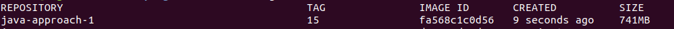
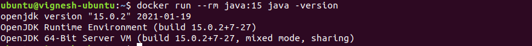
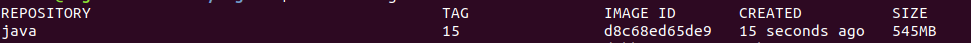
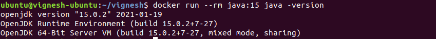
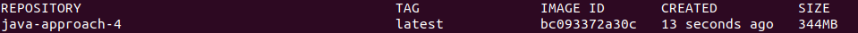

### Approach 1

Downloading the openjdk 15 tar file from official website, untar the file , delete the downloaded tar file and set the path to java binary.

##### Create a Dockerfile and copy a below content

```
FROM centos:8

ENV PATH=$PATH:/opt/java/jdk-15.0.2/bin

WORKDIR /opt/java

RUN curl https://download.java.net/java/GA/jdk15.0.2/0d1cfde4252546c6931946de8db48ee2/7/GPL/openjdk-15.0.2_linux-x64_bin.tar.gz -o openjdk-15.0.2_linux-x64_bin.tar.gz

RUN tar -xzf openjdk-15.0.2_linux-x64_bin.tar.gz && 
    rm -rf openjdk-15.0.2_linux-x64_bin.tar.gz
```

##### Build a docker image

```
docker build -t java-approach-1:15 .
```

##### Check the size of docker image

Run the following command to check the docker images available in local machine

```
docker images
```



##### Create a docker container from the created image and check the java version

```
docker run --rm java:15 java -version
```



### Approach 2 (Best Practice)

Downloading the openjdk 15 tar file from official website, untar it and delete the tar file in a single layer and set the path to java binary.

##### Create a Dockerfile and copy a below content

```
FROM centos:8

ENV PATH=$PATH:/opt/java/jdk-15.0.2/bin

RUN mkdir /opt/java && 
    curl https://download.java.net/java/GA/jdk15.0.2/0d1cfde4252546c6931946de8db48ee2/7/GPL/openjdk-15.0.2_linux-x64_bin.tar.gz | tar -xz -C /opt/java/
```

If you are downloading a file inside dockerfile and if that file is not needed after extracting, then we should delete that file in the same layer.

This is because, Docker images are layered architecture, file added in one layer cannot be deleted in second layer, we have to remove it in the same layer if that file is not required.

Even if we delete the file in the next layer, it will not have any effect because the file is already added in the last layer and we cannot override that layer.

Every 'RUN' command will create one layer for docker image.

##### Build a docker image

```
docker build -t java:15 .
```

##### Check the size of docker image

Run the following command to check the docker images available in local machine

```
docker images
```



Now we can see, the size of the docker image is reduced.

##### Create a docker container from the created image and check the java version

```
docker run --rm java:15 java -version
```



### Approach 3 (Best pratice)

Same as approach 2, but instead of putting all the commands in Dockerfile, put the commands in shellscript file, copy the file to Dockerfile then run the shellscript.

Approach 2 would be better, if you want to handle everything from the Dockerfile itself.

Use Approach 3 if you want to put lot of logic in single layer, if the commands are less we can use the approach 2

##### Create a shellscript `build.sh`

Copy the following content to `build.sh` file

```
#!/bin/bash

mkdir /opt/java
curl https://download.java.net/java/GA/jdk15.0.2/0d1cfde4252546c6931946de8db48ee2/7/GPL/openjdk-15.0.2_linux-x64_bin.tar.gz | tar -xz -C /opt/java/
```

##### Create a Dockerfile

```
FROM centos:8

ENV PATH=$PATH:/opt/java/jdk-15.0.2/bin

COPY build.sh .

RUN chmod +x build.sh && 
    ./build.sh
```

### Approach 4

Still if we want to reduce the image size, we can use `alipne` as base image. alpine is very light weight base image.

##### Create a Dockerfile and copy the below content

```
FROM alpine:latest

ENV PATH=$PATH:/opt/java/jdk-15.0.2/bin

RUN apk add --no-cache curl && 
    mkdir /opt/java && 
    curl https://download.java.net/java/GA/jdk15.0.2/0d1cfde4252546c6931946de8db48ee2/7/GPL/openjdk-15.0.2_linux-x64_bin.tar.gz | tar -xz -C /opt/java/
```

##### Build a docker image

```
docker build -t java-approach-4 .
```

##### Check the size of docker image

```
docker images
```



Now we can see, the size of the docker image is reduced very much.

---

## Important Tips

!!! tip
    **Combine Commands**: To reduce image size, combine related commands into a single `RUN` instruction (using `&&`). This prevents temporary files from persisting in intermediate layers.

!!! note
    **Base Image**: Choosing a smaller base image (like `alpine`) is the most effective way to reduce the final image size.

## 🧠 Quick Quiz — Docker Optimization

<quiz>
Why is it better to download and extract a file in a single `RUN` command rather than two separate ones?
- [x] Docker creates a layer for each command. Even if you verify delete the file in the next layer, the space is still consumed in the previous layer history.
- [ ] It makes the build slower.
- [ ] It uses less CPU.
- [ ] It is required by law.

Deleting a file in a subsequent layer only "hides" it from the final view; the data remains in the underlying image layer, increasing the total size.
</quiz>

<quiz>
Which base image is known for being extremely lightweight and security-focused?
- [x] Alpine Linux
- [ ] Ubuntu
- [ ] CentOS
- [ ] Fedora

Alpine Linux images are typically around 5MB, compared to 100MB+ for others, making them ideal for containerization.
</quiz>

<quiz>
What instruction sets the environment variable `PATH` in a Dockerfile?
- [x] `ENV`
- [ ] `SET`
- [ ] `EXPORT`
- [ ] `VAR`

The `ENV` instruction sets environment variables that persist when a container is run from the image.
</quiz>


