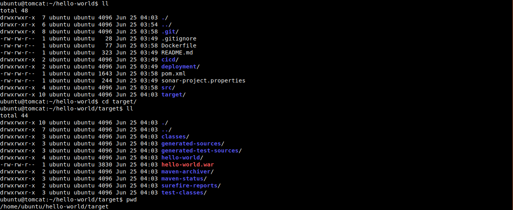

I have a sample hello-world maven project in github [hello-world](https://github.com/vigneshsweekaran/hello-world)

Maven is a build tool used to compile, test and package the application developed using Java programming language.

Run the `mvn clean package` command to compile and package the java application.

The `hello-world.war` file will be created in `targets` folder



I have already created a file `Dockerfile` and kept in root folder

```
From tomcat:8-jre8

COPY ./target/hello-world.war /usr/local/tomcat/webapps
```

In the `FROM` command we are taking `tomcat:8-jre8` as a base image.

On top of that we are copying the hello-world.war file from target folder and keeping it in /usr/local/tomcat/webapps inside a container.

we no need to explicity define the `CMD` here, because `CMD` is already written in base docker image `tomcat:8-jre8` to start the tomcat webserver.

---

## Important Tips

> [!TIP]
> **War File Placement**: Tomcat automatically deploys any `.war` file placed in the `webapps` directory. If you rename your file to `ROOT.war`, it will be deployed as the root application (accessible at `http://localhost:8080/` instead of `http://localhost:8080/app-name`).

> [!NOTE]
> **Base Image**: Using a specific version tag (e.g., `tomcat:9.0-jdk11`) is recommended over `latest` to ensure your build is reproducible and stable.

## 🧠 Quick Quiz — Tomcat in Docker

<quiz>
Where should you copy your `.war` file inside the official Tomcat container for it to be auto-deployed?
- [x] `/usr/local/tomcat/webapps`
- [ ] `/var/www/html`
- [ ] `/opt/tomcat/deploy`
- [ ] `/tmp`

The `webapps` directory is the standard deployment location for Tomcat.
</quiz>

<quiz>
Why don't we need a `CMD` instruction in this Dockerfile?
- [x] The base image (`tomcat`) already defines a `CMD` to start the server.
- [ ] Docker guesses how to start `.war` files.
- [ ] Tomcat runs as a kernel module.
- [ ] We forgot it.

Docker images inherit instructions from their base image. The official Tomcat image includes `CMD ["catalina.sh", "run"]` which starts the server.
</quiz>

<quiz>
If you want your app to be available at `http://localhost:8080/myapp`, what should your war file be named?
- [x] `myapp.war`
- [ ] `ROOT.war`
- [ ] `server.war`
- [ ] `index.war`

Tomcat uses the filename (minus `.war`) as the context path for the application. `ROOT.war` is a special case for the root context `/`.
</quiz>

---


