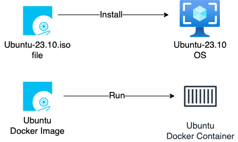

# Docker Image vs Docker Container – Differences with Examples

← [Back to Docker](../../index.md)

---

Docker images and Docker containers are core concepts every Docker beginner must understand.

In simple terms, a **Docker image** is a **read-only template**, while a **Docker container** is a **running instance created from that image**.

In this guide, you’ll learn:
- What a Docker image is
- What a Docker container is
- Key differences between images and containers
- Real Docker examples using Ubuntu

---

## What is a Docker Image?

A **Docker image** is a lightweight, immutable, read-only template that contains everything required to run an application:
- Application code
- Runtime
- Libraries
- Dependencies

Docker images are used as **blueprints** to create containers.

All Docker images are stored in a **Docker registry**, most commonly **Docker Hub**.

👉 **Docker Hub**: [https://hub.docker.com](https://hub.docker.com)

---

## What is a Docker Container?

A **Docker container** is a **running instance of a Docker image**.

When a container is created:
- The image stays unchanged (read-only)
- A writable layer is added on top
- The application starts running

If the container stops, the image remains intact.

---

## Docker Image vs Docker Container – Comparison Table

| Feature | Docker Image | Docker Container |
|------|-------------|------------------|
| Nature | Static | Dynamic |
| State | Read-only | Read-write |
| Purpose | Blueprint | Running application |
| Created using | Dockerfile | docker run |
| Stored in | Docker registry | Host system |
| Lifecycle | Does not run | Can start, stop, restart |

---

## ISO Image vs Docker Image (Easy Analogy)

An **ISO image** is a static installation file. Applications run only **after** the operating system is installed and started.

Similarly:
- A **Docker image** is a static package
- A **Docker container** runs applications from that image



---

## Pulling Docker Images from Docker Hub

Check existing images on the server:

```bash
docker image ls
```

Pull the Ubuntu image:

```bash
docker pull ubuntu
```

By default, Docker pulls the `latest` tag.

---

## Pulling a Specific Image Tag

Docker images follow this format:

```
IMAGE_NAME:TAG
```

Example:

```bash
docker pull ubuntu:23.10
```

Verify images:

```bash
docker images
```

---

## Creating a Docker Container from an Image

Create a container using the Ubuntu image:

```bash
docker run -it ubuntu:23.10 bash
```

Inside the container:

```bash
pwd
ls
id
cat /etc/os-release
```

This confirms that the container is running Ubuntu **23.10** using the image.

---

## Image and Container Relationship

- One image ➜ multiple containers
- Containers can be stopped or removed
- Images remain unchanged

---

## FAQs

### Is a Docker container an image?
No. A Docker container is created **from** an image and represents a running process.

### Can one Docker image create multiple containers?
Yes. A single image can be used to create multiple containers.

### What happens when a container stops?
The container stops running, but the image remains unchanged.

---

## Next Steps

👉 [What is Docker?](../what-is-docker/)  
👉 [How to Install Docker on Linux](../install-docker/)

---

## 🧠 Quick Quiz — Docker Image vs Container

<quiz>
Which of the following statements is true?
- [x] A Docker image is read-only, and a container is the runnable instance.
- [ ] A Docker container is read-only, and an image is the runnable instance.
- [ ] Images and Containers are exactly the same thing.
- [ ] You can edit a Docker image directly while it's running.

The Docker image is the static, read-only template, while the container is the dynamic, running instance created from that image.
</quiz>

---

### 📝 Want More Practice?

👉 **[Test your knowledge – Take the Docker Basics Quiz](../../../quiz/docker/basics/index.md)**

---



