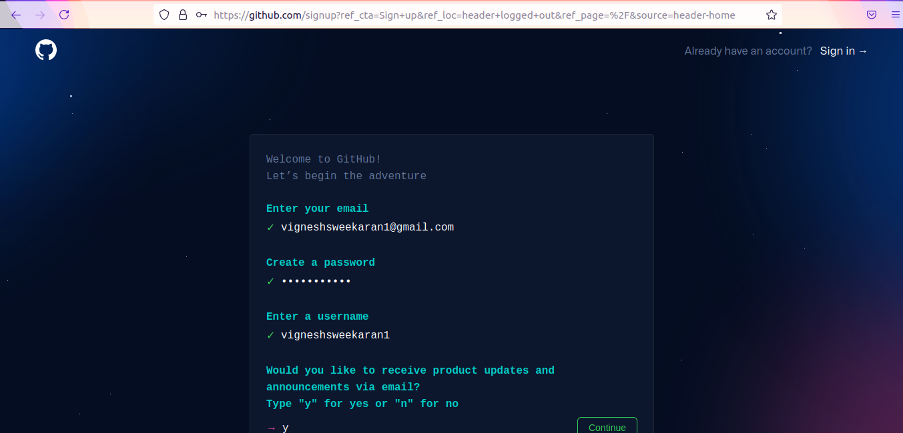
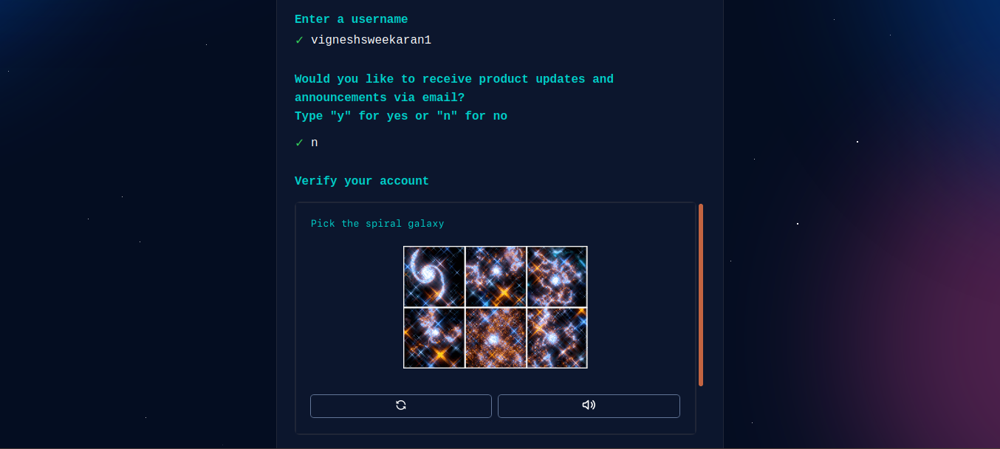
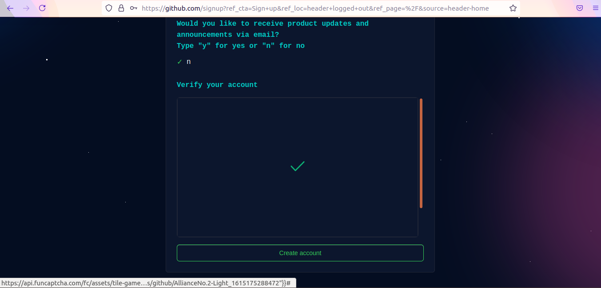

# How to Create a GitHub Account

← [Back to Git](../../index.md)

---

## 🤔 What is Git?

**Git** stands for **Global Information Tracker**.

It is a powerful distributed version control system used to track changes in source code during software development.

### Git Architecture

The core model of Git involves **Pull** and **Push** operations:

1. **Developer 1** creates `file-1` locally and **pushes** it to the **Remote Repository**.
2. **Developer 2** and **Developer 3** can **pull** `file-1` to their local machines.
3. If **Developer 3** creates `file-3` and pushes it, others can pull it too.

---

## 🐙 Git vs GitHub

| Feature | Git | GitHub |
| :--- | :--- | :--- |
| **Type** | Command-line Tool | Cloud Platform |
| **Purpose** | Version Control System (VCS) | Hosting Service for Git Repositories |
| **Installation** | Installed locally on your computer | Accessed via web browser ([github.com](https://github.com)) |

---

## 📝 Create a GitHub Account

Follow these steps to create your free GitHub account.

### 1. Go to GitHub
Visit [https://github.com](https://github.com).

### 2. Sign Up
Click on **Sign up** at the top right corner.

### 3. Enter Details
Enter your **email address**, create a **password**, and choose a **username**. Verify the puzzle to prove you are human.

### 4. Verify Email
Click on **Create account**. You will receive a verification code or link in your email inbox. Enter it to complete the process.

🎉 **Congratulations!** You now have a GitHub account.

---

## 🎥 **Watch on YouTube:**
[{: style="max-width:100%; height:auto"}](https://www.youtube.com/watch?v=kvqHSStbgfU)

---

## 🧠 Quick Quiz — GitHub

<quiz>
What is the main difference between Git and GitHub?
- [ ] They are the same thing.
- [x] Git is a tool installed locally; GitHub is a cloud hosting service for Git repositories.
- [ ] GitHub is the command line tool.
- [ ] Git requires internet; GitHub works offline.

Git is the version control engine that runs on your computer, while GitHub is a website that hosts your Git repositories online.
</quiz>

---

### 📝 Want More Practice?

👉 **[Test your knowledge - Take the Git Basics Quiz](../../../quiz/git/basics/index.md)**

---


