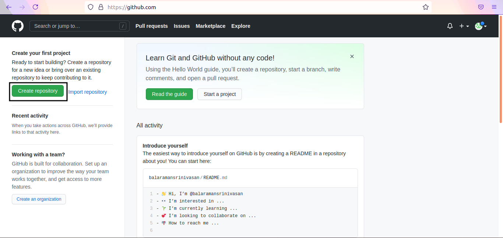
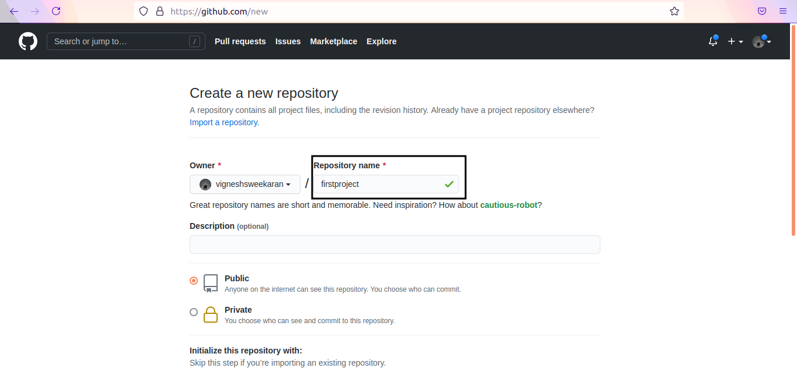
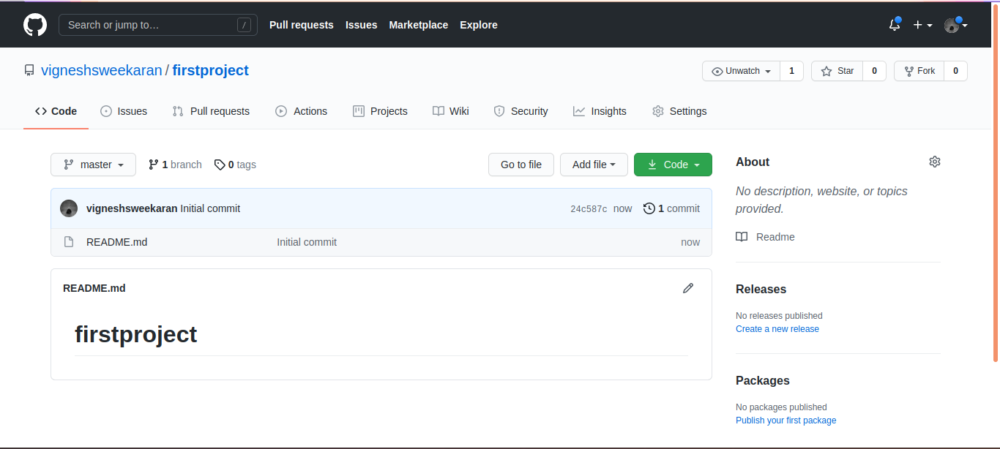

### How to create Github public repository

After login, click on `Create repository` to create a first repository in Github.

In Github, the repository is used to store the source code files.

Enter the repository name eg: `firstproject` and select the repository type as `public` or `private`

`public` --> Anybody can see the repository and its files from github. Anybody can clone you project.

`private` --> The repository and its files are only visible to you. Need username and password for cloning.

Click the check box `Add a README file`

`README.md` file is used to tell about your repository, like for what purpose you have created this reposirory.

The content in your `README.md` will be shown in your repository home page.

Now you have only one file `README.md` in your repository

### Youtube

