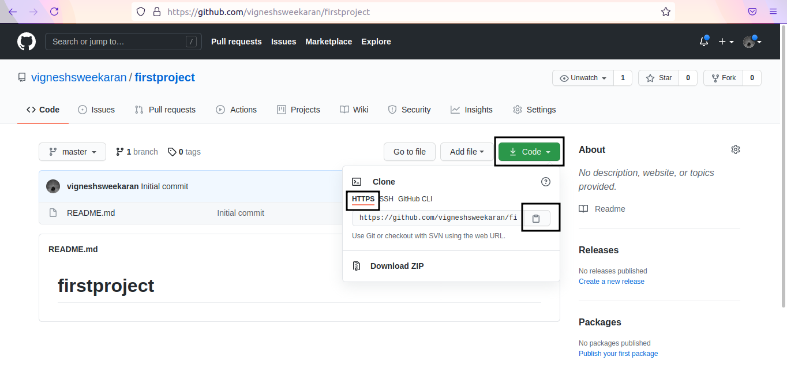
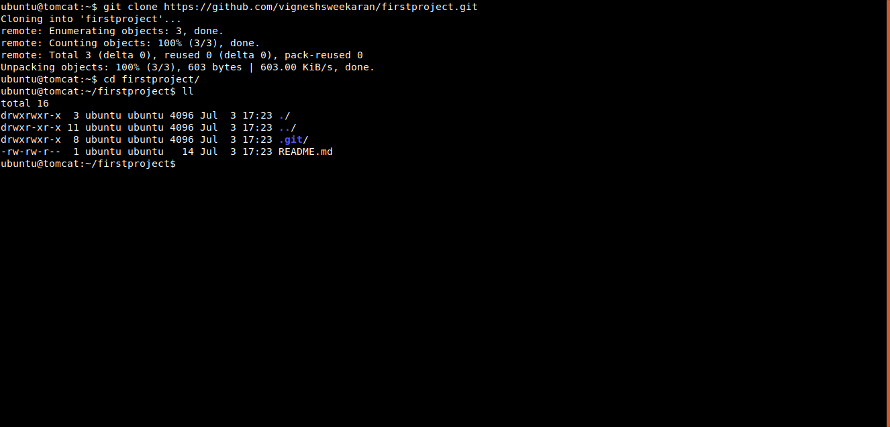

# How to Clone a Repository

← [Back to Git](../../index.md)

---

## 📥 How to Clone a Repository

Cloning creates a local copy of a remote repository on your machine.

### 1. Get the URL
Go to your repository on GitHub.
Click on **Code** -> Select **HTTPS** -> Copy the URL.



### 2. Run Git Clone
Open your terminal and use the `git clone` command followed by the URL:

```bash
git clone https://github.com/vigneshsweekaran/firstproject.git
```



You have now successfully cloned the repository to your local computer.

---

## 📺 Video Tutorial

[{: style="width:400px"}](https://www.youtube.com/watch?v=kvqHSStbgfU)

---

## 🧠 Quick Quiz — Cloning

<quiz>
What does `git clone` do?
- [ ] Deletes a repository.
- [x] Downloads a copy of a remote repository to your local machine.
- [ ] Uploads your local files to GitHub.
- [ ] Creates a new empty repository.

Cloning creates a full local copy of the repo history and files.
</quiz>

---

### 📝 Want More Practice?

👉 **[Start Git Intermediate Quiz (20 Questions)](../../../quiz/git/intermediate/index.md)**

---


