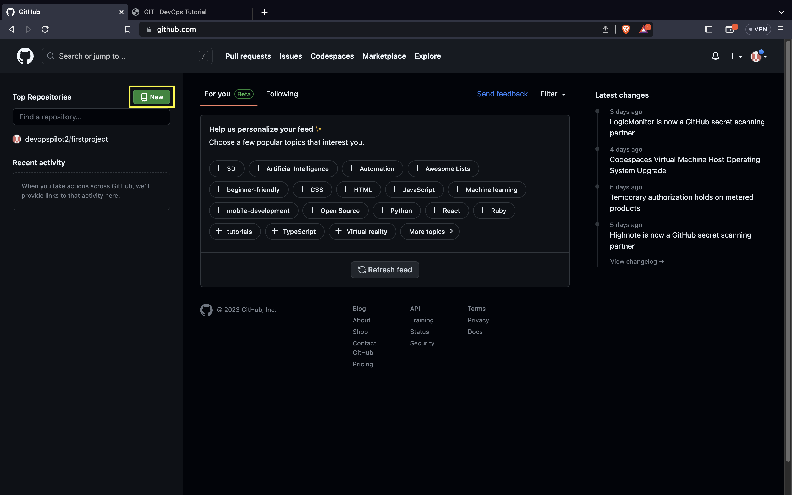
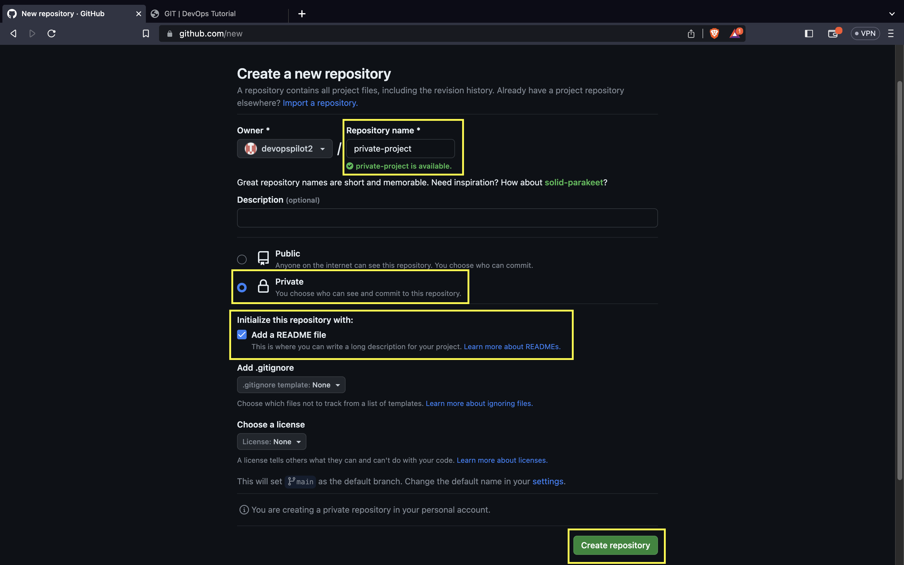
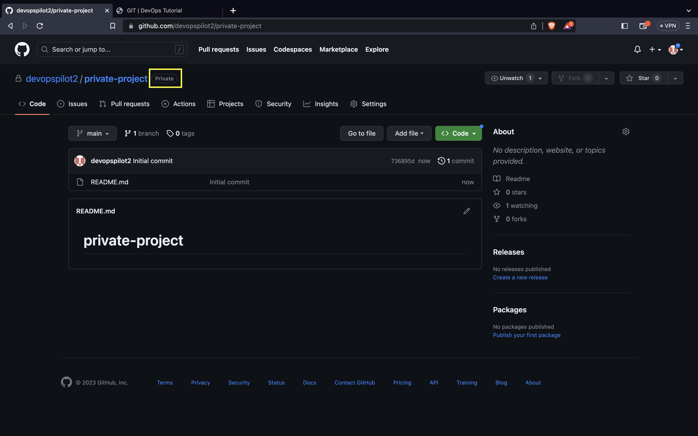

# How to Create a Private Repository

[← Back to Git](../../)

### How to create private repository

Click on `new`

Give the repository name and click the `private` check box and `Add a Readme file` check box

Click on `Create repository`

Next to the repository name, you can see its mentioned as `private`

For private repository, you need to authenticate to clone the repo.

There are two types of authentication,

- Using Personal Access Token(PAT)

- Using SSH public/private keys

### How to authenticate using Personal Access Token(PAT)

Lets generate the token

### Remote vs local repo

### Youtube

[{: style="width:400px"}](https://www.youtube.com/watch?v=LvlXQA5V1n0)


