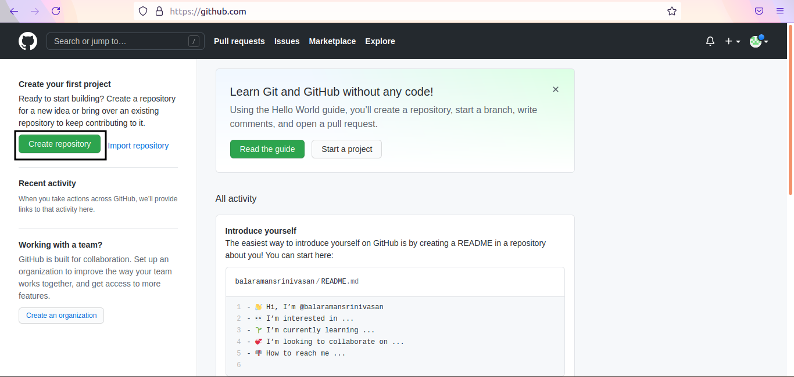
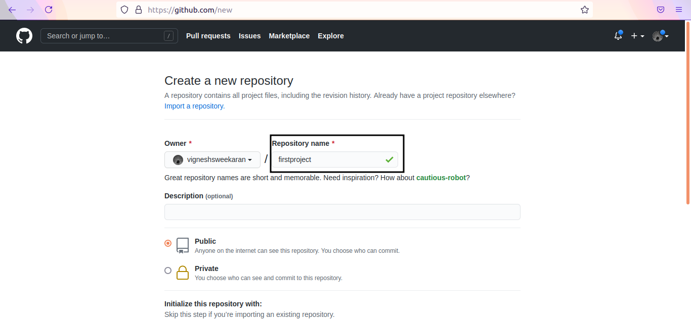
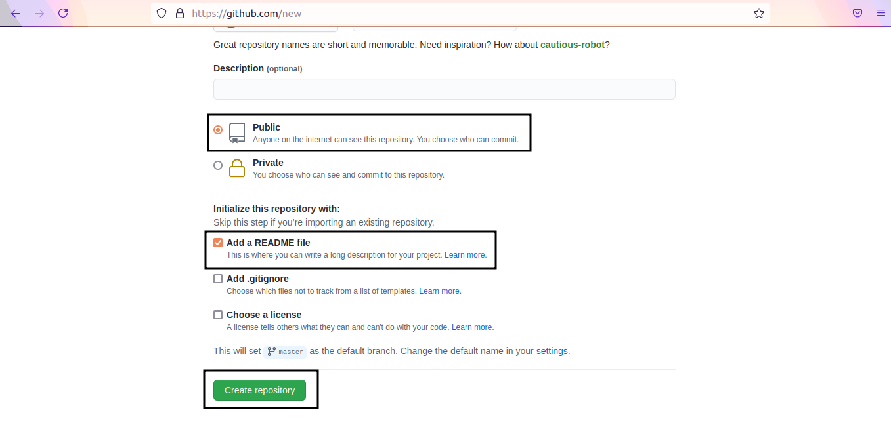
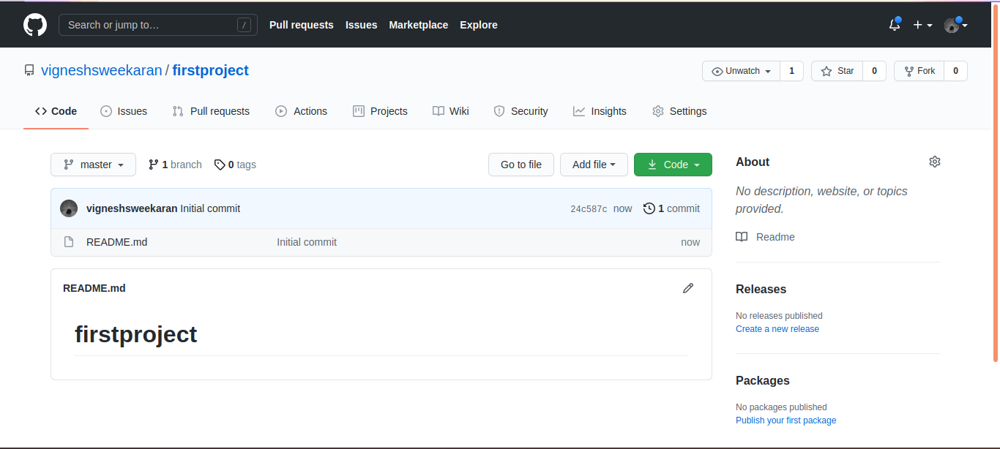

# How to Create a Public Repository

← [Back to Git](../../index.md)

---

## 📂 Create a Public Repository

A public repository is visible to everyone on the internet.

### 1. Create New Repo
Log in to GitHub and click on **New** (or "Create repository").

### 2. Configure Details
1. Enter a unique **Repository name** (e.g., `firstproject`).
2. Select **Public**.
    - **Public**: Visible to anyone. Anyone can clone it.
    - **Private**: Visible only to you and collaborators.

### 3. Initialize
Check **Add a README file**.
*A README file describes your project and is the first thing visitors see.*

### 4. Create
Click **Create repository**.
Your repository is now live! The `README.md` file will be displayed on the home page.

---

## 🎥 **Watch on YouTube:**
[{: style="max-width:100%; height:auto"}](https://www.youtube.com/watch?v=kvqHSStbgfU)

---

## 🧠 Quick Quiz — Public Repos

<quiz>
Which file is commonly used to describe your project on the repository home page?
- [ ] INDEX.html
- [ ] REPO.txt
- [x] README.md
- [ ] CONFIG.json

The `README.md` file is automatically rendered on the main page of GitHub repositories.
</quiz>

---

### 📝 Want More Practice?

👉 **[Start Git Intermediate Quiz (20 Questions)](../../../quiz/git/intermediate/index.md)**

---


