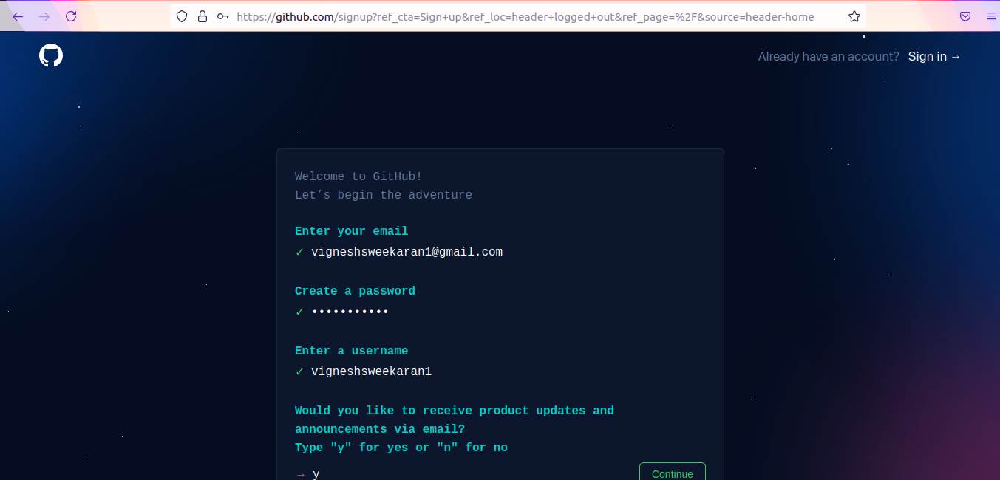
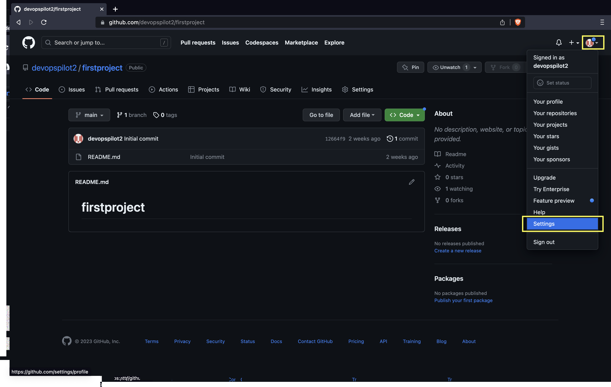
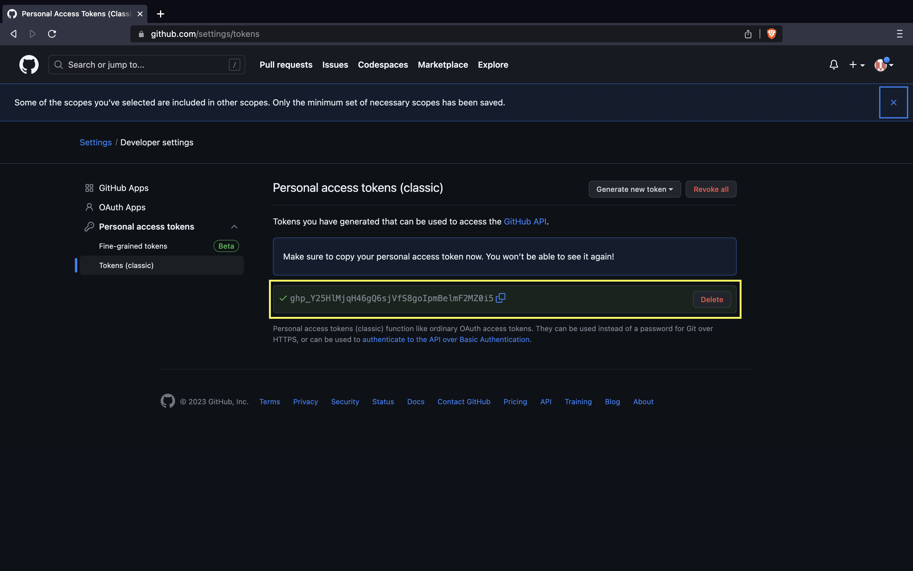
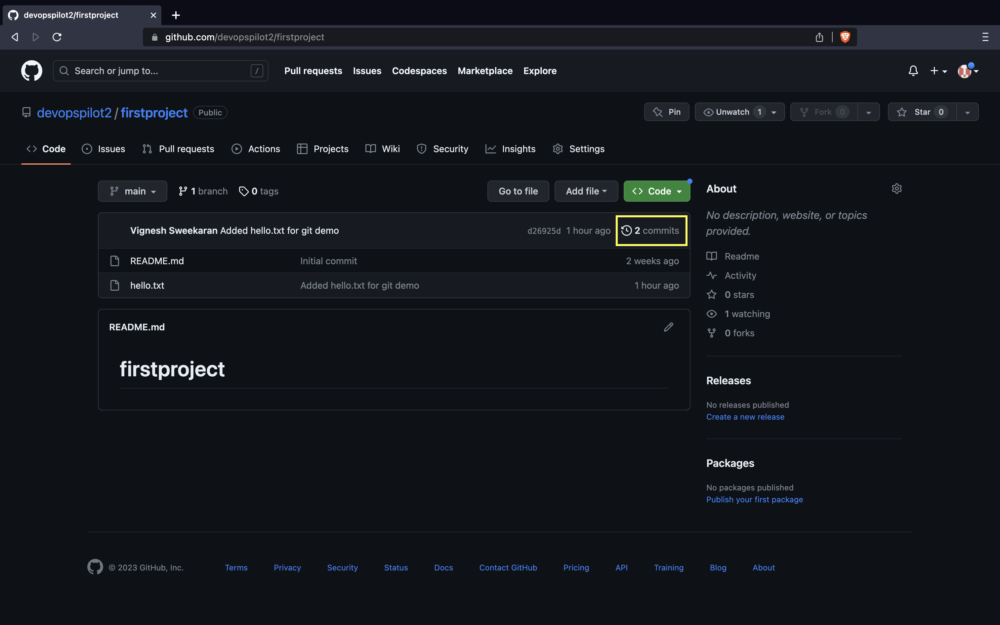
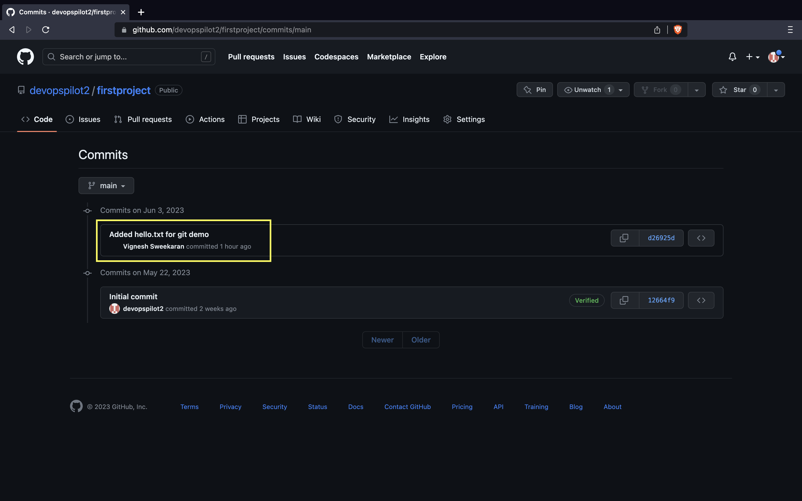

← [Back to Git](../../index.md)

---

## 📺 Git Overview - Part 1

This comprehensive guide covers the basics of Git and GitHub, from installation to your first push.

[{: style="width:400px"}](https://www.youtube.com/watch?v=kvqHSStbgfU)

### 📌 Topics Covered
* What is Git
* How to create GitHub account
* How to create GitHub public repository
* How to install Git in Linux operating system (Ubuntu)
* How to clone (download) the repository from GitHub to local computer

---

## 🤔 What is Git?

**Git** (Global Information Tracker) is a powerful and widely-used version control system commonly used for software development and other collaborative projects.


The model here is **pull** and **push**.

Let's say, `Developer 1` created a file `file-1` in their local computer and pushed that file to the **Remote repository**.

Now `Developer 2` and `3` can pull `file-1` from the remote repository to their local computers.

Similarly, if `Developer 3` created a file `file-3` locally and pushed it to the **Remote repository**, other developers can get `file-3` by pulling.

---

## 📝 Create GitHub Account

**GitHub** is a cloud platform for hosting Git repositories. **Git** is the command line utility installed on your computer.

1. Go to [https://github.com](https://github.com).
2. Click on **Signup**.


3. Enter your `email id`, `password`, `username`, verify the puzzle, and click on **Create account**.
4. You will receive a verification mail with a link in your inbox.




5. Click on the link received in your mail to complete the email verification. Once completed, login to [https://github.com](https://github.com).

---

## 📂 Create Public Repository

After login, click on **Create repository** to create your first repository in GitHub.


1. Enter the repository name e.g., `firstproject`.
2. Select the repository type as **Public** or **Private**.
    * **Public**: Anybody can see the repository and clone your project.
    * **Private**: Only visible to you and collaborators.


3. Check the box **Add a README file**.
   * `README.md` is used to describe your repository and its purpose.


4. Click **Create repository**. The content in your `README.md` will be shown on your repository home page.


---

## 🐧 Install Git on Linux

### Ubuntu
Run the following command to install git in Ubuntu:
```bash
sudo apt update
sudo apt install git -y
```

### CentOS
Run the following command to install git in CentOS:
```bash
sudo yum update -y
sudo yum install git -y
```

### Verify Version
```bash
git --version
```

---

## 📥 Clone Repository

Go to your repository -> click on **Code** -> make sure **HTTPS** is selected -> copy the URL.


In your terminal, type `git clone` followed by your copied URL:

```bash
git clone https://github.com/vigneshsweekaran/firstproject.git
```


Now you have successfully cloned the repository to your local computer.

---

## 💻 Making Changes & Pushing

### 1. Clone the repository
Let's clone the repository (if not already done) and see the output:

```bash
ubuntu@manikandan:~$ git clone https://github.com/devopspilot2/firstproject.git
Cloning into 'firstproject'...
remote: Enumerating objects: 3, done.
remote: Counting objects: 100% (3/3), done.
remote: Total 3 (delta 0), reused 0 (delta 0), pack-reused 0
Receiving objects: 100% (3/3), done.
ubuntu@manikandan:~$ cd firstproject/
ubuntu@manikandan:~/firstproject$ ll
total 4
-rw-rw-r-- 1 ubuntu ubuntu 14 Jun  2 23:41 README.md
```

In this `firstproject` repository we have only the `README.md` file.

### 2. Create a new file
Let's create a new file `hello.txt`:

```bash
ubuntu@manikandan:~/firstproject$ echo "Created for git demo" > hello.txt
ubuntu@manikandan:~/firstproject$ ll
total 8
-rw-rw-r-- 1 ubuntu ubuntu 14 Jun  2 23:41 README.md
-rw-rw-r-- 1 ubuntu ubuntu 21 Jun  2 23:42 hello.txt
ubuntu@manikandan:~/firstproject$ cat hello.txt 
Created for git demo
```

### 3. Check Git Status
Run `git status` to check the status of the file:

```bash
ubuntu@manikandan:~/firstproject$ git status
On branch main
Your branch is up to date with 'origin/main'.

Untracked files:
  (use "git add <file>..." to include in what will be committed)
        hello.txt

nothing added to commit but untracked files present (use "git add" to track)
```

It lists `hello.txt` under **Untracked files**, which means Git is not tracking this file yet. It suggests using `git add`.

### 4. Track the file (Git Add)
Run `git add <FILE_NAME>` to add the file to the Git index/staging area:

```bash
ubuntu@manikandan:~/firstproject$ git add hello.txt 
ubuntu@manikandan:~/firstproject$ git status
On branch main
Your branch is up to date with 'origin/main'.

Changes to be committed:
  (use "git restore --staged <file>..." to unstage)
        new file:   hello.txt
```

Now it is tracked and ready to be committed.

### 5. Commit Changes
Run `git commit -m "message"` to save the changes to the local repository.

```bash
ubuntu@manikandan:~/firstproject$ git commit -m "Added hello.txt for git demo"
Author identity unknown

*** Please tell me who you are.

Run

  git config --global user.email "you@example.com"
  git config --global user.name "Your Name"

to set your account's default identity.
Omit --global to set the identity only in this repository.

fatal: unable to auto-detect email address (got 'ubuntu@manikandan.(none)')
```

**The command has failed** because the author identity is not configured. Git needs to know who is making the changes.

### 6. Configure Identity
This is a one-time configuration per server (stored in `~/.gitconfig`).

```bash
ubuntu@manikandan:~/firstproject$ git config --global user.email "devopspilot2@gmail.com"
ubuntu@manikandan:~/firstproject$ git config --global user.name "Vignesh Sweekaran"
```

Verify the configuration:
```bash
ubuntu@manikandan:~/firstproject$ git config -l --global
user.email=devopspilot2@gmail.com
user.name=Vignesh Sweekaran
```

### 7. Retry Commit
Now that identity is configured, run the commit command again:

```bash
ubuntu@manikandan:~/firstproject$ git commit -m "Added hello.txt for git demo"
[main d26925d] Added hello.txt for git demo
 1 file changed, 1 insertion(+)
 create mode 100644 hello.txt
```

This has successfully committed the changes to the local repository.

### 8. View History
To see the commits, run `git log`:

```bash
ubuntu@manikandan:~/firstproject$ git log
commit d26925de77c593d4ac7dafaa07923d2f4a74f55a (HEAD -> main)
Author: Vignesh Sweekaran <devopspilot2@gmail.com>
Date:   Sat Jun 3 00:00:53 2023 +0000

    Added hello.txt for git demo

commit 12664f9c74d52f466c2091515e54d2fa2a184647 (origin/main, origin/HEAD)
Author: devopspilot2 <134018546+devopspilot2@users.noreply.github.com>
Date:   Mon May 22 18:26:49 2023 +0800

    Initial commit
```

### 9. Push to GitHub
Now it is time to push the changes to the Remote Repository (GitHub).

Run `git push origin main`. It will ask for username and password.

> **Note**: You cannot use your GitHub account password. You have to generate a **Personal Access Token (PAT)**.

**Generating a PAT:**
1. Click your profile photo -> **Settings**.



2. Click on **Developer settings**.


3. Click on **Personal access tokens** and then **Tokens (classic)**.


4. Click on **Generate token** and then **Generate new token (classic)**.


5. Name the token and check the `repo` box.


6. Click **Generate token**.


7. The Personal access token(PAT) is shown only one time. Copy and save in secure place.



8. Now, use the PAT as the password:

```bash
ubuntu@manikandan:~/firstproject$ git push origin main
Username for 'https://github.com': devopspilot2
Password for 'https://devopspilot2@github.com': 
Enumerating objects: 4, done.
Counting objects: 100% (4/4), done.
Delta compression using up to 2 threads
Compressing objects: 100% (2/2), done.
Writing objects: 100% (3/3), 322 bytes | 322.00 KiB/s, done.
Total 3 (delta 0), reused 0 (delta 0), pack-reused 0
To https://github.com/devopspilot2/firstproject.git
   12664f9..d26925d  main -> main
```

The `hello.txt` is now pushed to GitHub!


---

## 📜 View Commits in GitHub

Go to your `firstproject` repository and click on **Commits**.



Here you can see all the commits pushed:



After clicking on one commit, you can see the changes made in the commit:


---

## 🧠 Quick Quiz — Workflow

<quiz>
What is the correct order of commands to save changes to GitHub?
- [ ] git push -> git commit -> git add
- [x] git add -> git commit -> git push
- [ ] git commit -> git add -> git push
- [ ] git add -> git push -> git commit

You first `add` to staging, then `commit` to local history, then `push` to remote.
</quiz>

---

### 📝 Want More Practice?

👉 **[Start Git Beginner Quiz (20 Questions)](../../../quiz/git/beginner/index.md)**

---

