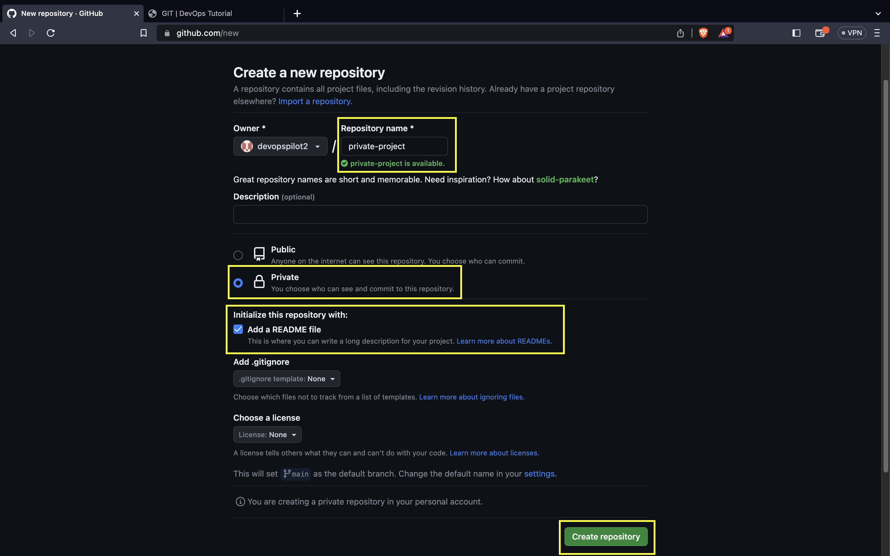

← [Back to Git](../../index.md)

---

## 📺 Git Overview - Part 2

This section covers private repositories and authentication.

[{: style="width:400px"}](https://www.youtube.com/watch?v=LvlXQA5V1n0)

---

## 🔒 Create Private Repository

1. Click on **New**.

2. Give the repository name and check the **Private** box and **Add a README file** box.
3. Click on **Create repository**.

Next to the repository name, you can see it is mentioned as `Private`.

For private repositories, you need to authenticate to clone the repo.

There are two types of authentication:
* Using Personal Access Token (PAT)
* Using SSH public/private keys

---

## 🔑 Authentication

### How to authenticate using Personal Access Token (PAT)
Let's generate the token (as shown in Part 1).

### Remote vs Local Repo

---

## 🧠 Quick Quiz — Authentication

<quiz>
Why do you need a PAT (Personal Access Token) for Git?
- [ ] To pay for GitHub features.
- [x] Because GitHub passwords are no longer supported for Git HTTPS operations.
- [ ] It makes git run faster.
- [ ] It is required only for public repos.

GitHub removed password authentication for Git over HTTPS in 2021, requiring tokens instead.
</quiz>

---

### 📝 Want More Practice?

👉 **[Start Git Beginner Quiz (20 Questions)](../../../quiz/git/beginner/index.md)**

---

