← [Back to Git](../../index.md)

---

## ⬆️ How to Push Changes to GitHub

Pushing transfers commits from your local repository to a remote repository.

### 1. Clone & Prepare
Let's clone the repository:

```bash
ubuntu@manikandan:~$ git clone https://github.com/devopspilot2/firstproject.git
Cloning into 'firstproject'...
remote: Enumerating objects: 3, done.
remote: Counting objects: 100% (3/3), done.
remote: Total 3 (delta 0), reused 0 (delta 0), pack-reused 0
Receiving objects: 100% (3/3), done.
ubuntu@manikandan:~$ cd firstproject/
ubuntu@manikandan:~/firstproject$ ll
total 4
-rw-rw-r-- 1 ubuntu ubuntu 14 Jun  2 23:41 README.md
```

In this `firstproject` repository we have only `README.md` file.

### 2. Make Changes
Let's create a new file `hello.txt`:

```bash
ubuntu@manikandan:~/firstproject$ echo "Created for git demo" > hello.txt
ubuntu@manikandan:~/firstproject$ ll
total 8
-rw-rw-r-- 1 ubuntu ubuntu 14 Jun  2 23:41 README.md
-rw-rw-r-- 1 ubuntu ubuntu 21 Jun  2 23:42 hello.txt
ubuntu@manikandan:~/firstproject$ cat hello.txt 
Created for git demo
```

### 3. Check Status
Run `git status` to check the status of the file:

```bash
ubuntu@manikandan:~/firstproject$ git status
On branch main
Your branch is up to date with 'origin/main'.

Untracked files:
  (use "git add <file>..." to include in what will be committed)
        hello.txt

nothing added to commit but untracked files present (use "git add" to track)
```

In the untracked files, its showing the newly created file `hello.txt`.

### 4. Stage & Commit
Run `git add` to track the file:

```bash
ubuntu@manikandan:~/firstproject$ git add hello.txt 
ubuntu@manikandan:~/firstproject$ git status
On branch main
Your branch is up to date with 'origin/main'.

Changes to be committed:
  (use "git restore --staged <file>..." to unstage)
        new file:   hello.txt
```

Now commit the file:

```bash
ubuntu@manikandan:~/firstproject$ git commit -m "Added hello.txt for git demo"
Author identity unknown

*** Please tell me who you are.

Run

  git config --global user.email "you@example.com"
  git config --global user.name "Your Name"

to set your account's default identity.
Omit --global to set the identity only in this repository.

fatal: unable to auto-detect email address (got 'ubuntu@manikandan.(none)')
```

The command has failed, since the author name and email id is not configured. This is a one-time activity.

**Configure Identity:**

```bash
ubuntu@manikandan:~/firstproject$ git config --global user.email "devopspilot2@gmail.com"
ubuntu@manikandan:~/firstproject$ git config --global user.name "Vignesh Sweekaran"
```

Verify configuration:

```bash
ubuntu@manikandan:~/firstproject$ git config -l --global
user.email=devopspilot2@gmail.com
user.name=Vignesh Sweekaran
```

**Retry Commit:**

```bash
ubuntu@manikandan:~/firstproject$ git commit -m "Added hello.txt for git demo"
[main d26925d] Added hello.txt for git demo
 1 file changed, 1 insertion(+)
 create mode 100644 hello.txt
```

### 5. Push to Remote
Run `git push origin main`. It will ask for username and password.

> **Note**: You must use a **Personal Access Token (PAT)** as the password.

**Generating a PAT:**
1. Click your profile photo -> **Settings**.

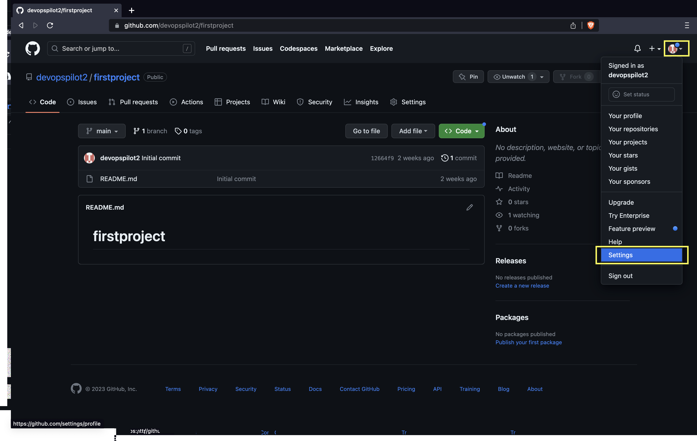

2. Click on **Developer settings**.

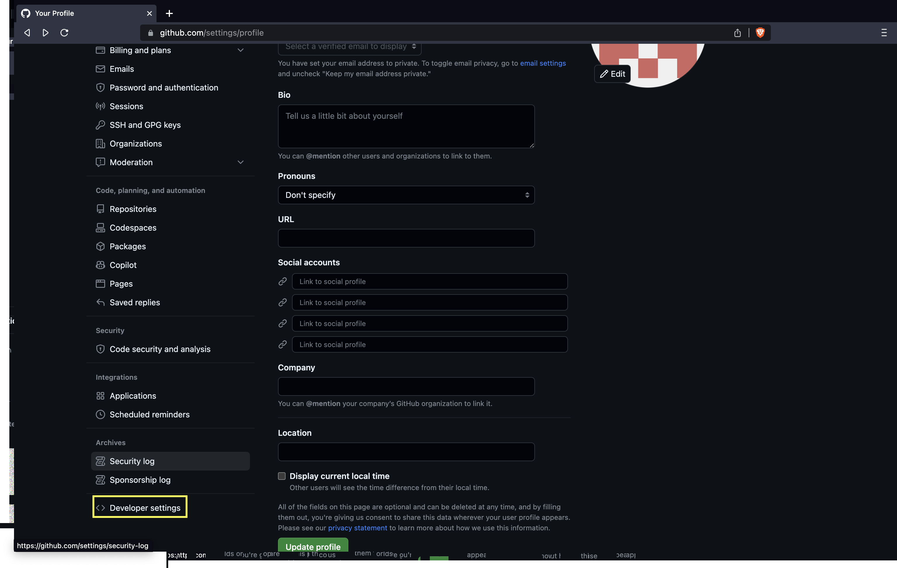

3. Click on **Personal access tokens** and then **Tokens (classic)**.

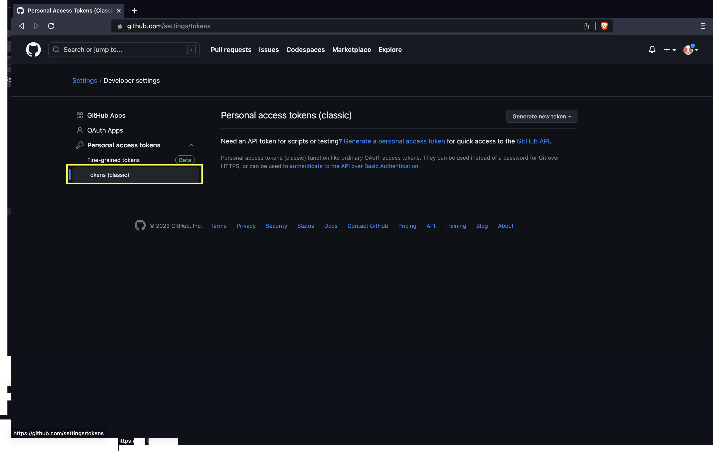

4. Click on **Generate token** and then **Generate new token (classic)**.

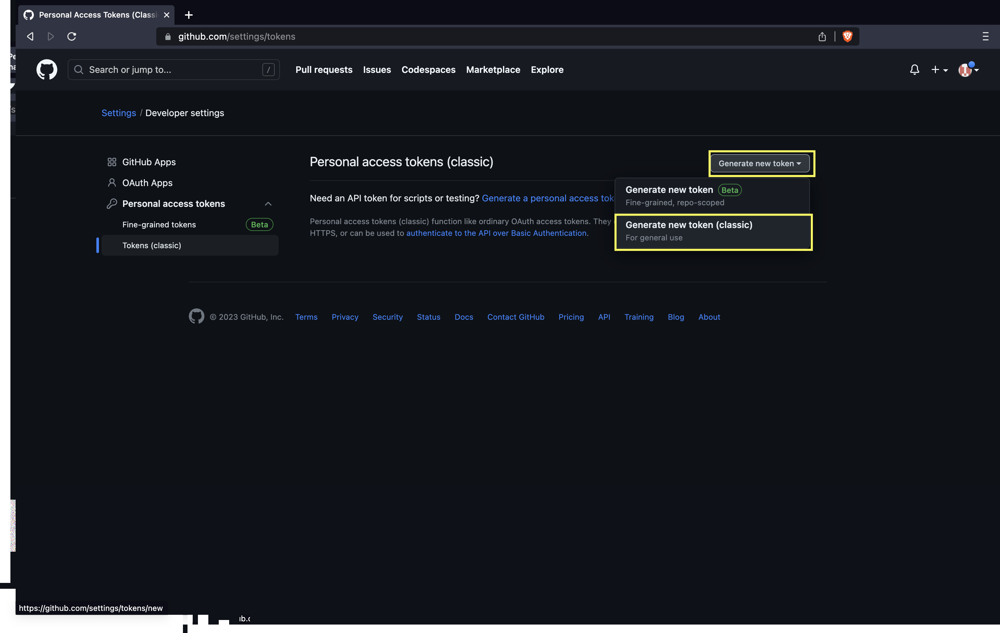

5. Name the token and check the `repo` box.

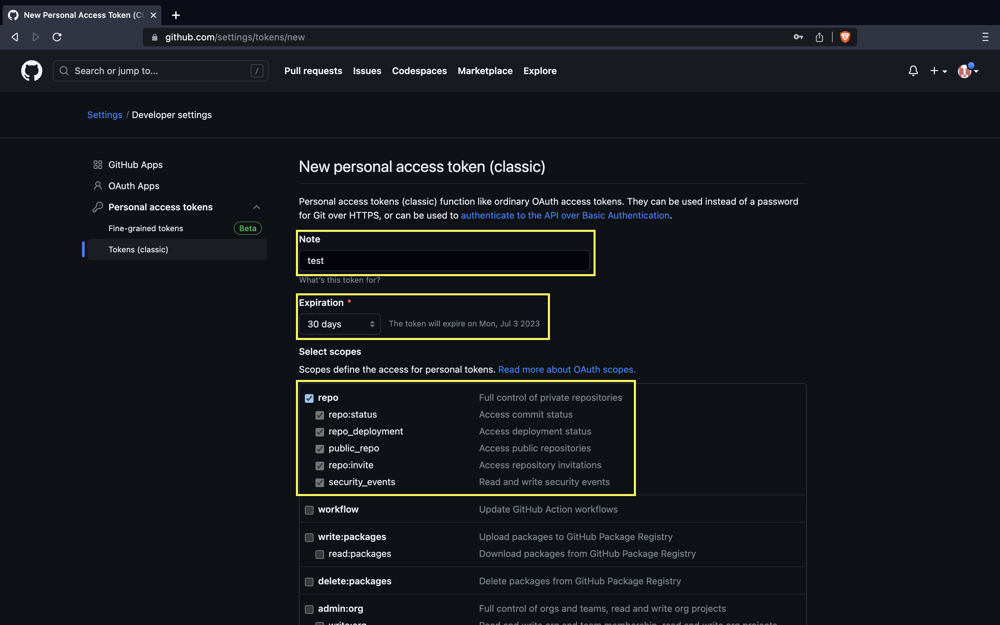

6. Click **Generate token**.

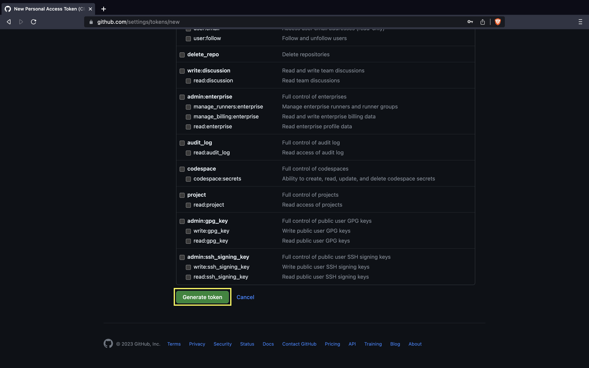

7. The Personal access token(PAT) is shown only one time. Copy and save in secure place.

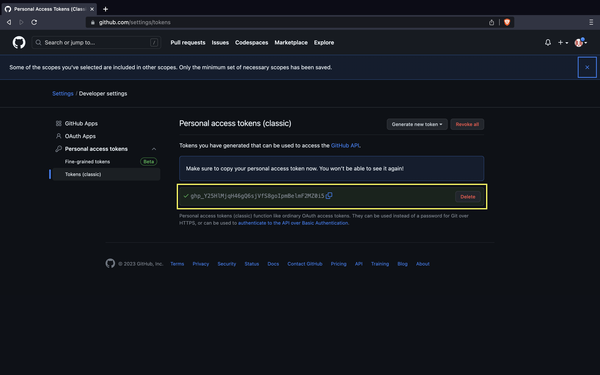

Now, use the PAT as the password:

```bash
ubuntu@manikandan:~/firstproject$ git push origin main
Username for 'https://github.com': devopspilot2
Password for 'https://devopspilot2@github.com': 
Enumerating objects: 4, done.
Counting objects: 100% (4/4), done.
Delta compression using up to 2 threads
Compressing objects: 100% (2/2), done.
Writing objects: 100% (3/3), 322 bytes | 322.00 KiB/s, done.
Total 3 (delta 0), reused 0 (delta 0), pack-reused 0
To https://github.com/devopspilot2/firstproject.git
   12664f9..d26925d  main -> main
```

The `hello.txt` is now pushed to GitHub!

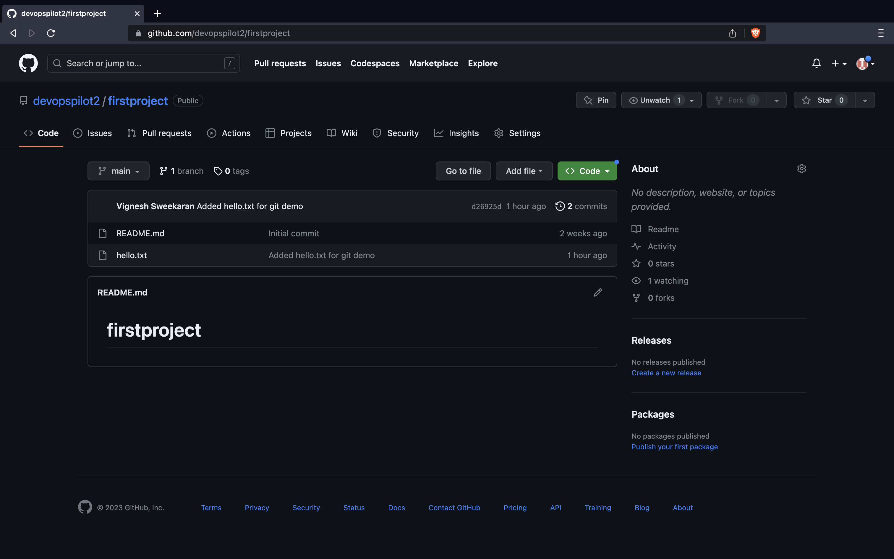

---

## 📜 Verify on GitHub

Go to your repository on GitHub and click **Commits** to see your changes.

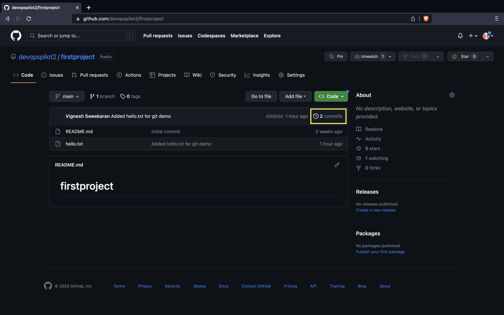

Here you can see all the commits pushed:

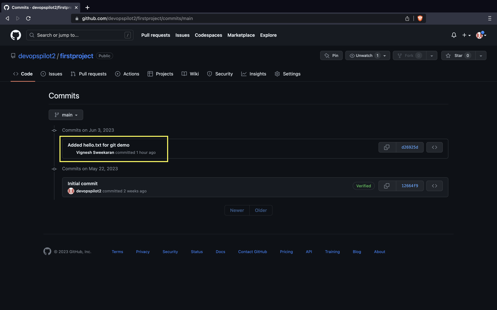

After clicking on one commit, you can see the changes made in the commit:

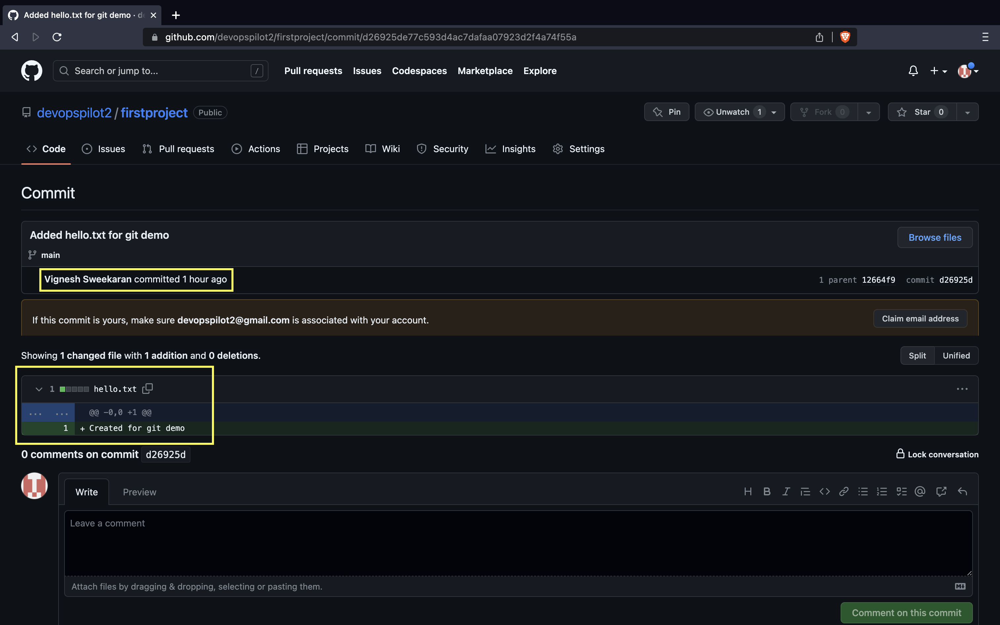

---

## 🧠 Quick Quiz — Pushing

<quiz>
What should you use as the password when pushing to GitHub via HTTPS?
- [ ] Your GitHub account password.
- [ ] Your SSH key passphrase.
- [x] A Personal Access Token (PAT).
- [ ] No password is required.

GitHub deprecated account passwords for command-line Git authentication; you must use a PAT.
</quiz>

---

### 📝 Want More Practice?

👉 **[Start Git Intermediate Quiz (20 Questions)](../../../quiz/git/intermediate/index.md)**

---


