In linux servers, we can install only one version of the tool at a time eg: we can install only maven 3.6 version and we cannot have both maven 3.6 and 3.7 version in same server.

By configuring **Global Tool configuration**, we can have multiple version of maven, nodejs, gradle, java and ant

#### How to configure multiple versions of maven

From Jenkins dashboard, click on **Manage Jenkins**


Click on **Global Tool Configurations**

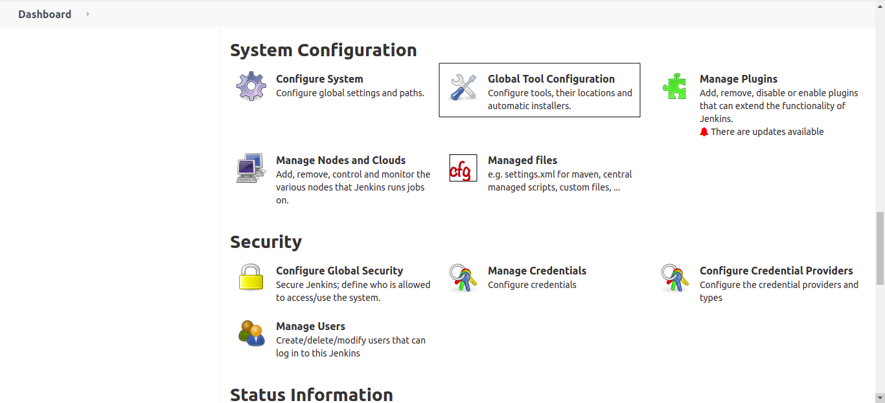

Click on **Maven installations..**


Scroll down and click on **Add Maven** and give unique name in **Name** feild and select the maven version 3.6.3 from the dropdown

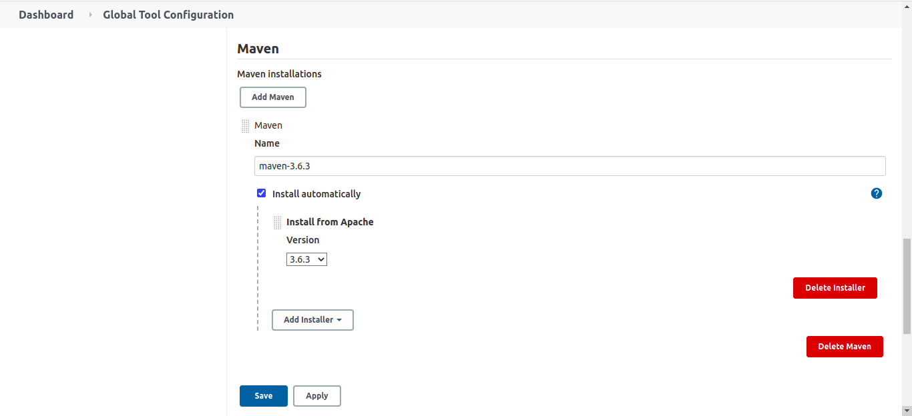

Now click on **Add Maven** once again

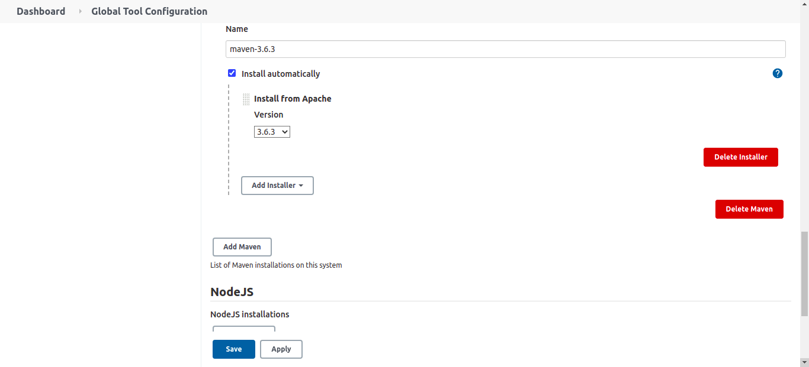

Add the name and select the version 3.8.1 and click on save

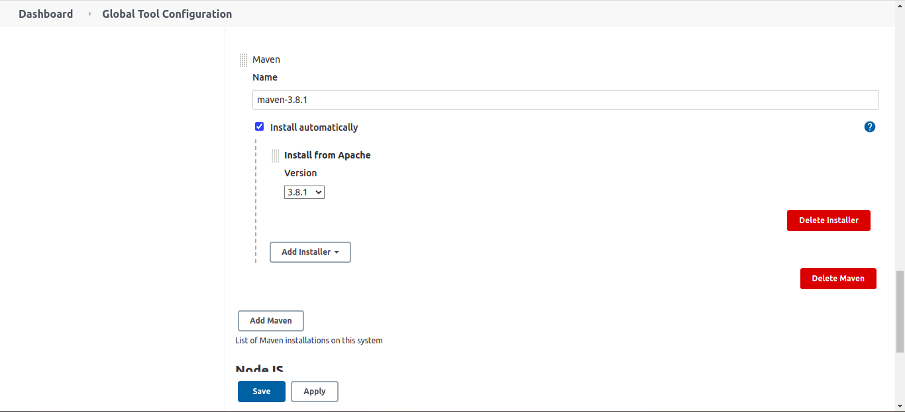

#### How to define maven in Jenkinsfile

```groovy
tools {
    maven 'maven-3.6.3'
}
```

**maven-3.6.3** is the unique name which we have given in the global tool configurations.

When we use maven for first time by referring to this name and run the job, jenkins will automatically download the maven tar file, extract and save it in **/var/lib/jenkins/tools/** folder

From the next build it will use the maven from that folder, it won't download everytime

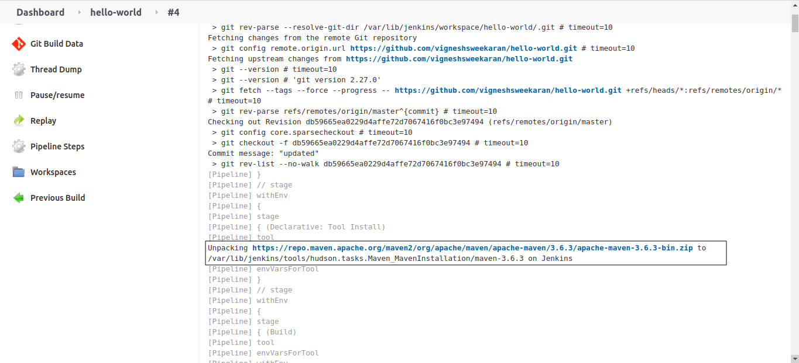

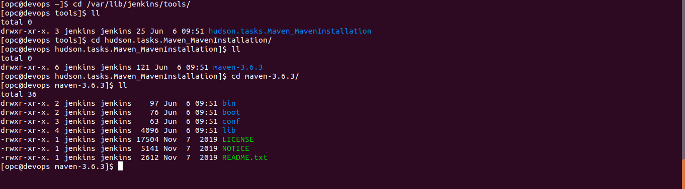

#### How to configure multiple versions of nodejs

In **Global Tool Configuration** scroll down click on **NodeJS installations..**

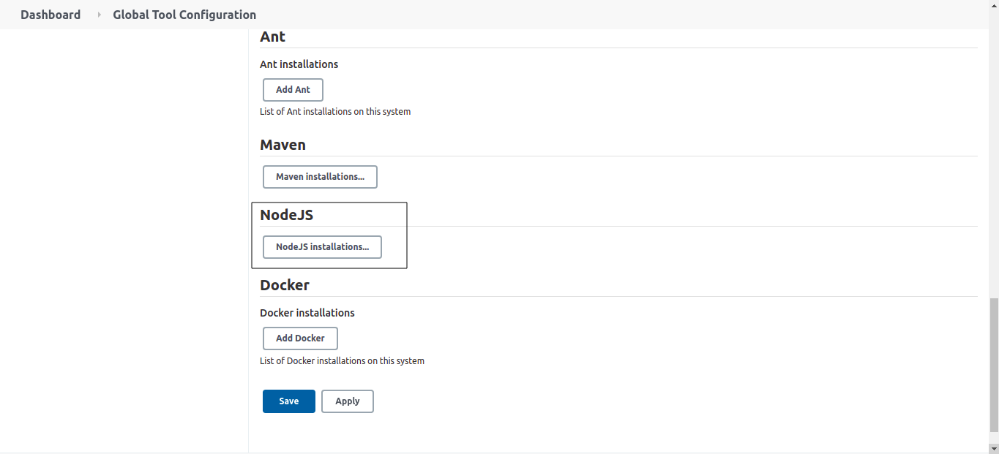

Click on **Add NodeJs** add the name and selcet the version 10.0.0(As per your requirements)

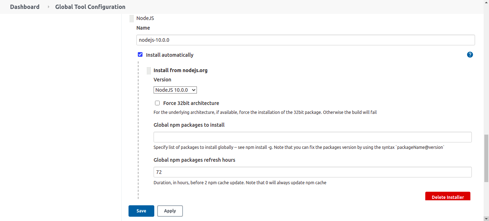

Now click on **Add NodeJs** once again, give the name and select the required version and click on save

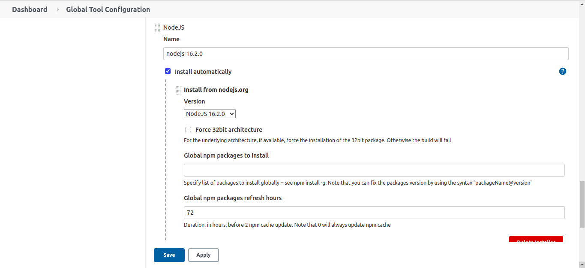

#### How to use nodejs in Jenkinsfile

```groovy
tools {
    nodejs "nodejs-10.0.0"
}
```

**nodejs-10.0.0** is the unique name which we have given in the global tool configurations.

When we use nodejs for first time by referring to this name and run the job, jenkins will automatically download the mnodejs tar file, extract and save it in **/var/lib/jenkins/tools/** folder

From the next build it will use the nodejs from that folder, it won't download everytime

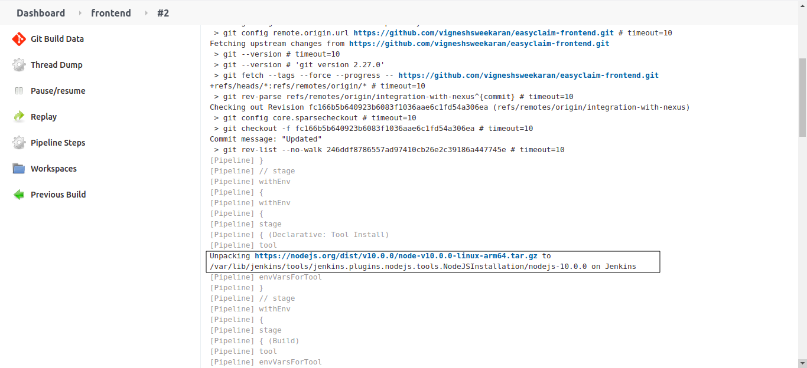

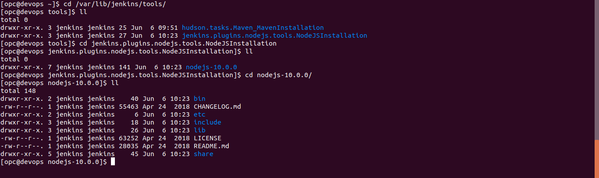

---

## Important Tips

> [!TIP]
> **Name Consistency**: The **Name** you assign to a tool in Global Configuration (e.g., `maven-3.6.3`) is the **KEY**. You must use this exact string in your Jenkinsfile's `tools` block. A typo here will cause the pipeline to fail with a "Tool not found" error.

> [!NOTE]
> **Disk Space**: Each tool version is downloaded to every agent that runs a job requiring it. If you have many agents and many tool versions, this can consume significant disk space over time.

## 🧠 Quick Quiz — Global Tools

<quiz>
What happens when you define a tool (like `maven 'maven-3.6.3'`) in the `tools` block of a Jenkinsfile?
- [ ] Jenkins checks if Maven is installed on the agent's OS (e.g., `/usr/bin/maven`).
- [x] Jenkins looks up the tool configuration by name, installs it (if missing), and adds it to the PATH for that build.
- [ ] Jenkins ignores it if the agent is a Docker container.
- [ ] Jenkins upgrades the controller's Maven version.

The `tools` block is a powerful feature that allows Jenkins to auto-install and configure specific tool versions for a build, regardless of what is installed globally on the agent's OS.
</quiz>
