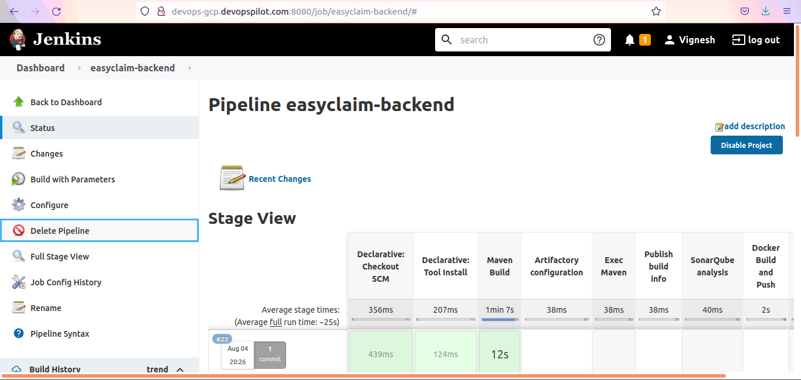
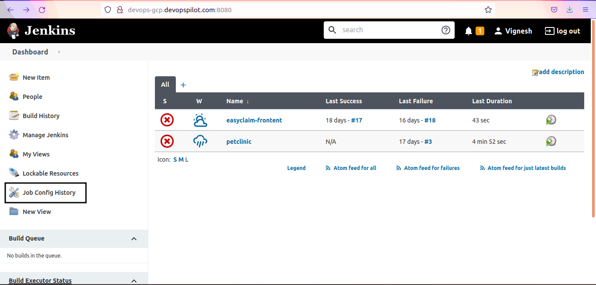
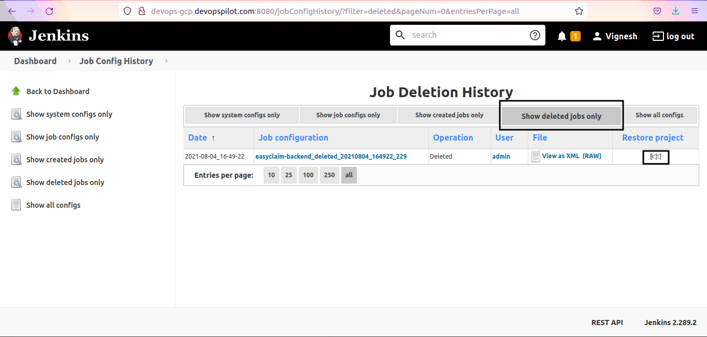
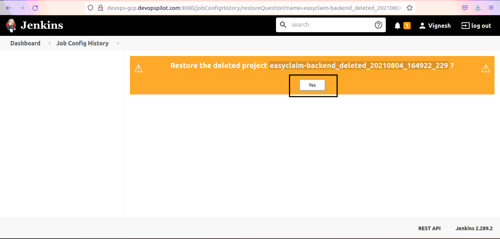
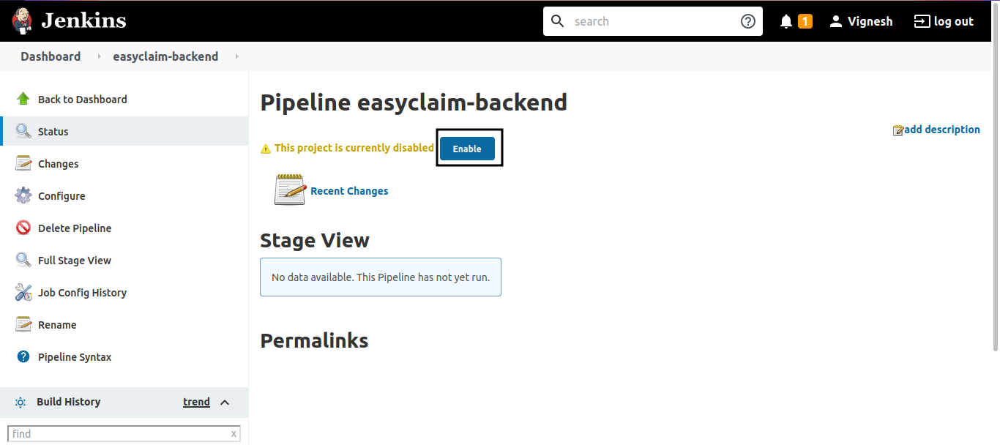
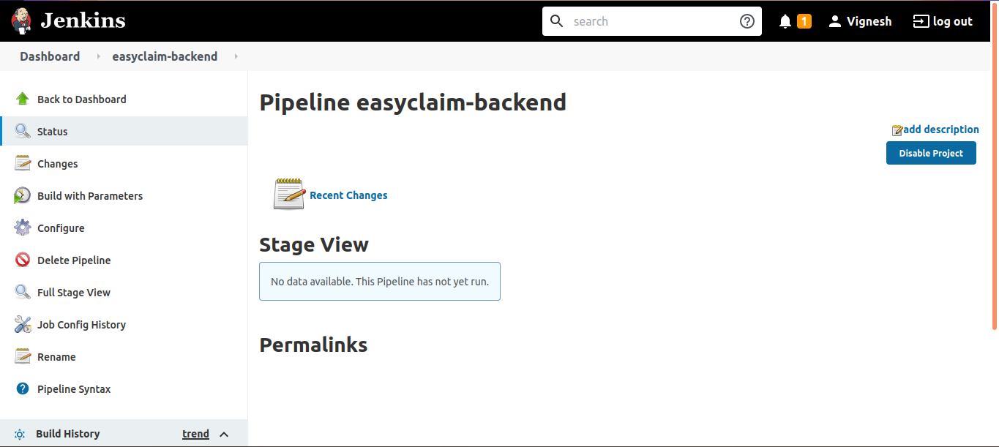

#### Prerequisites

- `Job Configuration History` plugin should be installed in Jenkins.

#### References

- [How to install plugins in Jenkins](../../images/jenkins-plugin-installation.png)

#### Restore deleted Jobs

Lets delete a job first

Go to Jenkins Homepage/Dashboard --> click on `Job Config History`

Click on `Show deleted jobs only` and click on restore icon next to the Job name

Now Job is restored but not enabled to run the pipeline

Click on `Enbale` to enable the restored job

Now pipeline is fully enabled and we can run the pipeline now.

