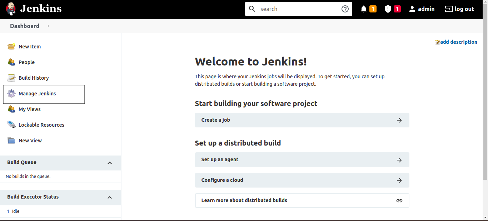
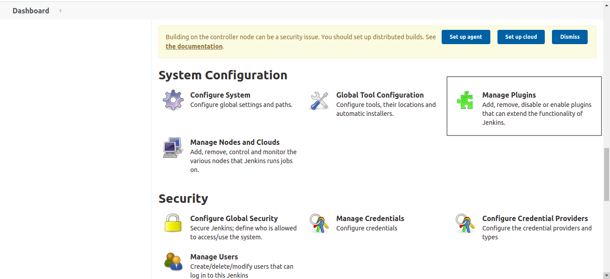
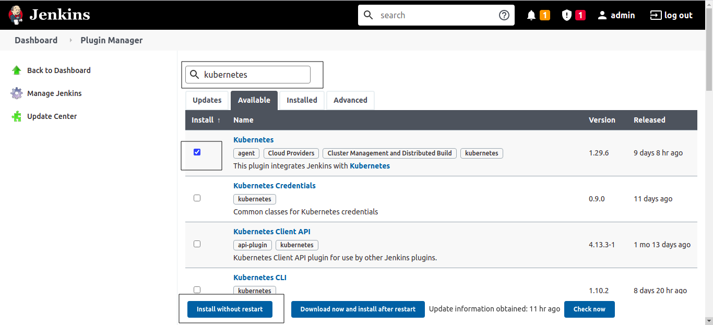
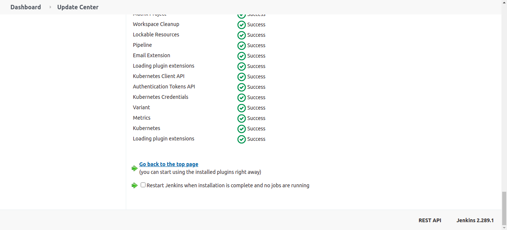

#### Commonly used plugins and their uses

- **Artifactory** - To interact with Jfrog Artifactory

- **Kubernetes** - To create jenkins agents in kubernetes cluster

- **Kubernetes CLI** - Allows you to configure kubectl in your job to interact with Kubernetes clusters. To deploy kubernetes configurations/objects/yamls to kubernetes cluster.

- **Deploy to container** - To deploy war file to tomcat

- **Docker** - To build, run and push docker images in freestyle job

- **Docker Pipeline** - To build, run and push docker images in Pipeline job

- **NodeJs** - To install multiple versions of nodejs from Global tool configuration

- **Slack Notification** - To post message to slack channel, generally we will post build status to slack channel

- **SonarQube Scanner** - To connect to the sonarqube server and install the sonarqube scanner from global tool configuration

- **Anchore Container Image Scanner** - To connect to Anchore engine for docker image scanning

- **Job Configuration History** - This plugin saves a copy of the configuration file of jobs and agents (config.xml) for every change made and of the system configuration. Deleted jobs can be restored.

- **Seed Jenkins** - To create Jenkins project automatically from DSL groovy script

- **Declarative Pipeline Migration Assistant** - Generate Declarative pipeline script(Jenkinsfile) from freestyle project

- **SSH Build Agents** - To configure SSH agent nodes

- **SSH Pipeline Steps** - For using ssh in Pipeline steps

#### Install Plugin

From Jenkins dashboard, click on **Manage Jenkins**

Click on **Manage Plugins**

Click on **Availabe** tab and type the plugin name in search box, select the plugin and click on **Install without restart**

---

## Important Tips

> [!TIP]
> **Restarting**: While many plugins can be installed "without restart", some core plugins or updates require a restart to fully initialize. If a plugin acts weirdly after install, try `http://YOUR_JENKINS_URL/safeRestart`.

> [!NOTE]
> **Dependencies**: Jenkins handles plugin dependencies automatically. If you install "Blue Ocean", it will automatically pull in dozens of other required plugins.

## 🧠 Quick Quiz — Plugin Management

<quiz>
How do you typically install a new plugin in Jenkins?
- [ ] By manually copying `.hpi` files to the server's `plugins` folder (though possible, it's not the standard way).
- [x] via "Manage Jenkins" -> "Plugins" -> "Available plugins" -> Search and Install.
- [ ] By running `apt-get install jenkins-plugin-name`.
- [ ] By editing the `config.xml` file directly.

The standard and safest way is using the built-in Plugin Manager in the Web UI, which handles dependencies and updates for you.
</quiz>
