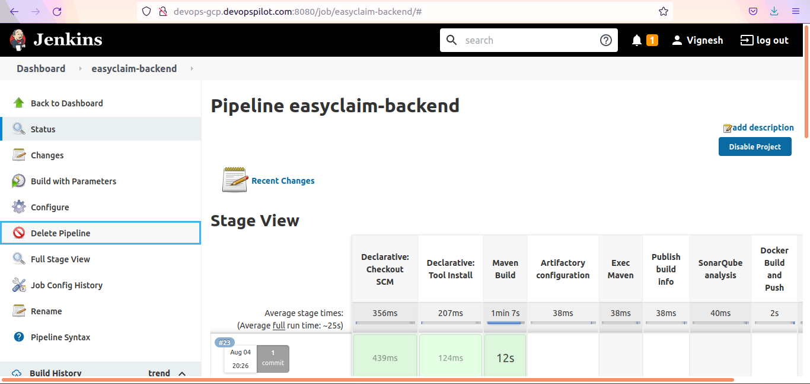
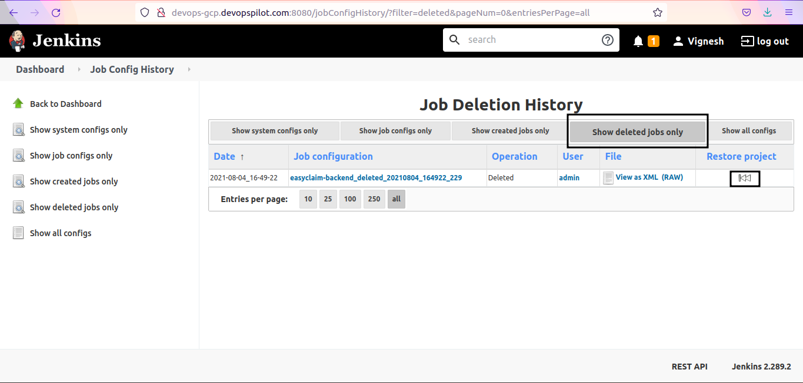
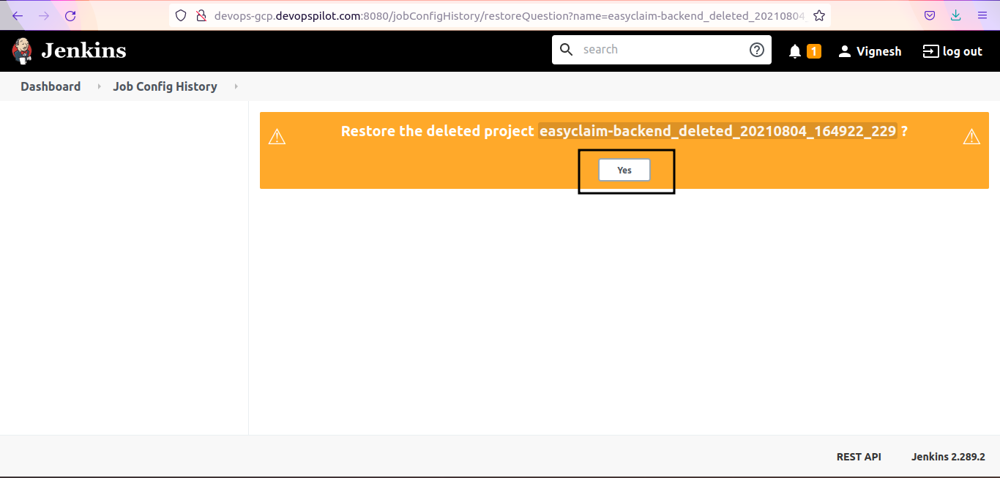

#### Prerequisites

- `Job Configuration History` plugin should be installed in Jenkins.

#### References

- [How to install plugins in Jenkins](../install-plugins/index.md)

#### Restore deleted Jobs

Lets delete a job first

Go to Jenkins Homepage/Dashboard --> click on `Job Config History`

Click on `Show deleted jobs only` and click on restore icon next to the Job name

Now Job is restored but not enabled to run the pipeline

Click on `Enable` to enable the restored job

Now pipeline is fully enabled and we can run the pipeline now.

---

## Important Tips

!!! tip
    **Plugin Requirement**: This feature is NOT available in Jenkins out-of-the-box. You MUST install the "Job Configuration History" plugin. Without it, once a job is deleted, it's gone for good (unless you have backups).

!!! note
    **Config History**: This plugin also tracks changes to job configurations. If you break a build by changing a setting, you can revert to the previous working configuration using the same plugin.

## 🧠 Quick Quiz — Restoring Jobs

<quiz>
Can you restore a deleted Jenkins job by default without any plugins?
- [ ] Yes, there is a "Trash" bin in Jenkins.
- [x] No, you need a plugin like "Job Configuration History" or a filesystem backup.
- [ ] Yes, but only within 24 hours.
- [ ] Yes, only if you are an administrator.

By default, deleting a job in Jenkins removes its configuration `xml` file from the disk immediately. Plugins or backups are required to recover it.
</quiz>
