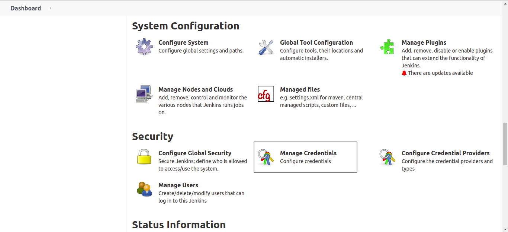
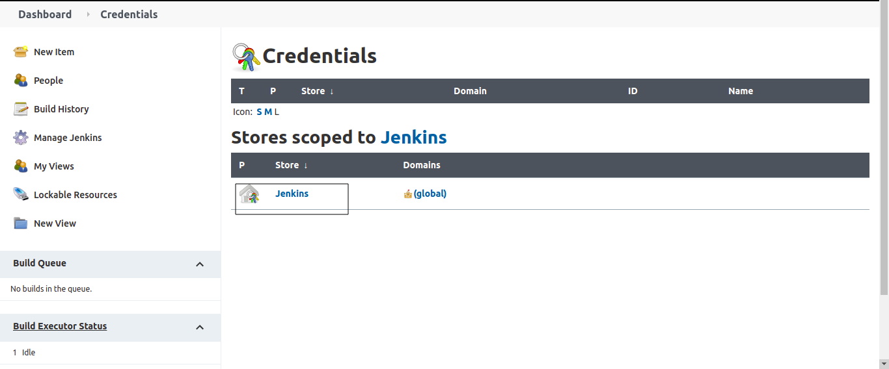
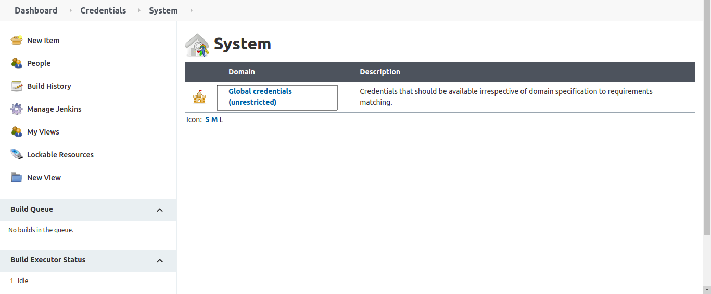
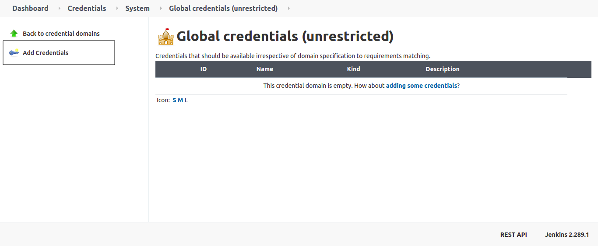
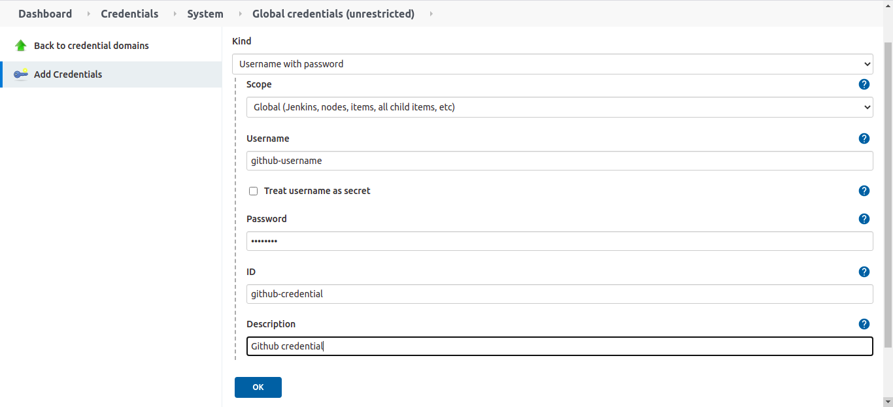
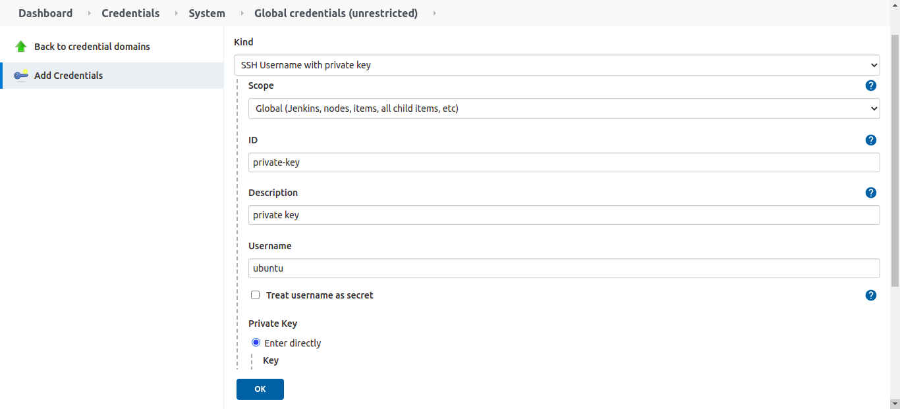
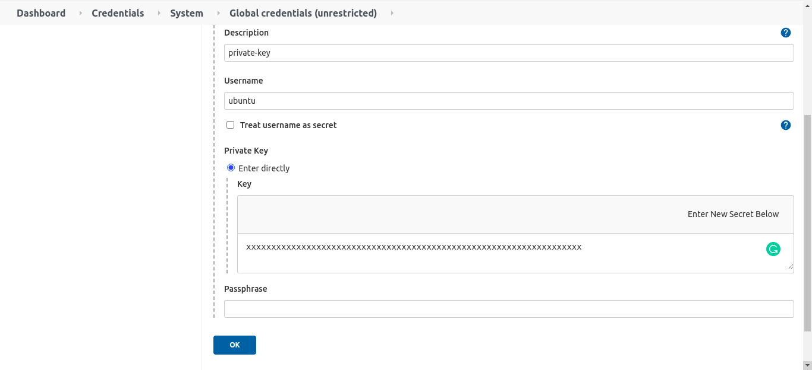
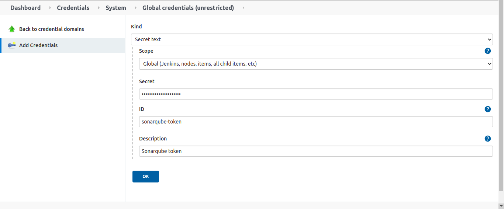

#### To store username and passsword of anything like github, dockerhub

From Jenkins dashboard, click on **Manage Jenkins**

Click on **Manage Credentials**

Click on **Jenkins**

Click on **Global credentials**

Click on **Add Credentials**

Select **kind** as **Username with password**, enter username, password and enter unique id and click on **OK**

#### To store ssh private key

Click on **Add Credentials** Select **kind** as **SSH Username with private key** enter the username, click on **Enter directly** and then click on Add and paste your private key and click on ok

#### To store any token eg: gitlab, Jfrog, artifactory and sonarqube token

Click on **Add Credentials** Select **kind** as **Secret text** enter the token, id and click on **OK**

---

## Important Tips

!!! tip
    **Use IDs**: Always assign a meaningful **ID** (e.g., `dockerhub-auth`) to your credentials. If you leave it blank, Jenkins assigns a random UUID, making your Jenkinsfiles hard to read and debug.

!!! important
    **Scope**: "Global" credentials are available everywhere. For tighter security, consider using "Folder" scoped credentials if you have organized your jobs into folders, restricting access to specific teams.

## 🧠 Quick Quiz — Credentials

<quiz>
Why should you store passwords and tokens in Jenkins Credentials instead of plain text in your pipeline script?
- [ ] Because it looks professional.
- [x] To prevent sensitive data from being exposed in source control and build logs.
- [ ] Because Jenkins runs faster with stored credentials.
- [ ] Because GitHub requires it.

Storing secrets in Credentials Manager ensures they are encrypted at rest and masked in build logs (e.g., as `****`), preventing accidental leaks.
</quiz>
