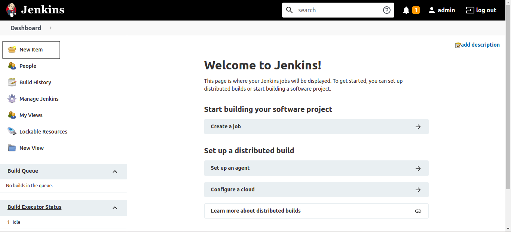
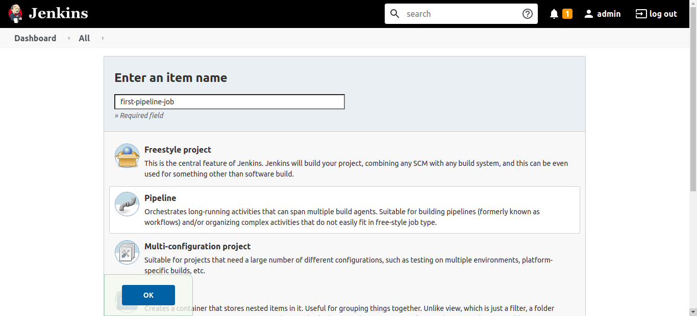
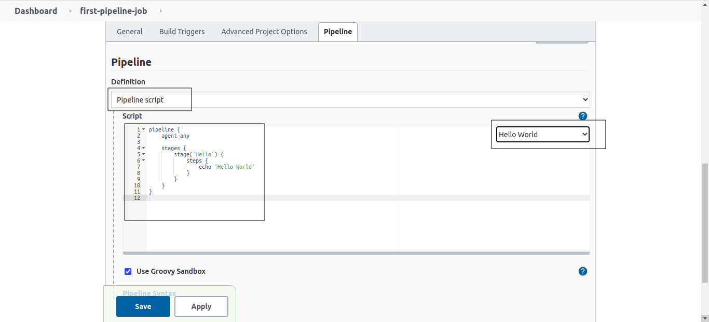
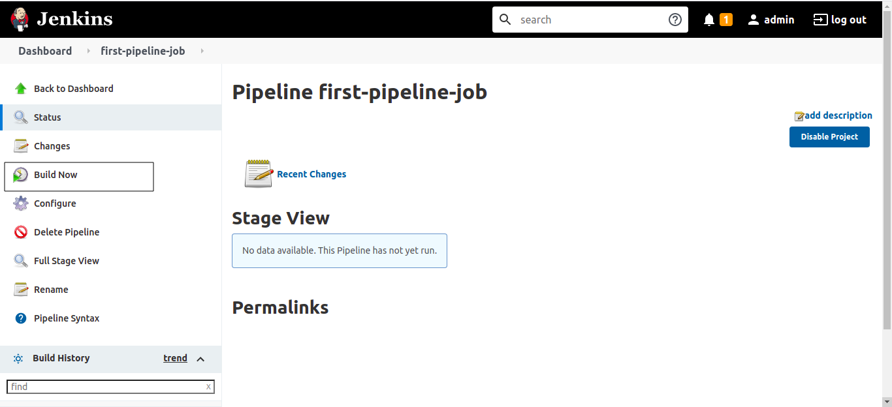
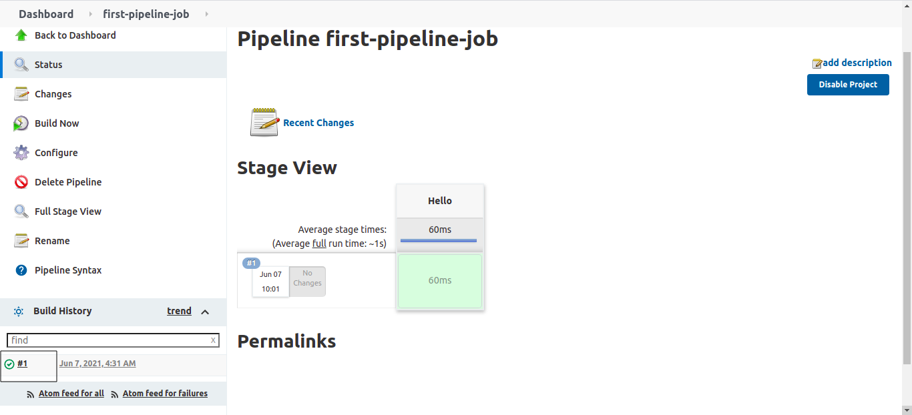
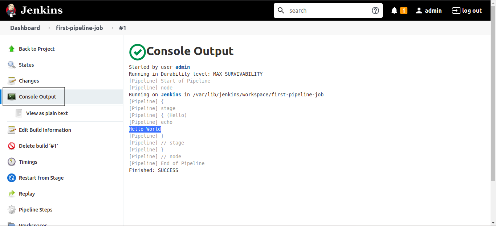
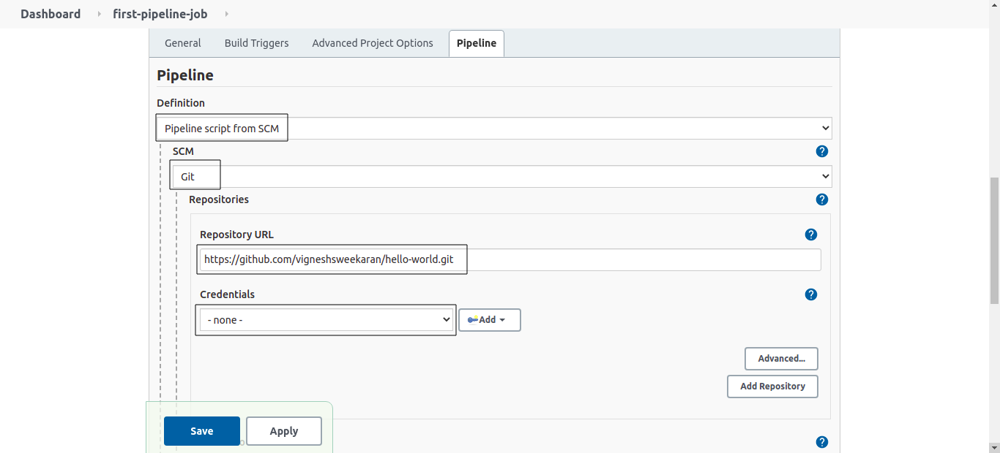
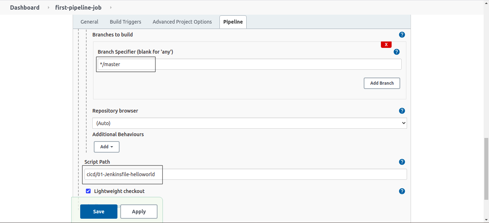
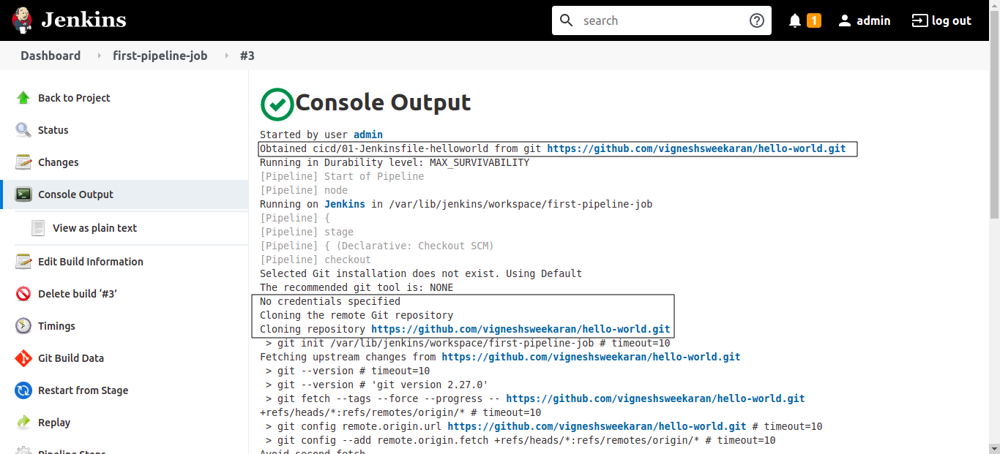
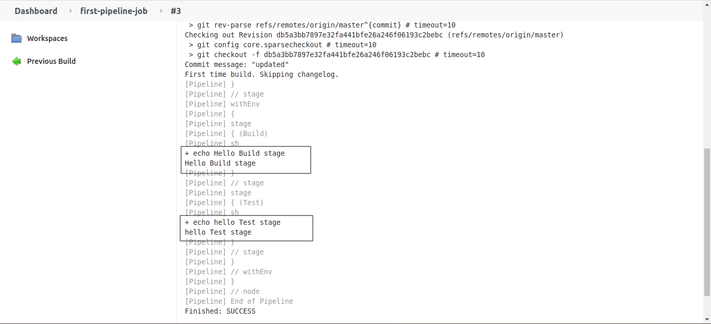

#### Approach 1: Jenkins pipeline script(Declarative pipeline) in Jenkins editor itself

This approach is good when we want to test some feature quickly. Now we will create a Job to print "Hello World" This approach is not recommended for realtime project.

From Jenkins dashboard, click on **New Item**



Enter the job name, select **Pipeline** and click on **OK**



Scroll down, go to **Pipeline** section, in **Definition** select **Pipeline script**, from **try sample Pipeline...** select **Hello World** sample pipeline script is added. click on **Save**

In this we have **Hello** stage, which will execute a echo command to print "Hello World"



Click on **Build Now**



Click on build no **#1**



Click on **Console Output** Now we can see the **Hello World** is printed on the screen



#### Approach 2: Jenkins pipeline script(Declarative pipeline) in Jenkinsfile

In this approach, the pipeline script is written to a file called **Jenkinsfile** then this file is added to the source code repository eg: Github, Gitlab

This approach is used in realtime project.

The **Jenkinsfile** can be named to anything like this **Jenkinsfile-dev**, **01-Jenkinsfile-helloworld**

While running the pipeline, it will fetch the **Jenkinsfile** and execute all the stages defined in the Jenkinsfile.

I have a sample **Jenkinsfile** named **01-Jenkinsfile-helloworld** in the cicd folder of the following github repo [hello-world](https://github.com/vigneshsweekaran/hello-world.git)

```
pipeline {
    agent any
    stages {
        stage ('Build') {
            steps {
                sh 'echo Hello Build stage'
            }
        }
        stage ('Test') {
            steps {
                sh 'echo hello Test stage'
            }
        }
    }
}
```

In above Jenkinsfile I have created two stages **Build** and **Test**, in both the stages for now I am just executing the echo command in **sh** step

Now lets see how to create a pipeline job using **Jenkinsfile** from github repository.

From Jenkins dashboard, click on **New Item**


Enter the job name, select **Pipeline** and click on **OK**


Scroll down, go to **Pipeline** section, in **Definition** select **Pipeline script from SCM**, select **Git** from SCM. In **Repository URL** give the github url **[https://github.com/vigneshsweekaran/hello-world.git](https://github.com/vigneshsweekaran/hello-world.git)**

This is a public repository so credentials are not required. If your reository is private then we need credentials to pull the code. Store the username and password in credentials. Then from the **Credentials** drop down select your git repository credential.

[How to store credentials in Jenkins](../../tutorials/github-token-credentials/index.md)



Now enter the branch name `master` in **Branches to build** field, then enter the Jenkinsfile name `cicd/01-Jenkinsfile-helloworld` in **Script path** click on **save**



Click on **Build Now** then go to **Console Output**

From the **Console Output** first line, we can see first it fetches the **cicd/01-Jenkinsfile-helloworld** from Github, then clone the source code and executes the steps inside each stage.



Echo commands from stages are printed to console output



## Important Tips

> [!TIP]
> **Use Jenkinsfile**: Always prefer "Pipeline script from SCM" (Jenkinsfile) over "Pipeline script" (Inline). This allows you to version control your pipeline code just like your application code.

> [!NOTE]
> **Declarative vs. Scripted**: We are using Declarative Pipeline syntax (starts with `pipeline {}`) which is newer, more structured, and easier to learn than Scripted Pipeline (starts with `node {}`).

## Quick Quiz

<quiz>
Which method of defining a Jenkins pipeline is recommended for real production projects?
- [x] Pipeline script from SCM (Jenkinsfile)
- [ ] Pipeline script in Web UI
- [ ] Freestyle project
- [ ] Copy from another job

Pipeline script from SCM allows you to version control your pipeline definition along with your application code, which is a best practice for production.
</quiz>

<quiz>
Which file name is standard for a declarative pipeline script in the root of your repository?
- [x] Jenkinsfile
- [ ] pipeline.groovy
- [ ] build.jenkins
- [ ] Jenkins.yaml

Jenkins looks for a file named `Jenkinsfile` by default when configuring a "Pipeline script from SCM".
</quiz>

<quiz>
What is a key advantage of "Pipeline as Code"?
- [x] It allows the build process to be versioned and reviewed like any other code
- [ ] It makes the UI look better
- [ ] It requires less memory
- [ ] It runs faster than freestyle jobs

Treating infrastructure and build logic as code brings the benefits of version control, code review, and audit trails to your CI/CD process.
</quiz>


