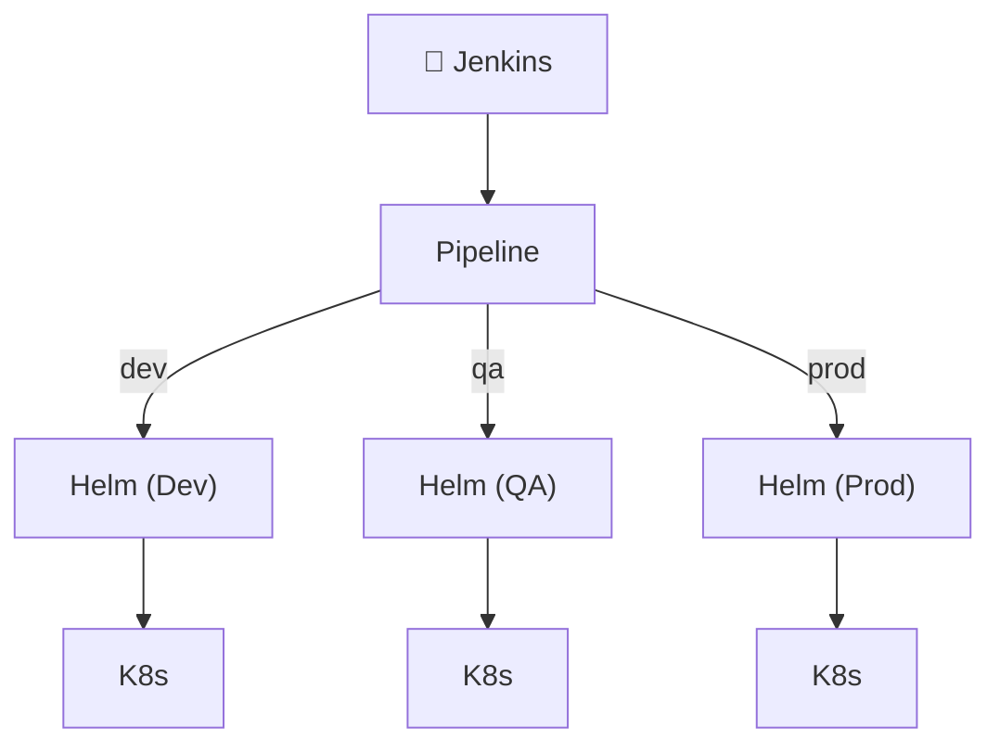

# Deploying a Helm Chart with Jenkins 🏗️

This tutorial walks through a declarative Jenkins pipeline (`40-Jenkinsfile-helm`) that orchestrates the deployment of a Helm chart across different environments (`dev`, `qa`, `prod`).

## 📊 Pipeline Overview

Here is the high-level flow of our Helm deployment pipeline:



!!! tip "Prerequisites"
    Ensure that the Helm CLI is installed on the underlying Jenkins agent and correctly configured in your system's `PATH`.

---

## 📝 Full Jenkinsfile Example

[View on GitHub](https://github.com/vigneshsweekaran/hello-world/blob/main/cicd/40-Jenkinsfile-helm)

```groovy
pipeline {
  agent any
  options {
    disableConcurrentBuilds()
    disableResume()
    buildDiscarder(logRotator(numToKeepStr: '10'))
    timeout(time: 1, unit: 'HOURS')
  }
  parameters {
    choice(name: 'ENVIRONMENT', choices: ['dev', 'qa', 'prod'], description: 'Choose Environment to deploy')
    string(name: 'IMAGE_TAG', defaultValue: '1.0', description: 'Docker image tag to deploy')
  }
  environment {
    HELM_CHART_PATH = "deployment/helm-chart"
    RELEASE_NAME    = "hello-world"
  }
  stages {
    stage('Deploy to Dev') {
      when {
        environment name: 'ENVIRONMENT', value: 'dev'
      }
      steps {
        sh """
          helm upgrade --install ${RELEASE_NAME} ${HELM_CHART_PATH} \
            -f ${HELM_CHART_PATH}/values-dev.yaml \
            --set image.tag=${params.IMAGE_TAG} \
            --namespace dev --create-namespace
        """
      }
    }
    stage('Deploy to QA') {
      when {
        environment name: 'ENVIRONMENT', value: 'qa'
      }
      steps {
        sh """
          helm upgrade --install ${RELEASE_NAME} ${HELM_CHART_PATH} \
            -f ${HELM_CHART_PATH}/values-qa.yaml \
            --set image.tag=${params.IMAGE_TAG} \
            --namespace qa --create-namespace
        """
      }
    }
    stage('Deploy to Prod') {
      when {
        environment name: 'ENVIRONMENT', value: 'prod'
      }
      steps {
        sh """
          helm upgrade --install ${RELEASE_NAME} ${HELM_CHART_PATH} \
            -f ${HELM_CHART_PATH}/values-prod.yaml \
            --set image.tag=${params.IMAGE_TAG} \
            --namespace prod --create-namespace
        """
      }
    }
  }
  post {
    always {
      deleteDir()
    }
  }
}
```

---

## 🛠️ Step-by-Step Breakdown

### 1. Jenkinsfile Structure & Parameters

The pipeline uses a declarative syntax for clarity and maintainability. It defines:

- **Global options** to control concurrency, build retention, and timeouts.
- **Parameters** for environment selection (`dev`, `qa`, `prod`) and the Docker image tag to deploy.
- **Environment variables** for the Helm chart path and release name, making the script reusable and easy to update.

!!! tip "Why use parameters?"
    Parameters allow you to promote the same pipeline to multiple environments and versions without changing the code.

### 2. Helm Deployment Stages

Each environment (Dev, QA, Prod) has its own stage. The `when` condition ensures only the selected environment's stage runs. The deployment step uses:

- `helm upgrade --install` to create or update the release.
- The appropriate `values-<env>.yaml` file for environment-specific configuration.
- The `--set image.tag` flag to inject the Docker image tag dynamically.
- The `--namespace` and `--create-namespace` flags to target the correct Kubernetes namespace.

!!! tip "Why upgrade --install?"
    This command ensures the pipeline works for both first-time deployments and updates, making it safe for CI/CD automation.

### 3. Post Actions

After deployment, the `post` block always cleans up the Jenkins workspace to avoid disk bloat and ensure a fresh environment for each run.

!!! tip "Workspace hygiene"
    Cleaning up after each run prevents issues with leftover files and makes builds more reliable.

---

## 🧠 Knowledge Check

<quiz>
What is the advantage of using `helm upgrade --install` in a pipeline?
- [ ] It deletes the old namespace and creates a new one
- [x] It installs the chart if missing, or upgrades it if already present
- [ ] It upgrades the Helm CLI tool on the Jenkins agent
- [ ] It only works for the `dev` environment

It securely handles both first-time initializations and subsequent infrastructure drift updates without throwing errors.
</quiz>

<quiz>
How does the pipeline ensure only one deployment happens at a time to prevent conflicts?
- [ ] Using `timeout(time: 1)`
- [ ] Using the `when` condition
- [x] Using the `disableConcurrentBuilds()` option
- [ ] By running in `agent any`

The `disableConcurrentBuilds()` option blocks parallel executions of the pipeline, preventing race conditions like two jobs modifying the same Helm release simultaneously.
</quiz>

<quiz>
How do you override the image tag locally injected by the Jenkins parameter during the deployment?
- [ ] Modifying the `deployment/helm-chart` string directly
- [x] Using `--set image.tag=${params.IMAGE_TAG}`
- [ ] Adding `deleteDir()`
- [ ] Re-running the UI login

The `--set` flag in Helm allows you to dynamically override or set specific variables defined in your `values.yaml` file.
</quiz>


