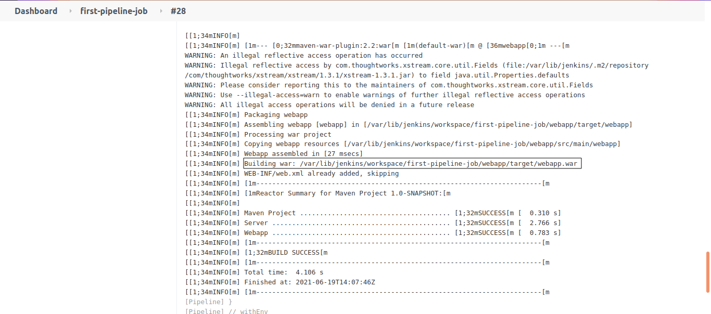

#### Prerequisites

- `maven`, `Deploy to container` plugins should be installed in Jenkins.

- Configure specific version of maven in Jenkins `Global Tool Configuration`

I have a sample hello-world maven project in github [hello-world](https://github.com/vigneshsweekaran/hello-world)

Fork this project [hello-world](https://github.com/vigneshsweekaran/hello-world) and update the required fields in the Jenkinsfile [`15-Jenkinsfile-deploy-to-tomcat`](https://github.com/vigneshsweekaran/hello-world/blob/main/cicd/15-Jenkinsfile-deploy-to-tomcat)

Maven is a build tool used to compile, test and package the application developed using Java programming language.

Jenkinsfile

```
pipeline {
  agent any
  options {
    disableConcurrentBuilds()
    disableResume()
    buildDiscarder(logRotator(numToKeepStr: '10'))
    timeout(time: 1, unit: 'HOURS')
  }
  tools {
    maven 'maven-3.6.3' 
  }
  stages {
    stage ('Build') {
      steps {
        sh 'mvn clean package'
      }
    }
    stage ('Deploy') {
      steps {
        script {
          deploy adapters: [tomcat9(credentialsId: 'tomcat_credential', path: '', url: 'http://20.197.20.20:8080')], contextPath: '/helloworld', onFailure: false, war: 'webapp/target/*.war' 
        }
      }
    }
  }
  post {
    always {
      deleteDir()
    }
  }
}
```

In the `tools` block we have used `maven` definition to refer the maven installation **maven-3.6.3** configured in Jenkins Global tool configuration.

In the stages block we have created two stages `Build` and `Deploy`.

In the `Build` stage we are executing `mvn clean package` command to compile and package the java application.

It will compile the java code and generate the package in **targets** folder.



In the `Deploy` stage we are using the `Deploy to container` plugin to deploy the hello-world.war file to tomcat webserver.

Parameters passed to `Deploy to container` plugin definition.

- credentialsId: 'tomcat\_credential' --> Store the tomcat username and password in Jenkins credentials and pass the tomcat credential id here. I have stored the tomcat credentials in Jenkins and created the id as `tomcat_credential`  
      
    Before storing the credentials in jenkins, create a user in Tomcat with `manager-script` role.  
      
    To create users in Tomcat, open the file **/var/lib/tomcat9/conf/tomcat-users.xml**  
    
    ```
    sudo vi /var/lib/tomcat9/conf/tomcat-users.xml
    ```
    
      
    
    Go to end of the file and paste the following lines inside tomcat-users block and save it.
    
      
    
    ```
    <role rolename="manager-script"/><user username="deployer" password="deployer" roles="manager-script"/>
    ```
    
      
      
      
      
    
      
    
    Here we have defined one role **manager-script** and created one user **deployer** and assigned the **manager-script** role to the deployer user.  
      
    Then restart the tomcat9
    
      
    
    ```
    sudo systemctl restart tomcat9
    ```
    
      
    

- url: '[http://152.70.71.239:8080/](http://152.70.71.239:8080/)' --> Your tomcat url

- contextPath: '/pipeline' --> Context path to deploy in Tomcat

- onFailure: false --> Flag used to control the deployment, I dont want to deploy If my pipeline JOb fails, thats why I am setting `onFailure` flag to `false`

- war: 'target/\*.war' --> Your war file name


#### References

- [How to install plugins in Jenkins](../../configuration/install-plugins/index.md)

- [How to configure maven in Global Tool Configuration](../../configuration/global-tools/index.md)

- [How to store credentials in Jenkins](../../configuration/store-credentials/index.md)

- [How to create pipeline job in Jenkins](../create-pipeline-job/index.md)

- [How to install Tomcat](../../../webserver/tomcat/installation/index.md)

- [How to manually deploy the java application to Tomcat 9 webserver](../../../webserver/tomcat/manual-deploy/index.md)

- [How to deploy the java application to Tomcat 9 webserver using maven](../../../webserver/tomcat/maven-deploy/index.md)

## Important Tips

!!! tip
    **Legacy Plugin**: The "Deploy to container" plugin is an older method of deployment. In modern CI/CD, creating a Docker image of your application (like in the next tutorials) is often preferred over deploying WAR files directly to a standalone Tomcat server.

!!! important
    **Tomcat Credentials**: Ensure the credentials used have the `manager-script` role in Tomcat's `tomcat-users.xml`. The plugin relies on the Tomcat Manager App's text interface to perform the deployment.

## Quick Quiz

<quiz>
Which plugin is commonly used in Jenkins to deploy a WAR file to a Tomcat container?
- [x] Deploy to container
- [ ] Tomcat Deployer
- [ ] Publish Over SSH
- [ ] Copy Artifact

The `Deploy to container` plugin allowed Jenkins to deploy a WAR file to a running Tomcat container (though modern approaches often prefer Docker/Kubernetes).
</quiz>

<quiz>
What user role is typically required in Tomcat's `tomcat-users.xml` for the deployer user?
- [x] `manager-script`
- [ ] `admin`
- [ ] `root`
- [ ] `user`

The `manager-script` role allows the user to access the text-based manager interface, which the plugin uses to deploy applications.
</quiz>

<quiz>
What does the `contextPath` parameter define in the deployment step?
- [x] The URL path where the application will be accessible (e.g., /myapp)
- [ ] The file path on the server
- [ ] The database connection string
- [ ] The Jenkins workspace path

The context path determines the URL endpoint for the deployed web application (e.g., `http://server:8080/contextPath`).
</quiz>


