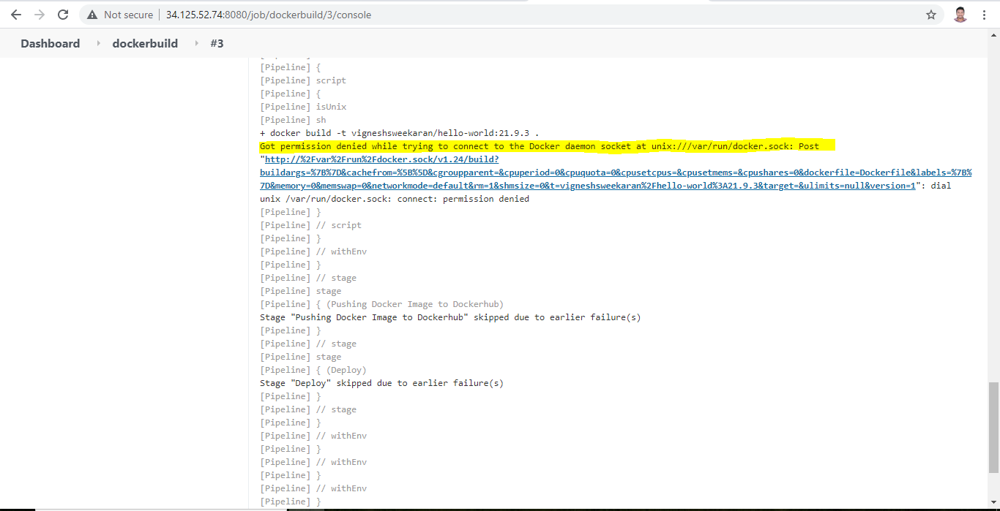

#### Prerequisites

- `maven`, `Docker` plugins should be installed in Jenkins.

- Configure specific version of maven in Jenkins `Global Tool Configuration`

- Store dockerhub credential in Jenkins credentials with type `Username with password` and give a unique id as `docker_credential`

I have a sample hello-world maven project in github [hello-world](https://github.com/vigneshsweekaran/hello-world)

Fork this project [hello-world](https://github.com/vigneshsweekaran/hello-world) and update the required feilds in the Jenkinsfile `04-Jenkinsfile-docker-build-push-deploy-same-server`

Maven is a build tool used to compile, test and package the application developed using Java programming language.

Jenkinsfile

```
pipeline {
    agent any
    tools {
        maven 'maven-3.6.3' 
    }
    environment {
        DATE = new Date().format('yy.M')
        TAG = "${DATE}.${BUILD_NUMBER}"
    }
    stages {
        stage ('Build') {
            steps {
                sh 'mvn clean package'
            }
        }
        stage('Docker Build') {
            steps {
                script {
                    docker.build("vigneshsweekaran/hello-world:${TAG}")
                }
            }
        }
        stage('Pushing Docker Image to Dockerhub') {
            steps {
                script {
                    docker.withRegistry('https://registry.hub.docker.com', 'docker_credential') {
                        docker.image("vigneshsweekaran/hello-world:${TAG}").push()
                        docker.image("vigneshsweekaran/hello-world:${TAG}").push("latest")
                    }
                }
            }
        }
        stage('Deploy'){
            steps {
                sh "docker stop hello-world | true"
                sh "docker rm hello-world | true"
                sh "docker run --name hello-world -d -p 9004:8080 vigneshsweekaran/hello-world:${TAG}"
            }
        }
    }
}
```

In the `tools` block we have used `maven` definition to refer the maven installation **maven-3.6.3** configured in Jenkins Global tool configuration.

In the `environment` block we have created two environment variables `DATE` and `TAG` The `TAG` environment varaible is used the tag the generated docker image.

In the stages block we have created four stages `Build`, `Docker Build`, `Pushing Docker Image to Dockerhub` and `Deploy`.

In the `Build` stage we are executing `mvn clean package` command to compile and package the java application.

In the `Docker Build` stage we have used `docker` plugin to build the docker image

```
docker.build("vigneshsweekaran/hello-world:${TAG}")
```

vigneshsweekaran --> dockerhub account name

hello-world --> Repository name/Image name

TAG --> Unique tag for the Image, defined in environment variable

In the `Pushing Docker Image to Dockerhub` we are pushing the docker images with two tags unique tag(${TAG}) and the latest tag to dockerhub using credentials stored in Jenkins credentials

```
docker.withRegistry('https://registry.hub.docker.com', 'docker_credential') {
    docker.image("vigneshsweekaran/hello-world:${TAG}").push()
    docker.image("vigneshsweekaran/hello-world:${TAG}").push("latest")
}
```

[https://registry.hub.docker.com](https://registry.hub.docker.com) --> Dockerhub registry url

docker\_credential --> Jenkins credential id, where the dockerhub credentials are stored

First we are pushing the docker image with unique tag(${TAG}) to the dockerhub

```
docker.image("vigneshsweekaran/hello-world:${TAG}").push()
```

Second we are retagging the generated docker image to latest tag and pushing to dockerhub.

Tagging every image to latest tag, will help in get the latest changes everytime.

```
docker.image("vigneshsweekaran/hello-world:${TAG}").push("latest")
```

In the `Deploy` stage we are creating the docker container with the latest docker image in the same Jenkins server.

NOTE: Here I am deploying docker container to the same Jenkins server, this is only for testing purpose. In real time scenario, we will be deploying the docker container in diffrent dedicated servers.

```
sh "docker stop hello-world | true"
sh "docker rm hello-world | true"
sh "docker run --name hello-world -d -p 9004:8080 vigneshsweekaran/hello-world:${TAG}"
```

We are creating the container with unique name `hello-world`, because we can stop and remove the docker container by referring the container name. The generated container id will be diffrent for each time when we create a container.

Inside the docker container we have tomcat, by default tomat is exposed on port 8080. We are mapping the port 9004 of the Jenkins server to the port 8080 of docker container.

When we access the application by [http://jenkins-server-ip-address:9004/hello-world](http://jenkins-server-ip-address:9004/hello-world), the 9004 will be port-forwarded to 8080 of the docker container

vigneshsweekaran/hello-world:${TAG} --> Generated docker image name and tag

```
sh "docker run --name hello-world -d -p 9004:8080 vigneshsweekaran/hello-world:${TAG}"
```

And we are executing the docker stop and rm command to remove the old container by referring the container name `hello-world`.

```
sh "docker stop hello-world | true"
sh "docker rm hello-world | true"
```

###### Issues

- If you are getting error like `Got permission denied while trying to connect to the Docker daemon socket at unix:///var/run/docker.sock: Post`  
      
      
      
      
    
      
    

Add `jenkins` user to `docker` group and restart Jenkins

```
sudo usermod -aG docker jenkins
sudo systemctl restart jenkins
```

#### References

- [How to install plugins in Jenkins](/index.php/jenkins/configuration/10-how-to-install-plugins)

- [How to configure maven in Global Tool Configuration](/index.php/jenkins/configuration/20-global-tool-configurations)

- [How to store credentials in Jenkins](/index.php/jenkins/configuration/30-how-to-store-credentials-in-jenkins)

- [How to create pipeline job in Jenkins](/index.php/jenkins/pipeline/10-how-to-create-pipeline-job)

- [How to write a dockerfile for running a java application (\*.war) in Apache tomcat webserver](/index.php/docker/04-how-to-write-a-dockerfile-for-running-war-file-in-tomcat)
