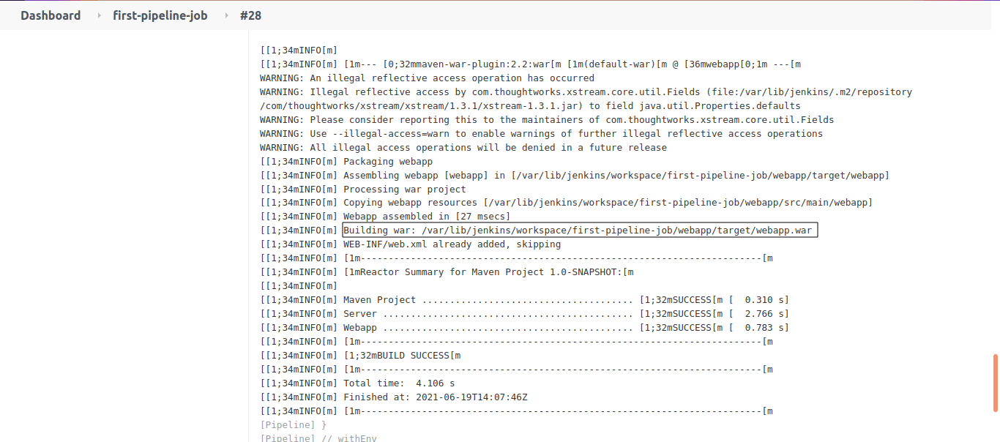

#### Prerequisites

- **maven** plugin should be installed in Jenkins. By default maven plugin will be installed in Jenkins

- Configure specific version of maven in Jenkins **Global Tool Configuration**

I have a sample hello-world maven project in github [hello-world](https://github.com/vigneshsweekaran/hello-world)

Fork this project [hello-world](https://github.com/vigneshsweekaran/hello-world) and update the required fields in the Jenkinsfile `02-Jenkinsfile-maven-build`

Maven is a build tool used to compile, test and package the application developed using Java programming language.

Jenkinsfile

```
pipeline {
  agent any
  tools {
    maven 'maven-3.6.3' 
  }
  stages {
    stage ('Build') {
      steps {
        sh 'mvn clean package'
      }
    }
  }
}
```

In the `tools` block we have used `maven` definition to refer the maven installation **maven-3.6.3** configured in Jenkins Global tool configuration.

We have created one stage called **Build**, here we are executing the **mvn clean package** command to compile and package the java application.

It will compile the java code and generate the package in **targets** folder.



#### References

- [How to install plugins in Jenkins](../configuration/how-to-install-plugins.md)

- [How to configure maven in Global Tool Configuration](../configuration/global-tool-configurations.md)

- [How to create pipeline job in Jenkins](how-to-create-pipeline-job.md)
