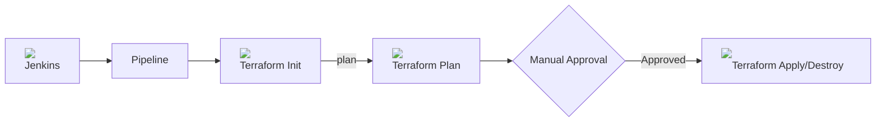

# Infrastructure as Code with Terraform & Jenkins 🌍

This tutorial walks through a declarative Jenkins pipeline (`45-Jenkinsfile-terraform`) that orchestrates the provisioning and teardown of infrastructure using Terraform across different environments (`dev`, `qa`, `prod`).

## 📊 Pipeline Overview

Here is the high-level flow of our Terraform automation pipeline:



> [!TIP]
> **Important:** Always include a manual `Approval` stage before executing `terraform apply` or `destroy` in a CI/CD environment to prevent accidental infrastructure modifications or deletions!

---

## 🛠️ Step-by-Step Breakdown

### 1. Configuration & Parameters

The pipeline begins by defining global options and the parameters required to trigger the build.

```groovy
pipeline {
  agent any
  options {
    disableConcurrentBuilds()
    disableResume()
    buildDiscarder(logRotator(numToKeepStr: '10'))
    timeout(time: 1, unit: 'HOURS')
  }
  parameters {
    choice(name: 'ENVIRONMENT', choices: ['dev', 'qa', 'prod'], description: 'Choose Environment to deploy')
    choice(name: 'ACTION', choices: ['plan', 'apply', 'destroy'], description: 'Terraform action to execute')
  }
```

- **Parameters**: 
  - `ENVIRONMENT` determines the target scope for the `.tfvars` file (e.g., development or production).
  - `ACTION` controls whether the pipeline will only generate a plan, apply it, or destroy the resources entirely.

### 2. Initialization & Plan Stages

```groovy
  environment {
    TF_DIR = "deployment/terraform"
  }
  stages {
    stage('Terraform Init') {
      steps {
        sh """
          cd ${TF_DIR}
          terraform init -reconfigure
        """
      }
    }

    stage('Plan Dev') {
      when { environment name: 'ENVIRONMENT', value: 'dev' }
      steps {
        sh """
          cd ${TF_DIR}
          terraform plan -var-file=dev.tfvars -out=tfplan
        """
      }
    }
```

- **`init -reconfigure`**: Ensures the backend is safely initialized, preventing state locking issues across parallel jobs or when switching configurations.
- **`-out=tfplan`**: Exports the plan to a binary file. This guarantees that the exact changes reviewed during the plan phase will be identical to what is applied.

> [!TIP]
> We always execute commands by first `cd`ing into the `TF_DIR` (e.g., `cd ${TF_DIR}`) since Jenkins starts executing from the root of the workspace.

### 3. Manual Approval Gateway

```groovy
    stage('Approval') {
      when {
        expression { params.ACTION in ['apply', 'destroy'] }
      }
      steps {
        input message: "Approve Terraform ${params.ACTION} for ${params.ENVIRONMENT}?", ok: 'Proceed'
      }
    }
```

This acts as a safety barrier. The pipeline will pause here, waiting for a human administrator to click "Proceed" inside the Jenkins UI before any real infrastructure is fundamentally altered.

### 4. Apply / Destroy Stage

```groovy
    stage('Apply / Destroy Dev') {
      when {
        allOf {
          environment name: 'ENVIRONMENT', value: 'dev'
          expression { params.ACTION in ['apply', 'destroy'] }
        }
      }
      steps {
        sh """
          cd ${TF_DIR}
          if [ "${params.ACTION}" = "destroy" ]; then
            terraform destroy -var-file=dev.tfvars -auto-approve
          else
            terraform apply tfplan
          fi
        """
      }
    }
```

Based on the initial parameter provided, it will seamlessly pivot between completely removing the stack (`destroy -auto-approve`) or rolling out the changes (`apply tfplan`).

---

## 🧠 Knowledge Check

<quiz>
Why do we use the `-out=tfplan` flag during `terraform plan`?
- [ ] It speeds up the initialization phase.
- [ ] It skips the human approval stage.
- [x] It guarantees the `apply` command executes exactly what was previewed.
- [ ] It automatically pushes the state file to an S3 bucket.

Saving a plan file ensures you safely apply the exact changes you reviewed, preventing any "drifting" if someone else modified the infrastructure immediately after your plan.
</quiz>

<quiz>
What does the `allOf { }` block do in the declarative pipeline's `when` statement?
- [ ] It fails the build if any test fails.
- [x] It requires multiple nested conditions to all evaluate to true before executing the stage.
- [ ] It triggers a deployment to Dev, QA, and Prod simultaneously.
- [ ] It automatically approves the manual input step.

Like a logical `AND` operator, `allOf` ensures that multiple conditions (such as matching the correct `ENVIRONMENT` and the correct `ACTION`) must be met to enter the deployment stage.
</quiz>

<quiz>
Which Terraform command is used to completely tear down all provisioned resources?
- [ ] `terraform delete`
- [ ] `terraform remove`
- [ ] `terraform plan -down`
- [x] `terraform destroy`

`terraform destroy` removes all resources defined in your configuration, and using the `-auto-approve` flag allows it to bypass interactive prompts in CI/CD.
</quiz>


