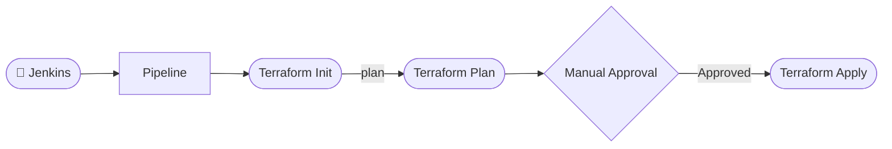

# Infrastructure as Code with Terraform & Jenkins 🌍

This tutorial walks through a declarative Jenkins pipeline (`45-Jenkinsfile-terraform`) that orchestrates the provisioning of infrastructure using Terraform across different environments (`dev`, `qa`, `prod`).

## 📊 Pipeline Overview

Here is the high-level flow of our Terraform automation pipeline:



!!! tip "Why Manual Approval?"
    Manual approval before `terraform apply` ensures that infrastructure changes are always reviewed and intentional, reducing the risk of accidental modifications in production.

---

## 🛠️ Step-by-Step Breakdown

### 1. Configuration & Parameters

The pipeline begins by defining global options and the parameters required to trigger the build.

```groovy
pipeline {
  agent any
  options {
    disableConcurrentBuilds()
    disableResume()
    buildDiscarder(logRotator(numToKeepStr: '10'))
    timeout(time: 1, unit: 'HOURS')
  }
  parameters {
    choice(name: 'ENVIRONMENT', choices: ['dev', 'qa', 'prod'], description: 'Choose Environment to deploy')
  }
  environment {
    TF_DIR = "deployment/terraform"
  }
  stages {
    stage('Deploy to Dev') {
      when {
        environment name: 'ENVIRONMENT', value: 'dev'
      }
      steps {
        terraformPipeline('dev')
      }
    }
    stage('Deploy to QA') {
      when {
        environment name: 'ENVIRONMENT', value: 'qa'
      }
      steps {
        terraformPipeline('qa')
      }
    }
    stage('Deploy to Prod') {
      when {
        environment name: 'ENVIRONMENT', value: 'prod'
      }
      steps {
        terraformPipeline('prod')
      }
    }
  }
  post {
    always {
      deleteDir()
    }
  }
}

def terraformPipeline(envName) {
  def tfvars = "${envName}.tfvars"
  dir(env.TF_DIR) {
    sh 'terraform init -reconfigure'
    sh "terraform plan -var-file=${tfvars} -out=tfplan"
    input message: "Approve Terraform apply for ${envName}?", ok: 'Proceed'
    sh 'terraform apply tfplan'
  }
}
```

- **Parameterization:** Choose the environment at build time.
- **Centralized Logic:** The `terraformPipeline` method handles all Terraform steps for each environment.
- **Approval:** Manual approval is required before applying changes.
- **No Destroy Option:** The pipeline only supports plan and apply for safety.

!!! tip "Why -reconfigure?"
    The `-reconfigure` flag in `terraform init` ensures the backend is always freshly initialized, which is important for CI/CD pipelines to avoid state or configuration drift.

---

## How it Works
1. **Select Environment:** User chooses `dev`, `qa`, or `prod` when triggering the pipeline.
2. **Terraform Flow:**
   - `terraform init -reconfigure` ensures backend is always fresh.
   - `terraform plan` creates a plan file for the selected environment.
   - Manual approval is required before applying.
   - `terraform apply tfplan` applies the exact plan.
3. **Workspace Cleanup:** Jenkins workspace is cleaned after every run.

---

## Reference
- [Jenkinsfile on GitHub](https://github.com/vigneshsweekaran/hello-world/blob/main/cicd/45-Jenkinsfile-terraform)

---

## 🧠 Knowledge Check

<quiz>
Why is manual approval included before `terraform apply` in this pipeline?
- [ ] To speed up the deployment process
- [x] To ensure infrastructure changes are reviewed and intentional
- [ ] To automatically rollback on failure
- [ ] To skip the plan phase

Manual approval acts as a safeguard, ensuring that only reviewed and approved changes are applied to your infrastructure.
</quiz>

<quiz>
What does the `terraformPipeline` method do in this Jenkinsfile?
- [ ] Only runs `terraform destroy`
- [ ] Only runs `terraform plan`
- [x] Handles init, plan, approval, and apply for the selected environment
- [ ] Runs tests on the Terraform code

The method encapsulates the full Terraform workflow for each environment, including approval before apply.
</quiz>

<quiz>
What is the purpose of the `-reconfigure` flag in `terraform init`?
- [ ] To skip backend initialization
- [ ] To delete all resources
- [x] To force reinitialization of the backend configuration
- [ ] To run Terraform in dry-run mode

`-reconfigure` ensures the backend is always set up fresh, which is important for reliable CI/CD automation.
</quiz>

