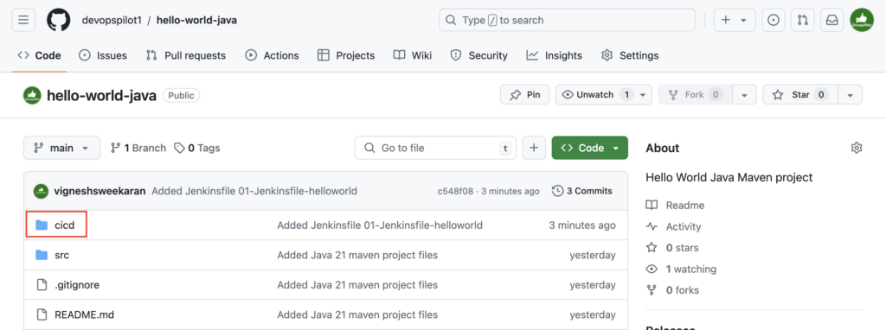
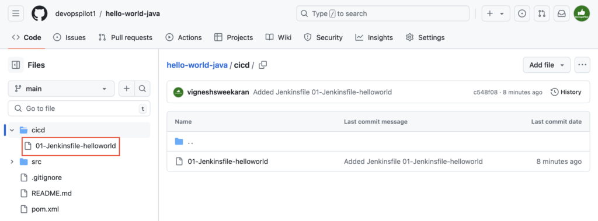
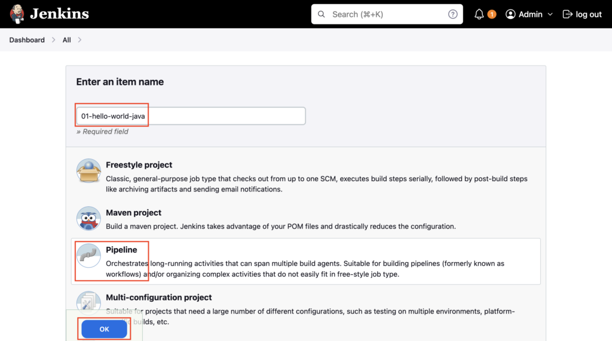
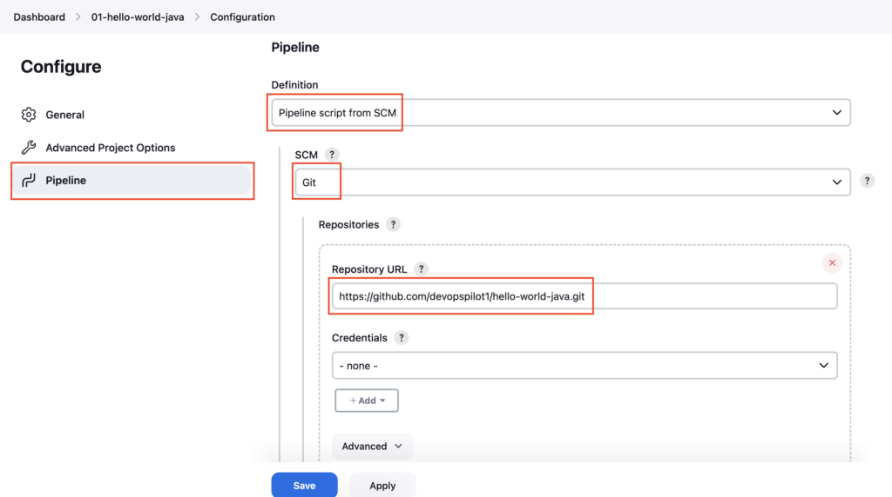
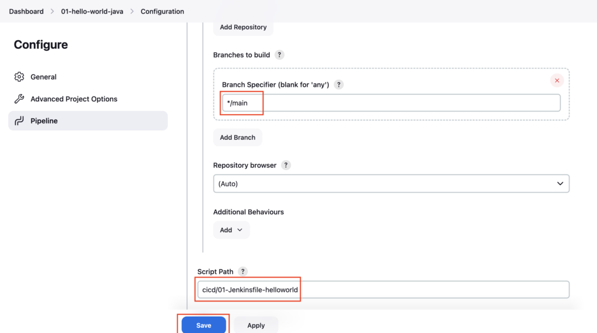
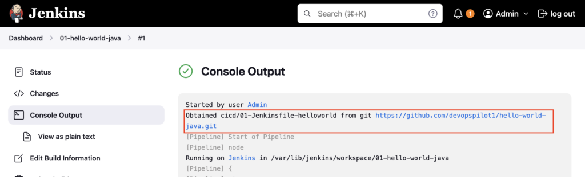
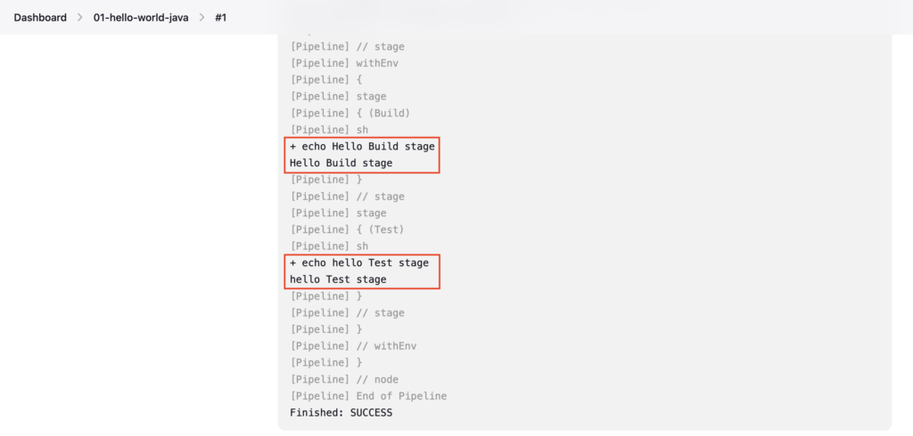

In this tutorial, I explain:
- How to create a Pipeline job in Jenkins
- Where to reference the Jenkinsfile from
- Difference between inline script vs Jenkinsfile from SCM
- How Jenkins reads and executes the Jenkinsfile
- How to trigger and validate the pipeline run

---

Create a GitHub repository with a sample Java Maven project [How to create a GitHub repository and push a sample Java 21 Maven Project](https://devopspilot.com/maven/how-to-create-a-github-repository-and-push-a-sample-java-maven-project/)

**Jenkinsfile** is a file, where you can write all the **build commands** and store the file in the GitHub repository, then Jenkins **Pipeline** can reference it to execute the commands

### Difference: Inline Script vs Pipeline from SCM

In the [previous tutorial](../create-pipeline-script/index.md), we used **Pipeline Script** (Inline), where the code is pasted directly into Jenkins UI.
In this tutorial, we use **Pipeline Script from SCM**, where Jenkins reads the **Jenkinsfile** from a Git repository.

| Feature | Inline Script | Pipeline from SCM |
| :--- | :--- | :--- |
| **Location** | Stored in Jenkins Job Config | Stored in Git Repository |
| **Versioning** | No version control | Versioned with App Code |
| **Collaboration** | Hard to review changes | Easy via Pull Requests |
| **Best For** | Quick testing / Experiments | Production Pipelines |


Create a **Jenkinsfile** named **01-Jenkinsfile-helloworld** inside **cicd**

The **Jenkinsfile** can be named to anything like this **Jenkinsfile-dev**, **01-Jenkinsfile-helloworld**

```bash
mkdir cicd
ls -l
cd cicd
vi 01-Jenkinsfile-helloworld
ls -l
```

```groovy
pipeline {
  agent any
  stages {
    stage ('Build') {
      steps {
        sh 'echo Hello Build stage'
      }
    }
    stage ('Test') {
      steps {
        sh 'echo hello Test stage'
      }
    }
  }
}
```

Reference: [Pipeline Syntax](https://www.jenkins.io/doc/book/pipeline/syntax/)

```
vignesh ~/code/devopspilot1/hello-world-java [main] $ ll
total 16
-rw-r--r-- 1 vignesh  staff   762 Jul 12 22:56 README.md
-rw-r--r-- 1 vignesh  staff  1414 Jul 12 22:56 pom.xml
drwxr-xr-x  4 vignesh  staff   128 Jul 12 22:56 src
```

```
vignesh ~/code/devopspilot1/hello-world-java [main] $ mkdir cicd
```

```
vignesh ~/code/devopspilot1/hello-world-java [main] $ ls -l
total 24
-rw-r--r-- 1 vignesh  staff   210 Jul 15 19:31 01-Jenkinsfile-helloworld
-rw-r--r-- 1 vignesh  staff   762 Jul 12 22:56 README.md
drwxr-xr-x  2 vignesh  staff    64 Jul 15 19:32 cicd
-rw-r--r-- 1 vignesh  staff  1414 Jul 12 22:56 pom.xml
drwxr-xr-x  4 vignesh  staff   128 Jul 12 22:56 src
```

```
vignesh ~/code/devopspilot1/hello-world-java [main] $ cd cicd
```

```
vignesh ~/code/devopspilot1/hello-world-java/cicd [main] $ vi 01-Jenkinsfile-helloworld
```

```
vignesh ~/code/devopspilot1/hello-world-java/cicd [main] $ ls -l
total 8
-rw-r--r-- 1 vignesh  staff  210 Jul 15 19:34 01-Jenkinsfile-helloworld
```

Check Git status

```bash
cd ..
git status
```

```
vignesh ~/code/devopspilot1/hello-world-java/cicd [main] $ cd ..
```

```
vignesh ~/code/devopspilot1/hello-world-java [main] $ git status
On branch main
Your branch is up to date with 'origin/main'.

Untracked files:
  (use "git add <file>..." to include in what will be committed)
	cicd/

nothing added to commit but untracked files present (use "git add" to track)
```

Add the file and push it to the GitHub repository

```bash
git add .
git status
git commit -m "Added Jenkinsfile 01-Jenkinsfile-helloworld"
git push origin main
```

```
vignesh ~/code/devopspilot1/hello-world-java [main] $ git add .
```

```
vignesh ~/code/devopspilot1/hello-world-java [main] $ git status
On branch main
Your branch is up to date with 'origin/main'.

Changes to be committed:
  (use "git restore --staged <file>..." to unstage)
	new file:   cicd/01-Jenkinsfile-helloworld
```

```
vignesh ~/code/devopspilot1/hello-world-java [main] $ git commit -m "Added Jenkinsfile 01-Jenkinsfile-helloworld" 
[main c548f08] Added Jenkinsfile 01-Jenkinsfile-helloworld
 1 file changed, 15 insertions(+)
 create mode 100644 cicd/01-Jenkinsfile-helloworld
```

```
vignesh ~/code/devopspilot1/hello-world-java [main] $ git push origin main
Enumerating objects: 5, done.
Counting objects: 100% (5/5), done.
Delta compression using up to 10 threads
Compressing objects: 100% (4/4), done.
Writing objects: 100% (4/4), 455 bytes | 455.00 KiB/s, done.
Total 4 (delta 1), reused 0 (delta 0), pack-reused 0
remote: Resolving deltas: 100% (1/1), completed with 1 local object.
To https://github.com/devopspilot1/hello-world-java.git
   27d7fcb..c548f08  main -> main
```

Verify **cicd/01-Jenkinsfile-helloworld** file is pushed to the GitHub repository





Goto Jenkins dashboard, click on **New Item**

Enter the Pipeline name **01-hello-world-java**, select **Pipeline**, and then click **OK**



Select the **Pipeline** section, under **Definition** choose **Pipeline script from SCM**

From **SCM** choose **Git** and enter your **GitHub repository** URL



Under **Branch Specifier** change the branch name to **main**

Under **Script Path** enter the Jenkfinsfile path **cicd/01-Jenkinsfile-helloworld** and click on **Save**



Click on **Build Now**

Goto **Console Output**, first it obtained the Jenkinsfile **cicd/01-Jenkinsfile-helloworld** from the GitHub repository, then clones the GitHub Repository and executed the commands defined in the stages



In **Jenkinsfile** you had 2 stages **Build** and **Test**, in both the stages it executes the **sh** step to execute the echo commands



### How Jenkins Reads and Executes

When you clicked **Build Now**:
1. Jenkins connected to the **Git URL** provided.
2. It searched for the file path **`cicd/01-Jenkinsfile-helloworld`**.
3. It read the file contents.
4. It recognized the `pipeline { ... }` syntax.
5. It then executed the stages sequentially (`Build` -> `Test`).

---

## Important Tips

!!! tip
    **Single Source of Truth**: Storing the pipeline in SCM means your build logic is versioned alongside your application code. This allows you to roll back build logic just like you roll back code changes.

!!! important
    **Branching**: When using "Pipeline script from SCM", Jenkins will check out the specific branch you configured. If you are using Multibranch Pipelines (advanced), Jenkins can automatically discover Jenkinsfiles in all branches.

## 🧠 Quick Quiz — Pipeline from SCM

<quiz>
What does "Pipeline script from SCM" allow you to do?
- [x] Load the pipeline code from a version control system like Git.
- [ ] Write the script in Python instead of Groovy.
- [ ] Run the pipeline only on SCM (Source Control Management) servers.
- [ ] Ignore the Jenkinsfile and use the UI definition.

"SCM" stands for Source Control Management. This option instructs Jenkins to fetch the Jenkinsfile from a repository (like GitHub/GitLab) rather than using a script typed into the browser.
</quiz>

