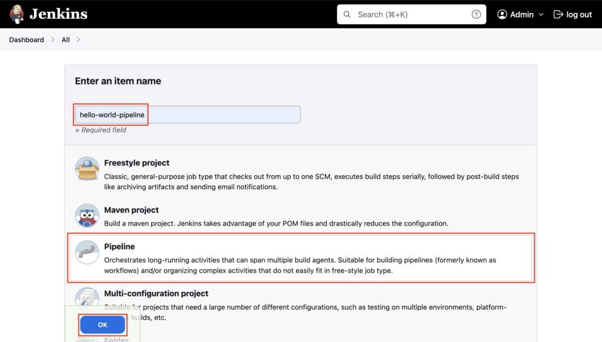
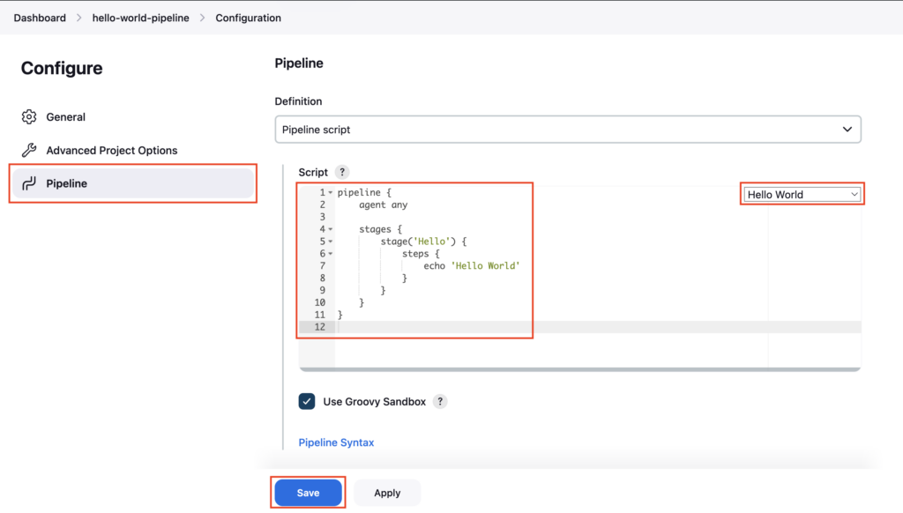
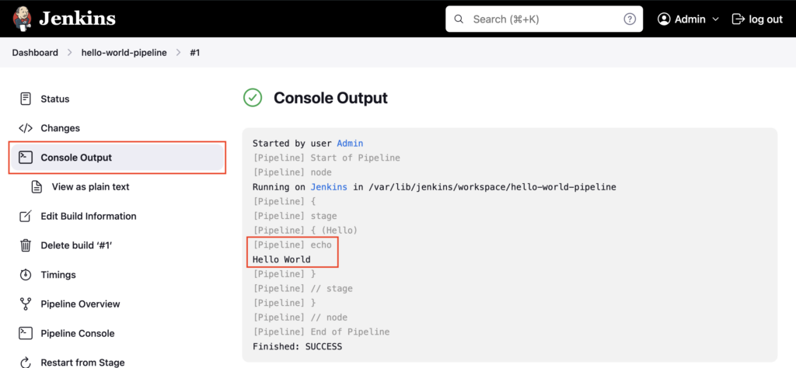

Pipeline Script is often the first step toward understanding how Jenkins pipelines actually work under the hood.

In this tutorial, I explain:

- What a Pipeline Script job is in Jenkins
- How it differs from Freestyle jobs
- Where the Groovy-based pipeline script lives
- How stages and steps are defined
- How Jenkins executes the pipeline end to end

Pipeline Script helps you:

- Understand pipeline flow before moving to Jenkinsfile
- Experiment quickly without committing code
- Learn core pipeline concepts clearly

---

## What is a Pipeline Script?

**Pipeline Script** in Jenkins allows you to define your build process using **Groovy code** directly in the Jenkins web interface.

Unlike **Freestyle jobs**, which rely on UI checkboxes and dropdowns, Pipeline Script gives you:

- **Code-based configuration**: Use logic, loops, and conditionals.
- **Durability**: Running pipelines survive Jenkins restarts.
- **Visualized Stages**: Clear feedback on which stage (Build, Test, Deploy) failed.

---

Goto Jenkins dashboard, click on **New Item**

Enter the Pipeline name **hello-world-pipeline**, select **Pipeline**, and then click **OK**

Select the **Pipeline** section, under **Definition** choose **Pipeline script**, and choose **Hello World**, sample pipeline script is added, and click on **Save**

In this, we have the **Hello** stage, which will execute an **`echo`** command to print **Hello World** to the Console Output.

### Understanding the Script Structure

The script follows a specific hierarchy:

- **`pipeline`**: The wrapper for the entire job.
- **`agent any`**: Tells Jenkins to run this on any available node (executor).
- **`stages`**: Blocks that define the sequence of tasks (e.g., Build, Test).
- **`steps`**: The actual commands (like `sh`, `echo`, `git`) inside a stage.

> **Note:** In this method, the **Groovy-based pipeline script lives** directly in the Jenkins job configuration (specifically in the `config.xml` file on the Jenkins controller), not in an external Git repository.

**Reference:** [Jenkinsfile Syntax](https://www.jenkins.io/doc/book/pipeline/syntax/)

Click on **Build Now**

### Pipeline Execution Flow

When you trigger the build, Jenkins executes the pipeline end-to-end:

1.  **Parses the Script**: Jenkins reads the Groovy syntax.
2.  **Allocates a Node**: Based on `agent any`, it finds an available executor.
3.  **Runs Stages**: It executes `Hello` stage.
4.  **Executes Steps**: It runs the `echo` command.
5.  **Finalizes**: Reports the build status (Success/Failure).

Goto **Console Output**, **Hello World** is printed on the logs using the **echo** command. In this way, you can execute any **shell** commands from the pipeline script.

This way of writing the **pipeline script** in **Jenkins UI** is used mostly for **testing purposes** only. Since the **script changes** are not **trackable**.

The better way is to write the **pipeline script** in **Jenkinsfile** and store it in a **GitHub repository**.

---

## Important Tips

!!! tip
    **Sandbox**: Inline scripts run in a Groovy Sandbox to prevent malicious code execution. Some advanced Groovy methods might require administrator approval via "In-process Script Approval".

!!! note
    **Limitations**: Inline scripts are hard to review and verify since they are part of the Jenkins configuration, not git. Use them only for quick prototypes or very simple administrative tasks.

## 🧠 Quick Quiz — Pipeline Script

<quiz>
Which language is used to write a Jenkins Pipeline Script?
- [ ] YAML
- [ ] Bash
- [x] Groovy
- [ ] JSON

Jenkins Pipeline scripts are written using Groovy syntax.
</quiz>

