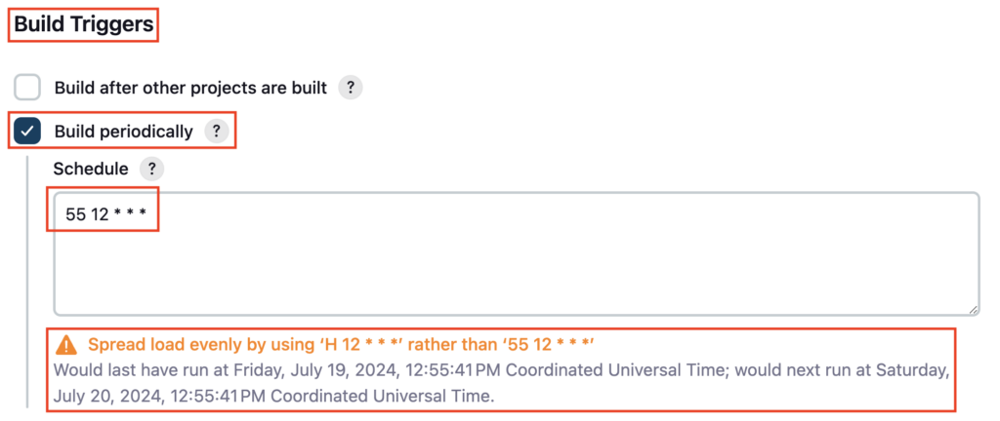
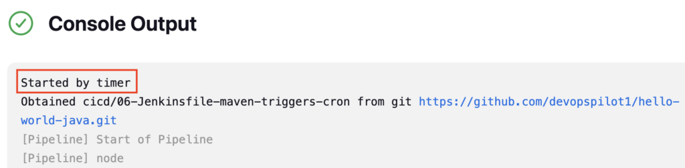
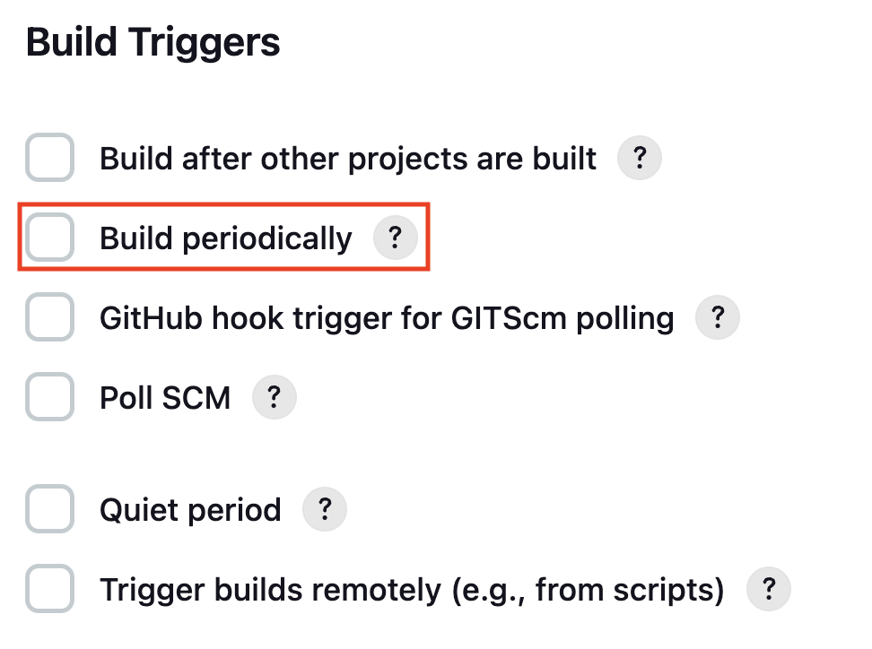
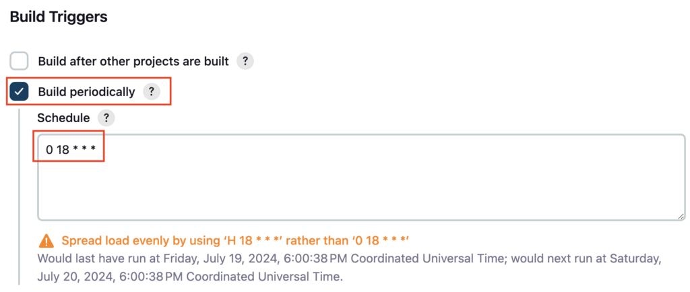

In Software Development, you want to execute the Integration test on a Nightly or weekly basis. To facilitate this requirement Jenkins has the Cron expression to trigger the pipeline on Specific Time and you can pass the CRON expression from Jenkinsfile

You can define the CRON syntax like **0 18 \* \* \*** which will trigger the Jenkins Pipeline at **6 PM daily**

### Create Pipeline

Create a **Jenkinsfile** named **06-Jenkinsfile-maven-triggers-cron** inside the **cicd** folder

```groovy
pipeline {
  agent any
  tools {
    maven 'maven-3.6.3' 
  }
  stages {
    stage ('Build') {
      steps {
        sh 'mvn clean package'
      }
    }
  }
}
```

If you do not have a sample Java code, follow these steps to create one

[How to create a GitHub repository and push a sample Java 21 Maven Project](https://devopspilot.com/maven/how-to-create-a-github-repository-and-push-a-sample-java-maven-project/)

Push the ****06-Jenkinsfile-maven-triggers-cron**** file to the GitHub repository

Create a Jenkins Pipeline named **06-hello-world-trigger-cron** referring to your GitHub repository and enter **Script Path** as **`cicd/06-Jenkinsfile-maven-triggers-cron`**

Click on **Configure**


Under **Build Triggers** enable the **Build periodically**, under the **Schedule** section enter your required cron expression and click on **Save**

I have entered **55 12 \* \* \*** which will trigger the Jenkins pipeline at **12 55 PM daily**



Wait for the scheduled time and the pipeline will be triggered automatically

Check the Console output logs, it printed **Started by timer**



### Enabling Cron from Jenkinsfile

Previously you have enabled the **Build periodically** from **Jenkins Pipeline GUI**. You can also enable the **Build periodically** option and trigger the Jenkins Pipeline using **cron** under the triggers block from **Jenkinsfile**

Uncheck the option **Build periodically** from Pipeline and click on Save



Let’s enable it from Jenkinfile

Add **triggers block** in Jenkinsfile **06-Jenkinsfile-maven-triggers-cron**

**`cron '0 18 * * *'`** inside the **triggers block** will enable the **Build periodically** option and set the Schedule to **`0 18 * * *`** , which will trigger the Jenkins Pipeline at **6 PM daily**

```groovy
pipeline {
  agent any
  triggers {
    cron '0 18 * * *'
  }
  tools {
    maven 'maven-3.6.3' 
  }
  stages {
    stage ('Build') {
      steps {
        sh 'mvn clean package'
      }
    }
  }
}
```

**Reference**: [Jenkins Triggers](https://www.jenkins.io/doc/book/pipeline/syntax/#triggers)

Push the changes to your GitHub repository

```
git diff
```

```
vignesh ~/code/devopspilot1/hello-world-java/cicd [main] $ git diff
diff --git a/cicd/06-Jenkinsfile-maven-triggers-cron b/cicd/06-Jenkinsfile-maven-triggers-cron
index 0e3fd6f..24c5856 100644
--- a/cicd/06-Jenkinsfile-maven-triggers-cron
+++ b/cicd/06-Jenkinsfile-maven-triggers-cron
@@ -1,5 +1,8 @@
 pipeline {
   agent any
+  triggers {
+    cron '0 18 * * *'
+  }
   tools {
     maven 'maven-3.6.3' 
   }
```

**Build** the pipeline, and check the pipeline configuration now **Build periodically** option should be enabled



### Reference:

- [GitHub Repository](https://github.com/vigneshsweekaran/hello-world)

---

## 🧠 Quick Quiz — Cron Trigger

<quiz>
Which trigger option allows you to run a Jenkins pipeline on a schedule (e.g., every night)?
- [ ] pollSCM
- [x] cron
- [ ] upstream
- [ ] webhook

The `cron` trigger accepts a cron-syntax string (e.g., `0 18 * * *`) to execute the pipeline at specific times.
</quiz>

