### Install Maven in the Jenkins server

```bash
sudo apt install maven
```

```
ubuntu@jenkins-test:~$ sudo apt install maven
Reading package lists... Done
Building dependency tree... Done
Reading state information... Done
The following additional packages will be installed:
  libaopalliance-java libapache-pom-java libatinject-jsr330-api-java libcdi-api-java libcommons-cli-java libcommons-io-java
  libcommons-lang3-java libcommons-parent-java liberror-prone-java libgeronimo-annotation-1.3-spec-java
  libgeronimo-interceptor-3.0-spec-java libguava-java libguice-java libjansi-java libjsr305-java libmaven-parent-java
  libmaven-resolver-java libmaven-shared-utils-java libmaven3-core-java libplexus-cipher-java libplexus-classworlds-java
  libplexus-component-annotations-java libplexus-interpolation-java libplexus-sec-dispatcher-java libplexus-utils2-java
  libsisu-inject-java libsisu-plexus-java libslf4j-java libwagon-file-java libwagon-http-shaded-java libwagon-provider-api-java
Suggested packages:
  libatinject-jsr330-api-java-doc libel-api-java libcommons-io-java-doc libasm-java libcglib-java libjsr305-java-doc
  libmaven-shared-utils-java-doc liblogback-java libplexus-utils2-java-doc junit4 testng libcommons-logging-java liblog4j1.2-java
The following NEW packages will be installed:
  libaopalliance-java libapache-pom-java libatinject-jsr330-api-java libcdi-api-java libcommons-cli-java libcommons-io-java
  libcommons-lang3-java libcommons-parent-java liberror-prone-java libgeronimo-annotation-1.3-spec-java
  libgeronimo-interceptor-3.0-spec-java libguava-java libguice-java libjansi-java libjsr305-java libmaven-parent-java
  libmaven-resolver-java libmaven-shared-utils-java libmaven3-core-java libplexus-cipher-java libplexus-classworlds-java
  libplexus-component-annotations-java libplexus-interpolation-java libplexus-sec-dispatcher-java libplexus-utils2-java
  libsisu-inject-java libsisu-plexus-java libslf4j-java libwagon-file-java libwagon-http-shaded-java libwagon-provider-api-java maven
0 upgraded, 32 newly installed, 0 to remove and 0 not upgraded.
```

Check **maven version**

```bash
mvn --version
```

```
ubuntu@jenkins-test:~$ mvn --version
Apache Maven 3.8.7
Maven home: /usr/share/maven
Java version: 21.0.3, vendor: Ubuntu, runtime: /usr/lib/jvm/java-21-openjdk-amd64
Default locale: en, platform encoding: UTF-8
OS name: "linux", version: "6.8.0-1009-azure", arch: "amd64", family: "unix"
```

Installed Maven version is **3.8.7**

**NOTE:** To install Maven, Java should be installed first

### Create Freestyle Project

Goto Jenkins dashboard, click on **New Item**


Enter the Freestyle project name **freestyle-project-maven**, select **Freestyle project** and then click **OK**

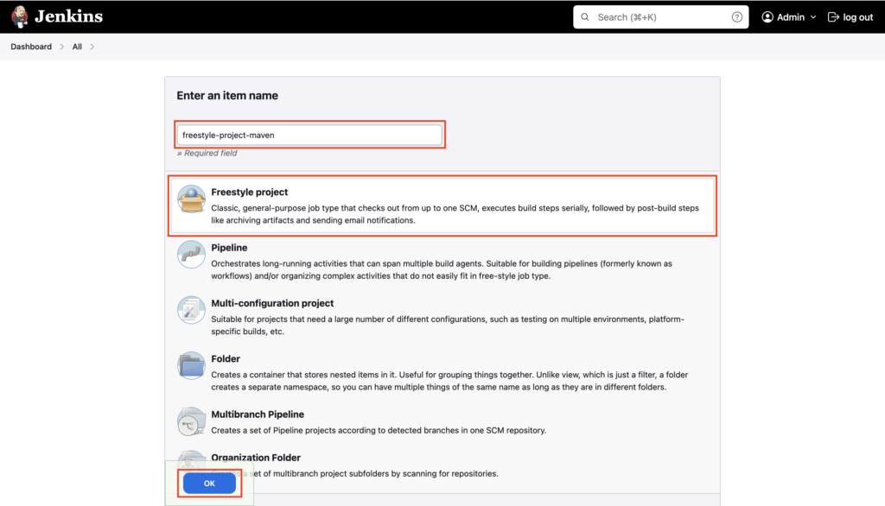

Select **Source Code Management** -> **Git** Enter your Public GitHub repository https URL where you have the Maven Java Project

If you don't have a sample Hello World Maven Java project. Fork this Github repository [https://github.com/vigneshsweekaran/hello-world](https://github.com/vigneshsweekaran/hello-world) and use your Github repository URL

Enter Branch Specifier as **main**

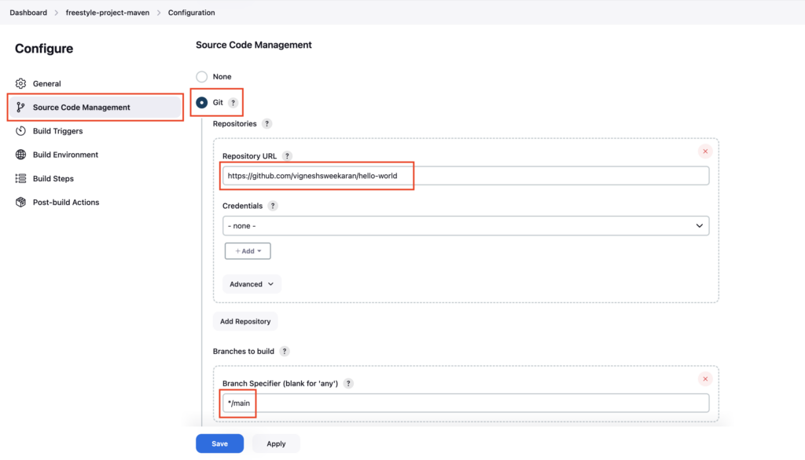

Click on **Build Steps** -> **Add build steps** -> **Execute shell**

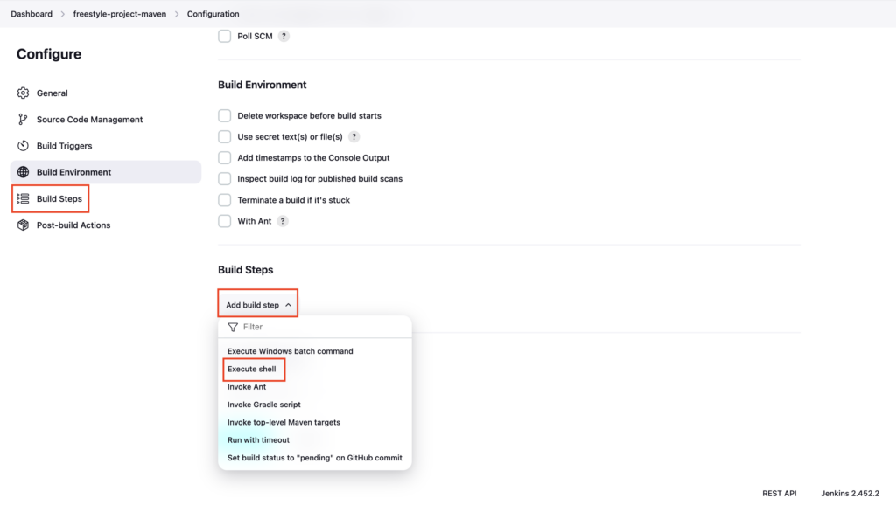

Enter **`mvn clean package`** command and click on **Save**

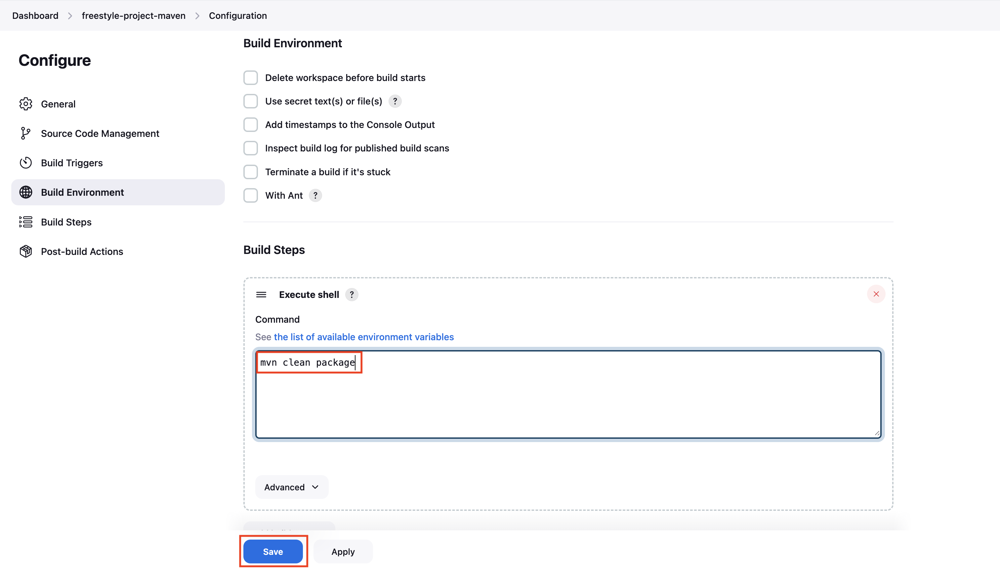

### Build the Freestyle Project

Click on **Build Now** to run a Freestyle project

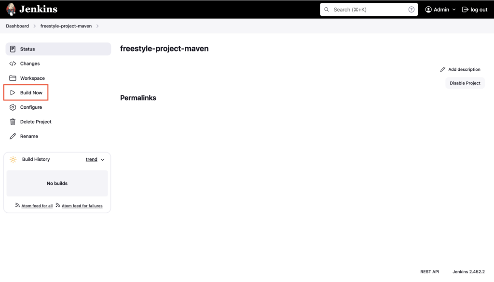

**1st** Build started

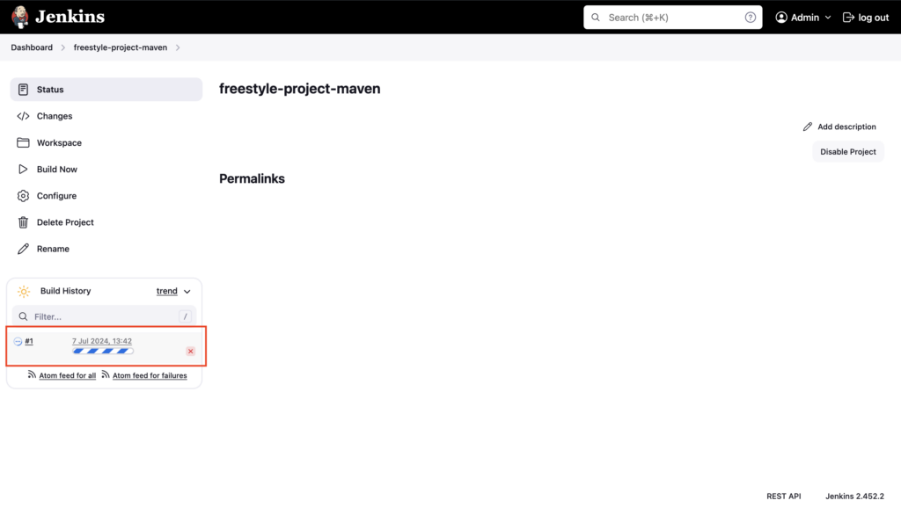

Click on Build Number **#1** to see the details

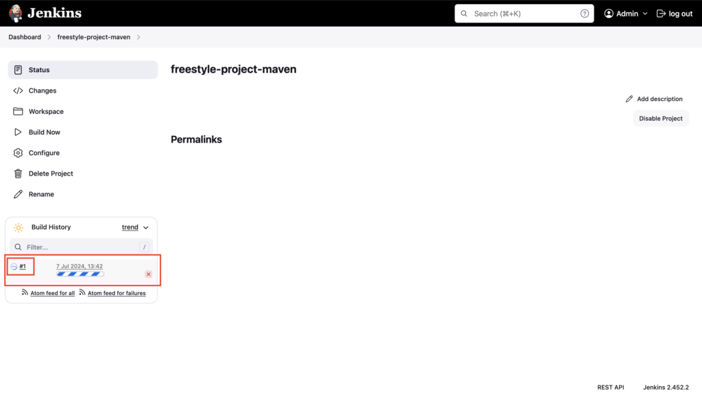

Here you can see,

- Who triggered this Freestyle project

- GitHub repository URL

- Github repository Branch

- Commit id

Now click on **Console output** to see the Build logs

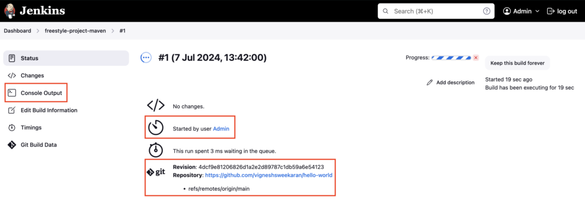

Click on **Full Log**

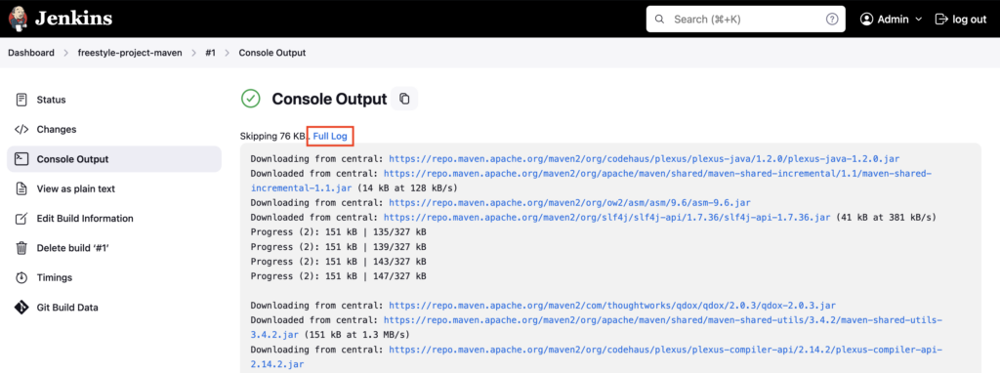

Here you can see Jenkins is building this Freestyle project in the Jenkins server from **/var/lib/jenkins/workspace/freestyle-project-maven** folder

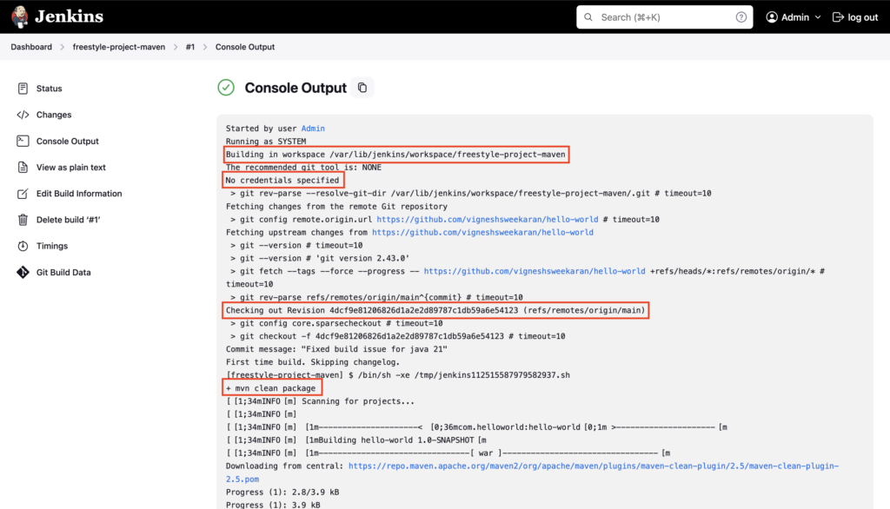

- Jenkins HOME folder is **`/var/lib/jenkins`**, under this folder, Jenkins keeps all the details as files

- In **`/var/lib/jenkins/workspace`** it keeps track of any Freestyle projects or Pipelines created in Jenkins

- In this case, the Freestyle Project name is **freestyle-project-maven** so it created a **freestyle-project-maven** folder in /**var/lib/jenkins**/**workspace** E.g. **`/var/lib/jenkins/workspace/freestyle-project-maven`**

Jenkins will clone the GitHub repository given during the Freestyle project creation in this folder for building

You can verify the same in the Jenkins server

Change to root user in Jenkins server

```bash
sudo su
```

```
ubuntu@jenkins-test:~$ sudo su
[sudo] password for ubuntu: 
root@jenkins-test:/home/ubuntu#
```

Goto **/var/lib/jenkins/workspace/freestyle-project-maven** and list the files there

```bash
cd /var/lib/jenkins/workspace/freestyle-project-maven
pwd
ls -l
```

```
root@jenkins-test:/home/ubuntu# cd /var/lib/jenkins/workspace/freestyle-project-maven/
root@jenkins-test:/var/lib/jenkins/workspace/freestyle-project-maven# pwd
/var/lib/jenkins/workspace/freestyle-project-maven
root@jenkins-test:/var/lib/jenkins/workspace/freestyle-project-maven# ls -l
total 44
-rw-r--r-- 1 jenkins jenkins   95 Jul  7 13:01 Dockerfile
-rw-r--r-- 1 jenkins jenkins 2654 Jul  7 13:16 README.md
-rw-r--r-- 1 jenkins jenkins  646 Jul  7 13:01 appspec.yml
-rw-r--r-- 1 jenkins jenkins 2146 Jul  7 13:01 buildspec.yml
drwxr-xr-x  3 jenkins jenkins 4096 Jul  7 13:16 cicd
drwxr-xr-x  3 jenkins jenkins 4096 Jul  7 13:01 codedeploy
drwxr-xr-x  5 jenkins jenkins 4096 Jul  7 13:01 deployment
-rw-r--r-- 1 jenkins jenkins 1414 Jul  7 13:16 pom.xml
-rw-r--r-- 1 jenkins jenkins  231 Jul  7 13:01 sonar-project.properties
drwxr-xr-x  4 jenkins jenkins 4096 Jul  7 13:01 src
drwxr-xr-x 10 jenkins jenkins 4096 Jul  7 13:42 target
```

And in the **Console Output** you can see **No credentials specified** is mentioned. While creating the Freestyle Project, you have given the Public Github repository URL and you have not selected any github credentials.

Next its cloning the repository with latest **Git Commit Id** from the branch **refs/remotes/origin/main**

Next its executing the command **mvn clean package** which you have given in the **Build Steps** -> **Execute Shell**

Once the build is completed, it creates a war file in the path **/var/lib/jenkins/workspace/freestyle-project-maven/target/hello-world-1.0-SNAPSHOT.war**

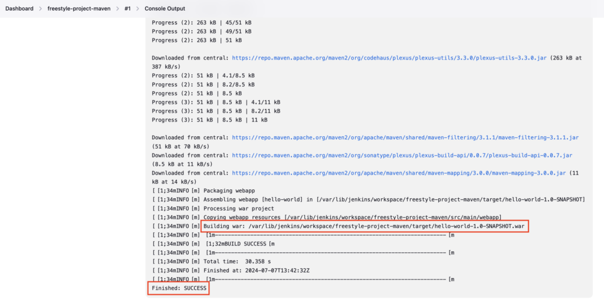

---

## Important Tips

!!! tip
    **Agent Labels**: In a real-world scenario, you often restrict where the project runs using "Restrict where this project can be run" and filtering by label (e.g., `linux`, `java21`), similar to `agent { label 'linux' }` in Pipelines.

!!! important
    **Freestyle Limitations**: Freestyle projects are hard to version control and audit compared to Pipelines (Jenkinsfile). They are generally not recommended for complex CD workflows anymore.

## 🧠 Quick Quiz — Freestyle Projects

<quiz>
Where does Jenkins store the workspace for a Freestyle project (e.g., named "demo") by default on a Linux controller?
- [ ] /tmp/demo
- [x] /var/lib/jenkins/workspace/demo
- [ ] /home/ubuntu/demo
- [ ] /opt/jenkins/demo

By default, Jenkins workspaces are created under `$JENKINS_HOME/workspace/<project-name>`. On standard Linux installs, `$JENKINS_HOME` is `/var/lib/jenkins`.
</quiz>

