You may use many plugins in Jenkins, and **finding the code** for those plugins to use in Jenkinsfile is sometimes challenging.  
**Declarative Directive Generator** is helpful to generate the code to use in Jenkinsfile for most of the plugins and pipeline steps

You can generate code for both **Scripted** and **Declarative** Jenkisnfile

For Scripted Jenkinsfile use **Snippet Generator** and for **Declarative** Jenkisnfile use **Declarative Directive Generator**

Reference: **[Snippet Generator](https://www.jenkins.io/doc/book/pipeline/getting-started/#snippet-generator)**

### How to go to Snippet Generator

In your Jenkins URL append path **/pipeline-syntax** E.g. **https:jenkins.com/piepline-syntax**

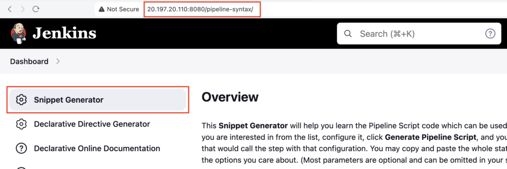

### How to go to **Declarative Directive Generator**

In your Jenkins URL append path **/directive-generator** E.g. **https:jenkins.com/directive-generator** then click on **Declarative Directive Generator**

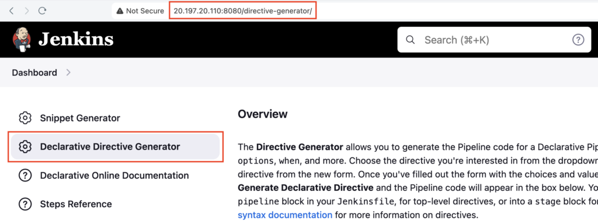

### How to go to Declarative Directive Generator from Pipeline Page

From any pipeline page, you can click on **Pipeline Syntax** to go to **Snippet Generator** or **Declarative Directive Generator**

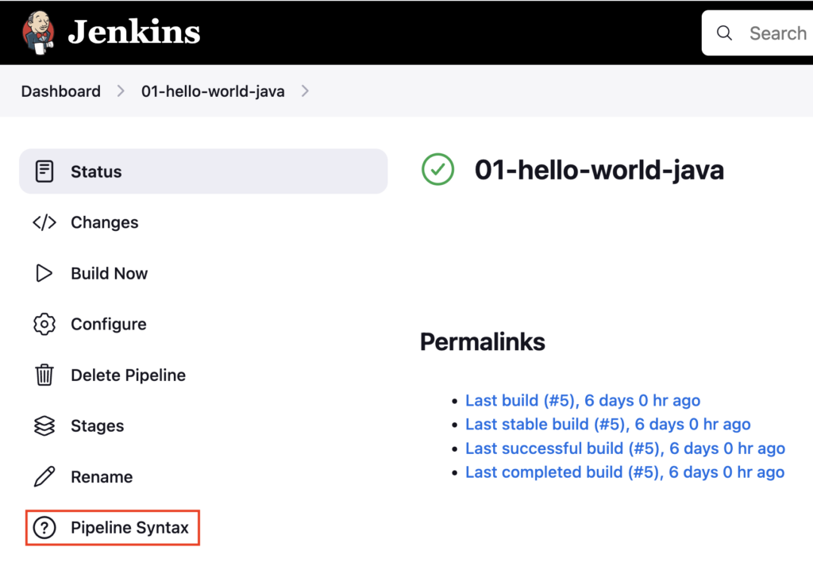

### Generate code for cron triggers using Declarative Directive Generator

Go to your **JENKINS\_URL/directive-generator** E.g. **https:jenkins.com/directive-generator**

Under **Sample Directive** choose **triggers: Triggers** from dropdown

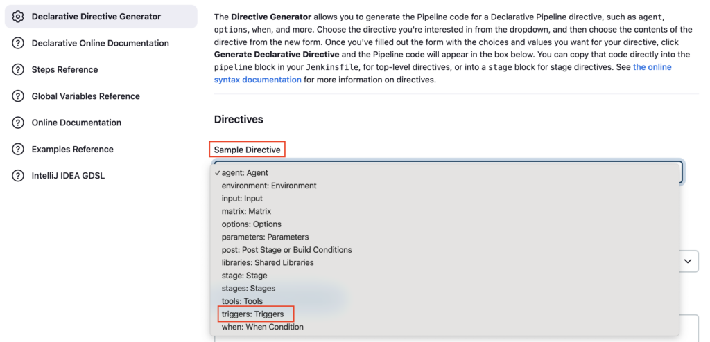

Click on **Add** and choose **cron: Build periodically**

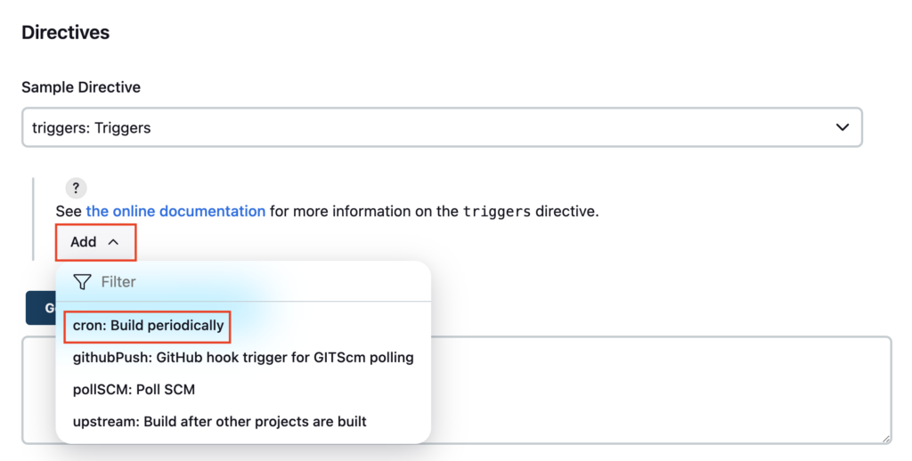

Enter the cron expression **`* * * * *`**

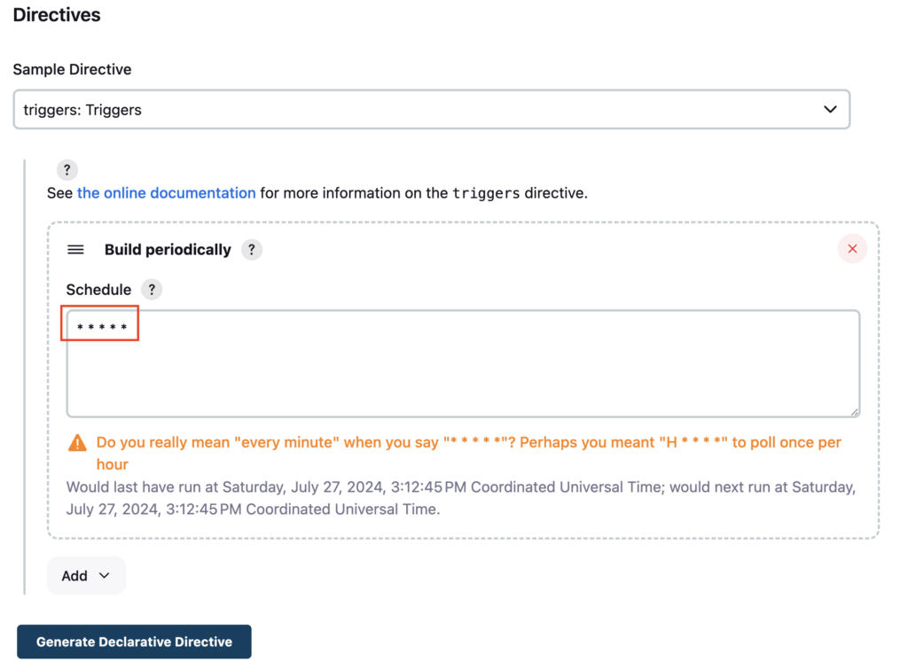

Click on the **Generate Declarative Directive** to generate the code

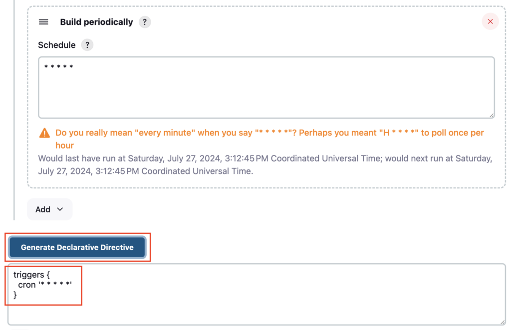

Copy the generated code

```groovy
triggers {
  cron '* * * * *'
}
```

### Generate code for tools block using Declarative Directive Generator

Choose **`tools: Tools`** from the dropdown under **Sample Directive**

Click on **Add** and choose **`maven: Maven`**

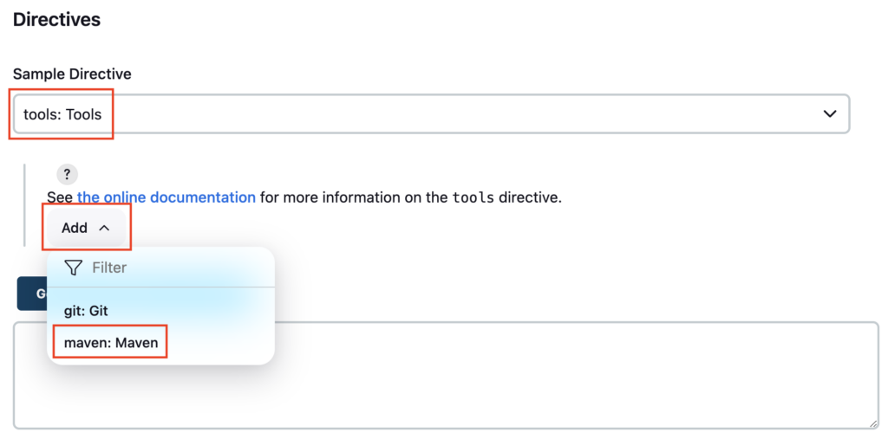

Click on the **Generate Declarative Directive** to generate the **tools block** code

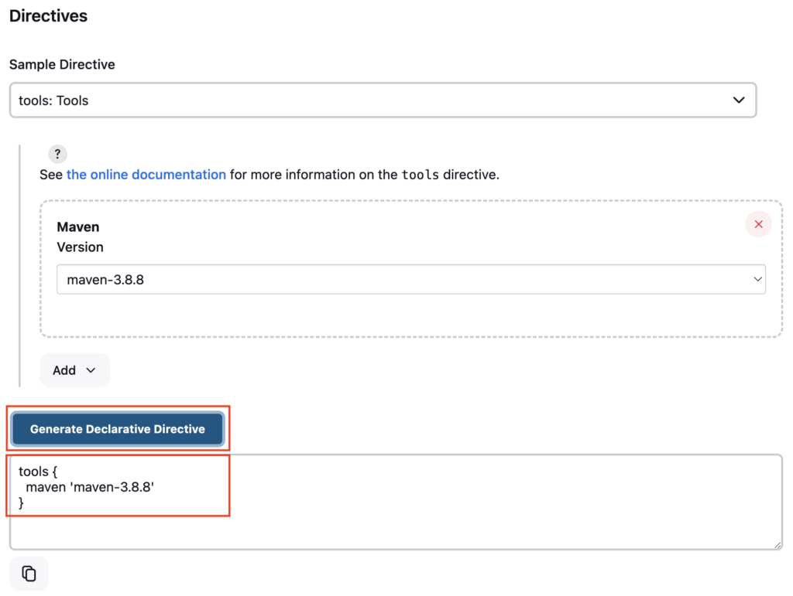

Copy the generated code

```groovy
tools {
  maven 'maven-3.8.8'
}
```

### Generate code to trigger other pipelines using Declarative Directive Generator

This feature was available from scripted Jenkinsfile, so it needs to generate it from the **Snippet Generator**

Go to **Snippet Generator**, choose **`build: Build a job`** from Sample Step

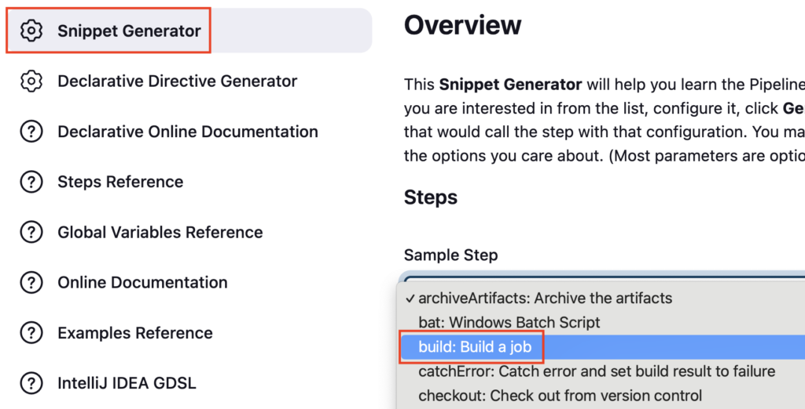

Enter the child pipeline name **01-hello-world-java** you want to trigger under **Project to Build**

Enable **Wait for completion** depends on your needs

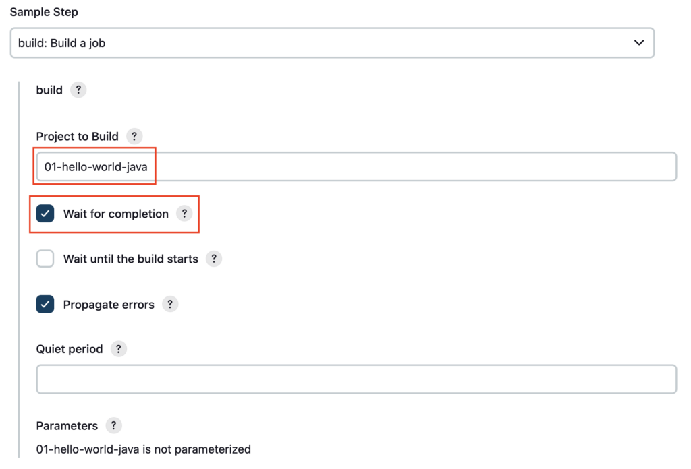

Click on **Generate Pipeline Script** to generate the code to trigger the child pipeline

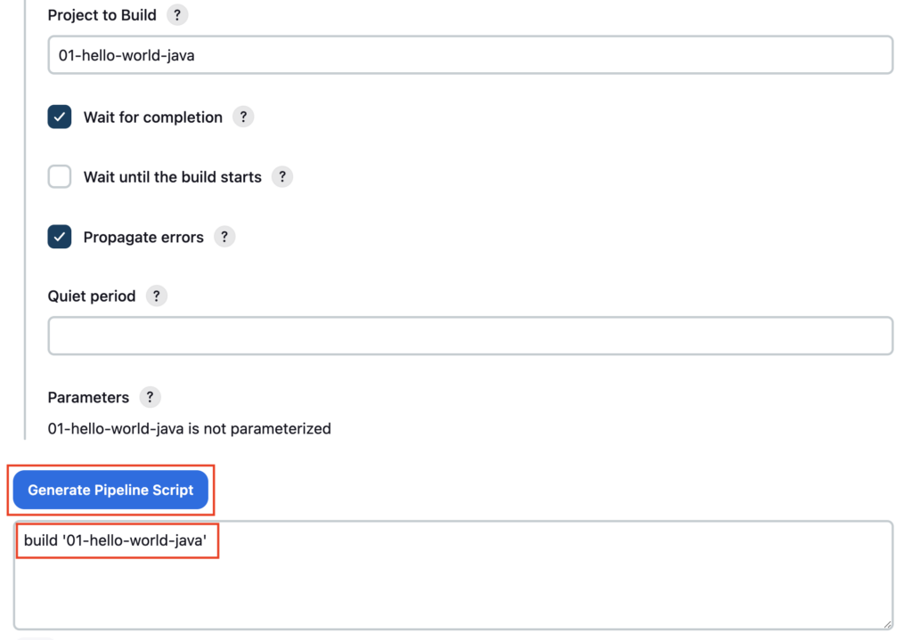

Copy the generated code

```groovy
build '01-hello-world-java'
```

Like this you can generate the Jenkinsfile code snippet for most of the plugin use cases
