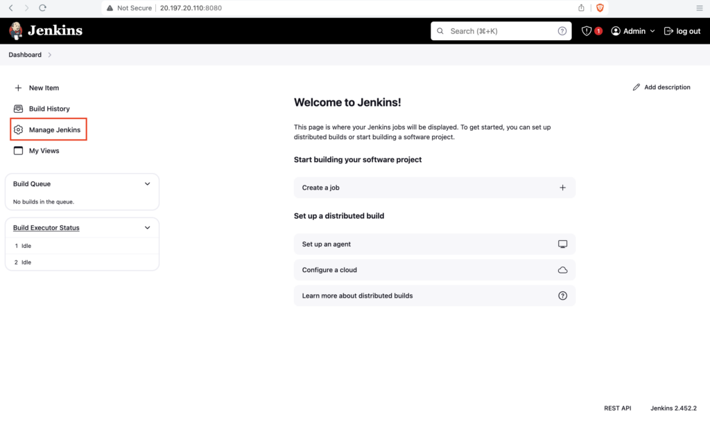
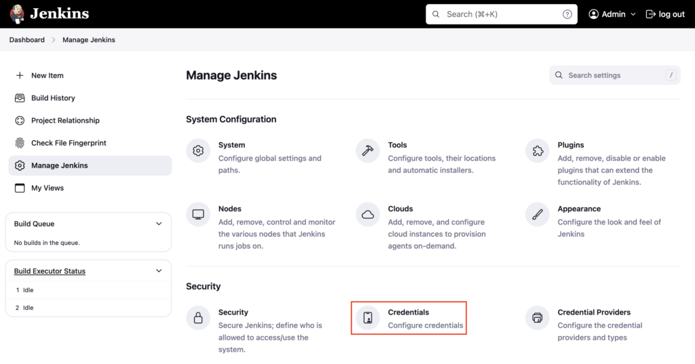
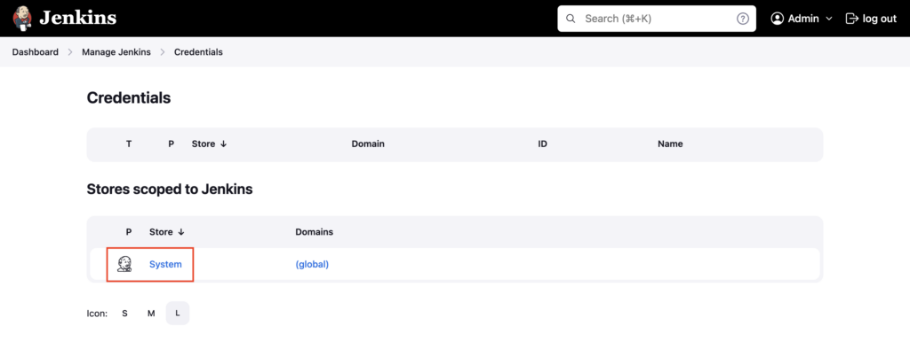
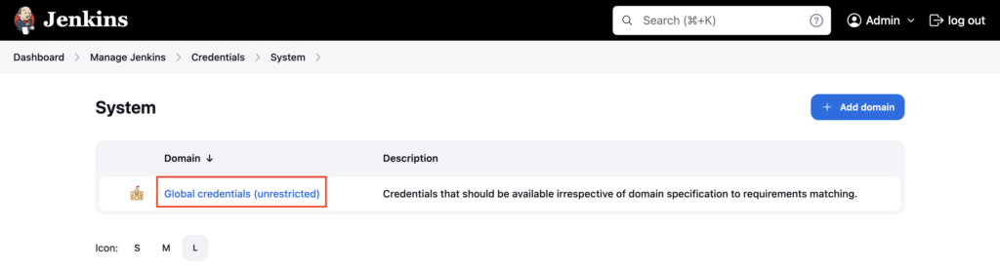
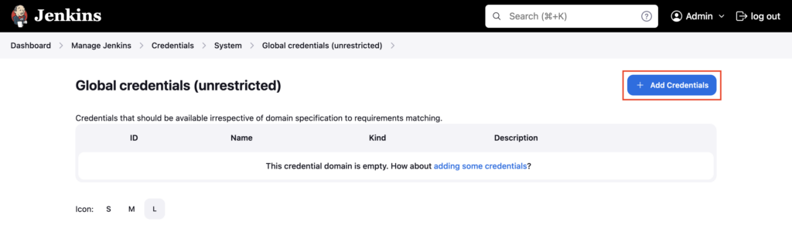
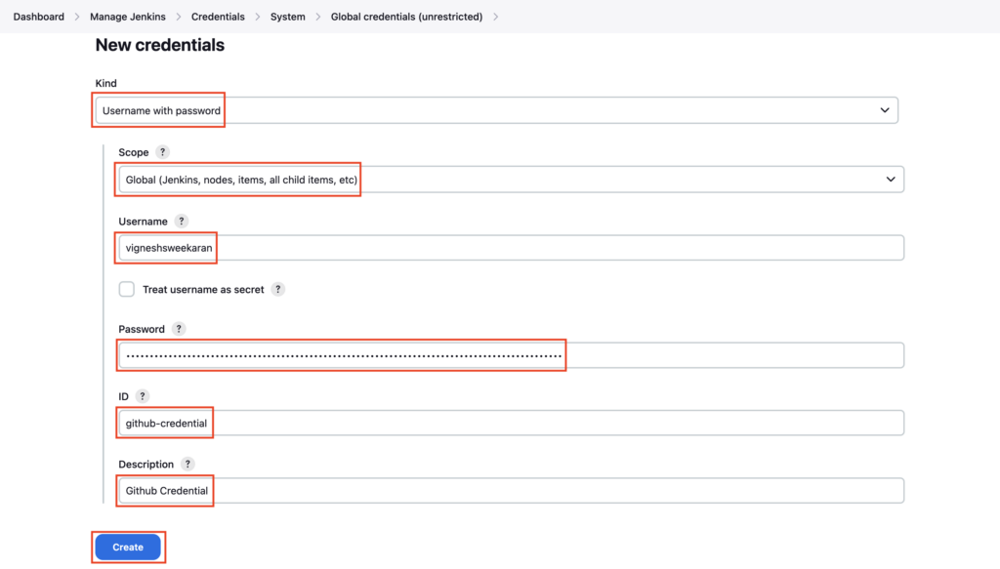
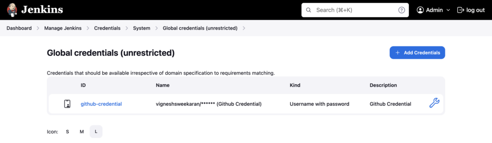

Goto Jenkins dashboard, click on **Manage Jenkins**

Click on **Credentials**

Click on **System**

Click on **Global credentials**

Click on **Add Credentials**

Under **kind** choose **Username with password**

With **kind** (**Username with password** ) you can store any credentials which have a username and password/token E.g. Github, DockerHub, Sonarqube, Jfrog Artifactory credentials

Select **Scope** as **Global**

Globally scoped credentials are accessible to any pipelines inside any folder in Jenkins

Enter the **Username**, and GitHub token in the **Password** section  
Enter **github-credential** under **ID** and **Github Credential** under **Description**

Click on **Create**

Credential is created and the GitHub token is safely stored for use in Jenkins pipelines

---

## Important Tips

!!! tip
    **Least Privilege**: When creating a Personal Access Token (PAT) in GitHub, select only the scopes necessary. For checking out code, `repo` scope is usually sufficient. Avoid giving full `admin` access.

!!! note
    **Credentials ID**: Choose a meaningful ID (e.g., `github-token-devopspilot`) instead of the auto-generated UUID. This makes your Jenkinsfiles readable and easier to debug.

## 🧠 Quick Quiz — Credentials

<quiz>
Which "Kind" of credential should you use to store a GitHub Username and Personal Access Token?
- [ ] Secret text
- [x] Username with password
- [ ] Secret file
- [ ] SSH Username with private key

In Jenkins, a **Username with password** credential type is used to store a username/token pair for services like GitHub, Docker Hub, etc.
</quiz>

