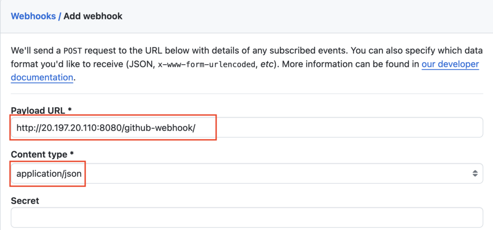

Webhook is a feature in the GitHub repository, that is used to t**rigger the URL** based on GitHub repository events like **Create events**, **Push events**, and **Delete events**  
Using this feature you can trigger the Jenkins pipeline automatically when you push a commit (any changes)

- Create events - Creating a commit, Creating a tag, Creating a branch

- Push events - Pushing a commit, Pushing a tag, Pushing a branch

- Delete events - Deleting a commit, Deleting a tag, Deleting a branch

### Create Pipeline

Create a **Jenkinsfile** named ****04-Jenkinsfile-maven-triggers-webhook**** inside the **cicd** folder

```groovy
pipeline {
  agent any
  tools {
    maven 'maven-3.6.3' 
  }
  stages {
    stage ('Build') {
      steps {
        sh 'mvn clean package'
      }
    }
  }
}
```

If you do not have a sample Java code, follow these steps to create one

[How to create a GitHub repository and push a sample Java 21 Maven Project](https://devopspilot.com/maven/how-to-create-a-github-repository-and-push-a-sample-java-maven-project/)

Push the ********04-Jenkinsfile-maven-triggers-webhook******** file to the GitHub repository

Create a Jenkins Pipeline named **04-hello-world-trigger-webhook** referring to your GitHub repository and enter **Script Path** as **`cicd/04-Jenkinsfile-maven-triggers-webhook`**

Click on **Configure**


Under **Build Triggers** enable the **GitHub hook trigger for GITScm polling** and click on **Save**


### Enable Webhook in GitHub repository

Go to your GitHub repository, click on **Settings**


Click on **Webhooks**


Click on **Add webhook**


Enter your **JENKINS\_URL/github-webhook/** in Payload URL  
E.g. **http://20.197.20.110:8080/github-webhook/**

Under **Content type** choose **application/json**



Click **Disable (not recommended)** and click on **Add webhook**

If your Jenkins URL starts with **https**, you should click **Enable SSL verification**


Wait for a couple of seconds, refresh the page, and you should see a **green tick**


Make a change in **04-hello-world-trigger-webhook** or any File, and **commit the changes** to **trigger** the Pipeline **automatically**

Change the stage name to **Build Maven** and commit the changes


**Commit** the changes


The pipeline is **triggered automatically**, once the change is committed


You can verify, who triggered this pipeline by verifying the logs


### Enable GitHub Webhook from Jenkinsfile

You have enabled the **GitHub hook trigger for GITScm polling** from **Jenkins Pipeline GUI**. You can also do the same from **Jenkinsfile** using the **triggers** block

Previously you have enabled the **GitHub hook trigger for GITScm polling** from **Jenkins Pipeline GUI**. You can also enable the **GitHub hook trigger for GITScm polling** option and trigger the Jenkins Pipeline using **githubPush** under the triggers block from **Jenkinsfile**


Uncheck the option **GitHub hook trigger for GITScm polling** from Pipeline and click on **Save**  
Let's enable it from Jenkinfile


Add **triggers block** in Jenkinsfile **04-hello-world-trigger-webhook**

**githubPush()** inside the triggers block will enable the **GitHub hook trigger for GITScm polling** in the pipeline

```groovy
pipeline {
  agent any
  triggers {
    githubPush()
  }
  tools {
    maven 'maven-3.6.3'
  }
  stages {
    stage ('Build Maven') {
      steps {
        sh 'mvn clean package'
      }
    }
  }
}
```

```bash
git diff
```

**OUTPUT:**

```
vignesh ~/code/devopspilot1/hello-world-java/cicd [main] $ git diff
diff --git a/cicd/04-Jenkinsfile-maven-triggers-webhook b/cicd/04-Jenkinsfile-maven-triggers-webhook
index 1801267..c343b6b 100644
--- a/cicd/04-Jenkinsfile-maven-triggers-webhook
+++ b/cicd/04-Jenkinsfile-maven-triggers-webhook
@@ -1,5 +1,8 @@
 pipeline {
   agent any
+  triggers {
+    githubPush()
+  }
   tools {
     maven 'maven-3.6.3' 
   }
```

Push the changes to your GitHub repository

**Build** the pipeline, and check the pipeline configuration now **GitHub hook trigger for GITScm polling** should be enabled


### Reference:

- [GitHub Repository](https://github.com/vigneshsweekaran/hello-world)

---

## Important Tips

> [!TIP]
> **Security**: In the GitHub webhook settings, you can set a "Secret". You can verify this secret in Jenkins to run validation, ensuring that the webhook request actually came from GitHub and not an imposter.

> [!IMPORTANT]
> **Firewalls**: For webhooks to work, GitHub must be able to reach your Jenkins URL over the internet. If your Jenkins is behind a corporate firewall, you might need to whitelist GitHub's IP addresses or use a relay service like Smee.io.

## 🧠 Quick Quiz — Webhooks

<quiz>
Which specific trigger function in a Declarative Jenkinsfile enables the GitHub Webhook integration?
- [ ] pollSCM()
- [x] githubPush()
- [ ] cron()
- [ ] webhook()

The `githubPush()` trigger enables the "GitHub hook trigger for GITScm polling" option, allowing Jenkins to run the pipeline immediately when GitHub sends a webhook event.
</quiz>

